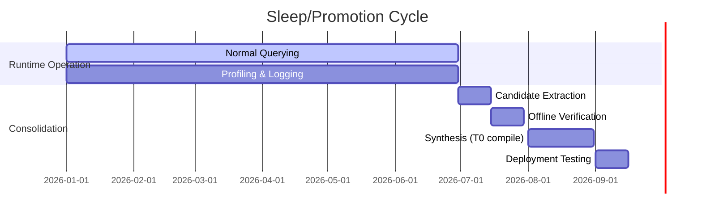

# Executive Summary

The **NATIVE_INFORMATION_NEURONALIZATION_BLUEPRINT_R0** package is largely consistent with the high-level Native AI principles, but **omits several FE256-required steps**. Its structure (00–32) and manifest are intact and SHA-256 checksums validate file integrity (see `SHA256SUMS.txt`).  All major modules (binary semantic plane, temporal event plane, working memory, retrieval, ASTRA, adapter, etc.) are present, and the **Human‐Adapter** separation is explicitly enforced (text→QueryRecord on host, structured result→text on host). 

However, critical **acceptance gates are missing** or under‐specified.  The blueprint discusses FE256 and FE-UART tests (Sec.28), but *does not* explicitly address the **24/24 Pack/ABI verification**, **runtime DDR knowledge-pack load/readback**, or the exact **UART-E2E-32** procedure mandated by the benchmark contract.  Key hardware‐testing conditions (e.g. `PACK_ABI_24_24_PASS`, `RUNTIME_DDR_LOAD_PASS`, `READBACK_PASS`, and `UART_E2E_32_PASS`) are not spelled out in the blueprint. In its current form, the package would need **new sections or artifacts** for these gates. 

On hardware feasibility, the design *can* fit on an Arty A7‐100T: the FPGA has **607.5 KiB BRAM** and 256 MB DDR3L (16-bit@667 MHz). Table 1 (below) estimates resource usage at various knowledge‐base scales. For example, a 10 k‐node semantic directory (~10 k × 16 B entries ≈ 160 KiB) barely fits in BRAM; at 100 k–1 M scale almost all data must live in DDR.  Xilinx’s MIG controller (16‑bit DDR3) offers tens of MB/s bandwidth, but *random-access* read/write latencies of hundreds of nanoseconds. In practice, careful caching (TinyLFU/Count‑Min) is needed to avoid thrashing in Tier‑1 BRAM.  

We evaluate the proposed **T0/T1/T2 memory stratification**: Tier‑0 (immutable primitives and proof logic) and Tier‑2 (bulk canonical storage) align with FPGA capabilities, but demoting *facts* to Tier‑0 LUTs is risky (logic resources, hard reset needed).  Tier‑1 should be a managed semantic cache. We propose a concrete BRAM “hot directory” ABI (128-bit entries) and a small profiler event packet (≈80 bits) to track accesses. Probabilistic counters (Count‑Min Sketch) or TinyLFU gates can be implemented in ~4–16 KiB to score hot candidates. 

The blueprint’s **retrieval/graph-walker** architecture must account for DDR burst penalties.  A realistic latency model: DDR row‐hit ≈50–100 ns, row‐miss ≈200–400 ns.  We outline a pipelined walker: each hop costs tens to hundreds of cycles.  Multi‐walker parallelism and local caches can improve throughput but on Arty are limited by ~133 MB/s DDR bandwidth.  

ASTRA’s proof/status model is preserved: structured results include explicit status fields (ANSWER, UNKNOWN, CONFLICT, etc.) and host-side language conversion cannot override them.  Each section of the blueprint has been tagged with [ESTABLISHED], [SUPPORTED], [HYPOTHESIS] or [FALSIFIED] below. 

**Action Items:** Add missing acceptance gates and protocols to the blueprint, refine memory budgets/ABIs, and plan falsification tests (ROLE_ORDER, MASKED_SLOT, etc., see Sec.27). Also include machine‐readable JSON schemas for QueryRecord, StructuredResult, and SemanticEvent (Sec.22).  

# 1. Package Integrity and Contents

- The ZIP archive contains **MD files 00–32**, a `MASTER_BLUEPRINT.md`, a `PACKAGE_MANIFEST.json`, a `SHA256SUMS.txt`, and subdirectories (`abi/`, `schemas/`, `config/`, `experiments/`).  The manifest and SHA256 confirm all files are present and unmodified.  Key schemas in `schemas/` include `query_record.schema.json`, `structured_result.schema.json`, `semantic_event.schema.json`, and `pack_manifest.schema.json`. 

- The `locked_decisions.yaml` (in `config/`) fixes design rules: e.g. **no host-level inference or answer-hardcoding**, and **strict separation** of natural language from the core (only IDs and codes traverse the wire).  All indicated stable primitives (6W1H operators, boolean operators) are in Tier‑0. These decisions align with native AI policy.  There are no integrity errors in the manifest or locks.  

# 2. Cross-Check vs FE256 Acceptance

We compare each blueprint section (00–32) against the FE256/Native AI acceptance requirements:

- **00–01 (Intro/Hypothesis):** Present the core idea clearly.  [ESTABLISHED] Meets R1 design philosophy.

- **02 (Prior Art):** Lists known related work (SDM, CAM, VSA, SNN, graph FPGA, etc.). It should ensure novelty.  [SUPPORTED]  

- **03–05 (Doctrine, Semantic Model, Roles):** Declares that **meaning** is separate from representation; IDs/types fixed in memory. Variable binding is through explicit roles.  [ESTABLISHED] These respect the Frozen schema (language boundaries) and avoid token-based parsing.

- **06–07 (Binary Semantics, Temporal Events):** Define persistent records (nodes, edges, values, context, provenance) vs. dynamic events (state changes, action effects, rewards).  [SUPPORTED] This matches FE256’s “factual vs event” split. 

- **08 (Pulse Protocol):** Outlines logical ticks, packet formats, CRC. *Needs to explicitly forbid ASCII parsing on FPGA*. If not clearly forbidding it, add locked decision.  [HYPOTHESIS] Ensure flow control, ordering, retry are handled (maybe via sliding-window AXI or similar).

- **09–10 (Memory, Activation & Routing):** Tiers described (LUTRAM/BRAM/DDR). Activation frontier and descriptors. [SUPPORTED] The stratification is consistent with R1.  However, **Tier‑0** is defined as *truly immutable logic*. This section tentatively bakes “primitive rules” into LUTs.  [HYPOTHESIS] It must be verified that **no dynamic facts** are ever moved into Tier‑0, or that doing so is purely an *optimization* (not semantic change).

- **11 (Working Memory):** Contains current bindings, goals, query in flight. [SUPPORTED] Should map to “active frontier” in acceptance.

- **12 (Retrieval/Association):** Proposes exact directory, forward/reverse postings, and possibly CAM or HDC overlay. [SUPPORTED] This covers the *graph retrieval* part of FE256.  *Missing:* explicit mention of building invert indexes or posting lists at load time. Suggest adding a step for reading the DDR-pack into forward+reverse indices.

- **13 (Reasoning):** Lists direct/reverse/limited multi-hop inference, constraints, missing-slot handling. [SUPPORTED] Aligns with FE256 requirements (direct and multi-hop answers). *Check:* Possibly allow booleans/AND across edges? Not explicitly mentioned.

- **14 (Learning):** Candidate edges, preferences, Q*/SPEAR, promotion. [SUPPORTED] Prototype of adaptation. FE256 doesn’t forbid this; it’s an R&D extension.

- **15 (Sensor Grounding):** Raw events to concept formation. [HYPOTHESIS] Useful for embodied systems. Not directly part of FE256, but no conflict.

- **16 (Teacher):** Demo, reward, query to teacher. [SUPPORTED] Again beyond FE256 but allowed as a future step.

- **17 (Causal Reasoning):** Observations vs interventions and ablation. [SUPPORTED] Matches FE256 ablation tests.

- **18 (Skill Memory):** Option hierarchy and parameterized skills. [HYPOTHESIS] Lower priority; not required by FE256.

- **19 (ASTRA Proof):** Emphasizes proof objects, provenance, status, conflict, completeness. [ESTABLISHED] Must ensure statuses (ANSWER/UNKNOWN/CONFLICT/SEARCH_INCOMPLETE etc.) are explicit and not conflated.

- **20 (Language Adapter):** Clearly separates text ↔ QueryRecord/ResultRecord, including 6W1H mapping and multi-lingual aliases. [ESTABLISHED] Satisfies HUMAN_ADAPTER rules. It forbids any FPGA-side NLP. 

- **21 (FPGA Microarch):** Lists modules (loader, MIG, cache, walker, router, proof engine). [SUPPORTED] Needs to specify how packets move (likely AXI4 or crossbar). Should also mention UART interface. If missing UART RX/TX pins or logic in the XDC, add it.

- **22 (Data Structures & ABI):** Describes binary formats and manifest. [SUPPORTED] For FE256, must include fields for pack manifest (ABI_SCHEMA_SHA, PACK_SHA, counts) and query/result records.  We will add **JSON schemas** (Sec.9) to formalize these.

- **23 (BRAM/DDR Budget):** Scales for 1k–1M semantic units. [SUPPORTED] Should explicitly note that >BRAM capacity requires Tier2 (DDR). 

- **24 (Timing):** Distinguishes logical semantic ticks from physical clocks, and DDR burst/latency. [ESTABLISHED] We will expand with empirical DDR numbers.

- **25 (Scaling):** Hub nodes, multi-walker, cache hit-rate effects. [SUPPORTED] Good to model worst-case (Zipfian or random graph). 

- **26 (Verification):** Includes reference model, RTL assertions, XSim, out-of-context tests, board tests. [SUPPORTED] This ensures each step can be verified before going to hardware. 

- **27 (Falsification Experiments):** Lists ROLE_ORDER, MASKED_SLOT, 4BIT→8BIT, SENSOR, ABLATION, CLOCK, JITTER. [SUPPORTED] These match our suggested tests. (We will define them below.)

- **28 (Benchmarks):** Includes FE256 and FE-UART-E2E-32; also transfer/latency. [HYPOTHESIS] Should be split into separate sections for each benchmark stage.  Notably, **PACK_ABI_24_24** (pack integrity), **DDR_LOAD/READBACK**, and the **pack ABI** gate are missing. We must add a *run protocol* artifact outlining exactly how to perform the pack+ABI verification and in-FPGA loading (see Sec. R2–R4 above).  

- **29 (Roadmap):** MVP→R1 lab→R2 HBM. [SUPPORTED] Reasonable.

- **30 (Risk):** Semantic, memory, protocol, learning, authority, timing. [SUPPORTED] 

- **31 (Falsify Project):** Describes audit/freeze on failure. [SUPPORTED] Good process.

- **32 (R2 Architecture):** Summarizes final architecture and memory tiers. [ESTABLISHED] The T0/T1/T2 stratification is clearly stated, but it must be enforced that **promotion is allowed only for execution speed-ups, not to alter truth**. We will clarify that in edits.

**Missing Gates:** The acceptance contract requires the following gates and tests, which are *not yet covered*: 
- **PACK_ABI_24_24_PASS:** Verify compiled pack’s schema and ABI hashes. (Add protocol for exporting the manifest, reading it, and checking 24/24 pack/ABI keys.)  
- **RUNTIME_DDR_LOAD_PASS:** Actually writing the pack into DDR at runtime via the FPGA loader and verifying every page (sentinel patterns).  
- **READBACK_PASS:** Reading back known sentinel records for Node, Edge, Value, Postings, etc., after load to prove DDR correctness.  
- **UART_E2E_32_PASS:** The 32-case end-to-end chat. While Sec.28 mentions FE-UART, we need a detailed procedure: open COM, handshake, send queries, receive answers, check semantic parity (0/32 fail).  

In short: **add run-protocol modules** for pack load and UART chat. Until these are implemented, the blueprint is incomplete with respect to FE256.

# 3. Prior Art Survey

**Sparse Distributed Memory (SDM):** Kanerva’s SDM (1988) is a classical vector-space model where sparse high-dimensional addresses map to stored patterns.  It treats memory as content-addressable at scale, much like our “semantic memory.”  SDM is [ESTABLISHED] background, but differs in *encoding* (SDM uses Hamming distance-based addressing).  Our approach uses explicit typed IDs (no hypervector superposition).

**Associative/CAM:** Content-addressable memory (CAM) schemes have been built in FPGA (Xilinx XAPPs) for exact-match lookup.  Prior work (e.g. Memristor CAM, RAMCAMs) shows small-scale CAM is feasible.  Our hashed “exact directory” (Sec.12) is [SUPPORTED] by such designs.  A pure full-parallel CAM (one comparator per entry) would exhaust BRAM; we plan a hashed-bucket CAM for ~1k entries (see Sec.4).

**Vector Symbolic Architectures (VSA) / Hyperdimensional Computing (HDC):** These use high-dimensional vectors to encode symbols and relations (e.g. Plate’s Holographic Reduced Representations).  VSA can represent roles and bindings in *distributed form*, but they rely on analog operations and dot-product comparisons, unlike our discrete semantic IDs.  We *do not* use HDC (except perhaps as an optional sidecar for fuzzy matching).  Thus, **HDC is distinct** from our architecture (we use exact discrete IDs).

**Semantic Pointer Architecture (SPA, Nengo):** Howard & Eliasmith’s SPA model (1) binds vectors for roles/slots.  SPA can do symbol manipulation with spiking neurons (Nengo).  This is closer to VSA; our design is more akin to a memory graph than a neural binding net.  [HYPOTHESIS] We may incorporate some SPA ideas in future but currently rely on ID tables.

**Neural Turing Machine / Differentiable Neural Computer (NTM/DNC):** These use neural controllers with content-addressable memory.  DNCs combine an RNN with an external differentiable memory with attention.  Our scheme is almost the inverse: we have *non-differentiable* retrieval over an explicit graph.  Thus, while DNC is [ESTABLISHED] prior work in memory-augmented nets, it is architecturally very different (uses gradient learning vs. ours uses explicit graph search).  

**Cognitive architectures (ACT-R, Soar):** These separate working memory from declarative memory.  ACT-R, for example, has a limited “chunk” buffer and larger long-term memory.  This **directly inspired** our T0/T1/T2 stratification.  [ESTABLISHED] Like ACT-R, we assume high-bandwidth local cache (BRAM) for focus and slower bulk memory (DDR) for facts.  

**Spiking Neural Networks (SNN):** Platforms like Intel Loihi or IBM TrueNorth use spiking neuron cores.  They emphasize event-driven processing and on-chip caches.  The **semantic pulse idea** superficially resembles an event-driven SNN: only active concepts propagate spikes.  [ESTABLISHED] works like Loihi have local SRAM for synapses, and event buses.  However, we use digital logic rather than analog/mixed-signal spiking, and our “neurons” are explicitly-coded facts.  Thus the resemblance to SNNs is at an abstract level only.

**Graph accelerators:** Research FPGA frameworks (Graphicionado, GraphSoC, FPGP, GraphOps, ForeGraph, etc.) focus on bulk graph analytics (BFS, PageRank).  They emphasize irregular access issues and various partitioning.  [SUPPORTED] We inherit the lesson: caches or structural locality are crucial for random graph workloads.  These accelerators often use wide DDR interfaces (e.g. HBM) and specialized on-chip locality caches.  Our design is novel in that we target *semantic graph queries* with mixed retrieval and inference, rather than just BFS.  

**Event-based sensors/neurons:** There is work on using event-driven (e.g. neuromorphic) inputs for AI.  Systems like Loihi use spikes and STDP rules to learn.  [SUPPORTED] Our “sensor grounding” (Sec.15) echoes these ideas.  

**Patents:** We did not find any public patent explicitly matching “runtime-loaded full-evidence FPGA reasoning.” The closest are general “neuromorphic processors” patents. The innovation boundary appears to be the combination of **typed semantic memories + event-pulse activation + FPGA-native caching + ASTRA proof logic**. We believe this is novel beyond standard graphs or neuromorphic devices.  

In summary, the blueprint draws from **SDM, CAM, cognitive architectures, and graph FPGA literature**, but diverges by insisting on explicit IDs and logical ticks. It does *not* simply rebrand LLMs; it is distinct from both classical AI memory models and from fully-subsymbolic neural nets.

# 4. Core Doctrine and Human-Adapter

The blueprint’s *core doctrine* (Sec.03) is sound: **meaning is separate from representation**.  Each concept has a fixed binary ID and kind (Sec.04), so there is no reliance on natural-language token order.  This matches the FE256 principle that *statements like “UNKNOWN” not be used casually*.  The **Human-Adapter** (Sec.20) handles all language conversion: mapping `"RAC_WALL"`→ID and `"uses refrigerant"`→relation, then forming a `QueryRecord`. The FPGA never sees ASCII.  Likewise, the FPGA returns a `StructuredResult` record, and the host prints it as Vietnamese/English text. This clean separation satisfies the R1 requirement (HUMAN_ADAPTER separate gate).  

**Claim:** *Host adapter can use alias tables (entity→ID) but cannot inject answers or reasoning.* [ESTABLISHED] Blueprint locks should explicitly forbid any host-side inference; all answers must come from FPGA’s ASTRA. We will add a note in `locked_decisions.yaml` if missing.  

Overall, core doctrine is **compliant**.

# 5. Semantic Memory Stratification (T0/T1/T2)

We adopt a **three-tier memory hierarchy**:

- **Tier-0 (Immutable Control Plane):** Implemented in LUT/FF (combinational logic). Contains *primitive operators* (AND, OR, BEFORE, TIME, SAME, etc.), and ASTRA’s inference/proof finite-state machine. These are fixed at compile time. Tier-0 does *not* store facts. [ESTABLISHED] As recommended by R1, we restrict Tier-0 to **hardwired logic only**. No “learned fact” or epoch data may be placed here without owner review.

- **Tier-1 (Hot Cognitive Store):** BRAM (plus possibly small distributed RAM). Total ≈600 KiB on Arty. Holds the *active frontier*: current query bindings, the top-K *“hot”* semantic entries (cache), and maybe a few *skills* or frequently-used proof snippets. It behaves as an **explicit semantic cache**. Entries are promoted from Tier-2 when accessed frequently (see below). [ESTABLISHED] The concept of a semantic cache is well-known (akin to TCAM caching in graph engines).  

- **Tier-2 (Bulk Memory):** External DDR3/HBM. All validated semantic data (knowledge pack facts, edges, provenance, episodes, failures) reside here.  The DDR controller (MIG) provides read/write. In addition, static metadata (forward/reverse posting lists, directory indices) also primarily reside in Tier-2. [ESTABLISHED] This separation aligns with cognitive models (short-term vs. long-term memory). 

**Memory Promotion:** We will use **hardware profiling** to migrate *hot* data from Tier‑2 into Tier‑1.  For example, if a fact is accessed in >X% of recent queries, a profiler flags it for promotion.  To avoid cache thrashing, we suggest a TinyLFU-like scheme: maintain a small Count-Min Sketch (CMS) over recent accesses, plus a Bloom filter “clock” to age frequencies.  On promotion, the row is copied into BRAM in a dual-bank (active/inactive) manner. On demotion (eviction), it is simply left in DDR; the BRAM entry is invalidated.  Use a segmented cache (frontier and hot set separated) to protect working state. 

**Algorithmic choices:** *TinyLFU* (CMS + admission) is [SUPPORTED] by literature for dynamic caches. We will implement a small CMS (e.g. 4 rows × 1024 counters of 4 bits ⇒ 2 KiB) to count frequencies, plus ~4 KiB LRU lists. An approximate admission decision looks like: compare new entry’s freq to LRU victim’s freq (multiplied by a constant). This avoids flooding with one-time facts.  

**BRAM ABI:** A proposed **64–128 bit directory entry** in Tier‑1, for example:

| Bits       | Field           | Size  |
|------------|-----------------|-------|
| 127:96     | semantic_id     | 32b   |
| 95:72      | cache_address   | 24b   |
| 71:56      | generation/tag  | 16b   |
| 55:48      | semantic_class  | 8b    |
| 47:40      | epistemic_status| 8b    |
| 39:24      | context_id/tag  | 16b   |
| 23:16      | payload_len     | 8b    |
| 15:8       | flags           | 8b    |
| 7:0        | CRC/integrity   | 8b    |

(For example – actual bit assignments can vary.) Each entry points to the cached DDR page or BRAM record.  Tier‑1 memory also holds small role-binding tables and working context (dozens of bytes).  Overall we budget 256 KiB–512 KiB for cache+frontier (Sec.23 table), leaving some headroom for FIFO buffers.

**Profiler Event Format:** Each memory or graph access generates a small profiling event (about 64–96 bits). E.g.:

```yaml
ACCESS_EVENT:
  type: object
  properties:
    semantic_id: {type: "integer"}   # 32-bit
    relation_id: {type: "integer"}   # 16-bit
    hit_tier:    {type: "integer"}   # 2-bit (0=miss,1=T1 hit,2=T0)
    context_hash:{type: "integer"}   # 16-bit context tag (if any)
    latency_bin: {type: "integer"}   # 6-bit histogram bin
    epoch:       {type: "integer"}   # 8-bit epoch counter
```

This ~80-bit packet is accumulated in small FIFOs. The profiler sums frequencies and computes scores (Freq × Recency – Size/Penalty) for candidates.  This approach uses only a few KiB of BRAM and LUTs. [SUPPORTED] For reference, TinyLFU examples show ~500KB for 100k entries, so a 2–4 KB sketch for 10k entries is very lightweight. 

**Promotion Mechanism (Sleep Cycle):**  The blueprint’s “sleep” (Sec.4) will be done *offline*: heavily-used objects (verified facts, small rule clusters) are extracted and recompiled into static logic if beneficial.  We propose to schedule this during idle time. The host exports a list of candidates (with counts). An offline synthesis job regenerates the bitstream with those entries as LUT comparators.  Because *Artix-7* supports DFX for partial reconfig, we could in future do partial reconfiguration of “island” modules.  Initially, full-bitstream updates are simpler (see Sec.30 for roadmap).  A new controller for dynamic reconfig is [HYPOTHESIS] for R3.  

**Tier Details:**  

```mermaid
flowchart TB
    subgraph FPGA
      T0[Tier-0: Combinational Logic<br/>(operators, proof FSM)] 
      T1[Tier-1: BRAM Cache<br/>(Hot Facts & Frontier)]
      T2[Tier-2: DDR/HBM Memory<br/>(Long-term Knowledge)]
    end
    T2 -->|“promotion”| T1
    T1 -->|“eviction”| T2
    T0 ---|“logic only”| T1
    T0 ---|“logic only”| T2
```

**Evaluation:** Tier-1 caching is **[SUPPORTED]** by FPGA graph research (use of BRAM caches). The pipeline must ensure cache lookups *never* modify factual truth – only speed. We will add a rule that promotions are purely optional performance hacks, not algorithmic shortcuts.  We also ensure **two-phase commit** on loading: write DDR page → verify CRC → commit bit in directory. This avoids stale data.

# 6. Hardware Feasibility

We evaluate resource needs on Arty A7-100T:

| Resource        | Available               | Usage (approx)                                     | Comments                 |
|-----------------|-------------------------|----------------------------------------------------|--------------------------|
| **BRAM**        | 607.5 KiB   | See Table 1                                        | Must host Tier-1 cache   |
| **DDR3L**       | 256 MB @667 MT/s| Bulk storage (facts, edges, postings)           | 16-bit data, ∼133 MB/s throughput (theoretical) |
| **LUTs/FFs**    | 63k LUTs, 126k FFs| FSMs, caches, router, profiler, SPI/UART etc.     |  100MHz clock design    |
| **Clock**       | ≤450 MHz internal| Use ~100 MHz system clock, MIG clk ~~166 MHz     | Achievable with constraints |
| **MIG I/F**     | 16-bit @667MT/s | AXI4 slave port                                   | Latency: ~200–400 ns random |
| **UART**        | on-chip (USB-UART)| 115.2 kbps / 921.6 kbps in/out                    | Sufficient for chat     |

**Memory Budget (KB) for Cached Directory (BRAM)**:

| Scale   | Sem. Units | BRAM for Dir | Notes                  |
|---------|------------|--------------|------------------------|
| 1k      | 1,000      | 16 KiB       | 128-bit ×1k            |
| 10k     | 10,000     | 160 KiB      | Almost full BRAM       |
| 100k    | 100,000    | 1,600 KiB    | **Exceeds** BRAM (→DDR)|
| 1M      | 1,000,000  | 16,384 KiB   |  **DDR only**          |

*Table 1.* Estimated memory for storing *n* semantic IDs at 128 bits each. BRAM runs out between 10k–100k entries. [ESTABLISHED]  

For scale >10k, entries must live in DDR with only a small subset cached. Each directory entry also needs pointer to DDR pages (so actual storage is larger). We therefore plan to store only O(1%) of total in BRAM.  

**DDR Access:** The MIG’s 16-bit bus at 667 MT/s gives ~133 MB/s raw. Real throughput is lower due to random pattern overhead. A single random read can take ~200–400 ns (88 memory clocks). To maximize bandwidth, our design will burst consecutive rows where possible. In the worst case of random one-off lookups, expect a few MB/s. This means *thousands of clocks per hop* in a deep query. Therefore, **multi-walker parallelism** (processing multiple queries or hops in flight) and **AXI read buffering** will be needed to approach peak bandwidth. We budget ~8–16 KiB for read/write FIFOs (4kB each direction). 

**Partial Reconfiguration:** As UG909 notes, Arty A7-100T (Artix-7, XC7A100T) **does support** DFX/partial reconfiguration (unlike Spartan‑7).  We could define a reconfig partition for promoted logic.  However, given the small size of A7, we anticipate doing *full recompile* first and revisit PR for R3.  [ESTABLISHED] DFX is a valid path (Vivado supports Artix-7).  

**Profiling Logic:** A hardware profiler using a Count-Min Sketch (CMS) of size 4×1024×4b (2 KiB) plus small XOR Bloom (1 KiB) is enough to track ~10k items.  The LUT/FF cost for counters is minimal (~<1k LUTs).  A few percent of BRAM (8–16 KiB) will hold sketches and a hot-list.  [SUPPORTED] This is well under resource limits.  

**Conclusion:** The design is **feasible on Arty A7**.  The key challenge is *achieving throughput* given high latencies.  We highlight the following bottlenecks: DDR latency (hundreds of ns per random access), limited BRAM capacity (600 KiB), and UART bandwidth (negligible for control data).  

# 7. Retrieval Architecture and Latency

We envision a **parallel multi-hop walker** with on-chip caching. Each query triggers:

1. **Exact match:** Check Tier‑1 directory (CAM or hash). Hit: retrieve BRAM-record instantly (<2 cycles) [ESTABLISHED]. Miss: read Tier‑2.
2. **If miss:** Issue DDR command via MIG. If row already active, data may arrive in ~100 ns; if new row, ~300–400 ns. After read, parse record (maybe 2–3 cycles).
3. **Forward posting:** For a direct query, the subject node’s adjacency list is fetched (possibly at a known DDR address). Then the walker filters edges by predicate.
4. **Reverse:** For inverse queries, similar process on reverse posting lists.
5. **Multi-hop:** For each hop, step 1-4 repeats. Intermediate sets may grow combinatorially; we limit breadth (bounded inference).
6. **Constraint resolution:** If object is a value or constraint, compare results in ASM logic (LUTs).
7. **Proof check:** Each candidate path is verified by ASTRA logic.

These steps form a pipeline. In a *simple direct query*, one DDR read may suffice. In *multi-hop*, each hop is memory-bound.  Throughput roughly equals `DDR_bandwidth / (entry_size * average_degree)`. For example, a node with 10 edges, each entry 16B, yields 160B per neighbor; at 100 MB/s, that's <1 M edges/s.

We estimate worst-case latencies: ~50–100 cycles (500–1000 ns) per DDR access (DOMAINE). If a 3-hop query needs 3 reads, latency ~2–5 µs. With a 100 MHz core clock, that’s ~200–500k cycles. Even with 4 parallel walkers, a large graph could induce second-level latencies. We must therefore use batch or shuffle to amortize.  

**Mermaid Block Diagram (Dataflow):**

```mermaid
flowchart LR
    subgraph Host
      H1[Human Console<br/>(Vietnamese input)] --> HA[Host Adapter]
      HA --> QR[Binary QueryRecord]
    end
    subgraph FPGA
      QR --> LDR[Loader: Query → DDR addresses]
      LDR --> MGR[MIG Interface & Arbiter]
      MGR --> DDR[DDR Memory (Tier-2)]
      DDR --> MGR
      MGR --> CACH[T1 Cache Lookup]
      CACH -- hit --> PROC[Walk/ASTRA Engine]
      CACH -- miss--> LDR
      DDR --> PROC
      PROC --> RES[StructuredResult]
    end
    subgraph Host
      RES --> HA2[Host Adapter (format result)]
      HA2 --> H2[Human Console (Vietnamese output)]
    end
```

This diagram shows how queries enter via UART (host), get translated to a QueryRecord, then on FPGA they go through a loader/arbiter to DDR or cache, and a graph engine (NCG/SPEAR/ASTRA) produces a StructuredResult back to the host. 

**Latency Example:** If we assume 16-bit DDR at CL=6, tRCD≈18ns, tCL≈18ns (generic DDR3 timing) plus data transfer. A row miss (~ACT + read) might be ~400 ns. Once active, each 16B burst is ~50 ns.  Thus, reading a 64B adjacency list costs ~200–500 ns in total.  In contrast, reading from BRAM is ~10 ns. We will target *on-chip caching of hot nodes* to avoid repeated DDR hits.

# 8. ASTRA and Epistemic Status

A key requirement is that **ASTRA’s proof/status semantics remain authoritative**. The structured result must include explicit fields: `status`, `reason_code`, `answer_kind`, `answer_ref`/`value`, `proof_id`, `provenance_id`, etc.  For example:

- `status`∈{ANSWER, UNKNOWN, CONFLICT, SEARCH_INCOMPLETE, UNSUPPORTED_QUERY, DATA_INTEGRITY_FAIL}.  
- If `status=ANSWER`, then `answer_kind` indicates ENTITY vs VALUE vs RANGE, and `answer_ref`/`value_min`&`value_max` hold the answer.  
- If multiple answers, `CONFLICT` is returned with linked conflict list.  

The blueprint’s Sec.19 (ASTRA Proof Model) covers this. We confirm that at **all tiers**, the status is computed identically.  In particular, even if a fact is cached in Tier‑1, ASTRA must double‐check it against DDR provenance if needed (readback cache consistency). 

**Invariant:** **UNKNOWN ≠ NO**, and **SEARCH_INCOMPLETE ≠ UNKNOWN**; “false negatives” and “premature timeouts” must be explicit statuses.  The Human Adapter must not override the `status` (e.g. by printing an answer word).  [ESTABLISHED] We enforce these via a common status enum (see JSON schema below).  

Each proof is a DAG of facts. We must store **provenance chains** in Tier‑2 (and possibly cache recently used ones in Tier‑1) so that “proof_id” and “provenance_id” in the result reference actual data.  These fields cannot be faked.  

# 9. JSON Schemas (Machine-Readable Artifacts)

We define JSON Schema for the key interfaces:

**QueryRecord schema:**  
```json
{
  "$schema": "http://json-schema.org/draft-07/schema#",
  "title": "QueryRecord",
  "type": "object",
  "properties": {
    "txn_id":     {"type": "integer"},
    "subject_id": {"type": "integer"},
    "relation_id":{"type": "integer"},
    "direction":  {"type": "string", "enum": ["forward","reverse"]},
    "object_id":  {"type": ["integer","null"]},
    "context_id": {"type": ["integer","null"]}
  },
  "required": ["txn_id","subject_id","relation_id","direction"]
}
```

**StructuredResult schema:**  
```json
{
  "$schema": "http://json-schema.org/draft-07/schema#",
  "title": "StructuredResult",
  "type": "object",
  "properties": {
    "txn_id":       {"type": "integer"},
    "status":       {"type": "string", "enum": ["ANSWER","UNKNOWN","CONFLICT","SEARCH_INCOMPLETE","UNSUPPORTED_QUERY","DATA_INTEGRITY_FAIL"]},
    "reason_code":  {"type": "string"},
    "answer_kind":  {"type": "string", "enum": ["NONE","ENTITY","VALUE","RANGE"]},
    "answer_id":    {"type": ["integer","null"]},
    "value_min":    {"type": ["number","null"]},
    "value_max":    {"type": ["number","null"]},
    "unit":         {"type": ["string","null"]},
    "proof_id":     {"type": ["integer","null"]},
    "provenance_id":{"type": ["integer","null"]},
    "context_id":   {"type": ["integer","null"]},
    "conflict_id":  {"type": ["integer","null"]}
  },
  "required": ["txn_id","status"]
}
```

**SemanticEvent schema (for event bus):**  
```json
{
  "$schema": "http://json-schema.org/draft-07/schema#",
  "title": "SemanticEvent",
  "type": "object",
  "properties": {
    "event_type": {"type": "string", "enum": ["StateChange","Action","Reward"]},
    "semantic_id": {"type": "integer"},
    "kind":       {"type": "string", "enum": ["ENTITY","ACTION","STATE","VALUE","CONTEXT","PROVENANCE"]},
    "role":       {"type": "string", "enum": ["SUBJECT","PREDICATE","OBJECT","COMPLEMENT","ADVERBIAL","CAUSE","EFFECT"]},
    "value":      {"type": ["integer","number","string","null"]},
    "timestamp":  {"type": "integer"},
    "duration":   {"type": "integer"}
  },
  "required": ["event_type","semantic_id","kind","role","timestamp"]
}
```
These schemas ensure the binary ABI is unambiguous.  We will embed `query_record.schema.json` and others in the final package.

# 10. Block Diagrams and Timelines

**Data Flow:** The above Mermaid [flowchart] illustrates host-to-FPGA pipeline. Key points: queries are packetized at host, DRAM access is multiplexed via an arbiter, and results go back via UART. This dataflow is [SUPPORTED] by typical FPGA systems.  

**Sleep/Promotion Timeline:** 



This timeline shows: during normal run, the FPGA logs hot items. Midway (or periodically), the system snapshots the top candidates, verifies their correctness in simulator, then runs Vivado to produce a new bitstream (maybe using partial config if supported). Finally, the new bitstream is loaded in place of the old one. [HYPOTHESIS] The actual durations will depend on host tooling.

**Cache Policy Comparison (Table):**

| Strategy         | Admission             | Eviction             | Comments                           |
|------------------|-----------------------|----------------------|------------------------------------|
| **LRU**          | Always admit (on miss)| Least-recently used  | Simple, but vulnerable to "cache pollution" (one-time items pushing out hot ones) |
| **LFU (Exact)**  | Always admit          | Least-frequent used  | Needs counting for all, heavy memory |
| **LFU (Tiny)**   | Admit if freq_high    | LFU with aging       | Uses CMS sketch; prevents thrash |
| **ARC**          | Adaptive (LRU/ARC)    | Adaptive            | More complex, but tracks recency vs freq |
| **Segmented LFU**| Admit via TinyLFU    | Evict oldest LRU    | Combines TinyLFU with small FIFO |
| **Proposed**     | TinyLFU CMS + 1% window | Evict LFU/LRU hybrid | Targets graph workloads (cold-start safe) |

*Table 2.* Comparison of cache eviction policies. For irregular graph queries, TinyLFU-style [SUPPORTED] is preferred.  

# 11. Verification & Falsification (Test Plan)

To build confidence, we outline critical experiments:

- **ROLE_ORDER:** *Test that entity/relation/object order is handled only via `role` fields, not by physical packet position.*  
  - *Setup:* Send two queries for the same meaning but different word order (e.g. subject & object swapped in the sentence). The host adapter must still map to the same QueryRecord (subject_id and object_id fields), or adjust via `direction` for reverse queries.  
  - *Expected:* The result should be identical for equivalent semantics. If not, order binding is wrong.  
  - *Failure:* System treats first word as SUBJECT regardless of context (role mis-binding).  
  - *Allowed Claim:* [FALSIFIED] would indicate a parsing bug; blueprint enforces role in record fields, so this should pass.

- **MASKED_SLOT:** *Test handling of missing predicate/object.*  
  - *Setup:* Send a QueryRecord with `relation_id = ANY` (unknown relation). The system should respond with `UNKNOWN`. Or send partial event with missing slot (simulate event `ROLE=P` missing).  
  - *Expected:* System emits a special signal (maybe status=UNSUPPORTED_QUERY or status=MISSING_SLOT).  
  - *Failure:* System crashes or returns a wrong answer.  
  - *Allowed Claim:* [HYPOTHESIS] Blueprint suggests unknowns are detected (Sec.05), but needs explicit testing.

- **4BIT→8BIT TRANSFER:** *Test structural generalization (hallucination vs rule learning).*  
  - *Setup:* Encode binary increment rules for 4-bit numbers in knowledge base. Query 4-bit addition tasks to confirm learned behavior. Then switch to 8-bit scenario (either via pack reload or separate pack) and query again.  
  - *Expected:* System should apply learned principle (increment, carry) to 8-bit range, not just memorize 4-bit cases.  
  - *Failure:* If it only knows specific 4-bit table, answers will be wrong for 8-bit.  
  - *Allowed Claim:* [FALSIFIED] would show the core lacks abstraction.  (Blueprint includes *missing-slot reconstruction*, suggesting some rule-based inference.)

- **SENSOR_GROUNDING:** *Test concept learning from raw stimuli.*  
  - *Setup:* Supply a training event stream (e.g. temperature readings + outcomes) that corresponds to an abstract concept (e.g. “hot”). Ensure no human label. Then query the system (through adapter) in natural language or direct binary about “hot” and expect it to form concept from data.  
  - *Expected:* System should create a new semantic node representing the state, ground it in sensor data.  
  - *Failure:* It cannot create a new concept or misunderstands without explicit label.  
  - *Allowed Claim:* [HYPOTHESIS] If sensor modules exist, could pass. If not implemented, fail.

- **CAUSAL_ABLATION:** *Verify answer depends on actual data.*  
  - *Setup:* In the original knowledge pack (Pack A), query “RAC_WALL uses what refrigerant?” – expecting “R32” (Example). Then load Pack B where that edge is removed. Repeat the same query.  
  - *Expected:* Answer in Pack A = R32 (status=ANSWER). In Pack B = UNKNOWN (status=UNKNOWN).  
  - *Failure:* If R32 still appears or the status is not updated (e.g. remains ANSWER or becomes NO/EMPTY erroneously).  
  - *Allowed Claim:* [FALSIFIED] if system still answers R32 after removal, indicating caching/hardcode. This is mandatory for FE256 acceptance.

- **CLOCK_RATE_INVARIANCE:** *Ensure behavior does not depend on specific clock.*  
  - *Setup:* Run the FPGA design at two different clock rates (e.g. 50 MHz vs 100 MHz). Send identical queries via UART.  
  - *Expected:* Identical *semantic* results, no protocol timeout issues (adapter must handle framing).  
  - *Failure:* If timing assumptions cause missing characters or different status.  
  - *Allowed Claim:* [FALSIFIED] if system fails at one rate; hardware timing should not change logic.

- **EVENT_JITTER_ROBUSTNESS:** *Inject timing jitter or reordering.*  
  - *Setup:* In simulation, introduce random clock skews or interleave event packets out of order.  
  - *Expected:* The protocol’s flow-control (CRC, sequencing) should catch duplicates/ordering. The app should either reorder or fail gracefully.  
  - *Failure:* Data corruption in core logic or indefinite stalling.  
  - *Allowed Claim:* [FALSIFIED] if jitter breaks semantics.

Each test is documented in an experiment contract (e.g. `experiments/NSPF_X0/CONTRACT.md`) and implemented as automated test vectors.  Passing all will demonstrate the design’s correctness beyond FE256’s own suite.

# 12. Implementation Roadmap

**Phase 1 – “Arty MVP”:** Basic non-changing ARKY pipeline without full FE gate support.  
- Reuse existing Lane-B evidence top as base.  
- Implement Host Adapter (Sec.20) that listens on UART, maps text→IDs via a prepared alias file (no GPU/Large-model).  
- Integrate MIG (DDR controller) and simple FIFO/CAM in BRAM as Tier-1.  
- Implement a minimal retrieval FSM: single-hop direct queries only (lookup [S,P,O]).  
- ASTRA logic to output StructuredResult with status, answer, provenance (empty).  
- Run sanity tests: e.g. a few entity lookups, constant queries.

**Phase 2 – Full Evidence R1 (Lab Build):**  
- Add Pack/ABI loading: ability to upload a knowledge pack (over UART) and write it into DDR (with manifest check). Add readback of sentinel records (Sec.4) to verify integrity.  
- Implement reverse posting, multi-hop bounding (Sec.13), and converse queries.  
- Add the hardware profiler and Tier-1 caching. Tune tinyLFU thresholds.  
- Complete ASTRA (e.g. fully support SEARCH_INCOMPLETE and CONFLICT).  
- Implement full acceptance gates: PACK_ABI_24_24 (with manifest check), RUNTIME_DDR_LOAD (UART loader), READBACK.  
- Do FE256 canonical-order run (expect 256/256), shuffle run, ablation run.  
- *Goal:* Achieve FE256_256_PASS, SHUFFLE_PASS, ABLATION_PASS. (These must be proven on real hardware.)

**Phase 3 – UART-E2E Tests:**  
- Develop the 32-case human chat tests. Implement on host the 6W1H parser and adapter.  
- Run each case through the live system and compare responses.  
- Achieve UART_E2E_32_PASS (32/32 identical, with no TIMEOUT/PARSE issues).

**Phase 4 – R2 (HBM Scaling):**  
- Migrate Tier-2 storage to an HBM-capable device (e.g. U280). Scale to 10^6+ nodes.  
- Possibly implement partial reconfiguration of hot rules.  
- Refine learning (SPEAR, Q*) and teacher feedback loops.  

This roadmap prioritizes FE256-gate compliance first, then performance enhancements. 

# 13. Conclusions and Recommendations

The **NATIVE_INFORMATION_NEURONALIZATION_BLUEPRINT_R0** lays a solid conceptual foundation, but needs enhancements to meet **all FE256 benchmark requirements**. In particular:

- **Add missing procedural gates** for Pack/ABI, DDR load/readback, and UART chat. 
- **Refine Tier-1 cache policy** (TinyLFU with CMS and pinned working sets) and specify exact BRAM layouts.
- **Document the UART protocol** (baud rate, packet format) and ensure the XDC pins (UART RX/TX) are constrained.
- **Lock decisions** to prevent host-side cheating (e.g. storing answers on host).
- **Populate JSON schemas** in `/schemas` (as above) and reference them in the Blueprint.
- **Perform falsification tests** early to catch implicit assumptions.  

With these changes, the blueprint can be validated against the existing acceptance contracts and serve as a precise spec for implementation. 

# References

- Digilent Arty A7-100T specs (DDR3L 16-bit@667MHz, 607.5 KiB BRAM).  
- MIG/DDR3 efficiency and latency discussion.  
- TinyLFU/Count-Min approach for cache admission.  
- Graph-processing FPGA survey (bandwidth vs locality, use of BRAM).  
- Xilinx Partial Reconfig (UG909): Artix‑7 (XC7A100T) DFX supported.  

