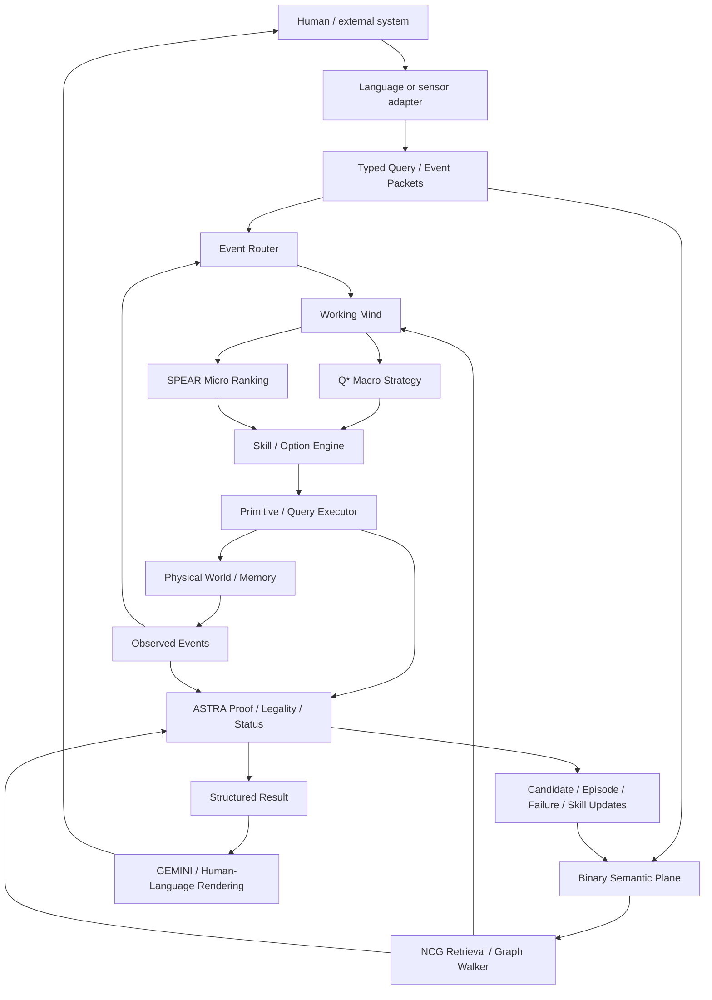
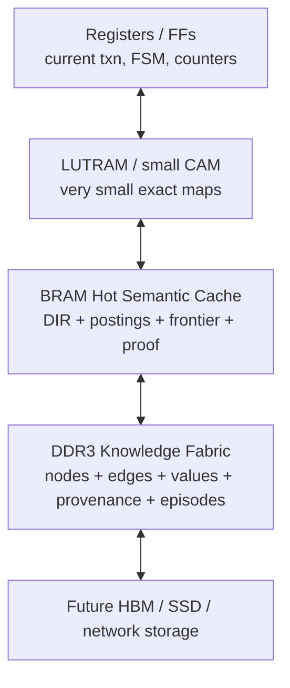
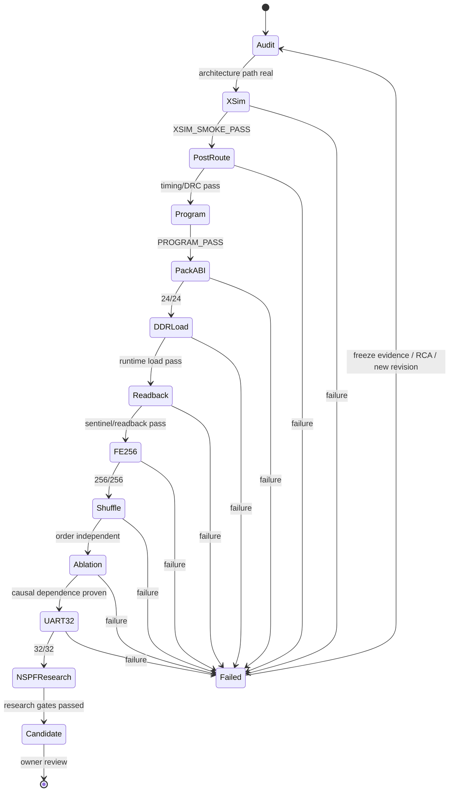

# Native Semantic Pulse Fabric — Neuronalizing Information Instead of Neuronalizing Computation

## Executive summary

**Claim-label convention.** **[ESTABLISHED]** means directly supported by primary/official evidence or by the current Native AI project authority documents. **[SUPPORTED]** means a synthesis strongly supported by several established results but not itself directly demonstrated for Native AI. **[HYPOTHESIS]** is an experimentally testable architectural proposition. **[SPECULATIVE]** is a longer-range possibility for which current evidence is insufficient. **[FALSIFIED]** marks a proposition that should be rejected as a design premise under the evidence and invariants adopted here.

**[SUPPORTED] The core idea is technically plausible, but the defensible formulation is narrower than “replace neural networks.”** The strongest version of the research hypothesis is that a useful cognitive substrate can treat **explicit semantic records, typed relations, bindings, events, and state transitions as the primary persistent information objects**, while using sparse event-driven activation to manipulate them. This is meaningfully different from a purely parametric Transformer, but it is not unprecedented in its ingredients: sparse distributed memory, vector-symbolic architectures, semantic-pointer systems, production systems, external neural memories, graph processors, CAMs, and neuromorphic event fabrics each implement important portions of the idea. citeturn18view0turn16view5turn23search0turn18view1turn16view2

**[ESTABLISHED] The contrast with modern AI must not be caricatured as “LLMs have no explicit memory.”** The original Transformer is a learned attention-based parametric architecture, and pretrained language models can retain factual knowledge in parameters; however, retrieval-augmented models explicitly combine parametric models with non-parametric external memory. Thus, NSPF should be contrasted primarily with **weight-centric cognition**, not with every contemporary AI system. citeturn22academia0turn18view2

**[SUPPORTED] The most promising architectural distinction is not “everything is binary”—all digital computers already are—but the separation of persistent meaning from transient activation.** In NSPF, a semantic unit would be a stable addressable record; a relation would be a typed edge; a current thought would be a sparse frontier of activated records; and a temporal experience would be a sequence of logical events. That model has direct conceptual precedents in sparse memories, event-driven neuromorphic systems, graph machines, and Semantic Pointer Architecture, while retaining an explicit proof/provenance layer that those systems generally do not impose as the central authority boundary. citeturn18view0turn16view2turn17search4turn23search0

**[ESTABLISHED] The current Native AI R1 documents already contain a coherent authority separation on which this can be built:** deterministic substrate and capabilities; working mind; Q* macro choice; SPEAR micro-ranking; skill/options; ASTRA legality/proof/status/promotion; GEMINI expression; and memory planes for evidence, skills, episodes, and failures. They also explicitly require that aliases are not identity, scores are not truth, candidates are not promoted facts, and `SEARCH_INCOMPLETE != UNKNOWN`. fileciteturn0file0 fileciteturn0file1 fileciteturn0file3

**[SUPPORTED] The best extension is therefore a dual-plane architecture:**

```text
BINARY SEMANTIC PLANE
identity • relation • value • context • provenance • proof
                     +
TEMPORAL EVENT PLANE
event • state • action • sequence • duration • observation • reward
                     ↓
            sparse Working Mind
      NCG → SPEAR/Q* → Skill/Action
                     ↓
                   ASTRA
            verify / reject / defer
```

The existing project already places hot bounded state in BRAM and long-term evidence, episodes, skill state, and knowledge packs in DDR, which is exactly the memory hierarchy required for virtual rather than one-physical-circuit-per-semantic-unit “neurons.” fileciteturn0file2

**[FALSIFIED] Three tempting formulations should be rejected.** First, noun/verb/adjective classes should not receive different identifier widths such as 6, 8, and 10 bits; `TYPE`, stable `ID`, and contextual `ROLE` should be independent. Second, English morphology such as `is/am/are` should not be silicon ontology; the language adapter should normalize it into language-independent predicates. Third, physical FPGA clock frequency or jitter must not carry semantic identity. Semantic ordering should use explicit **logical ticks/events**; physical timing is implementation timing. Event-driven machines such as SpiNNaker and TrueNorth already demonstrate that event identity and logical/event time can be separated from the physical details of message transit and core computation. citeturn16view2turn19view2

**[HYPOTHESIS] The most important research claim to test is consequently this:**

> **Information Neuronalization:** explicit semantic units are individually addressable persistent objects; typed relations act as addressable semantic synapses; current cognition is a sparse set of activated units and bindings; temporal experience is represented as ordered logical events; learning changes candidate relations, skills, preferences, and policy state without silently changing verified factual truth.

**[HYPOTHESIS] This is worth developing only if it beats simpler alternatives on measurable properties:** causal traceability, incremental update cost, deterministic provenance, transfer across IDs/instances, memory-access efficiency for sparse queries, and bounded hardware behavior. If it becomes merely a hand-authored knowledge graph plus task-specific FSMs, or if useful transfer requires reintroducing a large dense model into the core, the strong form of the hypothesis has failed.

| Principal conclusion | Status | Recommendation |
|---|---|---|
| Explicit semantic records as persistent “virtual neurons” | **SUPPORTED** | Develop |
| Typed graph edges as semantic “synapses” | **SUPPORTED** | Develop |
| Sparse event/frontier activation | **SUPPORTED** | Develop and measure |
| Binary semantic + temporal event dual plane | **HYPOTHESIS** | Highest-priority research extension |
| Stable `TYPE + ID + ROLE`, rather than POS-specific widths | **SUPPORTED** | Lock |
| 6W1H as compact query operators | **HYPOTHESIS** | Test, do not make linguistic ontology |
| Physical clock frequency as meaning | **FALSIFIED** | Prohibit |
| Jitter as semantic alphabet | **FALSIFIED** | Treat jitter as disturbance |
| Sensor-grounded native concepts before human aliases | **HYPOTHESIS** | Strong R1 experiment |
| Facts, episodes, skills, preferences and weights as separate classes | **ESTABLISHED** | Preserve |
| ASTRA as proof/status authority | **ESTABLISHED within Native AI** | Preserve |
| One physical circuit per semantic “neuron” | **FALSIFIED as scaling strategy** | Virtualize/page |
| Dense neural models relegated entirely to peripherals | **SPECULATIVE** | Test; a hybrid may prove necessary |

## Research hypothesis and core architecture

**[ESTABLISHED] The current project is already explicitly designed not to be “a small LLM.”** Its R1 architecture separates deterministic primitive substrate, physical execution, a bounded working mind, Q*, SPEAR, skills/options, ASTRA, GEMINI, and parallel episodic/failure memory. It locks deterministic codecs, arithmetic and legality while allowing semantics, skills, strategy, utility, associations, and recovery patterns to be learned. fileciteturn0file1

**[HYPOTHESIS] NSPF should extend that architecture by treating a semantic “neuron” as a virtual object, not as a neuron simulator.** A minimal definition is:

\[
N_i = \{ID, KIND, CLASS, FLAGS, INDEX\_PTRS, PROVENANCE\}
\]

and a semantic synapse is:

\[
E_j = \{SRC, RELATION, DST/VALUE, CONTEXT, PROVENANCE, STATE\}
\]

The dynamic state at logical time \(t\) is then not the entire database but a sparse active set:

\[
A_t = \{N_{i_1}, N_{i_2}, \ldots, E_{j_1}, B_1,\ldots\}
\]

where \(B\) denotes current role/variable bindings.

**[SUPPORTED] This “virtual neuron” interpretation has good precedent.** Neuromorphic architectures already decouple logical neurons from simple one-circuit-per-neuron interpretations through routing, local state, and time multiplexing; TrueNorth documentation and related patent material describe routed spike packets, logical ticks, and cases where computation circuitry is reused across multiple logical neuron functions. FPGA/HBM CAM systems likewise virtualize associative lookup over memory rather than requiring a comparator circuit for every semantic concept. citeturn17search4turn19view2turn16view4

**[HYPOTHESIS] Semantic type and grammatical role should be orthogonal.**

```text
Semantic kind:
ENTITY
AGENT
ACTION
STATE
PROPERTY
EVENT
VALUE
TIME
LOCATION
GOAL
SKILL
...

Contextual role:
SUBJECT
PREDICATE
OBJECT
SOURCE
TARGET
CAUSE
EFFECT
INSTRUMENT
LOCATION_ROLE
TEMPORAL_ROLE
...
```

The record for `HUMAN` remains the same whether a human-language sentence places it in subject or object position. This avoids encoding English syntax as ontology.

**[HYPOTHESIS] Six-W/one-H can be retained as a compact query algebra, but only as an experimental operator set.** A convenient 3-bit encoding is:

| Code | Host alias | Native interpretation |
|---:|---|---|
| `000` | WHAT | return thing/value/property |
| `001` | WHO | constrain answer toward agent/entity |
| `010` | WHERE | constrain answer toward spatial/location value |
| `011` | WHEN | constrain answer toward temporal value |
| `100` | WHY | request cause/proof/support path |
| `101` | WHICH | select an entity satisfying constraints |
| `110` | HOW | request procedure/skill/trajectory |
| `111` | RESERVED | future native operator |

**[HYPOTHESIS] The hardware should regard these as `QUERY_OPERATOR` codes, not representations of the English words “what,” “who,” or “why.”** A multilingual adapter should be able to map Vietnamese, English, or another language onto the same operator. Failure of that mapping across languages would be evidence that the primitive set is linguistically overfit.

**[SUPPORTED] A dedicated language boundary is consistent with the project’s existing authority model.** GEMINI is already restricted to expression/language rather than proof and actuator authority, while internal identity is designed to remain stable independently of human aliases. fileciteturn0file1 fileciteturn0file8

**[HYPOTHESIS] Therefore the English sentences**

```text
Human is sad.
I am sad.
They are sad.
```

should be normalized by the language adapter into forms such as:

```text
HAS_STATE(HUMAN_17, SAD)
HAS_STATE(SELF, SAD)
HAS_STATE(GROUP_42, SAD)
```

rather than giving `is`, `am`, and `are` separate metaphysical status inside the FPGA.

**[ESTABLISHED] Native AI’s current project rules already require a particularly valuable separation between knowledge and learning state.** A score from Q*/SPEAR is not proof confidence; a candidate, episode, failure record, or teacher statement does not automatically become verified truth; ASTRA retains promotion and proof authority. fileciteturn0file0 fileciteturn0file3 fileciteturn0file9

**[HYPOTHESIS] NSPF should formalize that separation into storage classes:**

```text
VERIFIED_FACT
CANDIDATE_FACT
OBSERVATION
EPISODE
SKILL
FAILURE
PREFERENCE
POLICY_WEIGHT
PROOF
```

No implicit cast should exist between these classes.

**[HYPOTHESIS] Logical semantic time should be explicit.** The physical Arty clock can remain 100 MHz or be changed in a later implementation without altering a semantic sequence:

```text
logical_tick 100:
    ROLE=SUBJECT, REF=HUMAN

logical_tick 101:
    ROLE=PREDICATE, REF=WALK

logical_tick 102:
    ROLE=LOCATION_ROLE, REF=ROOM_3
```

Whether each event takes 2, 20, or 200 physical FPGA cycles to process is an implementation matter. This is analogous to event systems such as SpiNNaker, where small packets communicate event source while time is treated by the execution model, and TrueNorth’s event/tick abstractions. citeturn16view2turn19view2

**[HYPOTHESIS] Jitter injection belongs in verification, not semantics.** Delay an event, stall a FIFO, vary clock-enable spacing, or perturb arrival time and require the same result whenever logical ordering remains unchanged. Only explicit temporal variables—logical tick, interval, duration, `BEFORE`, `AFTER`, deadline—should alter meaning.

The resulting architecture is:



**[SUPPORTED] The important property of this diagram is not the names of its modules but its authority boundaries.** The existing project verification plan already tests whether host authority is zero, whether learned preference can be vetoed, whether unknown and incomplete search remain distinct, whether aliases leave learned causal structure unchanged, and whether ID permutation reveals memorization. fileciteturn0file6

## Prior art and novelty boundary

**[ESTABLISHED] No individual ingredient here is unprecedented.** Kanerva-style sparse distributed memory distributes high-dimensional patterns over storage locations and reconstructs them statistically; HDC/VSA uses high-dimensional distributed vectors and algebraic binding/superposition; SPA builds structured cognitive representations from semantic pointers; DNC/NTM attach external memory to neural controllers; ACT-R and Soar divide cognition into explicit memories, productions, and working states; neuromorphic systems route sparse events; graph accelerators perform sparse frontier traversal; CAMs implement content-based exact lookup; and event cameras produce sparse physical events instead of full frames. citeturn18view0turn16view5turn23search0turn22academia1turn18view1turn18view4turn18view5turn17search4turn14view3turn16view4turn10search0

| Family | Status and primary pointers | What it establishes | Main strength | Scaling/fit limitation | Relevance to NSPF |
|---|---|---|---|---|---|
| **Kanerva / Sparse Distributed Memory** | **[ESTABLISHED]** Kanerva’s NASA work describes high-dimensional patterns stored by distribution/superposition and statistically reconstructed. citeturn18view0 | Sparse associative memory can retrieve from partial/noisy patterns. | Robust content-addressed recall. | Distributed/holographic storage does not naturally provide exact provenance or typed factual identity. | Useful inspiration for associative fallback or similarity memory, not replacement for verified graph identity. |
| **CAM / associative memory** | **[ESTABLISHED]** AMD’s HBM/DDR BCAM implements exact key→value lookup and scales to millions of entries; earlier patents cover RAM-backed CAM engines and FPGA-integrated CAM. citeturn16view4turn21search0turn21search1 | Exact content lookup can be hardware-accelerated. | Excellent for ID directories, alias tables, visited sets, exact keys. | Exact CAM does not itself solve graph traversal, variable binding, causality or proof. | Strong primitive for hot identity/index operations. |
| **HDC / VSA** | **[ESTABLISHED]** VSA/HDC uses high-dimensional distributed representations, binding, bundling and superposition; hardware work demonstrates in-memory and FPGA implementations. citeturn16view5turn9search3turn9search1 | Structured symbolic-like computation can be performed in distributed vectors. | Noise robustness, simple algebra, compositional binding. | Thousands-dimensional vectors increase storage/compute; cleanup/factorization can become a bottleneck; exact provenance is not intrinsic. | Best candidate for optional associative/compositional sidecar to exact semantic IDs. |
| **Semantic Pointer Architecture / Nengo / Spaun** | **[ESTABLISHED]** SPA is implemented in Nengo; Spaun integrated multiple cognitive tasks using millions of spiking neurons and semantic pointers; Nengo supports FPGA, Loihi and SpiNNaker backends. citeturn23search0turn16view6 | Structured representations, working memory, action selection and neural implementation can coexist. | Closest cognitive precedent for structured semantics plus neural dynamics. | Representations remain distributed vectors and neural dynamics rather than exact typed evidence records. | A major conceptual comparator; NSPF should benchmark variable binding against SPA rather than assume novelty. |
| **NTM / DNC / external neural memory** | **[ESTABLISHED]** NTM made external memory differentiably addressable; DNC demonstrated graph and relational tasks using a neural controller with external memory. citeturn22academia1turn18view1 | Explicit memory can extend neural systems beyond what internal recurrent state stores well. | Learns access strategies end to end. | Soft/differentiable addressing is computationally different from deterministic typed lookup; proof/provenance are not native. | Evidence that hybrid controller + external memory is powerful; NSPF tests whether more deterministic addressing improves auditability/hardware cost. |
| **ACT-R / Soar / production cognition** | **[ESTABLISHED]** ACT-R is explicitly a cognitive architecture; Soar is a long-running architecture built around symbolic working memory, rules, goals and learning. citeturn18view4turn18view5 | Working-memory/long-term-memory decomposition and production-level cognition are mature ideas. | Explicit state and interpretable control. | Symbol grounding, large-scale perception and manually engineered representations remain major challenges. | Important warning: NSPF must not become a new notation for a hand-built production system. |
| **TrueNorth** | **[ESTABLISHED]** IBM demonstrated 1M programmable spiking neurons, 256M synapses and event-driven routing at roughly tens of milliwatts in its published chip. citeturn17search4turn17search3 | Sparse event-driven communication can be extremely power-efficient for suitable workloads. | Local state, asynchronous/event routing, low energy. | It realizes neural computation, not typed semantic truth/provenance. | Strong evidence for sparse event fabrics; weak evidence for the semantic ontology itself. |
| **Loihi / Lava** | **[ESTABLISHED]** Loihi introduced programmable spiking cores with on-chip learning; Loihi 2 is accompanied by the open-source Lava framework. citeturn16view0turn17search8 | Event-driven programmable learning can be implemented in dedicated hardware. | Online learning and event-local computation. | SNN programming and semantic exactness are separate issues. | Study routing/plasticity mechanisms; do not assume biological spike semantics are required. |
| **SpiNNaker / sPyNNaker** | **[ESTABLISHED]** SpiNNaker is a massively parallel event-driven machine whose packets encode spike source and whose software supports real-time SNN execution; sPyNNaker is an open implementation layer. citeturn16view2turn16view7 | Packetized event fabrics scale beyond one synchronous monolithic datapath. | Routing, distributed execution, physical-device integration. | Event traffic saturation and synchronization are real scaling constraints. | Highly relevant to a future distributed Semantic Pulse NoC. |
| **BrainScaleS / Neurogrid** | **[ESTABLISHED]** BrainScaleS and Neurogrid demonstrate alternative analog/mixed-signal neuromorphic scaling strategies; recent BrainScaleS work continues multi-chip event interconnect research. citeturn17academia25turn11search0turn11search1 | Physical neural dynamics can be strongly accelerated or energy-efficient. | Temporal processing and dense physical synapses. | Analog variability and neural model constraints are unlike exact semantic records. | Useful comparator for temporal plane, not an obvious substrate for verified evidence. |
| **Event-based vision sensors** | **[ESTABLISHED]** The classic asynchronous temporal-contrast sensor emitted sparse precisely timed events with >120 dB dynamic range and very low latency; modern commercial devices continue the event-camera approach. citeturn10search0turn10search7 | Sensors themselves can produce sparse physical event streams. | Excellent match for event-driven processing. | Raw events are not grounded concepts; event-to-concept abstraction remains unsolved by the sensor. | Excellent sensor-plane input for grounding experiments. |
| **FPGA graph accelerators** | **[ESTABLISHED]** FPGP, Graphicionado and ScalaBFS demonstrate FPGA graph-processing architectures; ScalaBFS reports high BFS throughput by exploiting HBM. citeturn18view6turn18view7turn14view3 | Frontier-based sparse traversal maps naturally to FPGA pipelines and memory hierarchies. | Directly relevant to NCG/posting traversal. | Irregular random memory access and hub vertices remain hard; high throughput often depends on large HBM systems. | Closest hardware family for Full Evidence/NCG traversal. |

**[ESTABLISHED] HDC/VSA is particularly important because it already occupies the conceptual territory between symbolic structure and distributed “neural-like” representation.** The literature explicitly frames VSA as a framework for distributed representations, structured binding and emerging hardware. Consequently, a Native AI novelty claim cannot simply be “we represent concepts in bits and combine them”—that territory is already well established. citeturn16view5

**[SUPPORTED] NSPF’s potentially distinctive contribution is instead the combination of four constraints:** exact typed semantic identity, a separate sparse temporal-event plane, strict epistemic/provenance authority, and FPGA-oriented bounded execution. I found substantial prior art for each ingredient independently, but this research pass does **not** establish patent novelty for their combination; a formal freedom-to-operate/novelty search would be a separate legal-engineering activity.

**[ESTABLISHED] The patent landscape reinforces that caution.** Representative patents include FPGA-integrated CAM (`US6147890A`), RAM-based CAM engines (`US6226710B1`), distributed event-based neuromorphic computation (`US11645501B2`), external neural memory (`US11593640B2`), and recent VSA lookup mechanisms (`US20250258826A1`). citeturn21search1turn21search0turn19view2turn19view4turn19view3

**[SUPPORTED] The strongest novelty boundary for research purposes is therefore:**

```text
NOT:
"concepts are stored in memory"
"events are pulses"
"graphs run on FPGAs"
"memory can be associative"
"vectors can bind symbols"

POSSIBLY DISTINCTIVE COMBINATION:
exact typed semantic identity
+ explicit context/provenance
+ verified/candidate/episode/skill separation
+ sparse logical-event activation
+ causal proof authority
+ native FPGA packet/graph execution
+ falsification by ablation/ID permutation/clock invariance
```

**[ESTABLISHED] The existing Native AI verification documents are already unusually aligned with this distinction: they require causal reset/restore, ID permutation, unseen-instance transfer, relation ablation, explicit purpose traces, host-zero-authority tests, and ASTRA authority attacks rather than accepting output match alone. fileciteturn0file6**

## FPGA and SoC blueprint

**[ESTABLISHED] The Arty A7-100T provides an XC7A100T device with 101,440 logic cells, 240 DSP slices, 4,860 Kbit of on-chip block memory, and 256 MB DDR3L on a 16-bit bus at 333 MHz/667 MT/s; it also has a USB-UART bridge.** citeturn14view0 The Native AI project therefore correctly treats BRAM as hot bounded state and DDR as the repository for large evidence, skill, episode, provenance and checkpoint structures. fileciteturn0file2

**[SUPPORTED] Three implementation levels are sensible.**

| Architecture | Status | Description | Best target |
|---|---|---|---|
| **A — Indexed semantic graph walker** | **SUPPORTED / recommended MVP** | DDR-resident exact records; BRAM directory/posting caches; bounded frontier; explicit proof builder | Arty A7 |
| **B — Hybrid graph + HDC associative sidecar** | **HYPOTHESIS** | Exact graph remains truth authority; HDC/VSA proposes candidate concepts/relations when exact lookup is insufficient | Larger UltraScale+/HBM FPGA |
| **C — Distributed semantic-event tiles** | **SPECULATIVE** | Multiple memory/compute tiles receive semantic packets, maintain local hot state, and route activated IDs through a NoC | Large FPGA cluster / ASIC |

**[SUPPORTED] Architecture A should be implemented first because it cleanly extends the existing Native Information Fabric rather than creating a second cognition system.** The project already proposes bounded graph traversal, stable self IDs, typed node/edge classes, paged adjacency in DDR, hot Top-K caches, and explicit cycle/overflow handling. fileciteturn0file4 fileciteturn0file5

**[HYPOTHESIS] A recommended static record ABI is:**

| Record | Suggested size | Principal fields |
|---|---:|---|
| `NodeRecord` | 32 B | `node_id`, `generation`, `kind`, `flags`, `class_id`, `namespace`, forward/reverse posting pointers/counts, alias ref, provenance ref |
| `EdgeRecord` | 32 B | `src`, `dst`, `relation`, `flags`, `context_ref`, `provenance_ref`, `value_ref`, validity interval |
| `PostingRecord` | 8 B | `edge_id`, `neighbor_id` |
| `ValueRecord` | 16 B | type/flags/unit, low/high or scalar payload, auxiliary ref |
| `ContextRecord` | 16–32 B | context type, parent, constraint/value refs |
| `ProvenanceRecord` | 32 B baseline | source ID, source revision, location/span, digest/ref |
| `ProofHeader` | 16 B | proof ID, txn ID, status, rule/step count, flags, root hash/ref |
| `ProofStep` | 16 B | edge ID, source ID, relation/rule, target/value |

**[SUPPORTED] These widths are close to the project’s existing NCG candidate sizes—roughly 28–32 bytes for nodes and 36–40 bytes for richer edge records—but the verified Full Evidence edge should remain simpler than developmental experience metadata.** fileciteturn0file4

**[HYPOTHESIS] Do not store success counts, Q values, learning confidence, or failure statistics inside verified static `EdgeRecord`s.** Such mutable developmental fields should live in separate candidate/experience records keyed to the immutable semantic edge. This preserves the project’s fact-versus-learning authority boundary. fileciteturn0file9

**[HYPOTHESIS] A 192-bit Semantic Event Packet is a good first hardware format:**

```text
bits 191:184  event_type
bits 183:176  semantic_kind
bits 175:168  role
bits 167:160  flags

bits 159:128  semantic_id
bits 127:96   value_or_ref
bits 95:64    logical_tick
bits 63:32    context_id
bits 31:16    source_id
bits 15:0     sequence_id
```

This packet deliberately contains **logical time**, not physical-cycle count.

**[SUPPORTED] Packetized source/time/event semantics have strong hardware precedent in address-event and SpiNNaker-style communication, although NSPF packets would carry richer typed data than biological spike packets.** citeturn16view2turn17search9

**[HYPOTHESIS] `QueryRecord` should be fixed-width and independent of human text.** A compact first binary ABI can fit in 256 bits:

| Field | Bits |
|---|---:|
| magic | 16 |
| ABI version | 8 |
| flags | 8 |
| transaction ID | 32 |
| packed query meta (`query_op`, direction, answer hint, max hops) | 16 |
| subject ID | 32 |
| relation ID | 16 |
| object/constraint ID | 32 |
| context ID | 32 |
| value/constraint ref | 32 |
| search budget | 16 |
| CRC16 | 16 |
| **Total** | **256** |

**[HYPOTHESIS] `StructuredResult` should be richer, approximately 320 bits in R0:**

```text
status          8
reason          8
answer_kind     8
flags           8

txn_id         32
answer_ref     32
value_lo       32
value_hi       32

unit_id        16
completeness    8
conflict_count  8

proof_ref      32
provenance_ref 32
context_ref    32
conflict_ref   32
```

This guarantees that `UNKNOWN`, `CONFLICT`, `SEARCH_INCOMPLETE`, and integrity failures survive the UART/human-language boundary rather than collapsing into an empty string or generic “no.”

**[ESTABLISHED] That semantic distinction is already a project invariant: `SEARCH_INCOMPLETE != UNKNOWN`, learned score cannot override proof, and GEMINI cannot override ASTRA status.** fileciteturn0file0 fileciteturn0file6

**[HYPOTHESIS] Suggested JSON Schema for the host-side canonical `QueryRecord`:**

```json
{
  "$schema": "https://json-schema.org/draft/2020-12/schema",
  "$id": "urn:native-ai:nspf:query-record:r0",
  "title": "NSPF QueryRecord R0",
  "type": "object",
  "additionalProperties": false,
  "required": [
    "schema_version",
    "txn_id",
    "query_op",
    "subject_id",
    "relation_id",
    "object_mode",
    "direction",
    "context_id",
    "max_hops",
    "search_budget",
    "flags"
  ],
  "properties": {
    "schema_version": {
      "type": "integer",
      "minimum": 1,
      "maximum": 255
    },
    "txn_id": {
      "type": "integer",
      "minimum": 0,
      "maximum": 4294967295
    },
    "query_op": {
      "enum": [
        "WHAT",
        "WHO",
        "WHERE",
        "WHEN",
        "WHY",
        "WHICH",
        "HOW"
      ]
    },
    "subject_id": {
      "type": "integer",
      "minimum": 0,
      "maximum": 4294967295
    },
    "relation_id": {
      "type": "integer",
      "minimum": 0,
      "maximum": 65535
    },
    "object_mode": {
      "enum": ["ANY", "ENTITY", "VALUE", "RANGE", "EXACT"]
    },
    "object_ref": {
      "type": "integer",
      "minimum": 0,
      "maximum": 4294967295
    },
    "direction": {
      "enum": ["FORWARD", "REVERSE", "BIDIRECTIONAL"]
    },
    "context_id": {
      "type": "integer",
      "minimum": 0,
      "maximum": 4294967295
    },
    "max_hops": {
      "type": "integer",
      "minimum": 0,
      "maximum": 6
    },
    "search_budget": {
      "type": "integer",
      "minimum": 1,
      "maximum": 65535
    },
    "flags": {
      "type": "array",
      "uniqueItems": true,
      "items": {
        "enum": [
          "REQUIRE_PROOF",
          "REQUIRE_PROVENANCE",
          "ALLOW_INFERENCE"
        ]
      }
    }
  }
}
```

**[HYPOTHESIS] Suggested JSON Schema for `StructuredResult`:**

```json
{
  "$schema": "https://json-schema.org/draft/2020-12/schema",
  "$id": "urn:native-ai:nspf:structured-result:r0",
  "title": "NSPF StructuredResult R0",
  "type": "object",
  "additionalProperties": false,
  "required": [
    "schema_version",
    "txn_id",
    "status",
    "reason",
    "answer_kind",
    "completeness"
  ],
  "properties": {
    "schema_version": {
      "type": "integer",
      "minimum": 1,
      "maximum": 255
    },
    "txn_id": {
      "type": "integer",
      "minimum": 0,
      "maximum": 4294967295
    },
    "status": {
      "enum": [
        "ANSWER",
        "UNKNOWN",
        "CONFLICT",
        "SEARCH_INCOMPLETE",
        "UNSUPPORTED_QUERY",
        "DATA_INTEGRITY_FAIL"
      ]
    },
    "reason": {
      "type": "string",
      "maxLength": 64
    },
    "answer_kind": {
      "enum": [
        "NONE",
        "ENTITY",
        "VALUE",
        "RANGE",
        "BOOLEAN",
        "PROCEDURE",
        "PROOF_PATH"
      ]
    },
    "answer_ref": {
      "type": "integer",
      "minimum": 0,
      "maximum": 4294967295
    },
    "value_lo": {
      "type": ["integer", "number", "null"]
    },
    "value_hi": {
      "type": ["integer", "number", "null"]
    },
    "unit_id": {
      "type": ["integer", "null"],
      "minimum": 0,
      "maximum": 65535
    },
    "proof_ref": {
      "type": ["integer", "null"],
      "minimum": 0,
      "maximum": 4294967295
    },
    "provenance_ref": {
      "type": ["integer", "null"],
      "minimum": 0,
      "maximum": 4294967295
    },
    "context_ref": {
      "type": ["integer", "null"],
      "minimum": 0,
      "maximum": 4294967295
    },
    "conflict_ref": {
      "type": ["integer", "null"],
      "minimum": 0,
      "maximum": 4294967295
    },
    "completeness": {
      "enum": ["COMPLETE", "PARTIAL", "NOT_APPLICABLE"]
    }
  }
}
```

**[HYPOTHESIS] Example input, after a host language adapter resolves “What refrigerant does RAC_WALL use?”:**

```json
{
  "schema_version": 1,
  "txn_id": 4097,
  "query_op": "WHAT",
  "subject_id": 258,
  "relation_id": 9,
  "object_mode": "ANY",
  "object_ref": 0,
  "direction": "FORWARD",
  "context_id": 0,
  "max_hops": 1,
  "search_budget": 128,
  "flags": [
    "REQUIRE_PROOF",
    "REQUIRE_PROVENANCE"
  ]
}
```

**[HYPOTHESIS] Example FPGA result:**

```json
{
  "schema_version": 1,
  "txn_id": 4097,
  "status": "ANSWER",
  "reason": "DIRECT_VERIFIED_EDGE",
  "answer_kind": "ENTITY",
  "answer_ref": 307,
  "value_lo": null,
  "value_hi": null,
  "unit_id": null,
  "proof_ref": 8193,
  "provenance_ref": 12289,
  "context_ref": 0,
  "conflict_ref": null,
  "completeness": "COMPLETE"
}
```

The host may then map ID `307` to `R32`. It must not discover that answer itself.

**[SUPPORTED] This matches the current authority doctrine that aliases/human language can change without changing internal identity and learned causal relations.** fileciteturn0file8

**[HYPOTHESIS] The Knowledge Pack manifest should be a fixed 256- or 512-byte header containing:**

```text
magic
manifest_version
abi_version
schema_version
endianness
generation

node_count
edge_count
value_count
context_count
provenance_count

node_region_offset / size
edge_region_offset / size
fwd_post_region_offset / size
rev_post_region_offset / size
value_region_offset / size
context_region_offset / size
provenance_region_offset / size

schema_sha256[32]
content_sha256[32]
compiler_abi_sha256[32]

page_size
page_crc_scheme
manifest_crc
```

**[HYPOTHESIS] Production pack activation should be transactional:**

```text
HELLO / CAPABILITIES
        ↓
BEGIN_PACK(manifest)
        ↓
ABI + schema precheck
        ↓
DATA_PAGE(seq, address, length, payload, CRC)
        ↓
PAGE_ACK
        ↓
...
        ↓
END_PACK
        ↓
content digest / integrity verification
        ↓
sentinel readback
        ↓
COMMIT_GENERATION
        ↓
ACTIVE_GENERATION changes atomically
```

**[ESTABLISHED] Atomic A/B checkpointing and “verify before active-pointer flip” are already part of the Native AI memory architecture and risk register; the same discipline should apply to knowledge generations.** fileciteturn0file2 fileciteturn0file5

**[HYPOTHESIS] A proof object should store the machine path, not natural-language reasoning.** For example:

```text
ProofHeader
  proof_id       = 0x00002001
  txn_id         = 0x00001001
  status         = VALID
  step_count     = 1

ProofStep[0]
  edge_id        = EDGE_481
  source_id      = RAC_WALL
  relation_id    = USES_REFRIGERANT
  target_id      = R32
```

For two-hop inference, two edge steps plus a `rule_id` are sufficient. GEMINI may render the path but may not create missing steps.

**[SUPPORTED] The project’s existing NCG risk model already warns that correlation must not be promoted to causation, relation types must remain distinct, graph cycles need bounded traversal, and hash lookup must be followed by exact-key verification.** fileciteturn0file5

**[HYPOTHESIS] The memory hierarchy should be explicitly virtualized:**



**[SUPPORTED] A full one-record-per-BRAM-resident semantic-neuron design does not scale on Arty.** Using a deliberately conservative sizing model of **256 bytes per semantic unit**—32-byte node, average four 32-byte edges, bidirectional postings, and modest indexing/reference overhead—the approximate footprints are:

| Semantic units | Model footprint | BRAM36 equivalents if fully resident | Arty strategy | Larger FPGA strategy |
|---:|---:|---:|---|---|
| 1k | 0.244 MiB | ~56 | Technically BRAM-resident, but wasteful | on-chip SRAM/cache |
| 10k | 2.44 MiB | ~556 | DDR required | BRAM/URAM/DDR/HBM |
| 100k | 24.4 MiB | ~5,556 | DDR required | on-chip SRAM on very large devices or HBM |
| 1M | 244 MiB | ~55,556 | Essentially fills Arty DDR before other state | HBM/DDR |
| 10M | ~2.38 GiB | impractical | not Arty-class | HBM/server-class |

These are **[HYPOTHESIS] engineering-sizing numbers**, not measured utilization; actual edge degree and provenance payload dominate capacity.

**[ESTABLISHED] Arty’s total block memory is only 4,860 Kbit, whereas its external DDR is 256 MB, confirming that virtualized/paged semantics are not optional beyond tiny experiments.** citeturn14view0

**[ESTABLISHED] A larger board changes the scale dramatically: AMD’s U55C provides 16 GB HBM2 at 460 GB/s and 43 MB of internal SRAM, along with substantially larger logic/DSP resources.** citeturn15view0turn15view2 That makes 100k-unit experiments potentially SRAM-resident and multi-million-unit exact graphs practical in HBM under the sizing model, although irregular graph bandwidth must still be measured rather than inferred from peak bandwidth.

**[SUPPORTED] Memory technology should be selected by access role, not by the metaphor “neuron.”**

| Medium | Status | Best NSPF use | Strength | Main limitation |
|---|---|---|---|---|
| FF/registers | **ESTABLISHED** | current transaction, tiny working state | lowest latency | terrible capacity/area |
| LUTRAM | **ESTABLISHED** | tiny FIFOs/maps | flexible | consumes logic fabric |
| CAM / BCAM | **ESTABLISHED** | exact alias/identity/hot-key lookup | associative exact search | area/update cost; not graph reasoning |
| BRAM | **ESTABLISHED** | directory cache, postings cache, frontier, proof scratch | deterministic local bandwidth | ~607 KiB total on A7-100T |
| DDR3 | **ESTABLISHED** | bulk graph/evidence/episodes | 256 MB on Arty | irregular latency/bandwidth |
| HBM | **ESTABLISHED** | many parallel graph partitions | very high bandwidth/capacity | requires large accelerator hardware |
| HDC/VSA memory | **SUPPORTED option** | fuzzy candidate association | noise robustness/compositionality | not exact truth/provenance |

AMD’s BCAM documentation is particularly relevant: it implements exact associative lookup over HBM/DDR and supports tables with millions of entries, suggesting CAM-like directory functions can scale without requiring the whole semantic graph to live in local FPGA logic. citeturn16view4

**[SUPPORTED] The current Native AI DDR candidate map is already suitable for an NSPF prototype:** manifests/checkpoints, metadata/codebook, evidence directory/postings, facts/provenance, episodic/failure journal, compacted procedural memory, and checkpoints/scratch are separate regions. fileciteturn0file2

**[HYPOTHESIS] The key BRAM cache should therefore be approximately fixed-size even when the graph grows:**

```text
directory / node cache          4–8 BRAM36
forward/reverse posting cache   8–12
edge/value cache                4–8
frontier + visited filter       2–4
proof scratch                   2–4
event / query / result FIFOs    2–4
working bindings                2–4
--------------------------------------
semantic-fabric subtotal       ~24–44 BRAM36
```

The final count must come from OOC/full synthesis; the project’s existing design similarly treats BRAM tables as planning envelopes rather than utilization claims. fileciteturn0file2

## Falsification and verification program

**[ESTABLISHED] Native AI’s existing verification philosophy is already appropriate for NSPF: correctness is insufficient; testing must separate representation, chosen action, causal credit, state changes, transfer versus memorization, and ASTRA authority. It uses a ladder from pure reference through RTL/XSim/implementation to physical board evidence.** fileciteturn0file6

**[HYPOTHESIS] The following seven experiments should be preregistered before the Semantic Pulse architecture is allowed to modify the main R1 canon.**

| Experiment | Claim status and hypothesis | DUT / inputs / controls | Intervention | Expected outcome | Failure criterion | Core metrics | Required evidence |
|---|---|---|---|---|---|---|---|
| **ROLE_ORDER** | **HYPOTHESIS:** `KIND`, identity and `ROLE` are sufficient to preserve semantic binding independently of arbitrary physical arrival spacing. | Event ingress + frame assembler. Same IDs; correct roles; varied physical delays. Control swaps role labels while keeping IDs. | Delay events and permute physical arrival where logical sequence numbers are preserved; separately swap roles. | Timing perturbation leaves meaning unchanged; role swap changes/rejects meaning. | Answer depends on raw cycle spacing, or role-swapped structure produces same interpretation. | frame hash, binding table, cycles, errors | vectors JSONL, XSim wave, frame dump, SHA |
| **MASKED_SLOT** | **HYPOTHESIS:** structural constraints can reconstruct a missing typed slot without an answer table. | NCG + candidate generator + ASTRA. Frame `AGENT ? FOOD`; hold-out IDs. | Mask predicate; provide candidate actions via graph. | supported predicate becomes candidate/verified; insufficient evidence → `UNKNOWN`. | exact training ID required; host supplies winner; unsupported guess becomes answer. | candidate count, reads, proof validity, transfer rate | gold graph, result JSON, candidate trace, proof |
| **4BIT→8BIT TRANSFER** | **HYPOTHESIS:** a learned procedural abstraction can transfer across width. | Skill layer with direct `ADD/INCREMENT` disabled for this experiment. Train on 4-bit trajectories, test unseen 8-bit/16-bit. | Remap bit IDs and width. | learned carry/toggle procedure transfers parameterically. | per-bit script, exact-ID dependence, or no hold-out transfer. | success, steps, learned descriptors, ID-permutation delta | W0/W1, skill descriptors, transfer traces |
| **SENSOR_GROUNDING** | **HYPOTHESIS:** an unlabeled physical capability can acquire a stable internal concept before a human alias. | benign GPIO/sensor + NCG + episode memory. | Learn action/effect first; attach alias afterward; then change alias. | causal relations remain unchanged after alias attach/rename. | learning disappears when name changes; name alone creates causal fact. | effect consistency, transfer, graph diff | raw sensor/UART, graph snapshots, alias diff |
| **CAUSAL_ABLATION** | **SUPPORTED / mandatory:** asserted result must depend on declared evidence. | Full Evidence graph + ASTRA. Pack A contains supporting edge; Pack B removes it. | Runtime reload A→B. | Pack A `ANSWER`; Pack B `UNKNOWN` or alternate correctly supported status. | old answer survives absent support. | result status, proof path, cache generation | pack SHAs, UART, readback, proof dumps |
| **CLOCK_RATE_INVARIANCE** | **HYPOTHESIS:** semantics depends on logical ticks, not physical Hz. | same RTL at ≥2 core clock/enable rates. | Run identical logical event sequence at different physical timing. | bit-identical semantic results and proof IDs modulo timing metadata. | meaning/status changes because clock frequency changes. | result hash, logical ticks, latency in cycles/ns | XSim runs, timing configs, hashes |
| **EVENT_JITTER_ROBUSTNESS** | **HYPOTHESIS:** timing variation within protocol bounds is noise, not meaning. | ingress FIFO/event assembler. | Insert stalls/gaps and bounded asynchronous arrival shifts without changing seq/tick. | same semantic result; latency varies only. | answer changes, duplicates event, drops packet or deadlocks. | duplicate/drop count, output hash, latency distribution | seeded perturbation log, waveform, assertion report |

**[FALSIFIED] A naïve 4-bit→8-bit benchmark is meaningless if the native substrate exposes `ADD` or `INCREMENT` directly and the task merely calls that primitive.** The current project deliberately hard-codes basic arithmetic primitives. Therefore structural-transfer testing must either disable the shortcut in this experimental lane or test a transformation that is not already a fixed primitive. fileciteturn0file3

**[SUPPORTED] Sensor grounding should reuse the project’s already-defined distinction between `SELF_ID`, `HUMAN_ALIAS`, and learned semantic role.** The existing board-teaching plan explicitly proposes learning action→effect relations before attaching the human alias and demands that the relation/skill survive alias attachment and ID permutation. fileciteturn0file8

**[ESTABLISHED] Causal ablation is consistent with both the Full Evidence campaign and the existing developmental verification doctrine: removing a required relation or primitive must remove the downstream ability rather than leaving an unexplained correct answer.** fileciteturn0file6

**[HYPOTHESIS] FE256 should remain the acceptance authority for the verified static semantic plane; NSPF tests should be an additional research lane, not a way to redefine FE256.** The gate mapping should be:

| NSPF component | Existing/FE gate that remains authoritative | New NSPF evidence |
|---|---|---|
| Static identity/edge/value/context/provenance | `PACK_ABI_24_24_PASS`, runtime-load/readback | record ABI round-trip |
| Direct/reverse/multi-hop retrieval | `FE256_256_256_PASS` | event-triggered activation trace |
| Status/proof/provenance | FE256 structured-result gates | proof-object replay |
| Order independence | `SHUFFLE_PASS` | event spacing permutations |
| Evidence dependence | `ABLATION_PASS` | semantic-neuron activation disappears |
| Human interface | `UART_E2E_32_32_PASS` | host adapter emits same canonical QueryRecord |
| Developmental transfer | not a Full Evidence claim | masked slot, ID permutation, unseen instance |
| Sensor grounding | not a Full Evidence claim | action/effect/alias causal campaign |

**[SUPPORTED] The board acceptance state machine should remain fail-closed:**



**[ESTABLISHED] This is compatible with the project’s failure discipline: predictable hardware failures should be caught before board integration; DDR calibration, address/beat packing, UART sequence/CRC, BRAM latency, CDC, exact-key verification, traversal budgets and authority leaks are all already identified as pre-board risks.** fileciteturn0file5

## Roadmap, scaling, and risk register

**[SUPPORTED] The right implementation strategy is incremental because the principal uncertainty is architectural, not merely RTL volume.** The existing project already uses “one milestone = one primary causal question” and the progression reference model → RTL → XSim → OOC synthesis/timing → board only where silicon evidence matters. fileciteturn0file7

| Phase | Status | Scope | Maximum defensible claim |
|---|---|---|---|
| **Arty MVP** | **SUPPORTED** | exact Semantic Unit ABI; event packet; logical tick; bounded graph walker; proof object; Full Evidence integration | “FPGA executes explicit semantic records and event bindings causally.” |
| **R1 laboratory** | **HYPOTHESIS** | masked-slot, role binding, sensor grounding, skill transfer, event robustness, optional associative candidate memory | “Bounded structural transfer/grounding is evidenced.” |
| **R2 scale** | **SPECULATIVE until R1 passes** | partitioned graph, HBM, multiple walkers, semantic-event NoC, optional HDC candidate sidecar | “Sparse semantic fabric scales while preserving proof/status.” |
| **Long-range ASIC/SoC** | **SPECULATIVE** | distributed local semantic caches, event routers, persistent semantic memory, perception accelerator interfaces | “General-purpose cognitive substrate.” |

**[SUPPORTED] On Arty, the immediate objective should be depth of falsification rather than graph size.** The board has ample DDR for tens or hundreds of thousands of small records under a lean representation, but only about 607 KiB of block memory, so a large fraction of the engineering problem is irregular DDR access and hot-set management rather than raw storage capacity. citeturn14view0

**[SUPPORTED] Moving to an HBM device is justified only after profiling shows the graph walker is memory-bound.** FPGA graph literature demonstrates that HBM can dramatically increase BFS throughput, and U55C-class hardware supplies hundreds of GB/s of aggregate HBM bandwidth, but neither fact guarantees Native AI speed because query locality, edge degree, proof work, and random access determine realized performance. citeturn14view3turn15view0

**[HYPOTHESIS] The first scaling target should be latency proportional to the visited evidence frontier, not total corpus size:**

\[
Cost(query) \approx Cost(index) + O(E_{visited}) + Cost(proof)
\]

rather than a claim of constant-time general reasoning.

**[SUPPORTED] This formulation is consistent with graph accelerator experience: sparse traversal can be heavily accelerated, but the irregular frontier/memory problem does not disappear.** citeturn18view6turn14view3

**[HYPOTHESIS] A later hybrid may place HDC/VSA before exact NCG retrieval:**

```text
sensor / ambiguous query
       ↓
HDC associative proposal
       ↓
small Top-K native IDs
       ↓
exact NCG retrieval
       ↓
ASTRA proof
```

This uses HDC for what it is good at—robust distributed similarity/compositional proposal—without allowing approximate vector similarity to become factual authority. VSA research and in-memory HDC hardware provide substantial support for exploring this division of labor. citeturn16view5turn9search3

**[HYPOTHESIS] The main risks are not conventional “AI accuracy” alone.**

| Risk | Status | Severity | Falsifying symptom | Required mitigation |
|---|---|---:|---|---|
| **Hand-coded expert-system collapse** | HYPOTHESIS risk | Critical | new task requires new semantic FSM/if-tree | unseen-instance, ID permutation, task composition tests |
| **Symbol-grounding failure** | ESTABLISHED general problem | Critical | aliases work but physical concept does not transfer | effect-before-alias sensor experiments; Harnad’s symbol-grounding problem remains directly relevant. citeturn13search0 |
| **Correlation promoted to causality** | ESTABLISHED project risk | Critical | repeated co-occurrence creates `CAUSES` | intervention/ablation + ASTRA promotion rules. fileciteturn0file5 |
| **Graph bandwidth wall** | SUPPORTED | High | latency/DDR reads grow faster than useful frontier | paged postings, caching, HBM only after profiling |
| **Hub explosion** | ESTABLISHED project risk | High | adjacency silently truncates | overflow pages + explicit incomplete status. fileciteturn0file5 |
| **Host becomes hidden brain** | ESTABLISHED project risk | Critical | Python resolves answer rather than identity/query | log QueryRecord; host semantic authority=0 |
| **Ontology brittleness** | HYPOTHESIS risk | High | every domain requires incompatible new primitive set | keep primitives minimal; use extensible typed namespaces |
| **Language leakage into core** | HYPOTHESIS risk | Medium | English morphology or word order becomes identity | multilingual adapter-removal tests |
| **Clock semantics coupling** | HYPOTHESIS risk | High | frequency change changes meaning | clock-rate invariance gate |
| **Event loss/duplication** | ESTABLISHED RTL risk | High | one event → zero/multiple commits | seq IDs, VALID/READY assertions, FIFOs. fileciteturn0file5 |
| **Candidate score becomes truth** | ESTABLISHED project risk | Critical | SPEAR/Q* score commits unsupported fact | ASTRA authority attack. fileciteturn0file6 |
| **Overfitting masked-slot benchmark** | HYPOTHESIS risk | High | exact IDs/order needed | unseen concepts, ID permutation, ablation |
| **Memory class contamination** | ESTABLISHED project risk | Critical | episode/failure becomes verified fact | separate record classes/promotion path. fileciteturn0file9 |
| **Proof overhead dominates retrieval** | HYPOTHESIS risk | Medium/High | answer found quickly but proof construction dominates | bounded proof formats; measure separately |
| **Explicit semantics insufficient for perception** | SUPPORTED concern | High | sensor-to-concept mapping requires huge handcrafted front end | allow neural/HDC perception peripheral |
| **No energy benefit** | HYPOTHESIS risk | Critical to hardware thesis | joules/query ≥ fair small-model baseline | measure board power/latency, not metaphors |

**[ESTABLISHED] Causal representation learning research itself emphasizes that discovering useful high-level causal variables from low-level observations remains a central unresolved problem.** Explicit records do not solve that problem automatically. citeturn18view3

**[SUPPORTED] This means the likely viable long-term architecture is hybrid rather than ideologically “anti-neural.”** Dense or neuromorphic perception may transform raw image/audio/sensor data into candidate native entities/events; the exact semantic plane can then provide identity, memory, reasoning, provenance and control. DNC, RAG, Nengo/SPA and modern neuromorphic systems all illustrate successful hybrids between distinct memory/computation forms rather than one universal mechanism. citeturn18view1turn18view2turn16view6turn16view0

**[HYPOTHESIS] The strong form of NSPF should be considered falsified if, after controlled experiments, several of the following remain true:**

1. New domains continually require manually coded semantic FSMs rather than reusable primitives and relations.
2. ID permutation or unseen-instance tests destroy supposedly learned concepts/skills.
3. Masked-slot success disappears on novel compositions even though required structural relations are present.
4. Causal ablation fails to alter the answer.
5. Physical timing variations alter semantic results despite invariant logical events.
6. Sensor concepts cannot remain stable when human aliases change.
7. Query cost approaches a scan of the whole graph for ordinary bounded questions.
8. Proof/provenance overhead removes the hypothesized sparse-compute advantage.
9. A fair CPU/FPGA baseline using an ordinary indexed database/graph engine matches every claimed cognitive benefit.
10. The only way to obtain useful transfer is to move the actual reasoning back into a large dense model, leaving NSPF as a passive database.

**[SUPPORTED] Point nine is especially important.** The strongest baseline for NSPF is not merely an LLM; it is also a conventional indexed graph database or hand-designed graph accelerator. If NSPF cannot demonstrate additional value from its event/working-mind/learning architecture, then calling records “neurons” provides no engineering benefit.

## Blueprint deliverable, immediate experiment, and evidence map

**[SUPPORTED] The research should now be frozen into a separate document set—suggested name `NATIVE_INFORMATION_NEURONALIZATION_BLUEPRINT_R0`—rather than silently modifying Native Information Fabric R1.** This preserves the project’s existing policy of isolating forward-design research and protecting historical evidence. fileciteturn0file0 fileciteturn0file7

**[HYPOTHESIS] Recommended detailed blueprint TOC:**

```text
00_EXECUTIVE_SUMMARY

01_RESEARCH_HYPOTHESIS
   - Information neuronalization definition
   - Claims and non-claims
   - LLM / graph / neuromorphic baselines

02_PRIOR_ART_AND_NOVELTY
   - Sparse distributed memory
   - CAM / associative memory
   - VSA / HDC
   - SPA / Nengo
   - NTM / DNC
   - ACT-R / Soar
   - SNN / neuromorphic
   - Graph accelerators
   - Event sensors
   - Patent map
   - Novelty boundary

03_CORE_DOCTRINE
   - Meaning vs representation
   - Persistent information vs activation
   - Truth vs utility
   - Human language boundary

04_SEMANTIC_UNIT_MODEL
   - ID
   - KIND
   - CLASS
   - STATE
   - alias separation
   - namespaces and generations

05_ROLE_AND_VARIABLE_BINDING
   - semantic kind vs contextual role
   - slot/binding table
   - variable identity
   - frame representation

06_BINARY_SEMANTIC_PLANE
   - node
   - relation
   - edge
   - value
   - context
   - provenance

07_TEMPORAL_EVENT_PLANE
   - events
   - state transition
   - duration
   - before/after
   - action/effect
   - reward

08_NATIVE_SEMANTIC_PULSE_PROTOCOL
   - logical ticks
   - event packets
   - ordering
   - flow control
   - CRC
   - retry / duplicate handling

09_MEMORY_ARCHITECTURE
   - register
   - LUTRAM
   - BRAM
   - DDR
   - HBM
   - future external memory

10_ACTIVATION_AND_ROUTING
   - active frontier
   - activation descriptors
   - event router
   - backpressure
   - expiry

11_WORKING_MEMORY
   - role bindings
   - active goal
   - active query
   - frontier
   - trajectory

12_RETRIEVAL_AND_ASSOCIATION
   - exact directory
   - forward posting
   - reverse posting
   - optional CAM
   - optional HDC sidecar

13_REASONING_ARCHITECTURE
   - direct
   - reverse
   - bounded multi-hop
   - constraint resolution
   - missing slots

14_LEARNING_ARCHITECTURE
   - candidate relations
   - preference
   - Q*
   - SPEAR
   - promotion

15_SENSOR_GROUNDING
   - raw event
   - feature/event abstraction
   - native concept formation
   - alias attachment

16_TEACHER_AND_ACTIVE_LEARNING
   - demonstrations
   - reward
   - question to teacher
   - teacher authority boundary

17_CAUSAL_REASONING
   - observation
   - correlation
   - intervention
   - ablation
   - verified cause

18_SKILL_AND_PROCEDURE_MEMORY
   - primitives
   - options
   - parameterized skill
   - transfer

19_ASTRA_PROOF_MODEL
   - proof object
   - provenance chain
   - status
   - conflict
   - completeness

20_LANGUAGE_ADAPTER
   - multilingual aliases
   - 6W1H mapping
   - text → QueryRecord
   - ResultRecord → text

21_FPGA_MICROARCHITECTURE
   - loader
   - MIG
   - cache
   - graph walker
   - event router
   - proof engine

22_DATA_STRUCTURES_AND_ABI
   - binary structs
   - JSON Schemas
   - manifest
   - generations
   - compatibility

23_BRAM_DDR_BUDGET
   - 1k
   - 10k
   - 100k
   - 1M scale model

24_TIMING_AND_THROUGHPUT
   - logical vs physical clocks
   - DDR latency
   - event throughput
   - traversal throughput

25_SCALING_ANALYSIS
   - hub nodes
   - cache hit rate
   - graph partition
   - multi-walker
   - HBM

26_VERIFICATION
   - reference model
   - RTL assertions
   - XSim
   - OOC
   - board

27_FALSIFICATION_EXPERIMENTS
   - ROLE_ORDER
   - MASKED_SLOT
   - 4BIT_TO_8BIT
   - SENSOR_GROUNDING
   - CAUSAL_ABLATION
   - CLOCK_RATE_INVARIANCE
   - EVENT_JITTER_ROBUSTNESS

28_BENCHMARKS
   - FE256
   - FE-UART-E2E-32
   - transfer tests
   - latency/energy tests

29_IMPLEMENTATION_ROADMAP
   - Arty MVP
   - R1 lab
   - R2 HBM scale

30_RISK_REGISTER
   - semantic
   - memory
   - protocol
   - learning
   - authority
   - timing

31_WHAT_WOULD_FALSIFY_THE_PROJECT

32_RECOMMENDED_R2_ARCHITECTURE
```

**[HYPOTHESIS] The best experiment to run now is not a large “AI” demonstration. It is `NSPF-X0 — LOGICAL EVENT + MASKED SLOT + CAUSAL ABLATION`.** This one experiment tests four foundational propositions simultaneously without modifying the production Full Evidence lane:

```text
1. TYPE/ROLE/ID are independent.
2. Logical ticks survive physical timing variation.
3. A missing slot can be resolved from semantic structure.
4. The result disappears when its supporting evidence is ablated.
```

Use an isolated research path:

```text
D:/FPGA/FPGG_ART_Y_ASTRA_NATIVE_REASONER_V2_DEVELOPMENTAL_R1/
    rtl/research/nspf/
    sim/nspf/
    experiments/NSPF_X0/
```

**[HYPOTHESIS] Minimal native knowledge for Pack A:**

```text
NODE HUMAN_1   KIND=AGENT
NODE APPLE_1   KIND=ENTITY CLASS=FOOD

NODE EAT       KIND=ACTION
NODE SEE       KIND=ACTION
NODE HOLD      KIND=ACTION

EDGE EAT DOMAIN AGENT
EDGE EAT RANGE  FOOD

EDGE SEE DOMAIN AGENT
EDGE SEE RANGE  VISIBLE_ENTITY

EDGE HOLD DOMAIN AGENT
EDGE HOLD RANGE  PHYSICAL_OBJECT
```

The query frame is:

```text
logical_tick 0:
    ROLE=SUBJECT
    REF=HUMAN_1

logical_tick 1:
    ROLE=PREDICATE
    REF=MISSING

logical_tick 2:
    ROLE=OBJECT
    REF=APPLE_1
```

The resolver may propose `EAT`, `SEE`, and `HOLD`; ASTRA may return `EAT` only if the preregistered rule permits domain/range compatibility to establish the intended bounded inference.

**[HYPOTHESIS] Pack B must be byte-for-byte semantically equivalent except for removal of the supporting relation:**

```text
REMOVE:
EDGE EAT RANGE FOOD
```

Then the same masked query must no longer produce `EAT`.

A compact vector file can look like:

```json
{"case":"X0_A_BASE","pack":"A","physical_gaps":[1,1],"events":[["SUBJECT","HUMAN_1",0],["PREDICATE","MISSING",1],["OBJECT","APPLE_1",2]],"expect_status":"ANSWER","expect_ref":"EAT"}
{"case":"X0_A_GAPS","pack":"A","physical_gaps":[3,7],"events":[["SUBJECT","HUMAN_1",0],["PREDICATE","MISSING",1],["OBJECT","APPLE_1",2]],"expect_status":"ANSWER","expect_ref":"EAT"}
{"case":"X0_A_JITTER","pack":"A","physical_gaps":[9,2],"events":[["SUBJECT","HUMAN_1",0],["PREDICATE","MISSING",1],["OBJECT","APPLE_1",2]],"expect_status":"ANSWER","expect_ref":"EAT"}
{"case":"X0_ROLE_SWAP","pack":"A","physical_gaps":[1,1],"events":[["OBJECT","HUMAN_1",0],["PREDICATE","MISSING",1],["SUBJECT","APPLE_1",2]],"expect_status":"UNKNOWN"}
{"case":"X0_B_ABLATED","pack":"B","physical_gaps":[1,1],"events":[["SUBJECT","HUMAN_1",0],["PREDICATE","MISSING",1],["OBJECT","APPLE_1",2]],"expect_status":"UNKNOWN"}
```

**[HYPOTHESIS] A successful machine-readable result for the first case should resemble:**

```json
{
  "case": "X0_A_BASE",
  "status": "ANSWER",
  "answer_kind": "ACTION",
  "answer_ref": "EAT",
  "reason": "ROLE_CONSTRAINT_PROOF",
  "proof_steps": 2,
  "logical_ticks_consumed": 3
}
```

and the ablated run:

```json
{
  "case": "X0_B_ABLATED",
  "status": "UNKNOWN",
  "answer_kind": "NONE",
  "answer_ref": null,
  "reason": "NO_VERIFIED_SLOT_FILL"
}
```

**[HYPOTHESIS] Proposed first RTL modules:**

```text
rtl/research/nspf/native_event_ingress.sv
rtl/research/nspf/native_frame_assembler.sv
rtl/research/nspf/native_slot_resolver.sv
rtl/research/nspf/native_proof_builder.sv

sim/nspf/tb_nspf_x0.sv

experiments/NSPF_X0/
    vectors.jsonl
    score_x0.py
    CONTRACT.md
```

Using the Vivado 2026.1 installation already present in the project environment, the intended test sequence is:

```powershell
cd D:\FPGA\FPGG_ART_Y_ASTRA_NATIVE_REASONER_V2_DEVELOPMENTAL_R1

python experiments\NSPF_X0\score_x0.py --mode reference `
    --vectors experiments\NSPF_X0\vectors.jsonl `
    --out experiments\NSPF_X0\reference_results.jsonl

C:\2026.1\Vivado\bin\xvlog.bat -sv `
    rtl\research\nspf\native_event_ingress.sv `
    rtl\research\nspf\native_frame_assembler.sv `
    rtl\research\nspf\native_slot_resolver.sv `
    rtl\research\nspf\native_proof_builder.sv `
    sim\nspf\tb_nspf_x0.sv

C:\2026.1\Vivado\bin\xelab.bat tb_nspf_x0 `
    -s nspf_x0_sim

C:\2026.1\Vivado\bin\xsim.bat nspf_x0_sim `
    -runall

python experiments\NSPF_X0\score_x0.py --mode rtl `
    --vectors experiments\NSPF_X0\vectors.jsonl `
    --rtl-log experiments\NSPF_X0\rtl_results.jsonl `
    --gold experiments\NSPF_X0\reference_results.jsonl
```

These are blueprint commands: the named NSPF files are the proposed artifacts to implement, not a claim that they already exist.

**[HYPOTHESIS] The preregistered acceptance condition should be exactly:**

```text
X0_A_BASE       = ANSWER(EAT)
X0_A_GAPS       = ANSWER(EAT)
X0_A_JITTER     = ANSWER(EAT)
X0_ROLE_SWAP    != ANSWER(EAT)
X0_B_ABLATED    = UNKNOWN

DROPPED_EVENT       = 0
DUPLICATED_EVENT    = 0
TXN_MISMATCH        = 0
UNEXPLAINED_ANSWER  = 0

proof(A_BASE)       = valid
proof(A_GAPS)       = identical semantics
proof(A_JITTER)     = identical semantics

Ablation must change the result.
```

**[SUPPORTED] Do not program the Arty board for this experiment until the reference and XSim versions pass.** That follows the project’s explicit verification ladder and avoids using the physical board as the first debugger. fileciteturn0file6 fileciteturn0file7

**Evidence map.** The most load-bearing primary/official references for continuing the blueprint are:

| Evidence area | Status | Recommended anchor sources |
|---|---|---|
| Transformer/parametric baseline | **ESTABLISHED** | Vaswani et al., *Attention Is All You Need*. citeturn22academia0 |
| Parametric vs external knowledge | **ESTABLISHED** | Lewis et al., RAG. citeturn18view2 |
| Sparse distributed memory | **ESTABLISHED** | Kanerva, NASA/NTRS sparse distributed memory work. citeturn18view0 |
| VSA/HDC | **ESTABLISHED** | Kleyko et al., VSA as an emerging-hardware framework. citeturn16view5 |
| SPA/Nengo | **ESTABLISHED** | Nengo ecosystem and Spaun publications. citeturn16view6turn23search0 |
| External neural memory | **ESTABLISHED** | Neural Turing Machines and DNC. citeturn22academia1turn18view1 |
| Cognitive architectures | **ESTABLISHED** | ACT-R and Soar official projects. citeturn18view4turn18view5 |
| Event-driven neuromorphic hardware | **ESTABLISHED** | TrueNorth, Loihi, SpiNNaker. citeturn17search4turn16view0turn16view2 |
| Open neuromorphic software | **ESTABLISHED** | Lava, Nengo ecosystem, sPyNNaker. citeturn16view0turn16view6turn16view7 |
| Event sensors | **ESTABLISHED** | Lichtsteiner et al. asynchronous temporal-contrast sensor and modern event sensors. citeturn10search0turn10search7 |
| FPGA graph processing | **ESTABLISHED** | FPGP, Graphicionado, ScalaBFS. citeturn18view6turn18view7turn14view3 |
| Hardware associative lookup | **ESTABLISHED** | AMD HBM/DDR BCAM. citeturn16view4 |
| FPGA patent precedent for CAM | **ESTABLISHED** | `US6147890A`, `US6226710B1`. citeturn21search1turn21search0 |
| Event-based neuromorphic patent precedent | **ESTABLISHED** | `US11645501B2`. citeturn19view2 |
| Causal representation problem | **ESTABLISHED** | Schölkopf et al., *Towards Causal Representation Learning*. citeturn18view3 |
| Arty A7 physical target | **ESTABLISHED** | Digilent official Arty A7-100T specifications. citeturn14view0 |
| Larger FPGA/HBM scale target | **ESTABLISHED** | AMD Alveo U55C specifications. citeturn15view0turn15view2 |
| Native AI authority partition | **ESTABLISHED within project** | Native AI Master Architecture. fileciteturn0file1 |
| Native AI BRAM/DDR architecture | **ESTABLISHED within project** | Memory Architecture. fileciteturn0file2 |
| Native AI learning/authority separation | **ESTABLISHED within project** | Algorithms and Learning. fileciteturn0file3 |
| NCG native graph design | **ESTABLISHED as forward-design authority** | Implementation/locked decisions. fileciteturn0file4 |
| Causal/anti-memorization verification | **ESTABLISHED within project** | Verification and Causal Tests. fileciteturn0file6 |
| Known RTL failure surface | **ESTABLISHED within project** | RTL Failure Risk Register. fileciteturn0file5 |

**[SUPPORTED] Final assessment:** it is technically plausible to build a useful **bounded general-purpose cognitive substrate** in which explicit semantic units, typed relations, temporal events and state transitions are neuron-like virtual objects and sparse activation is the primary runtime mechanism. Prior art strongly supports each of the enabling mechanisms separately—associative memory, compositional representations, external memory, sparse event routing, graph traversal and structured cognitive control. citeturn18view0turn16view5turn18view1turn16view2turn14view3

**[HYPOTHESIS] What is not yet established is the key leap: that combining those mechanisms in Native AI will produce scalable abstraction, grounding and structural generalization that are materially better than a conventional graph engine plus controller.** The decisive evidence will therefore not be “it answers stored facts” or “it emits pulses.” FE256 can establish the former. NSPF must establish the latter through **masked-slot transfer, unseen-instance transfer, sensor grounding, clock invariance, ID permutation, reset/restore and causal ablation**.

**[HYPOTHESIS] The minimum viable architecture is therefore not a giant semantic brain. It is a deliberately small machine with exact native records in DDR, bounded BRAM working state, logical event packets, explicit role binding, a graph/frontier resolver, ASTRA proof/status, and one experiment demonstrating that a behavior survives representational perturbations but disappears when its true causal support is removed.** Only after that result should the project scale semantic-neuron count or add HDC/SNN mechanisms.

**[SPECULATIVE] If those experiments succeed repeatedly across unrelated domains, the long-range architecture becomes much more interesting: dense computation could be concentrated at sensory and language boundaries, while the persistent cognitive core operates as a sparse, explicit, auditable information fabric. If they fail, the valuable outcome is still substantial: Native AI will have identified exactly which cognitive functions cannot be obtained from explicit information neuronalization alone and where a hybrid neural mechanism is actually necessary.**