# Native AI — shared reasoning lessons

**Ngày ghi:** 2026-09-16  
**Phạm vi:** A-B-C-D, Vivado/FPGA, FE256, M2/NCG, MIG, FEM persistence,
Pack/ABI, ASTRA và board evidence  
**Tính chất:** sổ bài h�c dùng chung; các số liệu lấy từ session recap phải
được đối chiếu lại với raw artifact trước khi nâng evidence level.

## Cách dùng

Mỗi chat/agent đ�c phần này trước khi phân tích. Không dùng nó để biến một
recap thành proof. Nó trả l�i ba câu h�i:

1. Triệu chứng nào đã xảy ra?
2. Dấu hiệu nào giúp tìm ra first divergence và root cause?
3. Lần sau phải kiểm tra hoặc encode guard nào trước khi lặp lại claim?

Luồng suy luận chuẩn:

```mermaid
flowchart TD
    A[Claim hẹp] --> B[�óng băng provenance]
    B --> C[Trace flow và state]
    C --> D[So sánh success/failure]
    D --> E[Tìm first divergence]
    E --> F[Thử nghiệm quyết định]
    F --> G[Lesson + structural guard]
```



Tách ba mức trong m�i entry:

| Mức | � nghĩa |
|---|---|
| Direct evidence | raw source/log/report/checkpoint/bitstream/capture nối được với RUN_ID |
| Strong inference | nhi�u artifact cùng chỉ v� một cơ chế nhưng chưa có một phép đo trực tiếp |
| Unknown | chưa đủ dữ liệu; không được lấp bằng câu chuyện hợp lý |

## Truth boundary hiện tại

```text
BOARD_PASS       = NO
FINAL_PASS       = NO
FE256_PASS       = NO
TIMING_PASS      = NO
MIG_PASS         = NO
FEM_PERSIST_PASS = NO
PROGRAM          = NO
```

Vai trò:

| Agent | Quy�n sở hữu | Câu h�i phải giữ |
|---|---|---|
| A | architecture/semantic canon | Có còn một common runtime hay đã m�c thêm product path? |
| B | authority, ABI, ASTRA, verification/evidence | Claim này đạt đúng evidence layer và đúng status chưa? |
| C | learning/Q*/SPEAR/FEM/teaching và audit độc lập khi được g�i | Raw artifact có thật sự chứng minh đi�u D nói không? |
| D | RTL, Vivado, timing, implementation, integration, board path | Source nào tạo ra artifact, và artifact trả l�i đúng claim nào? |

Evidence ladder:

```text
BOARD > POST_ROUTE > MIG_XSIM > XSIM > OOC > RTL_FACT
      > ENGINEERING_ESTIMATE > HYPOTHESIS
```

`PASS_XSIM`, `PASS_OOC`, `PASS_IMPLEMENTED` và `PASS_BOARD` là các nhãn khác
nhau. Một block có thể `PASS_XSIM` nhưng `FAIL` ở implementation.

## Lesson L-001 — Functional PASS không đồng nghĩa FPGA architecture tốt

**Tình huống:** FE256 R0 mô ph�ng/synth được nhưng implementation FPGA sụp
timing.

**�ối chiếu đã thấy trong recap:**

| Thuộc tính | R0 | R1 reference candidate |
|---|---:|---:|
| ROM/data path | async ROM, LUT fabric | sync 1R BRAM |
| Reduction | `S_FINISH`: 16-hit provenance + uniqueness + min + first-valid | registered/sequential hit reduction |
| Worst depth | 144 logic levels, `hit_prov -> pref` | khoảng 11 levels |
| LUT/FF | 13,003 / 11,504 | khoảng 2,953 / 3,866 isolated |
| BRAM36/DSP | 0 / 0 | 1 / 0 isolated |
| Timing | WNS `-75.723 ns` | WNS `+0.223 ns`, WHS `+0.092 ns` isolated |
| Functional | benchmark usable | XSim `256/256` bit-exact |

Shadow integration R1 được báo cáo là XSim `256/256`, routed WNS `+0.368 ns`,
WHS `+0.037 ns`, TNS/THS `0`, không có routing error. �ây vẫn là candidate
evidence cho đến khi C nối lại exact source/top/XDC/report.

**Cách suy luận:**

```text
timing fail
-> h�i failing layer: implementation, không phải semantics
-> tìm first divergence: memory inference + combinational visibility
-> kiểm cơ chế vật lý: async ROM không vào BRAM; reduction rộng tạo depth/fanout
-> thay đúng biến: sync BRAM + register + sequential reduction
-> kiểm lại: logic depth, BRAM, LUT, WNS/WHS trên cùng top/config
```

**Bài h�c tổng quát:** RTL đúng semantics vẫn có thể sai microarchitecture cho
FPGA. Với data nóng, ưu tiên BRAM/register; với reasoning, bounded,
multi-cycle, registered, sparse. Latency tăng là chấp nhận được nếu protocol
cho phép và đã đo đúng.

**Guard:** m�i functional pass của block lớn phải đi qua memory inference,
logic depth/fanout, resource, implementation timing, hold và DRC trước khi g�i
là FPGA-fit. Không sửa XDC trước khi loại trừ mapping/microarchitecture.

## Lesson L-002 — First divergence nằm trước triệu chứng cuối

**Tình huống:** report cuối là WNS âm, nhưng nguyên nhân có thể bắt đầu từ
async memory, reset, clock hoặc source/config không giống baseline.

**Cách suy luận:** so sánh theo thứ tự thực thi, mỗi bước giữ các biến còn lại:

```text
source/commit
-> elaborated hierarchy
-> inferred memory
-> synthesized cone/depth/fanout
-> constraints/clocks
-> placement/route
-> timing/DRC/CDC
-> integration/board
```

Dừng ở bước đầu tiên khác nhau. `WNS -75 ns` là symptom; `async ROM -> LUT`
hoặc `unconstrained clock` mới là candidate cause. Nếu chưa có phép đo phân
biệt, ghi `UNKNOWN`.

**Guard:** m�i finding phải có trư�ng `FIRST_DIVERGENCE`; “timing không tốt�
không phải root-cause statement.

## Lesson L-003 — Baseline là định danh, không phải một con số đẹp hơn

Baseline frozen hiện tại:

```text
arty_a7_r2_top @100 MHz: WNS +0.375 ns, WHS +0.021 ns
```

`arty_a7_mig_top` có report khác (`WNS +1.032 ns`, `WHS +0.008 ns`) nhưng là
top/config khác. Không dùng nó để thay baseline `r2_top`. M�i so sánh phải
khớp full commit, top, part, XDC/clock, IP/MIG, source manifest và run ID.

**Guard:** manifest bắt buộc chứa các định danh trên; mismatch tạo comparison
mới, không overwrite baseline.

## Lesson L-004 — R1 là reference FPGA implementation, không phải Native AI thứ hai

FE256 trả l�i một workload/benchmark. `FE256_R1_REFERENCE_FREEZE` là reference
để kiểm semantics và FPGA mapping; nó không được m�c thành reasoning path song
song vá»›i M2/NCG.

Common runtime phải là:

```text
QueryRecord
-> directory/index
-> PostingEntry64
-> posting page
-> bounded traversal
-> working frontier
-> evidence
-> ASTRA
-> StructuredResult
```

Khi common runtime chạy cùng 256 cases với timing hợp lệ, dedicated FE256 path
mới có cơ sở để retire kh�i final top. Nếu common runtime fail, sửa directory,
posting, traversal, context, provenance, identity, conflict, ASTRA, memory hoặc
timing. Không thêm FE256-only cache/index/ASTRA path/memory protocol/answer
logic để làm benchmark dễ hơn.

**Cách suy luận:** một test pass chứng minh path đã chạy, không chứng minh đó là
path sản phẩm. H�i “input đã đi qua đúng common runtime chưa?� trước khi h�i
“tỷ lệ pass bao nhiêu?�.

## Lesson L-005 — Scale warning chưa phải failure, nhưng là nợ phải theo dõi

C audit Q*/SPEAR/FEM được báo cáo là `CLEAN_WITH_SCALE_WARNINGS`:

```text
QSTAR = YELLOW
SPEAR = YELLOW
FEM   = GREEN
```

Q* hiện `theta[64] -> async dual read -> async reset-all -> register + mux`
vẫn timing được ở scale hiện tại, nhưng có rủi ro khi scale tăng. SPEAR có rủi
ro nếu `K_HARD_MAX` tăng lớn. �ây là cảnh báo có đi�u kiện, không được ghi
thành FE256-class failure.

**Cách suy luận:** ghi rõ đi�u kiện kích hoạt rủi ro (width, K, fanout, reset,
memory size), rồi tạo threshold test hoặc report để phát hiện khi đi�u kiện
đó xảy ra.

## Lesson L-006 — Semantic shortcut có thể làm recall đẹp giả

Các pattern từng phải kiểm:

```text
qid/map_q/fi_of
answer ID hoặc hidden winner
designer-fixed lexicon
ID-derived key
host oracle/host answer path
full scan hoặc corpus quá nh� nên trả lại tất cả
```

**Cách suy luận:** không h�i chỉ “counter leakage = 0�. H�i đư�ng lựa ch�n
thực tế: query nào tạo key, candidate nào được sinh, candidate nào bị loại,
winner đến từ đâu, và mỗi representation có còn semantic identity không.

Test bác b� tối thiểu:

| Test | Nếu hệ thống thật sự semantic/learned |
|---|---|
| role reversal | subject/object đổi thì hành vi đổi đúng theo vai |
| ID permutation | đổi ID nhưng giữ structure thì kết quả giữ semantics |
| edge mutation/ablation | b� cạnh quyết định thì evidence/result đổi |
| unknown/conflict/incomplete | không bịa đáp án và giữ safety/status đúng |
| held-out / shuffled reward | kết quả không chỉ là fixture hoặc thứ tự ID |

**Guard:** m�i claim “sparse retrieval�, “learned language� hoặc “no host
help� phải liệt kê test bác b� và exact path instrumentation.

## Lesson L-007 — Identity width phải được kiểm ở m�i boundary

Canonical rule hiện tại gồm semantic ID 32-bit, `ACTIVE_ID_RANGE`,
`PostingEntry = 64 bit`, và `2x64 = PACK_GROUP`. Full identity phải sống qua
parser, key, directory, posting, context, ASTRA, reward, persistence và pack.

**Cách suy luận:** tìm m�i chỗ cắt width, cast, hash, slice và serialize. Thử
high-ID và hai ID va vào cùng low bits. Nếu chỉ test ID nh� thì không chứng minh
được identity preservation.

**Guard:** width assertions, high-ID/collision vector, byte-level pack compare
và manifest ghi schema version/field width.

## Lesson L-008 — Accepted không đồng nghĩa committed

`UPDATE_ACCEPTED`, ACK hoặc counter chỉ chứng minh protocol đã nhận request.
Commit phải chứng minh intended state transition đã ghi đúng, có generation/
epoch/digest phù hợp và survive boundary đang được claim.

**Cách suy luận:** trace:

```text
request -> validation -> accepted -> write enable/address/data
-> write completion -> commit marker/digest -> readback
-> reset/reload/power boundary -> restored state
```

Kiểm riêng duplicate, stale generation, wrong identity, interrupted commit,
dirty eviction, reset/reload và power-loss. BRAM còn dữ liệu không chứng minh
DDR/T2 persistence.

**Guard:** tách status names và assertions cho accepted/committed/restored;
không cấp `FEM_PERSIST_PASS` từ ACK hoặc warm reset đơn lẻ.

## Lesson L-009 — Artifact tồn tại không chứng minh đúng artifact đã chạy

Một bitstream trên disk, text decode, file timestamp hoặc exit code không đủ.
Phải nối được:

```text
full commit -> exact Vivado project/top/part/XDC/IP
-> command -> checkpoint/bitstream hash
-> programming target/DONE/JTAG state
-> raw UART binary capture -> comparator/gold result
```

OOC timing thiếu constraint không phải timing proof. Một candidate top khác
không phải final top. Dirty worktree hoặc stale report phải được ghi rõ.

## Lesson L-010 — Bài h�c phải trở thành cấu trúc có thể kiểm tra

Khi cùng một correction xuất hiện lần thứ hai, chuyển nó thành một trong các
guard sau:

| Loại | Ví dụ |
|---|---|
| manifest field | full SHA, top, part, XDC, IP, Vivado skill/version |
| script/check | compare snapshot, hash raw capture, detect unconstrained clocks |
| RTL assertion | width, valid mask, generation, accepted/committed |
| test | role reversal, ID permutation, overflow, reset/reload, common-runtime FE256 |
| status policy | block-level PASS không tự promote global PASS |
| review check | FE256-only path không được import vào common runtime |

�ây là cách các chat sau h�c lại được bài cũ mà không cần dựa vào trí nhớ của
má»™t agent.

## Template cho lesson má»›i

Copy nguyên entry này khi phát hiện pattern mới:

```text
LESSON_ID:
DATE/RUN_ID:
OWNER:
SITUATION:
CLAIM_BEING_TESTED:
EXPECTED:
OBSERVED:
SUCCESS_ARTIFACT:
FAILURE_ARTIFACT:
EVIDENCE_PATHS_AND_HASHES:
EVIDENCE_LEVEL:
FIRST_DIVERGENCE:
ROOT_CAUSE_OR_UNKNOWN:
WHY_THE_INITIAL_INFERENCE_FAILED:
GENERAL_RULE:
SMALLEST_DECISIVE_REPRODUCER:
STRUCTURAL_GUARD_OR_TEST:
BLAST_RADIUS:
NEXT_OWNER_ACTION:
STOP_CONDITION:
STATUS:
```

Không xóa entry cũ khi thiết kế được sửa. Thêm RUN_ID mới và ghi rõ đi�u gì đã
được chứng minh, đi�u gì vẫn là candidate.

## Lesson L-011 — Operational verbs are not acceptance stamps

**DATE/RUN_ID:** 2026-09-17 / A-ARCH-ABSORB-20260917-M4-MIG-PROGRAM  
**OWNER:** AGENT_A  
**SITUATION:** D/B delivered M4 shadow route, M4+MIG candidate, bitstream,
owner PROGRAM, UART board smoke, and Pack/ABI24 MIG-DUT XSim. Mail language
uses PROGRAM / XSIM_PASS banners / BOARD smoke adjacent to ladder vocabulary.

**CLAIM_BEING_TESTED:** May A absorb these as architecture facts without
emitting BOARD_PASS / PROGRAM_PASS / MIG_PASS / PACK_ABI_24_24_PASS?

**EXPECTED:** Absorb as CANDIDATE facts; encode inequalities; no ladder promote.

**OBSERVED:** Live D 01:04 + B-CLASS no-promote; A stamps 01:10 MATCH; §20
rows OWNER_PROGRAM_YES ≠ PROGRAM_PASS, UART_BOARD_SMOKE ≠ BOARD_PASS,
MIG_INSTANTIATE ≠ MIG_PASS, BITSTREAM_WRITE ≠ PROGRAM_PASS,
PACK_ABI24_MIG_DUT_XSIM ≠ PACK_ABI_24_24_PASS.

**SUCCESS_ARTIFACT:** A-owned 00/01/02/20 @ 2026-09-17T01:10:00+07:00 live MATCH;
reasoning export `reasoning_exports/20260917T0420_AGENT_A_A-ARCH-ABSORB-20260917-M4-MIG-PROGRAM.md`

**FAILURE_ARTIFACT:** N/A (promotion path rejected before stamp)

**EVIDENCE_PATHS_AND_HASHES:** live 22/23/30/33 SHA prefixes CCBAD0F5 /
FAF2541C / 2127690B / D5C96CDB; bit sha f6a6091f… cited as programmed-config
only

**EVIDENCE_LEVEL:** RTL_FACT / POST_ROUTE / PROGRAMMED_CONFIG / UART_SMOKE
(not BOARD acceptance)

**FIRST_DIVERGENCE:** Treating owner PROGRAM + UART response as BOARD_PASS /
PROGRAM_PASS vs D/B explicit NO PASS + PROGRAM.DONE NA + fail-closed hop-1

**ROOT_CAUSE_OR_UNKNOWN:** Vocabulary collision between ops events and ladder
stamps (process). Silicon root cause N/A for this absorb.

**WHY_THE_INITIAL_INFERENCE_FAILED:** Surface words PROGRAM / XSIM_PASS / BOARD
invite promotion; decisive check is B-CLASS + §32 completeness (DONE/IR) +
result status (0x04/0x20 SEARCH_INCOMPLETE), not the verb alone.

**GENERAL_RULE:** Classify artifact layer first (XSIM|OOC|POST_ROUTE|BITSTREAM|
PROGRAMMED_CONFIG|UART_SMOKE|BOARD_ACCEPTANCE). Map to CANDIDATE unless owner+B
authorize a named PASS. A never self-stamps PASS. Every new ops verb needs a
§20 inequality before absorb closes.

**SMALLEST_DECISIVE_REPRODUCER:** For any mail containing PROGRAM or *_XSIM_PASS:
require explicit NOT_CLAIMED list + one inequality row before updating A stamps.

**STRUCTURAL_GUARD_OR_TEST:**
- Forbidden A PASS stamps list in absorb checklist
- OWNER PROGRAM=YES ≠ PROGRAM_PASS
- Freeze/FE256 reference remains DO_NOT_BIND / REFERENCE until retirement contract
- Missing NATIVE_AI_REASONING_EXPERIENCE_V1 => INCOMPLETE_HANDOFF

**BLAST_RADIUS:** A canon absorb; B ladder classification; D lab ops reporting.
Does not change RTL.

**NEXT_OWNER_ACTION:** Drain subsequent Pack board SEQ/ISO and REPROGRAM mails
under the same ceilings; export a new experience if absorbed.

**STOP_CONDITION:** Inequalities present; live MATCH; ACK; stop CLEAN; experience
export on disk.

**STATUS:** ACTIVE

## Lesson L-012 — Partial board scores stay CANDIDATE

**DATE/RUN_ID:** 2026-09-17 / A-ARCH-ABSORB-20260917-PACK-BOARD-SEQ-ISO
**OWNER:** AGENT_A
**SITUATION:** Pack ABI24 board SEQ 2/24 (first fail PA24-V-03 R_SENTINEL) and ISO 14/24 after per-case reprogram; B ACCEPT_CANDIDATE_ONLY.
**CLAIM_BEING_TESTED:** Do partial UART board scores authorize PACK_ABI_24_24_PASS or BOARD_PASS?
**EXPECTED:** No — record first_divergence and class CANDIDATE only.
**OBSERVED:** Absorbed as PACK_ABI24_BOARD_SEQ/ISO_CANDIDATE; inequalities added; no PASS.
**FIRST_DIVERGENCE:** Presence of some ACK/NAK on COM ? acceptance ladder stamp.
**ROOT_CAUSE_OR_UNKNOWN:** UNKNOWN silicon/protocol cause of R_SENTINEL/timeouts (D/B); A process root = score?stamp.
**GENERAL_RULE:** Always capture first failing case_id/expect/got/reason; SEQ vs ISO uplift informs sticky-state hypothesis but never auto-promotes.
**STRUCTURAL_GUARD_OR_TEST:** PACK_ABI24_BOARD_SEQ/ISO ? PACK_ABI_24_24_PASS; B_ACCEPT_CANDIDATE ? LADDER_PASS.
**STATUS:** ACTIVE

LESSON_ID: UNIQUE-DIR-OVERWRITE-BIT-FILE-20260921T012400Z
DATE/RUN_ID: 20260921T012400Z
OWNER: CURSOR_OWNER
SITUATION: Unique build_u33obs_query BIT_OK 99823c92 PROGRAMMED then iso R-04 hop; parent write_bitstream -force in the same dir.
CLAIM_BEING_TESTED: SHA256.txt after BIT_OK is the programmed silicon SHA.
EXPECTED: File SHA stays 99823c92 until a new unique dir.
OBSERVED: 08:24 BIT_OK file 8fc14f25 PROGRAM=NO; PROGRAM.txt still 99823c92; hop json still 99823c92.
SUCCESS_ARTIFACT: two-SHA publish; hop bound to PROGRAM.txt; PACK_ABI=NO
FAILURE_ARTIFACT: treating current SHA256.txt as SRAM
EVIDENCE_PATHS_AND_HASHES: PROGRAM.txt b42ac7ab… 99823c92; file 8fc14f25; hop json ae394b6b…; bit.log 1f448a35…
EVIDENCE_LEVEL: PASS_IMPLEMENTED docs. PROGRAMMED record. File BIT_OK. Not PROGRAM_PASS. Not PACK_ABI.
FIRST_DIVERGENCE: Get-FileHash bit 08:24 != PROGRAM.txt SHA256
ROOT_CAUSE_OR_UNKNOWN: unique dir reuse + write_bitstream -force (FACT)
WHY_THE_INITIAL_INFERENCE_FAILED: unique dir was assumed append-only once BIT_OK
GENERAL_RULE: Hash the bit file and PROGRAM.txt separately every tick. SRAM identity is PROGRAM.txt until a new PROGRAMMED record.
SMALLEST_DECISIVE_REPRODUCER: Get-FileHash uart_r2_u33obs_query_candidate.bit vs PROGRAM.txt SHA256=
STRUCTURAL_GUARD_OR_TEST: tick fails if SHA256.txt != PROGRAM.txt without a new PROGRAM.txt
BLAST_RADIUS: query filename only. Rearm/steer/rgoff dirs untouched. No n?p by watch.
NEXT_OWNER_ACTION: Do not copy TSV 6/80. Do not claim 8fc14f25 ran the 08:09 hop.
STOP_CONDITION: User d?ng theo dõi.
STATUS: ACTIVE

LESSON_ID: BENCHMARK-SIBLING-NOT-GOLD-REPLACE-20260921T013900Z
DATE/RUN_ID: 20260921T013900Z
OWNER: CURSOR_OWNER
SITUATION: New causal acceptance zip + MASTER.md offered as benchmark update.
CLAIM_BEING_TESTED: R2 can join the old suite without replacing FE256 256 gold.
EXPECTED: Sibling layer; R1 archive and fe256_gold.py unchanged.
OBSERVED: self-check PASS; SHA256SUMS 15/15; git diff gold/archive empty except unrelated pycache.
SUCCESS_ARTIFACT: verification/native_ai_benchmark_r2 + BENCHMARK_INDEX.md
FAILURE_ARTIFACT: none; would be editing fe256_gold.py
EVIDENCE_PATHS_AND_HASHES: zip f1c5f998…; MASTER af23ad6b…
EVIDENCE_LEVEL: PASS_IMPLEMENTED ingest docs. Not PACK_ABI. Not FE256_PASS. Not BOARD.
FIRST_DIVERGENCE: R1 endpoint vs R2 L1-before-FE256
ROOT_CAUSE_OR_UNKNOWN: N/A
WHY_THE_INITIAL_INFERENCE_FAILED: N/A
GENERAL_RULE: Ingest new benchmark zips as siblings after proving they do not mutate frozen gold.
SMALLEST_DECISIVE_REPRODUCER: python tools/validate_package.py; git diff -- verification/fe256
STRUCTURAL_GUARD_OR_TEST: BENCHMARK_INDEX.md; ingest forbids gold edits
BLAST_RADIUS: verification/native_ai_benchmark_r2. Not C RTL. Not freeze DCPs.
NEXT_OWNER_ACTION: B/owner may promote L1 into §32. Do not weaken 256 gold.
STOP_CONDITION: No PACK_ABI / BOARD_PASS / FE256_PASS from ingest.
STATUS: ACTIVE
