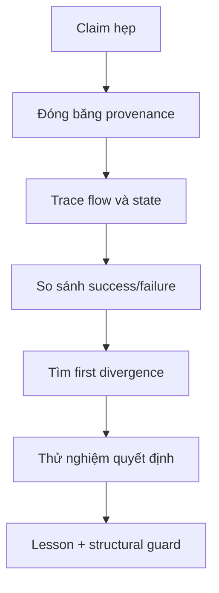

# Native AI — shared reasoning lessons

**Ngày ghi:** 2026-09-16  
**Phạm vi:** A-B-C-D, Vivado/FPGA, FE256, M2/NCG, MIG, FEM persistence,
Pack/ABI, ASTRA và board evidence  
**Tính chất:** sổ bài học dùng chung; các số liệu lấy từ session recap phải
được đối chiếu lại với raw artifact trước khi nâng evidence level.

## Cách dùng

Mỗi chat/agent đọc phần này trước khi phân tích. Không dùng nó để biến một
recap thành proof. Nó trả lời ba câu hỏi:

1. Triệu chứng nào đã xảy ra?
2. Dấu hiệu nào giúp tìm ra first divergence và root cause?
3. Lần sau phải kiểm tra hoặc encode guard nào trước khi lặp lại claim?

Luồng suy luận chuẩn:



Tách ba mức trong mọi entry:

| Mức | Ý nghĩa |
|---|---|
| Direct evidence | raw source/log/report/checkpoint/bitstream/capture nối được với RUN_ID |
| Strong inference | nhiều artifact cùng chỉ về một cơ chế nhưng chưa có một phép đo trực tiếp |
| Unknown | chưa đủ dữ liệu; không được lấp bằng câu chuyện hợp lý |

## Truth boundary hiện tại

```text
BOARD_PASS       = NO
FINAL_PASS       = NO
FE256_PASS       = NO
TIMING_PASS      = NO
MIG_PASS         = NO
FEM_PERSIST_PASS = NO
PROGRAM_PASS     = NO
PROGRAM          = NO   # ladder stamp; OWNER PROGRAM=YES 2026-09-17 is auth only
```

Vai trò:

| Agent | Quyền sở hữu | Câu hỏi phải giữ |
|---|---|---|
| A | architecture/semantic canon | Có còn một common runtime hay đã mọc thêm product path? |
| B | authority, ABI, ASTRA, verification/evidence | Claim này đạt đúng evidence layer và đúng status chưa? |
| C | learning/Q*/SPEAR/FEM/teaching và audit độc lập khi được gọi | Raw artifact có thật sự chứng minh điều D nói không? |
| D | RTL, Vivado, timing, implementation, integration, board path | Source nào tạo ra artifact, và artifact trả lời đúng claim nào? |

Evidence ladder:

```text
BOARD > POST_ROUTE > MIG_XSIM > XSIM > OOC > RTL_FACT
      > ENGINEERING_ESTIMATE > HYPOTHESIS
```

`PASS_XSIM`, `PASS_OOC`, `PASS_IMPLEMENTED` và `PASS_BOARD` là các nhãn khác
nhau. Một block có thể `PASS_XSIM` nhưng `FAIL` ở implementation.

## Lesson L-001 — Functional PASS không đồng nghĩa FPGA architecture tốt

**Tình huống:** FE256 R0 mô phỏng/synth được nhưng implementation FPGA sụp
timing.

**Đối chiếu đã thấy trong recap:**

| Thuộc tính | R0 | R1 reference candidate |
|---|---:|---:|
| ROM/data path | async ROM, LUT fabric | sync 1R BRAM |
| Reduction | `S_FINISH`: 16-hit provenance + uniqueness + min + first-valid | registered/sequential hit reduction |
| Worst depth | 144 logic levels, `hit_prov -> pref` | khoảng 11 levels |
| LUT/FF | 13,003 / 11,504 | khoảng 2,953 / 3,866 isolated |
| BRAM36/DSP | 0 / 0 | 1 / 0 isolated |
| Timing | WNS `-75.723 ns` | WNS `+0.223 ns`, WHS `+0.092 ns` isolated |
| Functional | benchmark usable | XSim `256/256` bit-exact |

Shadow integration R1 được báo cáo là XSim `256/256`, routed WNS `+0.368 ns`,
WHS `+0.037 ns`, TNS/THS `0`, không có routing error. Đây vẫn là candidate
evidence cho đến khi C nối lại exact source/top/XDC/report.

**Cách suy luận:**

```text
timing fail
-> hỏi failing layer: implementation, không phải semantics
-> tìm first divergence: memory inference + combinational visibility
-> kiểm cơ chế vật lý: async ROM không vào BRAM; reduction rộng tạo depth/fanout
-> thay đúng biến: sync BRAM + register + sequential reduction
-> kiểm lại: logic depth, BRAM, LUT, WNS/WHS trên cùng top/config
```

**Bài học tổng quát:** RTL đúng semantics vẫn có thể sai microarchitecture cho
FPGA. Với data nóng, ưu tiên BRAM/register; với reasoning, bounded,
multi-cycle, registered, sparse. Latency tăng là chấp nhận được nếu protocol
cho phép và đã đo đúng.

**Guard:** mọi functional pass của block lớn phải đi qua memory inference,
logic depth/fanout, resource, implementation timing, hold và DRC trước khi gọi
là FPGA-fit. Không sửa XDC trước khi loại trừ mapping/microarchitecture.

## Lesson L-002 — First divergence nằm trước triệu chứng cuối

**Tình huống:** report cuối là WNS âm, nhưng nguyên nhân có thể bắt đầu từ
async memory, reset, clock hoặc source/config không giống baseline.

**Cách suy luận:** so sánh theo thứ tự thực thi, mỗi bước giữ các biến còn lại:

```text
source/commit
-> elaborated hierarchy
-> inferred memory
-> synthesized cone/depth/fanout
-> constraints/clocks
-> placement/route
-> timing/DRC/CDC
-> integration/board
```

Dừng ở bước đầu tiên khác nhau. `WNS -75 ns` là symptom; `async ROM -> LUT`
hoặc `unconstrained clock` mới là candidate cause. Nếu chưa có phép đo phân
biệt, ghi `UNKNOWN`.

**Guard:** mọi finding phải có trường `FIRST_DIVERGENCE`; “timing không tốt”
không phải root-cause statement.

## Lesson L-003 — Baseline là định danh, không phải một con số đẹp hơn

Baseline frozen hiện tại:

```text
arty_a7_r2_top @100 MHz: WNS +0.375 ns, WHS +0.021 ns
```

`arty_a7_mig_top` có report khác (`WNS +1.032 ns`, `WHS +0.008 ns`) nhưng là
top/config khác. Không dùng nó để thay baseline `r2_top`. Mọi so sánh phải
khớp full commit, top, part, XDC/clock, IP/MIG, source manifest và run ID.

**Guard:** manifest bắt buộc chứa các định danh trên; mismatch tạo comparison
mới, không overwrite baseline.

## Lesson L-004 — R1 là reference FPGA implementation, không phải Native AI thứ hai

FE256 trả lời một workload/benchmark. `FE256_R1_REFERENCE_FREEZE` là reference
để kiểm semantics và FPGA mapping; nó không được mọc thành reasoning path song
song với M2/NCG.

Common runtime phải là:

```text
QueryRecord
-> directory/index
-> PostingEntry64
-> posting page
-> bounded traversal
-> working frontier
-> evidence
-> ASTRA
-> StructuredResult
```

Khi common runtime chạy cùng 256 cases với timing hợp lệ, dedicated FE256 path
mới có cơ sở để retire khỏi final top. Nếu common runtime fail, sửa directory,
posting, traversal, context, provenance, identity, conflict, ASTRA, memory hoặc
timing. Không thêm FE256-only cache/index/ASTRA path/memory protocol/answer
logic để làm benchmark dễ hơn.

**Cách suy luận:** một test pass chứng minh path đã chạy, không chứng minh đó là
path sản phẩm. Hỏi “input đã đi qua đúng common runtime chưa?” trước khi hỏi
“tỷ lệ pass bao nhiêu?”.

## Lesson L-005 — Scale warning chưa phải failure, nhưng là nợ phải theo dõi

C audit Q*/SPEAR/FEM được báo cáo là `CLEAN_WITH_SCALE_WARNINGS`:

```text
QSTAR = YELLOW
SPEAR = YELLOW
FEM   = GREEN
```

Q* hiện `theta[64] -> async dual read -> async reset-all -> register + mux`
vẫn timing được ở scale hiện tại, nhưng có rủi ro khi scale tăng. SPEAR có rủi
ro nếu `K_HARD_MAX` tăng lớn. Đây là cảnh báo có điều kiện, không được ghi
thành FE256-class failure.

**Cách suy luận:** ghi rõ điều kiện kích hoạt rủi ro (width, K, fanout, reset,
memory size), rồi tạo threshold test hoặc report để phát hiện khi điều kiện
đó xảy ra.

## Lesson L-006 — Semantic shortcut có thể làm recall đẹp giả

Các pattern từng phải kiểm:

```text
qid/map_q/fi_of
answer ID hoặc hidden winner
designer-fixed lexicon
ID-derived key
host oracle/host answer path
full scan hoặc corpus quá nhỏ nên trả lại tất cả
```

**Cách suy luận:** không hỏi chỉ “counter leakage = 0”. Hỏi đường lựa chọn
thực tế: query nào tạo key, candidate nào được sinh, candidate nào bị loại,
winner đến từ đâu, và mỗi representation có còn semantic identity không.

Test bác bỏ tối thiểu:

| Test | Nếu hệ thống thật sự semantic/learned |
|---|---|
| role reversal | subject/object đổi thì hành vi đổi đúng theo vai |
| ID permutation | đổi ID nhưng giữ structure thì kết quả giữ semantics |
| edge mutation/ablation | bỏ cạnh quyết định thì evidence/result đổi |
| unknown/conflict/incomplete | không bịa đáp án và giữ safety/status đúng |
| held-out / shuffled reward | kết quả không chỉ là fixture hoặc thứ tự ID |

**Guard:** mọi claim “sparse retrieval”, “learned language” hoặc “no host
help” phải liệt kê test bác bỏ và exact path instrumentation.

## Lesson L-007 — Identity width phải được kiểm ở mọi boundary

Canonical rule hiện tại gồm semantic ID 32-bit, `ACTIVE_ID_RANGE`,
`PostingEntry = 64 bit`, và `2x64 = PACK_GROUP`. Full identity phải sống qua
parser, key, directory, posting, context, ASTRA, reward, persistence và pack.

**Cách suy luận:** tìm mọi chỗ cắt width, cast, hash, slice và serialize. Thử
high-ID và hai ID va vào cùng low bits. Nếu chỉ test ID nhỏ thì không chứng minh
được identity preservation.

**Guard:** width assertions, high-ID/collision vector, byte-level pack compare
và manifest ghi schema version/field width.

## Lesson L-008 — Accepted không đồng nghĩa committed

`UPDATE_ACCEPTED`, ACK hoặc counter chỉ chứng minh protocol đã nhận request.
Commit phải chứng minh intended state transition đã ghi đúng, có generation/
epoch/digest phù hợp và survive boundary đang được claim.

**Cách suy luận:** trace:

```text
request -> validation -> accepted -> write enable/address/data
-> write completion -> commit marker/digest -> readback
-> reset/reload/power boundary -> restored state
```

Kiểm riêng duplicate, stale generation, wrong identity, interrupted commit,
dirty eviction, reset/reload và power-loss. BRAM còn dữ liệu không chứng minh
DDR/T2 persistence.

**Guard:** tách status names và assertions cho accepted/committed/restored;
không cấp `FEM_PERSIST_PASS` từ ACK hoặc warm reset đơn lẻ.

## Lesson L-009 — Artifact tồn tại không chứng minh đúng artifact đã chạy

Một bitstream trên disk, text decode, file timestamp hoặc exit code không đủ.
Phải nối được:

```text
full commit -> exact Vivado project/top/part/XDC/IP
-> command -> checkpoint/bitstream hash
-> programming target/DONE/JTAG state
-> raw UART binary capture -> comparator/gold result
```

OOC timing thiếu constraint không phải timing proof. Một candidate top khác
không phải final top. Dirty worktree hoặc stale report phải được ghi rõ.

## Lesson L-010 — Bài học phải trở thành cấu trúc có thể kiểm tra

Khi cùng một correction xuất hiện lần thứ hai, chuyển nó thành một trong các
guard sau:

| Loại | Ví dụ |
|---|---|
| manifest field | full SHA, top, part, XDC, IP, Vivado skill/version |
| script/check | compare snapshot, hash raw capture, detect unconstrained clocks |
| RTL assertion | width, valid mask, generation, accepted/committed |
| test | role reversal, ID permutation, overflow, reset/reload, common-runtime FE256 |
| status policy | block-level PASS không tự promote global PASS |
| review check | FE256-only path không được import vào common runtime |

Đây là cách các chat sau học lại được bài cũ mà không cần dựa vào trí nhớ của
một agent.

## Lesson L-011 — JSON/mail là claim index, không phải artifact

**Tình huống:** B nghiệm thu D 2026-09-17. Isolated `D_M2_QUERY_POSTING.json`
ghi `finish_ns=593505` và `xsim_log.sha256=bb4647d7…`. Live
`vivado/m2_query_posting/xsim/xsim.log` là `$finish 1153925 ns`, sha256
`712d594e…`. Cả hai banner đều `M2_QUERY_POST_XSIM_PASS rows=235`.
`D_M4_MIG.json` đồng thời `program=YES` và `bitstream.program=NO`.

**Claim being tested:** reading D JSON is enough to absorb evidence class.

**Expected:** JSON sha256/finish_ns equals live file bytes.

**Observed:** mismatch on M2 log; contradictory program flags in one JSON.

**First divergence:** evidence package superseded (isolated JSON not rewritten
after later XSim / JSON merge leftover). Not a hidden DUT functional fail —
live log still shows the same XSim banner.

**Root cause:** STALE_INDEX (confirmed for M2 JSON vs live log). Program-flag
contradiction is strong inference of merge leftover; `PROGRAM.txt` /
`program.log` remain the program-event sources.

**General rule:** mail and summary JSON are claim indexes. Rehash the named
live bytes. If JSON ≠ live, classify STALE_INDEX and absorb from the live
artifact at its proven layer only.

**Smallest decisive reproducer:** `Get-FileHash` (or sha256) of the path named
in JSON versus the hash field in JSON.

**Guard:** absorb record must include `path, sha256_live, sha256_json, match`.
Mismatch blocks ladder promotion; it does not silently inherit the JSON
finish_ns. Related to L-009 (artifact existence ≠ correct artifact).

**Next owner action:** D may refresh isolated M2 JSON to the live log hash.
B does not rewrite D JSON as gold.

**Status:** ACTIVE (B-NGHIEM-THU-D-20260917)

## Lesson L-012 — End of startup HIGH ≠ PROGRAM.DONE ≠ PROGRAM_PASS

**Tình huống:** Owner `PROGRAM=YES` 2026-09-17. `program_hw_devices` on bit
`f6a6091f…` for `xc7a100t_0` / JTAG `210319BE776EA`. Labtools
`End of startup status: HIGH`. Same run: `IR.STATUS=NA PROGRAM.DONE=NA`.
D `PROGRAM.txt` explicitly `PROGRAM_PASS=NO`. Adjacent UART hop-1
`0x04`+`0x20` CRC match is fail-closed SEARCH_INCOMPLETE.

**Claim being tested:** JTAG program + startup HIGH (+ owner auth) = PROGRAM_PASS
or BOARD_PASS.

**Expected [§32 PROGRAM_PASS]:** exact bit hash, target/device identity,
configuration succeeds **and** startup/DONE valid.

**Observed:** hash + target + startup HIGH recorded; DONE register NA.

**First divergence:** Tcl `get_property PROGRAM.DONE` / `REGISTER.IR.STATUS`
returns NA in the same session that prints End of startup HIGH.

**Root cause:** UNKNOWN why the properties are NA (tool/property-name vs
true missing DONE). Direct evidence forbids inferring DONE=1.

**Why initial inference fails:** owner authorization is permission to program,
not a ladder stamp. Startup HIGH is one Labtools line, not the DONE readback
§32 names. Hop-1 UART is not UART_E2E_32_32.

**General rule:**

```text
OWNER PROGRAM=YES     -> authorization
bit hash + JTAG id    -> identity of what was streamed
End of startup HIGH   -> Labtools config event
PROGRAM.DONE recorded -> required for PROGRAM_PASS
1-txn UART smoke      -> UART_BOARD_SMOKE_CANDIDATE only
```

**Guard:** B/D must not self-stamp `PROGRAM_PASS` when `PROGRAM.DONE` is NA.
Do not stamp `BOARD_PASS` from hop-1. Pack dest-complete XSim on `mig_ui_bram`
is not `PACK_ABI_24_24_PASS` (B comparator + `--compare DUT.jsonl` required).

**Next owner action:** optional alternate DONE readback if owner wants the
PROGRAM_PASS gate; D next main task remains FEM persist.

**Stop condition:** ACCEPT_CANDIDATE_ONLY. Owner-only BOARD_PASS / FINAL_PASS.

**Status:** ACTIVE (B-NGHIEM-THU-D-20260917)

## Template cho lesson mới

Copy nguyên entry này khi phát hiện pattern mới:

```text
LESSON_ID:
DATE/RUN_ID:
OWNER:
SITUATION:
CLAIM_BEING_TESTED:
EXPECTED:
OBSERVED:
SUCCESS_ARTIFACT:
FAILURE_ARTIFACT:
EVIDENCE_PATHS_AND_HASHES:
EVIDENCE_LEVEL:
FIRST_DIVERGENCE:
ROOT_CAUSE_OR_UNKNOWN:
WHY_THE_INITIAL_INFERENCE_FAILED:
GENERAL_RULE:
SMALLEST_DECISIVE_REPRODUCER:
STRUCTURAL_GUARD_OR_TEST:
BLAST_RADIUS:
NEXT_OWNER_ACTION:
STOP_CONDITION:
STATUS:
```

Không xóa entry cũ khi thiết kế được sửa. Thêm RUN_ID mới và ghi rõ điều gì đã
được chứng minh, điều gì vẫn là candidate.

## Lesson L-011 — Operational verbs are not acceptance stamps

**DATE/RUN_ID:** 2026-09-17 / A-ARCH-ABSORB-20260917-M4-MIG-PROGRAM  
**OWNER:** AGENT_A  
**SITUATION:** D/B delivered M4 shadow route, M4+MIG candidate, bitstream,
owner PROGRAM, UART board smoke, and Pack/ABI24 MIG-DUT XSim. Mail language
uses PROGRAM / XSIM_PASS banners / BOARD smoke adjacent to ladder vocabulary.

**CLAIM_BEING_TESTED:** May A absorb these as architecture facts without
emitting BOARD_PASS / PROGRAM_PASS / MIG_PASS / PACK_ABI_24_24_PASS?

**EXPECTED:** Absorb as CANDIDATE facts; encode inequalities; no ladder promote.

**OBSERVED:** Live D 01:04 + B-CLASS no-promote; A stamps 01:10 MATCH; §20
rows OWNER_PROGRAM_YES ≠ PROGRAM_PASS, UART_BOARD_SMOKE ≠ BOARD_PASS,
MIG_INSTANTIATE ≠ MIG_PASS, BITSTREAM_WRITE ≠ PROGRAM_PASS,
PACK_ABI24_MIG_DUT_XSIM ≠ PACK_ABI_24_24_PASS.

**SUCCESS_ARTIFACT:** A-owned 00/01/02/20 @ 2026-09-17T01:10:00+07:00 live MATCH;
reasoning export `reasoning_exports/20260917T0420_AGENT_A_A-ARCH-ABSORB-20260917-M4-MIG-PROGRAM.md`

**FAILURE_ARTIFACT:** N/A (promotion path rejected before stamp)

**EVIDENCE_PATHS_AND_HASHES:** live 22/23/30/33 SHA prefixes CCBAD0F5 /
FAF2541C / 2127690B / D5C96CDB; bit sha f6a6091f… cited as programmed-config
only

**EVIDENCE_LEVEL:** RTL_FACT / POST_ROUTE / PROGRAMMED_CONFIG / UART_SMOKE
(not BOARD acceptance)

**FIRST_DIVERGENCE:** Treating owner PROGRAM + UART response as BOARD_PASS /
PROGRAM_PASS vs D/B explicit NO PASS + PROGRAM.DONE NA + fail-closed hop-1

**ROOT_CAUSE_OR_UNKNOWN:** Vocabulary collision between ops events and ladder
stamps (process). Silicon root cause N/A for this absorb.

**WHY_THE_INITIAL_INFERENCE_FAILED:** Surface words PROGRAM / XSIM_PASS / BOARD
invite promotion; decisive check is B-CLASS + §32 completeness (DONE/IR) +
result status (0x04/0x20 SEARCH_INCOMPLETE), not the verb alone.

**GENERAL_RULE:** Classify artifact layer first (XSIM|OOC|POST_ROUTE|BITSTREAM|
PROGRAMMED_CONFIG|UART_SMOKE|BOARD_ACCEPTANCE). Map to CANDIDATE unless owner+B
authorize a named PASS. A never self-stamps PASS. Every new ops verb needs a
§20 inequality before absorb closes.

**SMALLEST_DECISIVE_REPRODUCER:** For any mail containing PROGRAM or *_XSIM_PASS:
require explicit NOT_CLAIMED list + one inequality row before updating A stamps.

**STRUCTURAL_GUARD_OR_TEST:**
- Forbidden A PASS stamps list in absorb checklist
- OWNER PROGRAM=YES ≠ PROGRAM_PASS
- Freeze/FE256 reference remains DO_NOT_BIND / REFERENCE until retirement contract
- Missing NATIVE_AI_REASONING_EXPERIENCE_V1 => INCOMPLETE_HANDOFF

**BLAST_RADIUS:** A canon absorb; B ladder classification; D lab ops reporting.
Does not change RTL.

**NEXT_OWNER_ACTION:** Drain subsequent Pack board SEQ/ISO and REPROGRAM mails
under the same ceilings; export a new experience if absorbed.

**STOP_CONDITION:** Inequalities present; live MATCH; ACK; stop CLEAN; experience
export on disk.

**STATUS:** ACTIVE

## Lesson L-015 — Closing the previous worst path is not timing-closed

**DATE/RUN_ID:** 2026-09-16 / C-20260916-PIPE-AUDIT-HANDOFF  
**OWNER:** AGENT_C  
**SITUATION:** Q*/SPEAR OOC 100 MHz after successive registered splits.

**CLAIM_BEING_TESTED:** Two pipeline splits (Q* da/mul-write, SPEAR CRC-before-latch) suffice to close 10 ns OOC.

**EXPECTED:** After those splits, design WNS > 0 and remains the closed cone.

**OBSERVED:** Worst path migrated each round (feat_r→theta, then disc_m→target, then SPEAR CRC/ranking/operand, then mask_r→q_sel). Icarus/XSim stayed PASS. Final OOC Q* +1.703 SPEAR +1.898.

**SUCCESS_ARTIFACT:** PACKAGE `QSTAR_SPEAR_OOC_PIPE.json`; audit `*_timing.rpt` / `*_paths_setup.rpt`

**FAILURE_ARTIFACT:** Mid-pipe OOC Q* WNS −2.330/−2.009; SPEAR −2.739/−1.311/−1.052 (reports later overwritten)

**EVIDENCE_PATHS_AND_HASHES:** HEAD `e3d59ab`; qstar `d4f64e65…`; spear `11e71b50…`

**EVIDENCE_LEVEL:** PASS_OOC (unplaced) after final split; FAIL at PASS_OOC until then; not PASS_IMPLEMENTED

**FIRST_DIVERGENCE:** Combinational remainder after each new register stage, not XDC, not a simulator mismatch.

**ROOT_CAUSE_OR_UNKNOWN:** Software-shaped one-cycle datapaths; slack-worst migrates to the next unregistered cone.

**WHY_THE_INITIAL_INFERENCE_FAILED:** Treating disappearance of the old Source/Dest as "timing closed" instead of re-quoting the new worst.

**GENERAL_RULE:** After every RTL split, re-run OOC and quote the **current** Source/Destination/levels. Stop only when that worst is MET or classified as another owner's path.

**SMALLEST_DECISIVE_REPRODUCER:** Synth the pre-split RTL vs `e3d59ab` at 10 ns; compare worst-path endpoints, not only WNS sign.

**STRUCTURAL_GUARD_OR_TEST:** `C_CONE_CONSUME_GUARD`; `C_OOC_LAYER_GUARD` (OOC WNS>0 is PASS_OOC only)

**BLAST_RADIUS:** Extra handshake cycles; ports unchanged; D must use `done`/`prop_valid`.

**NEXT_OWNER_ACTION:** AGENT_D consume hashes; quote flatten/route if a C-owned cone fails.

**STOP_CONDITION:** Current worst MET at the claimed layer, or not C-owned.

**STATUS:** ACTIVE

## Lesson L-016 — OOC slack-worst can hide a different flatten cone

**DATE/RUN_ID:** 2026-09-16 / C-20260916-PIPE-AUDIT-HANDOFF  
**OWNER:** AGENT_C (measure/split), AGENT_D (quote path)  
**SITUATION:** bag1 OOC MET and r2_top keep-hierarchy +1.549 vs `arty_a7_mig_top` flatten fail.

**CLAIM_BEING_TESTED:** OOC design WNS > 0 implies the D-reported flatten cone is also MET.

**EXPECTED:** Same C RTL, 10 ns, all C-owned cones MET under flatten.

**OBSERVED:** Flatten `mask_r[5]→q_sel[0]` −1.482 / 16 LUT / 11.346 ns while C OOC quoted DSP 3-level MET. After P_EXP, named OOC cone 3.160 ns slack +6.800; D ui_clk WNS +1.277 and mask cone not top.

**SUCCESS_ARTIFACT:** JSON `round2_select_cone`; D mailbox 20260916T132944

**FAILURE_ARTIFACT:** D mailbox 20260916T113106 mask cone

**EVIDENCE_PATHS_AND_HASHES:** same C hashes as L-015; P_EXP in `e3d59ab`

**EVIDENCE_LEVEL:** FAIL 100 MHz flatten (bag1); PASS_OOC on named cone after P_EXP; routed NOT_EVIDENCED

**FIRST_DIVERGENCE:** Which path is worst under which top/config (DSP vs select LUT cone; r2_top vs mig_top), not C arithmetic.

**ROOT_CAUSE_OR_UNKNOWN:** P_SEL still computed popcnt + mod_small + kth_legal + q_row mux combinationally. Why r2_top vs mig_top differed: UNKNOWN.

**WHY_THE_INITIAL_INFERENCE_FAILED:** Design WNS reports the slack-worst path only; a still-combo cone can hide until flatten/congestion.

**GENERAL_RULE:** Treat D's quoted Source/Dest as the requirement. Run named-cone timing even if OOC WNS is already positive.

**SMALLEST_DECISIVE_REPRODUCER:** `OOC_FROM=mask_r_reg.*` `OOC_TO=q_sel_reg.*` via env (do not put unquoted `|` in cmd.exe Tcl regex).

**STRUCTURAL_GUARD_OR_TEST:** env `OOC_FROM`/`OOC_TO` in `ooc_synth.tcl`; never infer flatten MET from OOC MET.

**BLAST_RADIUS:** +2 propose cycles, 5-bit Q* state; 10 ns sys_clk vs ~12 ns ui_clk.

**NEXT_OWNER_ACTION:** AGENT_D quote post-P_EXP flatten/route on these hashes.

**STOP_CONDITION:** Named cone quoted at the claimed layer.

**STATUS:** ACTIVE

## Lesson L-017 — D must consume hashes, not measurement-only mail

**DATE/RUN_ID:** 2026-09-16 / C-TO-D-INTEGRATION-HANDOFF  
**OWNER:** AGENT_C (publish), AGENT_D (consume)  
**SITUATION:** Cross-agent FPGA integration after C publishes pipelined RTL.

**CLAIM_BEING_TESTED:** A timing table in mail is evidence about the live C netlist.

**EXPECTED:** PACKAGE SHA256 of each named RTL equals worktree; D ACK echoes those hashes.

**OBSERVED:** D could not use C fabric numbers until old combo paths left disk. Publish-before-measure is the only valid consume.

**SUCCESS_ARTIFACT:** PACKAGE `QSTAR_SPEAR_OOC_PIPE.json` with hashes `d4f64e65` / `11e71b50` / `45b9b930`

**FAILURE_ARTIFACT:** Any WNS attached to a different hash (STALE_INDEX)

**EVIDENCE_PATHS_AND_HASHES:** `TASK_C_TO_D_INTEGRATION_HANDOFF.md`; JSON bag

**EVIDENCE_LEVEL:** process FACT; timing numbers remain layer-tagged

**FIRST_DIVERGENCE:** Timing table identity (hash) vs live worktree, before WNS sign.

**ROOT_CAUSE_OR_UNKNOWN:** Measurement without netlist identity is not evidence.

**WHY_THE_INITIAL_INFERENCE_FAILED:** Treating "we ran OOC" as transferable without the bytes D will instantiate.

**GENERAL_RULE:** Mail D only after bag JSON + RTL hashes match. If hashes differ, D's WNS is about a different design.

**SMALLEST_DECISIVE_REPRODUCER:** `Get-FileHash` PACKAGE vs worktree for the three C RTL files; mismatch ⇒ do not consume.

**STRUCTURAL_GUARD_OR_TEST:** `C_PUBLISH_HASH_GUARD`

**BLAST_RADIUS:** D integration schedule; C claim ceiling stays PASS_OOC/PASS_XSIM.

**NEXT_OWNER_ACTION:** AGENT_D ACK hashes; do not rewrite C memory.

**STOP_CONDITION:** Hash match + D quoted layer.

**STATUS:** ACTIVE

## Lesson L-018 — Small async-reset arrays are REGISTER+MUXF, not a BRAM rewrite ticket

**DATE/RUN_ID:** 2026-09-16 / C-FPGA-STRUCTURAL-AUDIT-01  
**OWNER:** AGENT_D (do not rewrite); AGENT_C if scale  
**SITUATION:** Q* `theta[0:63]` 16-bit, SPEAR `cand_*` NSLOT=9, vs FE256 R0 large async mem (0 BRAM, 144 levels, WNS −75.7).

**CLAIM_BEING_TESTED:** 0 BRAM on C Q*/SPEAR means D must recode memories to BRAM now.

**EXPECTED:** Optional LUTRAM at this size; BRAM not expected; style overlap ≠ same failure class.

**OBSERVED:** Audit 0 BRAM / 0 LUTRAM; Q* MUXF8=128; max listed levels 14; OOC WNS all positive. Complements L-005 (YELLOW scale warning).

**SUCCESS_ARTIFACT:** `worktrees/AGENT_C/Temp/c_fpga_structural_audit/*_ram.rpt`; WNS +1.703/+1.898/+3.669

**FAILURE_ARTIFACT:** FE256 R0 144 levels / WNS −75.723 (different size)

**EVIDENCE_PATHS_AND_HASHES:** fem `45b9b930…`; audit reports in C Temp

**EVIDENCE_LEVEL:** EVIDENCED_LOCAL_CAUSAL mapping; CLEAN_WITH_SCALE_WARNINGS

**FIRST_DIVERGENCE:** Depth 64 / NSLOT=9 vs large ROM + 144-level cone — not "async array ⇒ recode now".

**ROOT_CAUSE_OR_UNKNOWN:** UG901 RAM templates want synchronous read and typically no async reset-all. At this capacity REGISTER+MUXF is expected.

**WHY_THE_INITIAL_INFERENCE_FAILED:** Equating FE256-class coding style with FE256-class timing without checking size/levels/WNS.

**GENERAL_RULE:** Approve current size. Do not rewrite C memories to force BRAM. Halt and wake C if `C_SCALE_GUARD` fires.

**SMALLEST_DECISIVE_REPRODUCER:** `report_ram_utilization` on `qstar_select` at depth 64.

**STRUCTURAL_GUARD_OR_TEST:** `C_SCALE_GUARD` (theta>64, actions>8, features>8, K_HARD_MAX>9, FEM N_RAW material increase)

**BLAST_RADIUS:** D bind; FEM T2/MIG stays D-owned.

**NEXT_OWNER_ACTION:** AGENT_D integrate current hashes; do not force BRAM.

**STOP_CONDITION:** Profile stays within guard, or C re-audit if guard fires.

**STATUS:** ACTIVE

---

LESSON_ID: L-019 ACK_FLUSH_OVERLAP

DATE/RUN_ID: 2026-09-16 / 20260916T221443Z

OWNER: AGENT_D

SITUATION: Pack VALIDATION_CLEAR UART TB after adding TX flush to clear leftover frames that blocked mux_ready.

CLAIM_BEING_TESTED: uart_flush during S_ACK/S_BUSY/S_ERR can coexist with clr_ack_ready=mux_ready.

EXPECTED: ACK token 0xC1EA50A5 captured; UART XSim 15 MATCH.

OBSERVED: PACK_DEBUG_CLEAR_UART_XSIM_FAIL 7/15 TIMEOUT exp=c1ea50a5. After `clr_ack_ready = mux_ready && !uart_flush`: PASS 15 finish 15781665 ns.

SUCCESS_ARTIFACT: `D:/FPGA/arty_d/pack_debug_clear/xsim_uart_run.log` PASS 15; top `clr_ack_ready = mux_ready && !uart_flush`.

FAILURE_ARTIFACT: UART XSim FAIL 7/15 on identity with flush overlapping ACK handshake.

EVIDENCE_PATHS_AND_HASHES: live top `arty_a7_r2_top_m4_mig_candidate.sv` sha256 `35c49b2ceb4995c5cca3328e5b42c9b8121ae6c82b6e4813c173c4e843789ef3`; `pack_debug_clear.sv` `77e3dc26cebacbc2e975fb8748635b7c364263f3f52a5f31538ac7e49fd752ec`.

EVIDENCE_LEVEL: PASS_XSIM (UART TB BAUD=1e6, mig_ui_bram). Not PASS_BOARD.

FIRST_DIVERGENCE: First cycle of S_ACK with uart_flush still high dropped the ACK word.

ROOT_CAUSE_OR_UNKNOWN: Flush forces TX idle/ready while CLEAR FSM also tries to complete ACK handshake on the same mux.

WHY_THE_INITIAL_INFERENCE_FAILED: Flush was inferred as a TX leftover cure; leftover cure and ACK completion share the same ready/valid path.

GENERAL_RULE: Never assert consumer-ready for a protocol ACK while a flush that resets that path is active.

SMALLEST_DECISIVE_REPRODUCER: UART CLEAR TB T1 with `clr_ack_ready=mux_ready` (no flush gate).

STRUCTURAL_GUARD_OR_TEST: ACK_READY_NOT_DURING_FLUSH; UART XSim T1-T8.

BLAST_RADIUS: D-owned UART mux/CLEAR only.

NEXT_OWNER_ACTION: AGENT_E ANALYSIS_ONLY; do not re-enable ack_ready during flush.

STOP_CONDITION: UART XSim 15 MATCH at the identity that adds flush.

STATUS: ACTIVE

---

LESSON_ID: L-020 STOP_FRAMING_R_UNSUP

DATE/RUN_ID: 2026-09-16 / identity 097c7795 vs bbba86c1

OWNER: AGENT_D

SITUATION: Board CLEAR after successful packs returned 0 bytes. Hypothesis: STOP-hold left RX mid-word; CLEAR_REQ bytes misaligned.

CLAIM_BEING_TESTED: At STOP, if stop-bit sample is 0, drop byte and reset bix so the next start-bit realigns.

EXPECTED: Fewer silent CLEAR; CLEAR_ACK 0xC1EA50A5.

OBSERVED: Identity `097c7795` campaign pack_ok=21/31 with many status `0200075a` (R_UNSUP). Opcode of CLEAR_REQ 0x44524743 is 0x43. Identity `bbba86c1` (framing branch reverted) pack_ok=2/5 CLEAR None from S-02.

SUCCESS_ARTIFACT: none on board for this change.

FAILURE_ARTIFACT: `D:/FPGA/arty_d/m4_mig_clear/UART_PACK24_CLEAR_BOARD.jsonl` rows with status 0200075a; bit sha256 `097c7795…`.

EVIDENCE_PATHS_AND_HASHES: `uart_rx_word.sv` live `638f9719732f971828205c43b9894cc2b93529fb6e1e39ab90f6970ca0790823` (framing reverted).

EVIDENCE_LEVEL: UART_BOARD CANDIDATE. Not BOARD_PASS.

FIRST_DIVERGENCE: Extra `if (!rx_d)` at STOP vs always complete word then IDLE.

ROOT_CAUSE_OR_UNKNOWN: Dropping a STOP=0 byte and resetting bix can emit a 4-byte window whose opcode is 0x43 (CLEAR word eaten as pack). Whether STOP-hold is the board-silence cause remains UNKNOWN on live `bbba86c1`.

WHY_THE_INITIAL_INFERENCE_FAILED: Framing noise and protocol opcode share the same 32-bit mailbox; a drop+realign can still present a plausible but wrong word.

GENERAL_RULE: UART framing experiments must be scored by token class (None vs 0200075a vs ACK), not pack_ok alone. One RTL variable per bitstream.

SMALLEST_DECISIVE_REPRODUCER: Board campaign on 097c7795 vs bbba86c1 with same host script.

STRUCTURAL_GUARD_OR_TEST: Do not treat R_UNSUP as CLEAR timeout. AGENT_E ANALYSIS_ONLY.

BLAST_RADIUS: uart_rx_word (all consumers of default flush=0). Freeze tops not modified.

NEXT_OWNER_ACTION: AGENT_E discriminate H1 vs H2 vs H4 without re-adding STOP drop unless authorized.

STOP_CONDITION: E_AUDIT_OUT classifies token 0200075a vs None.

STATUS: ACTIVE

---

LESSON_ID: L-021 WR_VALID_WITHOUT_READY

DATE/RUN_ID: 2026-09-16 / AGENT_E 20260916T223500Z identity bbba86c1

OWNER: AGENT_E

SITUATION: CLEAR board pack_ok=2/5 then CLEAR got=None. Top sniffs CLEAR on uart_rx mailbox, FIFO sits after, w_ready ignores fifo_wr_ready.

CLAIM_BEING_TESTED: wr_valid=w_valid&&!clr_take and w_ready=clr_take||!clr_hold can write FIFO while UART thinks the word is stalled, or drop pack words when FIFO is full.

EXPECTED: valid/ready: consumer accepts only when ready; hold must not duplicate CLEAR into FIFO.

OBSERVED: RTL_FACT both assigns present in snapshot top and UART TB. Board V-02 0200075a (R_UNSUP) with gold BEGIN; mute after S-01. Mechanism on board not ILA-proven.

SUCCESS_ARTIFACT: none. ANALYSIS_ONLY.

FAILURE_ARTIFACT: UART_PACK24_CLEAR_BOARD.jsonl; top sha256 35c49b2ceb4995c5cca3328e5b42c9b8121ae6c82b6e4813c173c4e843789ef3

EVIDENCE_PATHS_AND_HASHES: E_AUDIT_OUT/E_AUDIT_REPORT.md; scan_result.json handshake true/true/true.

EVIDENCE_LEVEL: RTL_FACT + UART_BOARD CANDIDATE. Not BOARD_PASS.

FIRST_DIVERGENCE: UART TB never extra-CLEAR during hold and never fifo-full at 115200+mig0.

ROOT_CAUSE_OR_UNKNOWN: Handshake defect is FACT. Whether it is the mute injector remains UNKNOWN.

WHY_THE_INITIAL_INFERENCE_FAILED: PASS_XSIM UART 15 used the same broken handshake, so it cannot falsify hold-flood.

GENERAL_RULE: Elastic buffer wr_valid must be gated by wr_ready and by hold when the sniff path has already taken the command word. Token None ≠ R_UNSUP ≠ R_SENTINEL.

SMALLEST_DECISIVE_REPRODUCER: XSim: assert clr_hold, keep w_valid=1 with CLEAR data, count FIFO used. Expect used not ramp to DEPTH.

STRUCTURAL_GUARD_OR_TEST: WR_VALID_REQUIRES_READY; do not implement until owner authorizes D.

BLAST_RADIUS: D-owned top/FIFO/UART. C RTL and freeze DCPs out of scope.

NEXT_OWNER_ACTION: AGENT_D implement only after owner task; E does not patch.

STOP_CONDITION: XSim hold-flood test exists; then optional READ_ONLY board 1-CLEAR.

STATUS: CANDIDATE

---

LESSON_ID: L-022 AUDIT_EXCEPT_PROGRAM_NE_ANALYSIS_ONLY

DATE/RUN_ID: 2026-09-17 / AGENT_D 20260916T225000Z

OWNER: AGENT_D (project lead); AGENT_E (audit)

SITUATION: First E wake used ANALYSIS_ONLY and did not re-run XSim. Owner restated: D still leads; E may do everything needed to audit except nạp board.

CLAIM_BEING_TESTED: "Audit" equals "read files only" vs "all tools except program_hw_devices".

EXPECTED: E can XSim, copy, DCP analysis, UART probe after GRANT program=no. E cannot 32_program.

OBSERVED: Owner restated after ANALYSIS_ONLY wake. D wrote 04_OWNER_MANDATE_AUDIT_FULL_EXCEPT_PROGRAM.md. SRAM not programmed this run.

SUCCESS_ARTIFACT: 04_OWNER_MANDATE_AUDIT_FULL_EXCEPT_PROGRAM.md; unique H bit cf62102f copy.

FAILURE_ARTIFACT: none for this law change. GOAL CLEAR board still NOT_MET.

EVIDENCE_PATHS_AND_HASHES: unique H bit sha256 cf62102f21bd146976779e45dec77f912790da1000327fbc505941cdef4e7fc9

EVIDENCE_LEVEL: OWNER_LAW. Not PASS_BOARD.

FIRST_DIVERGENCE: ANALYSIS_ONLY vs AUDIT_FULL_EXCEPT_PROGRAM.

ROOT_CAUSE_OR_UNKNOWN: Mandate wording, not RTL.

WHY_THE_INITIAL_INFERENCE_FAILED: ANALYSIS_ONLY was copied from the first handoff; owner later distinguished nạp from other audit work.

GENERAL_RULE: Do not treat "do not program" as "do not XSim / do not UART-capture / do not copy". Nạp = JTAG configure. Dispatcher GRANT program=yes only to the implementation owner.

SMALLEST_DECISIVE_REPRODUCER: E re-run hold-flood XSim without 32_program.

STRUCTURAL_GUARD_OR_TEST: PROGRAM_BY_E=FORBIDDEN; BOARD_LEASE program flag separate from UART.

BLAST_RADIUS: mailbox/lease/E folder. SRAM unchanged.

NEXT_OWNER_ACTION: AGENT_E execute audit except nạp. AGENT_D wait GRANT + SRAM-D probe before nạp H.

STOP_CONDITION: E 32_program never; D 32_program only after GRANT.

STATUS: ACTIVE

---

LESSON_ID: L-023 S_REJECT_ABSORBING_NO_STATUS_EDGE

DATE/RUN_ID: 2026-09-17 / AGENT_E 20260917T055616Z

OWNER: AGENT_E

SITUATION: pack_loader unknown opcode (CLEAR 0x43 or MAGIC 0x4E as opcode) goes S_EDRAIN then S_REJECT. s_ready stays 1. Status UART is edge-triggered on load_reject.

CLAIM_BEING_TESTED: A second command after reject produces a new ACK/NAK word.

EXPECTED: Either return to IDLE after reject, or drop s_ready, or pulse a new status.

OBSERVED: XSim T4/T5 reason 07. T6 second CLEAR: load_reject stays 1, new_ack=0, loader_busy=0. debug-463f7f.log T6 ts=7705.

SUCCESS_ARTIFACT: E_AUDIT_OUT/xsim_e_rtl/xsim.log E_RTL_AUDIT_XSIM_PASS 8

FAILURE_ARTIFACT: none on board this run (no program)

EVIDENCE_PATHS_AND_HASHES: E_AUDIT_OUT/tb_e_rtl_audit.sv; xsim.log finish 7705 ns; debug-463f7f.log

EVIDENCE_LEVEL: PASS_XSIM. Not BOARD_PASS.

FIRST_DIVERGENCE: S_REJECT consumes s_valid without a new load_ack/load_reject edge.

ROOT_CAUSE_OR_UNKNOWN: Absorbing state + edge status encoder. Whether this is CLEAR UART None is UNKNOWN (CLEAR sniff is 100-side).

WHY_THE_INITIAL_INFERENCE_FAILED: Treating loader_busy=0 as ready for next pack hides that S_REJECT is still eating the stream.

GENERAL_RULE: Terminal reject with s_ready=1 must still emit a status edge per consumed command, or not consume. Token None ≠ 0200075a.

SMALLEST_DECISIVE_REPRODUCER: Drive leftover 0x44524743 into pack_loader; wait load_reject; send a second word; assert no new load_ack.

STRUCTURAL_GUARD_OR_TEST: S_REJECT_MUST_NOT_EAT_CLEAR_WITHOUT_STATUS (proposed; E does not patch)

BLAST_RADIUS: pack_loader / pack status CDC / UART mux. C RTL out of scope.

NEXT_OWNER_ACTION: D may patch after owner task. E no GRANT.

STOP_CONDITION: XSim shows a new status edge or s_ready=0 in S_REJECT; board still not implied.

STATUS: CANDIDATE

---

LESSON_ID: L-024 STALE_FILE_BITGEN_OVERWRITE

DATE/RUN_ID: 2026-09-17 / AGENT_E 20260916T230400Z

OWNER: AGENT_E

SITUATION: Identity H bitgen wrote `arty_a7_r2_top_m4_mig_validation_clear.bit` on the same path that identity D had been programmed from. Unique H copy exists. PROGRAM.txt still records D.

CLAIM_BEING_TESTED: Disk `.bit` at the program path is the SRAM image.

EXPECTED: Path hash equals PROGRAM.txt SHA256, or a unique D copy remains.

OBSERVED: live path and `_cf62102f.bit` both `cf62102f…`. PROGRAM.txt content `bbba86c1…`. Walk `D:/FPGA/arty_d` `*.bit` = 3 files, identity D NONE. Identity D DCP `33310a44…` also NONE; `post_route_clear.dcp` is `beab0263…`.

SUCCESS_ARTIFACT: unique H copy preserved; E_HASH_RECHECK.json

FAILURE_ARTIFACT: no unique D `.bit` to restore SRAM-D

EVIDENCE_PATHS_AND_HASHES: E_AUDIT_OUT/E_HASH_RECHECK.json; PROGRAM.txt; unique H `cf62102f21bd146976779e45dec77f912790da1000327fbc505941cdef4e7fc9`

EVIDENCE_LEVEL: FACT disk. SRAM claim is PROGRAM.txt only (no bitstream readback).

FIRST_DIVERGENCE: bitgen overwrite of the programmed path without keeping identity D.

ROOT_CAUSE_OR_UNKNOWN: Output path reused. Unique-copy discipline applied to H only.

WHY_THE_INITIAL_INFERENCE_FAILED: Treating PROGRAM.txt SHA as the file currently at FILE=.

GENERAL_RULE: After bitgen, hash FILE= vs PROGRAM.txt. If they differ, label STALE_FILE vs SRAM. Keep a unique copy of every programmed identity before overwrite.

SMALLEST_DECISIVE_REPRODUCER: python SHA256 of path `.bit` vs PROGRAM.txt line SHA256.

STRUCTURAL_GUARD_OR_TEST: UNIQUE_BIT_COPY_BEFORE_BITGEN_OVERWRITE; PROGRAM_TXT_VS_DISK_BIT

BLAST_RADIUS: program Tcl want_sha vs SRAM. Not C RTL / freeze / hist M4+mig.

NEXT_OWNER_ACTION: D may program H after GRANT knowing D is unrestorable from disk.

STOP_CONDITION: Unique copy exists for every programmed SHA recorded in PROGRAM.txt.

STATUS: ACTIVE

---

LESSON_ID: L-025 FIND_TOKEN_CANNOT_INVENT_NEEDLE

DATE/RUN_ID: 2026-09-17 / AGENT_E 20260916T230400Z

OWNER: AGENT_E

SITUATION: H8 claimed host `find_token` first-4 fallback could false-ACK CLEAR. Live host replaced it with `find_known`. Campaign CLEAR `got=null`. Probe n=0.

CLAIM_BEING_TESTED: Host classified garbage as `C1EA50A5`.

EXPECTED: If first-4 fallback returns ACK when needle absent, H8 would explain PACK-phase success or mute mislabel.

OBSERVED: Old `find_token`: if `raw.find(needle)<0` return first-4. `got==CLR_ACK` can be true only if those bytes are ACK, which `find` would have found at offset 0. Live `find_known` never uses first-4. Probe n=0 so no 4B to misread.

SUCCESS_ARTIFACT: live uart_pack24_clear_board.py sha256 515eba9e…; UART_CLEAR_PROBE_E.txt n=0

FAILURE_ARTIFACT: identity D campaign jsonl CLEAR got=null (empty RX), not a forged ACK

EVIDENCE_PATHS_AND_HASHES: snapshot find_token; live find_known; probe log

EVIDENCE_LEVEL: host FACT + UART_CAPTURE n=0. Not BOARD_PASS.

FIRST_DIVERGENCE: mute is zero bytes, not a wrong token decode.

ROOT_CAUSE_OR_UNKNOWN: H8 REJECTED as mute cause. CLEAR mute DUT-side UNKNOWN.

WHY_THE_INITIAL_INFERENCE_FAILED: first-4 fallback sounds like false ACK; it cannot invent a needle `find()` already searched for.

GENERAL_RULE: Search against host-parser hypotheses with the actual compare. Empty RX ≠ false ACK.

SMALLEST_DECISIVE_REPRODUCER: find_token of four zero bytes vs CLR_ACK returns not ACK; probe n=0.

STRUCTURAL_GUARD_OR_TEST: find_known only ACK/BUSY/ERR; log raw hex

BLAST_RADIUS: host only. Does not fix DUT mute.

NEXT_OWNER_ACTION: D program H then probe; do not treat ACK parser as mute root.

STOP_CONDITION: Raw hex shows a token or remains empty on a known identity.

STATUS: ACTIVE

---

LESSON_ID: L-023 CLEAR_ACK_THEN_STICKY_MUTE

DATE/RUN_ID: 2026-09-17 / AGENT_D 20260916T231100Z identity H cf62102f

OWNER: AGENT_D

SITUATION: E GRANTed D to program handshake identity H. Host one CLEAR + find_known.

CLAIM_BEING_TESTED: Handshake wr_valid hold-gate plus one-CLEAR host makes VALIDATION_CLEAR stable on Arty.

EXPECTED: CLEAR ACK then 24-case GOLD/NAK class without mute.

OBSERVED: Idle probe after program ACK c1ea50a5. Campaign pack_ok=7/11. CLEAR n=0 at S-02 then recover; sticky n=0 from A-04 through r1. Post-campaign probe n=0. Second program restores ACK.

SUCCESS_ARTIFACT: UART_CLEAR_PROBE_POST_PROGRAM.txt; PROGRAM.txt sha cf62102f End of startup HIGH

FAILURE_ARTIFACT: UART_PACK24_CLEAR_BOARD.jsonl pack_ok=7/11; UART_CLEAR_PROBE_POST_CAMPAIGN.txt n=0

EVIDENCE_PATHS_AND_HASHES: bit cf62102f21bd146976779e45dec77f912790da1000327fbc505941cdef4e7fc9; PROGRAM.txt MATCH

EVIDENCE_LEVEL: UART_BOARD CANDIDATE. Not BOARD_PASS / PROGRAM_PASS.

FIRST_DIVERGENCE: Idle ACK vs mute after pack burst.

ROOT_CAUSE_OR_UNKNOWN: Handshake-only not sufficient. Sticky mute until reprogram. Mechanism UNKNOWN.

WHY_THE_INITIAL_INFERENCE_FAILED: PASS_XSIM hold-flood (HOLD_WR_MAX=0) does not reproduce mig0+UART 115200 pack traffic mute.

GENERAL_RULE: After program, probe CLEAR before campaign. After campaign, probe again. Mute that clears only on reprogram is not a host parser bug.

SMALLEST_DECISIVE_REPRODUCER: program H; probe ACK; --mode clear until first n=0; probe n=0; reprogram; probe ACK.

STRUCTURAL_GUARD_OR_TEST: leave-state reprogram after sticky mute if next agent needs UART; do not stamp PACK_ABI_24_24_PASS at 7/11.

BLAST_RADIUS: CLEAR UART/pack path. Freeze and hist f6a6091f untouched.

NEXT_OWNER_ACTION: Discriminate TX/RX/mux/mig0 after pack. FEM persist blocked.

STOP_CONDITION: 24x2 CLEAR ACK classified or root named with ILA/raw.

STATUS: ACTIVE

---

LESSON_ID: D-EXP-A-B-20260917T003500Z
DATE/RUN_ID: 20260917T003500Z
OWNER: AGENT_D
SITUATION: Owner asked two independent experiments instead of a 24-case campaign. Lease dropped; D exclusive board.
CLAIM_BEING_TESTED: (A) V-02 MAG is stable even when fresh/reprogrammed. (B) Mute needs 24-case diversity.
EXPECTED: A MAG 0200015a if ISO reproduces. B mute after CLEAR+same PACK.
OBSERVED: A GOLD 3/3 010000a5 host TX MAGIC 3149414e. B GOLD then CLEAR 5a070002=0200075a then MUTE n=0. XSim A PATH_MATCH; XSim B 8/8 no mute.
SUCCESS_ARTIFACT: D:/FPGA/arty_d/exp_a_b/EXP_A_FRESH.json gold=3; xsim_a EXP_A_V02_DUALCLK_XSIM_PASS finish 2120465 ns
FAILURE_ARTIFACT: D:/FPGA/arty_d/exp_a_b/EXP_B_LIVENESS.json session2 MUTE n=0 after V-04-only; session1 CLEAR hex 5a070002
EVIDENCE_PATHS_AND_HASHES: ISO bit f6a6091fccab5bdb331932195d34c984f3101cdf52d3959c172706b33ba368d7; H bit cf62102f21bd146976779e45dec77f912790da1000327fbc505941cdef4e7fc9; mem V-02 3bfa5eb4e1368072ed8f378941576d5a15b4cf025c41be8d5879148668b9e210
EVIDENCE_LEVEL: UART_BOARD CANDIDATE + PASS_XSIM (BRAM dest). Not BOARD_PASS / PROGRAM_PASS / PACK_ABI_24_24_PASS.
FIRST_DIVERGENCE: Hist ISO MAG vs today GOLD (same bit/mem). B silicon CLEAR after GOLD is R_UNSUP; XSim still ACK. True mute is later n=0.
ROOT_CAUSE_OR_UNKNOWN: A MAG UNKNOWN (not reproduced). B mechanism UNKNOWN; sequence named. find_known hid UNSUP as mute.
WHY_THE_INITIAL_INFERENCE_FAILED: One ISO MAG row is not a stable discriminator. Pack NAK n=4 is not UART mute.
GENERAL_RULE: Independent A/B. Classify n=0 MUTE separately from 0200075a UNSUP. ILA the B 5-step, not a 24-case corpus.
SMALLEST_DECISIVE_REPRODUCER: program H; CLEAR ACK; V-04 GOLD; CLEAR -> 0200075a; CLEAR ACK; V-04 UNSUP; CLEAR n=0.
STRUCTURAL_GUARD_OR_TEST: find_known ACK/BUSY/ERR only; do not stop-label UNSUP as mute. Do not 24-case for ILA.
BLAST_RADIUS: CLEAR/pack_lock UART on H. Freeze and hist bit files untouched. SRAM left MUTE.
NEXT_OWNER_ACTION: ILA on B sequence. FEM persist blocked.
STOP_CONDITION: ILA names first divergence (clr_take vs pack_lock vs TX mux) or sequence fails to reproduce.
STATUS: ACTIVE

---

LESSON_ID: D-H9-H10-H11-20260917T044000Z
DATE/RUN_ID: 20260917T044000Z
OWNER: AGENT_D
SITUATION: Owner removed JP2/CK_RST after H9 installed arm sticky-muted. Same identity H, same campaign host, then H10 rate pair, then H11 V-04 repeat.
CLAIM_BEING_TESTED: JP2 is the mute/MAG root; burst vs paced is the mute root; V-04 is a stable GOLD after ACK.
EXPECTED: Removed jumper matches installed if H9 false; paced recovers if H10 true; V-04 GOLD-stable if H11 true.
OBSERVED: Installed pack_ok=0/3 sticky n=0. Removed pack_ok=16/21 post BUSY. Paced GOLD 19/24 vs burst 13/24. V-03 SENTINEL both rates. H11 V-04 first PACK UNSUP then GOLD/MAG then CLEAR UNSUP then n=0.
SUCCESS_ARTIFACT: H9_JP2_REMOVED.json pack_ok=16/21; H10_COMPARE.json; H11_V04.jsonl sha256 c1d33aa8e6da2a757059049bdd932acf01ba7fd9c7a6699e64c9df676b180156
FAILURE_ARTIFACT: H9_JP2_INSTALLED.json pack_ok=0/3 post n=0; H11 i=0 0200075a; H11 i=5 n=0
EVIDENCE_PATHS_AND_HASHES: bit cf62102f21bd146976779e45dec77f912790da1000327fbc505941cdef4e7fc9; H9 installed jsonl 232cdb25090981376915a68654be6395d2285299f5389b5d397582afc8e067ea; H9 removed jsonl f88e9778e94e19d805d4052b4b973fc084ad22ebd80ab393086493d8577bdddd; H10 burst b565a0cdbd7be0e313582c5db8f64404c61a79f97711ec1529215dd53a04c406; H10 paced 4a7ba163334223a26d5dc2b363bee474f20e9721bc8bdb335133c1d4df2ce4d9
EVIDENCE_LEVEL: UART_BOARD CANDIDATE. Not BOARD_PASS / PROGRAM_PASS / PACK_ABI_24_24_PASS.
FIRST_DIVERGENCE: CLASS B sticky n=0 correlates with JP2 installed. CLASS A earliest named this run: H11 i=0 PACK UNSUP after ACK. Internal net UNKNOWN.
ROOT_CAUSE_OR_UNKNOWN: Sticky mute H9-correlated not proven. CLASS A unknown. COMMON_ROOT unknown.
WHY_THE_INITIAL_INFERENCE_FAILED: Jumper removal improved liveness but did not delete UNSUP/SEN/MAG. Pacing raised GOLD count but V-03 still SENTINEL. Same .mem is not a stable GOLD discriminator.
GENERAL_RULE: Keep CLASS A (wrong 4-byte) and CLASS B (n=0) separate. One jumper or one gap-ms change cannot close both. ILA the named 6-step, not a 24-case corpus.
SMALLEST_DECISIVE_REPRODUCER: JP2 removed; program H; H11 V-04 until i=5 n=0.
STRUCTURAL_GUARD_OR_TEST: Do not stamp PACK_ABI_24_24_PASS at 16/21 or 19/24. Do not Identity I without owner debug-bit grant.
BLAST_RADIUS: UART CLEAR/Pack on H SRAM. Freeze DCPs and hist f6a6091f untouched.
NEXT_OWNER_ACTION: Authorize or refuse ILA-A debug bitstream. FEM persist blocked.
STOP_CONDITION: ILA names clr_take vs pack_lock vs TX mux vs dest, or owner forbids debug bit.
STATUS: ACTIVE

---

LESSON_ID: D-H17-H11-XSIM-20260917T044900Z
DATE/RUN_ID: 20260917T044900Z
OWNER: AGENT_D
SITUATION: GOAL PROGRAM=NO. Need Pack classification without nạp. Test whether silicon CLASS A is in UART+pack_loader+BRAM dest.
CLAIM_BEING_TESTED: Dest persist after CLEAR causes V-03 SENTINEL. 115200 UART RTL causes H11 first-pack UNSUP / leftover CLEAR in FIFO.
EXPECTED: XSim matches silicon (SENTINEL / UNSUP) if root is in that model.
OBSERVED: V-03 twice GOLD; V-01→V-02→V-03 GOLD; H11 115200 2/2 GOLD first_p=00800001 n_cmd_fifo=0.
SUCCESS_ARTIFACT: xsim_h11_115200/xsim.log sha256 117778ec5ba71a8bebaea1cd544abb4b088b0c031e9c5308aed70aa3efb35613; xsim_h17 fb255aa3…; xsim_h17_seq 509a8de4…
FAILURE_ARTIFACT: silicon H11_V04.jsonl first PACK 0200075a; H10 V-03 0200085a
EVIDENCE_PATHS_AND_HASHES: H17_H11_XSIM.json; logs as above; bit H cf62102f (silicon prior, not this XSim)
EVIDENCE_LEVEL: PASS_XSIM BRAM dest. UART_BOARD CANDIDATE unchanged. Not BOARD_PASS / PACK_ABI_24_24_PASS.
FIRST_DIVERGENCE: same .mem GOLD in XSim vs UNSUP/SENTINEL on silicon.
ROOT_CAUSE_OR_UNKNOWN: CLASS A not in BRAM dualclk model. Silicon root UNKNOWN (mig0/FTDI/ck_rst analog/host burst).
WHY_THE_INITIAL_INFERENCE_FAILED: Dest persist and 115200 bit times were sufficient stories; the BRAM TB returned GOLD anyway. R_SENTINEL is readback mismatch, not occupancy.
GENERAL_RULE: Classify PASS_XSIM dest model separately from UART_BOARD. Do not ILA leftover CLEAR opcode until n_cmd_fifo is measured on silicon.
SMALLEST_DECISIVE_REPRODUCER: xvlog dualclk harness + tb_h11_v04_115200; compare to H11_V04.jsonl i=0.
STRUCTURAL_GUARD_OR_TEST: Keep dest=BRAM TBs from implying MIG_PASS. FEM persist stays blocked until Pack+mig0 classified.
BLAST_RADIUS: TB-only. Synthesizable RTL / freeze DCPs / hist bit untouched.
NEXT_OWNER_ACTION: Authorize ILA debug bitstream on mig0/TX/FTDI or refuse. Do not start FEM persist.
STOP_CONDITION: silicon first loader word / mig0 rdata captured, or owner stops board work.
STATUS: ACTIVE

---

LESSON_ID: D-H17-STALL-SRX-BUSY-20260917T045400Z
DATE/RUN_ID: 20260917T045400Z
OWNER: AGENT_D
SITUATION: GOAL PROGRAM=NO. Need a mig0-like dest stall XSim for silicon BUSY/MUTE/SENTINEL.
CLAIM_BEING_TESTED: Dest not-ready causes SENTINEL/UNSUP; CLEAR resets loader even on BUSY.
EXPECTED: stall → SENTINEL or mute; CLEAR always ACK after stall release.
OBSERVED: idle stall ACK. Mid-pack CLEAR BUSY, pack_loader.state=S_RX (1), sticky BUSY after release, pack MUTE. SENTINEL not seen.
SUCCESS_ARTIFACT: xsim_h17_stall/xsim.log sha256 67198af5c38d5feb63f9c68dc8261bcaffc02762c56b2c90e3688ae532cfbaf5 finish 31329885 ns
FAILURE_ARTIFACT: none for this claim; silicon CLASS A still unreproduced
EVIDENCE_PATHS_AND_HASHES: H17_STALL_XSIM.json; pack_debug_clear BUSY path no debug_clear; pack_loader loader_busy excludes only IDLE/OK/REJECT
EVIDENCE_LEVEL: PASS_XSIM. Not BOARD_PASS / MIG_PASS / PACK_ABI_24_24_PASS.
FIRST_DIVERGENCE: S_IDLE qsc=1 ACK vs S_RX ld_busy=1 BUSY without debug_clear.
ROOT_CAUSE_OR_UNKNOWN: Sticky BUSY+MUTE after incomplete pack is S_RX + BUSY-no-reset. Silicon CLASS A unknown.
WHY_THE_INITIAL_INFERENCE_FAILED: Dest stall looked like mig0 root; idle stall still ACK. Incomplete pack S_RX is enough.
GENERAL_RULE: Classify BUSY separately from n=0 and from UNSUP. Do not treat VALIDATION_CLEAR BUSY as loader reset. Do not start FEM persist on shared UI while loader may be S_RX.
SMALLEST_DECISIVE_REPRODUCER: send 12 V-04 words; CLEAR; expect BUSY and state=1; CLEAR again still BUSY.
STRUCTURAL_GUARD_OR_TEST: ILA pack_loader.state and pack_quiescent. TB dest_stall default 0 so Exp A/B unchanged.
BLAST_RADIUS: TB harness only. Synthesizable RTL / freeze DCPs untouched.
NEXT_OWNER_ACTION: ILA S_RX vs S_IDLE on silicon H11. FEM persist blocked.
STOP_CONDITION: silicon state captured, or owner authorizes/forbids debug bit.
STATUS: ACTIVE

---

LESSON_ID: D-H12-STRAY-BYTE-UNSUP-20260917T045800Z
DATE/RUN_ID: 20260917T045800Z
OWNER: AGENT_D
SITUATION: Silicon CLASS A is 0200075a on complete-looking packs. Clean dualclk GOLD. Need a UART-framing XSim.
CLAIM_BEING_TESTED: Extra RX bytes before CLEAR are harmless / not the UNSUP path.
EXPECTED: extra bytes still ACK or BUSY, not UNSUP.
OBSERVED: extra=1 → UNSUP 0200075a word 52474300. extra=2/3 → MUTE. Control GOLD then ACK.
SUCCESS_ARTIFACT: xsim_h12/xsim.log sha256 7f61066ac4f4d98ad006aacddb604e9d3c7bd1b6b9319556178e53260fcf26e1 finish 25019055 ns
FAILURE_ARTIFACT: silicon stray-byte source not measured
EVIDENCE_PATHS_AND_HASHES: H12_CLASS_A_XSIM.json; H11_V04.jsonl i=0/i=4 0200075a
EVIDENCE_LEVEL: PASS_XSIM for mechanism. UART_BOARD token match is not source proof.
FIRST_DIVERGENCE: bix=0 CLEAR 44524743 ACK vs 1 leftover byte then CLEAR bytes → opcode 00 UNSUP.
ROOT_CAUSE_OR_UNKNOWN: Mechanism named. Silicon extra-byte source UNKNOWN (FTDI/JP2/host).
WHY_THE_INITIAL_INFERENCE_FAILED: Clean TB GOLD hid a 1-byte framing hole. find_known hid 5a070002 as mute.
GENERAL_RULE: Inject 1/2/3 extra bytes before CLEAR/PACK as a standard CLASS A/B discriminator. Do not edit uart_rx_word without owner grant.
SMALLEST_DECISIVE_REPRODUCER: GOLD V-04; uart_byte(0); CLEAR; expect 0200075a.
STRUCTURAL_GUARD_OR_TEST: ILA bix and clr_take. Host must not send non-multiple-of-4.
BLAST_RADIUS: TB only. Synthesizable RTL untouched.
NEXT_OWNER_ACTION: ILA bix on H11 or authorize RX resync. FEM persist blocked.
STOP_CONDITION: silicon bix captured or owner decides RTL grant.
STATUS: ACTIVE

---

LESSON_ID: D-H12-MAG-PAD3-RESYNC-20260917T050200Z
DATE/RUN_ID: 20260917T050200Z
OWNER: AGENT_D
SITUATION: Need MAG vs UNSUP split and a host-only recovery without uart_rx_word edit.
CLAIM_BEING_TESTED: Prefix stray causes MAG; cannot GOLD again without RTL.
EXPECTED: stray then PACK is MAG; pad cannot restore GOLD.
OBSERVED: stray then PACK is UNSUP. extra after BEGIN is MAG 0200015a. pad3 then CLEAR ACK + GOLD.
SUCCESS_ARTIFACT: xsim_h12_mag/xsim.log sha256 a8e471c7ebe14779b5fa5dc45bfb29336693024afc6b92af78e17fe701eb88f2 finish 18274295 ns
FAILURE_ARTIFACT: board resync NOT_RUN (PROGRAM=NO)
EVIDENCE_PATHS_AND_HASHES: H12_MAG_RESYNC.json; uart_h12_resync.py
EVIDENCE_LEVEL: PASS_XSIM. Not BOARD_PASS.
FIRST_DIVERGENCE: extra before opcode vs extra after BEGIN.
ROOT_CAUSE_OR_UNKNOWN: Two CLASS A injection points named. Silicon extra source UNKNOWN.
WHY_THE_INITIAL_INFERENCE_FAILED: MAG and UNSUP were treated as one leftover class.
GENERAL_RULE: Classify UNSUP as prefix/opcode misalign; MAG as BEGIN-then-bad-magic. After UNSUP send 3 pad bytes then CLEAR.
SMALLEST_DECISIVE_REPRODUCER: GOLD; BEGIN word; 0x00; rest of mem → 0200015a. GOLD; 0x00; CLEAR; 3x00; CLEAR; PACK → GOLD.
STRUCTURAL_GUARD_OR_TEST: New host only; do not edit frozen campaign host or uart_rx_word.
BLAST_RADIUS: TB + uart_h12_resync.py. RTL untouched.
NEXT_OWNER_ACTION: Optional board run of uart_h12_resync.py after PROGRAM=YES. FEM persist blocked.
STOP_CONDITION: silicon pad3 GOLD or ILA bix or RTL grant.
STATUS: ACTIVE

LESSON_ID: D-H12-BOARD-PAD3-CLASS-B-20260917T050500Z
DATE/RUN_ID: 20260917T050500Z
OWNER: AGENT_D
SITUATION: Owner said JTAG nạp is allowed. Test whether pad3 after UNSUP/MAG restores silicon CLEAR after identity H program.
CLAIM_BEING_TESTED: Host pad3 recovers CLASS A leftover and prevents CLASS B mute.
EXPECTED: After MAG or UNSUP, 3x 0x00 then CLEAR ACK, then more GOLD.
OBSERVED: Frozen post-program probe 5a070002 UNSUP. Then V-04 GOLD x5, MAG 0200015a, CLEAR n=0, pad3 CLEAR n=0, leave-state n=0.
SUCCESS_ARTIFACT: H12_BOARD_RESYNC.jsonl sha256 901322c382cbbe328a39cb95e6059adc50e035361a4660c376d806464a2a964c gold=5; PROGRAM.txt sha256 67431fa5e68c0e6b8ec86d6f191f6a7899ba8578acbc4783fdab1586e78cf39d End of startup HIGH
FAILURE_ARTIFACT: pad3 after MAG did not restore ACK; CLASS B mute
EVIDENCE_PATHS_AND_HASHES: H12_BOARD.json; H12_BOARD_RESYNC.jsonl; H12_BOARD_PROGRAM.txt
EVIDENCE_LEVEL: PASS_BOARD for the sequence. Not BOARD_PASS / PROGRAM_PASS / PACK_ABI_24_24_PASS.
FIRST_DIVERGENCE: MAG then next CLEAR is n=0. pad3 does not re-open TX. H17 S_RX BUSY is a 4-byte BUSY, not n=0.
ROOT_CAUSE_OR_UNKNOWN: CLASS B mute after MAG is not uart_rx_word bix leftover. MAG extra source UNKNOWN.
WHY_THE_INITIAL_INFERENCE_FAILED: XSim pad3 GOLD after UNSUP was treated as a silicon mute cure.
GENERAL_RULE: Use pad3 only for CLASS A prefix UNSUP. If CLEAR returns n=0, classify CLASS B and stop treating it as bix.
SMALLEST_DECISIVE_REPRODUCER: Program H; uart_h12_resync.py --case PA24-V-04 --n 8.
STRUCTURAL_GUARD_OR_TEST: Do not edit uart_rx_word without grant. Frozen campaign host stays frozen.
BLAST_RADIUS: SRAM + jsonl. RTL untouched.
NEXT_OWNER_ACTION: ILA bix/loader st/uart TX after MAG, or mig0 stall vs BRAM. FEM persist blocked.
STOP_CONDITION: named CLASS B mechanism on ILA or owner RTL grant.
STATUS: ACTIVE

LESSON_ID: D-H12-NAK-NOPAD-20260917T051600Z
DATE/RUN_ID: 20260917T051600Z
OWNER: AGENT_D
SITUATION: pad3 after MAG/PACK NAK was suspected to mute aligned bix=0. extra-BEGIN leftover needs pad3 (bix=1).
CLAIM_BEING_TESTED: Do not pad3 after PACK NAK; CLASS B is leftover bix from extra-BEGIN.
EXPECTED: CLEAR after PACK UNSUP ACK; pad3 after CLEAR UNSUP ACK.
OBSERVED: PACK UNSUP without pad3 → CLEAR ACK + GOLD x6. CLEAR UNSUP + pad3 → n=0. XSim extra-BEGIN MAG+pad3 ACK (silicon did not).
SUCCESS_ARTIFACT: H12_BOARD_NAK_NOPAD.jsonl sha256 208e4643c5d4bfa42682ca986b046e4c96a00d367766b8c41d07f8c4b6edee2b; xsim.log sha256 26e51c0d150a72b6652b2a25ca937608ae9166e2ebac2c3387ea32f0913e1503 finish 9138785 ns
FAILURE_ARTIFACT: i=7 CLEAR UNSUP then pad3 NO_BYTE
EVIDENCE_PATHS_AND_HASHES: H12_BOARD_NAK_NOPAD.json; H12_BOARD_NOPAD.jsonl sha256 31abc6c0e08d1e168b26ffccc88816781bc255634aeb3c00f60777e4de0b2f36
EVIDENCE_LEVEL: PASS_XSIM leftover bix1; PASS_BOARD GOLD 6 and mute after CLEAR UNSUP. Not BOARD_PASS / PROGRAM_PASS.
FIRST_DIVERGENCE: CLEAR UNSUP after GOLD streak then pad3 mute, unlike extra-BEGIN XSim.
ROOT_CAUSE_OR_UNKNOWN: pad3 after PACK NAK named as host mute. CLASS B after CLEAR UNSUP UNKNOWN.
WHY_THE_INITIAL_INFERENCE_FAILED: pad3 was applied to every NAK class; MAG leftover and aligned PACK UNSUP are opposite bix.
GENERAL_RULE: pad3 only after CLEAR UNSUP (prefix leftover). Never pad3 after PACK MAG/UNSUP. If pad3 still n=0, CLASS B.
SMALLEST_DECISIVE_REPRODUCER: Program H; PACK UNSUP; CLEAR (ACK vs pad3 mute). GOLD loop until CLEAR UNSUP then pad3.
STRUCTURAL_GUARD_OR_TEST: Frozen campaign host not edited. No uart_rx_word edit.
BLAST_RADIUS: uart_h12_resync.py. RTL untouched.
NEXT_OWNER_ACTION: ILA after CLEAR UNSUP before pad3. FEM persist blocked.
STOP_CONDITION: named CLASS B after CLEAR UNSUP or RTL grant.
STATUS: ACTIVE

LESSON_ID: D-H12-UNSUP-PAD0-20260917T052300Z
DATE/RUN_ID: 20260917T052300Z
OWNER: AGENT_D
SITUATION: pad3 after CLEAR UNSUP muted silicon; XSim extra1 leftover needs pad3.
CLAIM_BEING_TESTED: silicon CLEAR UNSUP is extra1 leftover; pad0 retry MUTE.
EXPECTED: pad0 MUTE like XSim; pad3 ACK.
OBSERVED: XSim matches expected. Board pad0 ACK x3; n=20 GOLD 14 mute=0 leave ACK.
SUCCESS_ARTIFACT: H12_BOARD_UNSUP_PAD0.jsonl sha256 c20376df1122a46f1f404b8fa68aa1c332cb5e89db4405600cf9cee61e0da4d4; xsim.log sha256 2ab8edea05af0a4ba3190993500f04726268777e31a38eef830243417a8152fb finish 9374025 ns
FAILURE_ARTIFACT: prior pad3 after CLEAR UNSUP n=0 (H12_BOARD_NAK_NOPAD)
EVIDENCE_PATHS_AND_HASHES: H12_BOARD_UNSUP_PAD0.json; uart_h12_resync.py --unsup-pad 0
EVIDENCE_LEVEL: PASS_XSIM extra1 pad0/pad3 split; PASS_BOARD mute=0. Not BOARD_PASS / PROGRAM_PASS / PACK_ABI_24_24_PASS.
FIRST_DIVERGENCE: silicon UNSUP then pad0 ACK vs extra1 XSim pad0 MUTE. Same token, different leftover.
ROOT_CAUSE_OR_UNKNOWN: pad3 on aligned CLEAR UNSUP named as host mute. CLASS A PACK MAG/UNSUP UNKNOWN.
WHY_THE_INITIAL_INFERENCE_FAILED: token 0200075a was treated as extra1 leftover without a pad0 control.
GENERAL_RULE: After a 4-byte NAK, retry CLEAR with pad0 first. pad3 only if pad0 is MUTE and XSim leftover bix=1 is proven. Same token ≠ same leftover.
SMALLEST_DECISIVE_REPRODUCER: Program H; GOLD loop; on CLEAR UNSUP send CLEAR with 0 pad bytes.
STRUCTURAL_GUARD_OR_TEST: Frozen campaign host not edited. No uart_rx_word edit.
BLAST_RADIUS: uart_h12_resync.py. RTL untouched.
NEXT_OWNER_ACTION: Classify PACK MAG/UNSUP without pad3. FEM persist blocked.
STOP_CONDITION: CLASS A named or 24-case board classified by B.
STATUS: ACTIVE

LESSON_ID: D-H12-24-PAD0-A02-MUTE-20260917T052600Z
DATE/RUN_ID: 20260917T052600Z
OWNER: AGENT_D
SITUATION: pad0 V-04 loop was mute-free. Run 24-case mix with same CLEAR rule.
CLAIM_BEING_TESTED: pad0 CLEAR retry completes 24 cases without CLASS B.
EXPECTED: 24 packs, mute=0, classify vs TSV.
OBSERVED: pack_ok=6/9; V-03 SENTINEL; V-04/S-01 UNSUP; A-01 NAK_R02 then A-02 CLEAR n=0.
SUCCESS_ARTIFACT: H12_BOARD_24_PAD0.jsonl sha256 b9d0b4e649fcffea2ab1f05aa8567946fc9417e7277e0e6075730b02ba397091
FAILURE_ARTIFACT: A-02 CLEAR NO_BYTE
EVIDENCE_PATHS_AND_HASHES: H12_BOARD_24_PAD0.json; uart_h12_24.py sha256 da5e680d5d266d751efba0f1cf551f32598fca6a6ef6cf9f08519206e24bb326
EVIDENCE_LEVEL: PASS_BOARD sequence. Not BOARD_PASS / PACK_ABI_24_24_PASS / PROGRAM_PASS.
FIRST_DIVERGENCE: A-01 short ABI NAK then next CLEAR mute. V-04x20 had no mute.
ROOT_CAUSE_OR_UNKNOWN: CLASS B after A-01 UNKNOWN. V-03 SENTINEL dest persist vs BRAM XSim GOLD.
WHY_THE_INITIAL_INFERENCE_FAILED: V-04 repeat mute=0 was treated as 24-case mute-free.
GENERAL_RULE: A mute-free single-case loop does not imply a mixed 24-case run. Name the last OK pack before CLASS B.
SMALLEST_DECISIVE_REPRODUCER: Program H; uart_h12_24.py
STRUCTURAL_GUARD_OR_TEST: Frozen campaign host not edited. No uart_rx_word edit.
BLAST_RADIUS: uart_h12_24.py. RTL untouched.
NEXT_OWNER_ACTION: Isolate A-01 then CLEAR; XSim A-01 drain. FEM persist blocked.
STOP_CONDITION: A-01→CLEAR named or B classifies Pack 24.
STATUS: ACTIVE

LESSON_ID: D-H12-A01-ISOLATE-20260917T053000Z
DATE/RUN_ID: 20260917T053000Z
OWNER: AGENT_D
SITUATION: 24-case muted at A-02 after A-01 NAK. Is the 24-prefix required?
CLAIM_BEING_TESTED: Isolated A-01 then CLEAR ACK; leftover is A-01 UART words.
EXPECTED: Board isolate ACK like XSim; mute only after mixed prefix.
OBSERVED: XSim 6/6 ACK bix=0. Board isolate UNSUP/MAG + 3x NAK_R02 then CLEAR n=0 at i=5.
SUCCESS_ARTIFACT: xsim.log sha256 04bd2329d0e7b606596801a9dd9f85c7b5ff3d32593a94eadccbc55699a20834 finish 10222325 ns
FAILURE_ARTIFACT: H12_BOARD_A01.jsonl sha256 0c117fc5eba55d35c1184b42683498864ba7214bae2550a59798e99d3e466017
EVIDENCE_PATHS_AND_HASHES: H12_BOARD_A01.json
EVIDENCE_LEVEL: PASS_XSIM 6x ACK; PASS_BOARD isolate mute. Not BOARD_PASS / PACK_ABI_24_24_PASS.
FIRST_DIVERGENCE: 3rd NAK_R02 then silicon CLEAR n=0; BRAM UART still ACK.
ROOT_CAUSE_OR_UNKNOWN: CLASS B after A-01 reject is silicon-only. Not A-01 word leftover on dualclk BRAM.
WHY_THE_INITIAL_INFERENCE_FAILED: A-02 mute was attributed to 24-mix prefix without an isolate arm.
GENERAL_RULE: Isolate the last OK case on a fresh program before blaming case-mix leftover.
SMALLEST_DECISIVE_REPRODUCER: Program H; uart_h12_resync.py --case PA24-A-01 --n 8 --unsup-pad 0
STRUCTURAL_GUARD_OR_TEST: Frozen campaign host not edited. No uart_rx_word edit.
BLAST_RADIUS: TB + jsonl. RTL untouched.
NEXT_OWNER_ACTION: ILA TX after 3rd A-01 NAK or mig0 vs BRAM. FEM persist blocked.
STOP_CONDITION: named silicon CLASS B after A-01 or owner ILA grant.
STATUS: ACTIVE

LESSON_ID: D-TIA-R1-JOURNAL-SPLIT-20260917T054500Z
DATE/RUN_ID: 20260917T054500Z
OWNER: AGENT_D
SITUATION: Agents rediscover Native AI tests by hand; Anthropic CI TIA hit listener lag from mutable singleton state.
CLAIM_BEING_TESTED: Smallest deterministic TIA for this FPGA repo is local JSONL + rollup + rules, not Anthropic's in-memory store.
EXPECTED: Selector explains CHANGE→COMPONENT→TEST; never skips mandatory gates because history is green; UART leaf does not force Q*/FE256.
OBSERVED: OPTION_B implemented under D:/FPGA/host_tools/NATIVE_AI_TEST_IMPACT_SELECTOR. unittest 15/15. Backtest 5/5 no missed_critical. Same-top Q* instantiation is not an impact edge for uart_rx_word.sv.
SUCCESS_ARTIFACT: NATIVE_AI_TEST_IMPACT_SELECTOR_R1.md; tests.test_selector 15/15 PASS_HOST; catalog_sha256 4b87f7c3c3439a7bce0fde3a2fdbd4fe78715e51cbbcc297d36ee15d48fad7fa
FAILURE_ARTIFACT: none for selector. Pack CLASS B after A-01 still UNKNOWN on silicon.
EVIDENCE_PATHS_AND_HASHES: host_tools/NATIVE_AI_TEST_IMPACT_SELECTOR/; reasoning V1 AGENT_D 20260917T054500Z
EVIDENCE_LEVEL: PASS_HOST. Not PASS_XSIM / BOARD_PASS / PROGRAM_PASS.
FIRST_DIVERGENCE: Naive "shares a top" would MUST_RUN QSTAR_UNIT on UART leaf; leaf-component map does not.
ROOT_CAUSE_OR_UNKNOWN: N/A (tool MVP). Residual: catalog drift vs new TBs (UNTRACKED MUST_RUN).
WHY_THE_INITIAL_INFERENCE_FAILED: Copying Anthropic SQLite/workers would have been scale theatre; Native AI bottleneck is impl/board cost.
GENERAL_RULE: Split journal / rollup / select even when all three are files. History elevates, never waives MUST_RUN or B gates. Lesson→IMPACT_RULE only if CONFIRMED. Physical tests are BOARD_RUN_REQUIRED, never auto-program.
SMALLEST_DECISIVE_REPRODUCER: python -m unittest tests.test_selector; python -m nai_tia backtest
STRUCTURAL_GUARD_OR_TEST: GUARD_ID G-TIA-R1-CANARY-NO-PASS. IMPACT_RULE_ID IR-L001-FPGA-FIT-LAYER, IR-H12-UART-FRAMING, IR-C-SCALE-GUARD.
BLAST_RADIUS: host_tools selector + reasoning/lesson append. Product RTL, gold, freeze DCP, Pack jsonl untouched.
NEXT_OWNER_ACTION: Canary on next real D change; do not delay Pack CLASS B debug. Promotion to enforced selection needs owner.
STOP_CONDITION: Owner CANARY→ENFORCE decision or two measured canary misses.
STATUS: ACTIVE

LESSON_ID: D-H16-A01-115200-20260917T055200Z
DATE/RUN_ID: 20260917T055200Z
OWNER: AGENT_D
SITUATION: A-01 isolate XSim at 1 Mbps was NAK+ACK; silicon first PACK is UNSUP then mute. H16 TX/baud was NOT_RUN.
CLAIM_BEING_TESTED: Silicon baud 115200 on the BRAM dualclk harness reproduces A-01 UNSUP or mute.
EXPECTED: If baud/TX is the root, 115200 A-01 PACK is UNSUP or POST CLEAR n=0.
OBSERVED: NAK_R02 0200025a x2, first_p=BEGIN 00800001, n_p=33/66, bix=0, fifo=0, tx_rdy=1, POST CLEAR ACK. finish 26601335 ns.
SUCCESS_ARTIFACT: xsim.log sha256 f187b2262cc9759e3b90c3adfe9bf5cf58e28809176f7fac4ab7cedaaa502fe7 banner H16_A01_115200_XSIM_NAK_THEN_ACK
FAILURE_ARTIFACT: H12_BOARD_A01.jsonl still UNSUP then CLEAR n=0
EVIDENCE_PATHS_AND_HASHES: H16_A01_115200_XSIM.json; tb_h16_a01_115200.sv
EVIDENCE_LEVEL: PASS_XSIM. Not BOARD_PASS / PACK_ABI_24_24_PASS / PROGRAM_PASS.
FIRST_DIVERGENCE: Same A-01.mem BEGIN; harness NAK_R02; silicon first PACK UNSUP.
ROOT_CAUSE_OR_UNKNOWN: Baud on this harness REJECTED. COMMON_ROOT UNKNOWN (mig0/full top/FTDI/ILA).
WHY_THE_INITIAL_INFERENCE_FAILED: Treating 1 Mbps A-01 ACK as silicon-baud evidence, or treating H16 as unrun forever.
GENERAL_RULE: A Pack UART TB that claims silicon comparison must use 115200 or label non-silicon baud. Do not repeat BRAM harness baud arms after 115200 still NAK.
SMALLEST_DECISIVE_REPRODUCER: run_xsim_h16_a01_115200.bat
STRUCTURAL_GUARD_OR_TEST: GUARD_ID G-H16-BAUD-MATCH. No uart_rx_word edit. dest remains BRAM stand-in.
BLAST_RADIUS: H16 TB + xsim dir + STATUS. Identity H bit / gold / C RTL untouched.
NEXT_OWNER_ACTION: mig0 or full-top A-01, or ILA first RX word after CLEAR ACK. FEM persist blocked.
STOP_CONDITION: silicon first PACK word named on ILA/mig0 or owner grant.
STATUS: ACTIVE

LESSON_ID: D-TIA-R1-CATALOG-DRIFT-20260917T055700Z
DATE/RUN_ID: 20260917T055700Z
OWNER: AGENT_D
SITUATION: Catalog-vs-PACKAGE audit after TIA R1 canary. Independent glob vs tests.json.
CLAIM_BEING_TESTED: R1 “35+ tb / 43 Tcl / 8 XDC” and “catalog is maintained JSON” are enough for canary without expanding tests.json.
EXPECTED: Inventory counts match PACKAGE glob; unnamed TBs fail open only when those files are in --files.
OBSERVED: PACKAGE tb_* = 42 (36 sv + 6 v), tests.json IDs = 38. Twelve TBs unnamed including tb_h16_a01_115200.sv (audit 41-count missed H16). FEM_T2/FEM_MEDIA inventory IDs have no tests.json IDs. instantiated_in unused by engine (path_contains only). Selector tree has 0 dcp/bit. AGENT_D worktree is not an RTL copy.
SUCCESS_ARTIFACT: inventories/TEST_INVENTORY.md CATALOG_DRIFT section; R1 LIMITATIONS update
FAILURE_ARTIFACT: none for selector host tests. Catalog still incomplete vs glob.
EVIDENCE_PATHS_AND_HASHES: live PACKAGE CANON_BLUEPRINT glob tb_*.sv/v; config/tests.json 38 ids; engine.py match_component
EVIDENCE_LEVEL: PASS_IMPLEMENTED inventory refresh. Not PASS_XSIM / BOARD_PASS. Catalog completeness = FAIL vs glob (documented).
FIRST_DIVERGENCE: Audit listed 35 sv; parent glob found tb_h16_a01_115200.sv → 36 sv.
ROOT_CAUSE_OR_UNKNOWN: Maintained JSON catalog, not a Verilog/TB glob. UNTRACKED covers file edits of unnamed TBs, not related-RTL impact.
WHY_THE_INITIAL_INFERENCE_FAILED: Treating “35+” and an explore 41-count as exact; H16 existed after R1 freeze of the catalog.
GENERAL_RULE: After any PACKAGE TB add, glob tb_* vs tests.json before trusting impact coverage. UNTRACKED is not the same as component-overlap selection. Do not treat worktree AGENT_D as an RTL mirror.
SMALLEST_DECISIVE_REPRODUCER: glob live PACKAGE **/tb_*.sv and **/tb_*.v; grep tests.json for each basename
STRUCTURAL_GUARD_OR_TEST: GUARD_ID G-TIA-R1-CANARY-NO-PASS. Catalog expansion = owner. UNTRACKED MUST_RUN on unnamed tb_* in --files.
BLAST_RADIUS: host_tools inventories + R1.md LIMITATIONS + reasoning. tests.json / product RTL / gold unchanged.
NEXT_OWNER_ACTION: Optional CONFIRMED IR for G-H16-BAUD-MATCH / FEM_T2. Do not delay Pack CLASS B. Stay CANARY.
STOP_CONDITION: Owner catalog-enrich decision or two canary misses of a later-exposing unnamed TB.
STATUS: ACTIVE

LESSON_ID: D-H19-ACK-PAD-UNSUP-20260917T061500Z
DATE/RUN_ID: 20260917T061500Z
OWNER: AGENT_D
SITUATION: Silicon A-01 isolate is ACK then PACK UNSUP. H16 clean 115200 is NAK. Extra-before-CLEAR was H12. Extra-AFTER-ACK was untested.
CLAIM_BEING_TESTED: One extra 0x00 between CLEAR ACK and A-01 produces R_UNSUP with shifted BEGIN.
EXPECTED: If true, PACK=0200075a and first_p != 00800001.
OBSERVED: ACK c1ea50a5; extra sets bix=1; PACK 0200075a first_p=80000100 n_p=33 reason=07. Banner H19_ACK_PAD_XSIM_UNSUP. finish 12570465 ns.
SUCCESS_ARTIFACT: xsim.log sha256 7ffd4627e216796fdba7a9f0f7ba5147e5be2e440d277576a4e8012c0f4834d6
FAILURE_ARTIFACT: silicon extra-byte source still unmeasured; CLASS B mute open
EVIDENCE_PATHS_AND_HASHES: H19_ACK_PAD_A01_XSIM.json; tb_h19_ack_pad_a01.sv
EVIDENCE_LEVEL: PASS_XSIM. Not BOARD_PASS / PACK_ABI_24_24_PASS.
FIRST_DIVERGENCE: After ACK, bix=0 (H16 NAK) vs bix=1 (H19 UNSUP).
ROOT_CAUSE_OR_UNKNOWN: Mechanism named (BEGIN phase shift). Silicon SOURCE UNKNOWN.
WHY_THE_INITIAL_INFERENCE_FAILED: Treating “clean 115200 NAK” as proof that UART cannot make silicon UNSUP; the missing arm was post-ACK pad, not baud.
GENERAL_RULE: For ACK-then-UNSUP, test extra byte BETWEEN response and next command. Keep 0/1/2/3 extra-byte vectors. Do not retune gold.
SMALLEST_DECISIVE_REPRODUCER: run_xsim_h19_ack_pad_a01.bat
STRUCTURAL_GUARD_OR_TEST: GUARD_ID G-H19-POST-ACK-PAD. IMPACT_RULE later only if silicon shows the extra byte.
BLAST_RADIUS: H19 TB + evidence. Product RTL / gold / identity H bit untouched.
NEXT_OWNER_ACTION: ILA or raw capture of first RX byte after CLEAR ACK on identity H.
STOP_CONDITION: Silicon first post-ACK byte named, or owner ILA grant declined and mig0 arm authorized.
STATUS: ACTIVE

LESSON_ID: D-H19-BOARD-EXACT-TX-20260917T062100Z
DATE/RUN_ID: 20260917T062100Z
OWNER: AGENT_D
SITUATION: H19 XSim maps extra 0x00 after ACK to UNSUP. Board isolate i0 was UNSUP; need to know if Python sent extra bytes.
CLAIM_BEING_TESTED: pyserial exact 4*nwords A-01 after ACK still UNSUP on first post-program pack.
EXPECTED: If Python is the extra-byte source, tx_n!=132 or i0 NAK like XSim clean path.
OBSERVED: tx_n=132/132; i0 ACK+UNSUP; i1-i2 ACK+NAK; in_waiting=0; idle 0.15s after ACK.
SUCCESS_ARTIFACT: H19_BOARD_A01.jsonl sha256 3aa5d56e950b89b6bed64ec221bbe2090d00e56e684891e710a0d17a34f99650
FAILURE_ARTIFACT: no ILA; Labtools no soft debug core on this bit
EVIDENCE_PATHS_AND_HASHES: H19_BOARD_A01.json; PROGRAM.txt identity H cf62102f…
EVIDENCE_LEVEL: PASS_BOARD isolate only. Not BOARD_PASS / PROGRAM_PASS / PACK_ABI_24_24_PASS.
FIRST_DIVERGENCE: i=0 PACK UNSUP vs i=1 PACK NAK same exact A-01.
ROOT_CAUSE_OR_UNKNOWN: Python extra REJECTED. SOURCE UNKNOWN below Python.
WHY_THE_INITIAL_INFERENCE_FAILED: Assuming host join/pad was the extra byte without logging write lengths.
GENERAL_RULE: Log tx_n vs expected before blaming the host script. First pack after program is its own case.
SMALLEST_DECISIVE_REPRODUCER: uart_h19_board_probe.py after program of identity H
STRUCTURAL_GUARD_OR_TEST: GUARD_ID G-H19-POST-ACK-PAD. ILA required to see FPGA RX byte.
BLAST_RADIUS: probe + reprogram H. Frozen host / gold / C RTL untouched. No Identity I.
NEXT_OWNER_ACTION: Authorize ILA debug top or capture FTDI TX. FEM persist still blocked.
STOP_CONDITION: First post-ACK RX byte named on ILA, or owner stops ILA.
STATUS: ACTIVE

LESSON_ID: D-TRANSPORT-CDC-MIG-AUDIT-R1-20260917T064130Z
DATE/RUN_ID: 20260917T064130Z
OWNER: AGENT_D
SITUATION: Open audit of UART/FIFO/CDC/reset/MIG mux vs AMD XPM/IP after H19 named extra-byte→bix→UNSUP. Pressure to “just use Xilinx FIFO/CDC”.
CLAIM_BEING_TESTED: Custom blocks are the silicon failure, and XPM_FIFO_ASYNC or handshake IP would fix them.
EXPECTED: If true, implemented clocks would show FIFO as CDC and extra byte would be after FIFO/CDC; replacing those blocks would PREVENT UNSUP.
OBSERVED: u_rfifo same-clock LUTRAM; u_qhost before u_cdc; u_cdc is 100→83.333 handshake with max_delay met (0 unsafe); extra 0x00 is pre-FIFO; MIG app_addr is 28 bits; WNS +0.497. report_cdc Critical is ck_rst false-path class.
SUCCESS_ARTIFACT: D:/FPGA/arty_d/AUDIT_TRANSPORT_CDC_MIG_R1/D_OPEN_TRANSPORT_CDC_MIG_ARCHITECTURE_AUDIT_R1.md ; STATIC_IMPLEMENTATION_DIAGNOSTICS (timing sha16 7af7081d0da0b70a)
FAILURE_ARTIFACT: silicon extra-byte SOURCE still UNKNOWN; no ILA-A
EVIDENCE_PATHS_AND_HASHES: post_route_clear.dcp beab0263… ; bit cf62102f… ; netlist_probe sha16 24f77f57b380f201
EVIDENCE_LEVEL: PASS_IMPLEMENTED static + RTL_FACT. Not BOARD_PASS / TIMING_PASS / PACK_ABI_24_24_PASS.
FIRST_DIVERGENCE: Still the unmeasured first RX byte after CLEAR ACK on silicon.
ROOT_CAUSE_OR_UNKNOWN: UNKNOWN extra-byte source. Named UNSUP-given-extra-byte (bix) PASS_XSIM only.
WHY_THE_INITIAL_INFERENCE_FAILED: Schematic grouping “FIFO then CDC then both consumers” hid the clk100 query tap; report_cdc Critical looked like a CDC bug but is async reset from ck_rst.
GENERAL_RULE: Map implemented clocks and the first block that can insert the observed extra symbol before proposing vendor IP. Score PREVENTS/DETECTS/CONTAINS/NOT_ADDRESS per failure class. Do not replace a handshake CDC because XPM_CDC_HANDSHAKE exists.
SMALLEST_DECISIVE_REPRODUCER: open_checkpoint post_route_clear.dcp; Tcl 35_static_diag_m4_mig_clear.tcl; H19 pad TB for the byte-phase mechanism.
STRUCTURAL_GUARD_OR_TEST: GUARD_ID G-TRANSPORT-AUDIT-R1-NO-PREMATURE-XPM. PRODUCT_RTL_CHANGE=NO until SOURCE named.
BLAST_RADIUS: reports + audit + reasoning. Identity H / C RTL / gold untouched.
NEXT_OWNER_ACTION: Authorize ILA-A (new debug identity) or FTDI TX capture. Do not replace UART/FIFO/CDC/reset/mux.
STOP_CONDITION: Extra-byte SOURCE named, or owner explicitly authorizes a CONTAIN-only prototype knowing masking risk.
STATUS: ACTIVE

LESSON_ID: D-H20-4TH-BYTE-BP-20260917T070305Z
DATE/RUN_ID: 20260917T070305Z
OWNER: AGENT_D
SITUATION: NEXT-B asked whether 4th-byte backpressure drops a UART word and causes rate-dependent Pack failure.
CLAIM_BEING_TESTED: 4TH_BYTE_BACKPRESSURE → WORD_DROP → RATE_DEPENDENT_FAILURE
EXPECTED: Isolate w_ready around STOP of byte 4; measure bytes/words/bix/alignment/Pack token. No RTL edit.
OBSERVED: Case1/2/4 no drop. Case3 drop=1 sitting A1B2C3D4 then W2 ALIGNED. Case5 drop=2 token 0200075a UNSUP. finish 501445 ns.
SUCCESS_ARTIFACT: H20_4TH_BYTE_BP_XSIM.json; CHECK_OK 1-5 + 3b + UNSUP
FAILURE_ARTIFACT: none this XSim
EVIDENCE_PATHS_AND_HASHES: xsim.log sha256 826a3adfc0fd6b4fc6451110fa4197345e879ec42e26cb62cb73bd783b7044e5; tb_h20_4th_byte_bp.sv
EVIDENCE_LEVEL: PASS_XSIM. Not BOARD_PASS / PACK_ABI_24_24_PASS.
FIRST_DIVERGENCE: Sitting w_valid at next 4th STOP vs stall with UART idle.
ROOT_CAUSE_OR_UNKNOWN: Named RTL drop at bix==3 && w_valid && !w_ready. Silicon overlap UNKNOWN.
WHY_THE_INITIAL_INFERENCE_FAILED: Treating any w_ready low, or leftover-bix, as the same event.
GENERAL_RULE: 4th-byte drop loses a whole word and keeps alignment. Extra-byte leftover is a different class. Do not pad3 for a lost word. No uart_rx_word edit without ILA overlap.
SMALLEST_DECISIVE_REPRODUCER: run_xsim.bat under tb/native_ai/board/build_h20_4th_byte_bp
STRUCTURAL_GUARD_OR_TEST: GUARD_ID G-H20-4TH-BYTE-BP-XSIM. PRODUCT_RTL_CHANGED=NO.
BLAST_RADIUS: TB + xsim + reasoning. Identity H / gold / C RTL untouched.
NEXT_OWNER_ACTION: ILA w_valid/w_ready/bix at 4th STOP, or continue Pack CLASS B isolate. FEM persist still blocked.
STOP_CONDITION: Silicon overlap named, or owner RTL grant, or owner closes this arm.
STATUS: ACTIVE

LESSON_ID: D-H-ILA-A-BASIC-RX-00-20260917T080808Z
DATE/RUN_ID: 20260917T080808Z
OWNER: AGENT_D
SITUATION: NEXT-A asked whether unexpected 0x00 already exists at UART RX or later bix/assembly creates H11 i=0 UNSUP. H-ILA-A debug only. JP2 OPEN. Same host / H11 V-04.
CLAIM_BEING_TESTED: Extra 0x00 is on uart_rx sample vs created by uart_rx_word state/assembly.
EXPECTED: ILA on H nets (rx sample, bix, w_valid, w_data, clr_take, fifo wr).
OBSERVED: create_debug_core BLOCKED BASIC (12-29205). Observe debug bit first H11: wire=0x43 CLEAR 8N1; post-CLEAR sh=01 00 80 00 BEGIN; PACK GOLD 010000a5. Second trial CLEAR UNSUP with stale dump.
SUCCESS_ARTIFACT: D:/FPGA/arty_d/H_ILA_A/D_H_ILA_A.json ; bit b037b355… ; TB_H_ILA_A_CAP_PASS
FAILURE_ARTIFACT: ILA IP abort list_nets/BUILD.txt CUT=ILA_CREATE; identity H unprobed
EVIDENCE_PATHS_AND_HASHES: identity H cf62102f…; debug bit b037b355a7098c99b9a995554756122e09569230d3b8d02698c255e6a64f8cef; dump magic 31414c48 wire10=0x286
EVIDENCE_LEVEL: PASS_XSIM cap TB; PASS_IMPLEMENTED debug bit UART dump. Not ILA_IP / BOARD_PASS / TIMING_PASS / PACK_ABI_24_24_PASS / PROGRAM_PASS.
FIRST_DIVERGENCE: Debug-bit first H11 GOLD aligned BEGIN vs identity-H first H11 UNSUP (unmeasured on H).
ROOT_CAUSE_OR_UNKNOWN: Named ABSENT extra 0x00 on this debug-bit first trial. Identity-H SOURCE still UNKNOWN.
WHY_THE_INITIAL_INFERENCE_FAILED: Assuming BASIC includes ILA; assuming extra 0x00 is a constant host byte on every bitstream.
GENERAL_RULE: On BASIC, do not plan netlist ILA. A GOLD trial with first wire 0x43 and sh=01 00 80 00 rejects host-always-sends-0x00. A different P&R is not identity H. Reset capture per trial.
SMALLEST_DECISIVE_REPRODUCER: program H_ILA_A bit b037b355…; uart_ila_a_h11.py PA24-V-04; decode dump after GOLD+16.
STRUCTURAL_GUARD_OR_TEST: GUARD_ID G-H-ILA-A-BASIC-NO-ILA-IP. Do not overwrite H/freeze/C RTL.
BLAST_RADIUS: arty_d/H_ILA_A only.
NEXT_OWNER_ACTION: Standard-license ILA on identity H, or per-trial cap reset around leave-state UNSUP. FEM persist still blocked.
STOP_CONDITION: Identity-H RX waveform named, or owner closes ILA-A.
STATUS: ACTIVE

LESSON_ID: D-H20-VS-H19-CLASSIFIER-20260917T081300Z
DATE/RUN_ID: 20260917T081300Z
OWNER: AGENT_D
SITUATION: Owner asked whether H20 4th-byte backpressure XSim adds information after H-ILA-A.
CLAIM_BEING_TESTED: H20 drop is the same mechanism as H19 extra 0x00 / identity-H i0 UNSUP.
EXPECTED: Compare drop predicate, case 2 first-word emit, case 5 MAGIC-as-opcode, vs ILA-A sh=01 00 80 00.
OBSERVED: Same token 0200075a from two RTL paths. H20 loses a whole word, bix=0, next ALIGNED. H19 extra byte, bix=1, next SHIFTED. After CLEAR take, BEGIN is case 2 (no drop of first word).
SUCCESS_ARTIFACT: H20_4TH_BYTE_BP_XSIM.json; uart_rx_word STOP bix==3; D_H_ILA_A.json first trial
FAILURE_ARTIFACT: silicon CLASS B still UNKNOWN
EVIDENCE_PATHS_AND_HASHES: xsim log 826a3adf…; debug dump sh 01 00 80 00 wire 0x43
EVIDENCE_LEVEL: PASS_XSIM H20. PASS_IMPLEMENTED ILA-A dump on debug bit only. Not BOARD_PASS.
FIRST_DIVERGENCE: Sitting w_valid at next 4th STOP vs extra 0x00 before BEGIN.
ROOT_CAUSE_OR_UNKNOWN: Two named XSim classes. Identity-H class UNKNOWN.
WHY_THE_INITIAL_INFERENCE_FAILED: Treating all 0200075a as leftover-bix.
GENERAL_RULE: Classify silicon by first pack word and bix: 80000100→H19; 3149414e with bix=0 and lost BEGIN→H20. Do not pad-3 a lost word. Do not stall-blame without 4th-STOP overlap.
SMALLEST_DECISIVE_REPRODUCER: dump first_word/bix/sh after CLEAR on identity H.
STRUCTURAL_GUARD_OR_TEST: PRODUCT_RTL_CHANGED=NO until silicon class named.
BLAST_RADIUS: classifier only. No RTL edit.
NEXT_OWNER_ACTION: On next capture, record first pack word not only the NAK token.
STOP_CONDITION: Identity-H first pack word named H19 or H20 or other.
STATUS: ACTIVE

LESSON_ID: D-04-GOLD-4-EQUALS-INCOMPLETE
DATE/RUN_ID: 20260917T092000Z
OWNER: AGENT_D
SITUATION: D-04 bound query_result_bind to B FE256 256-case gold. XSim 4/256 ASTRA_STATUS.
CLAIM_BEING_TESTED: The 4 passes are random / walker hits / a small ASTRA success.
EXPECTED: Histogram gold status vs DUT constant 0x04/0x20 pack.
OBSERVED: Gold has exactly 4 SEARCH_INCOMPLETE 0x04/0x20 at indices 200–203. 194 ANSWER all have proof_ref≠0. DUT never emits ANSWER. rtl/native_ai/astra/ ABSENT.
SUCCESS_ARTIFACT: D:/FPGA/arty_d/common_runtime_fe256/D_COMMON_RUNTIME_FE256.json ; xsim log 69690ab0… finish 353815 ns
FAILURE_ARTIFACT: 252 fail; gold[0] ANSWER 0x01/0x01 proof 00060100 vs DUT 0x04/0x20 proof 0
EVIDENCE_PATHS_AND_HASHES: query_result_bind 9529fd27… ; gold results 9a3aec0d… ; B TB f95b10b2… unmodified
EVIDENCE_LEVEL: PASS_XSIM bind/run. FAIL vs B gold. Not FE256_PASS / ASTRA_PASS.
FIRST_DIVERGENCE: Status byte gold ANSWER vs DUT SEARCH_INCOMPLETE. Payload refs would still fail a naive 0x01 patch.
ROOT_CAUSE_OR_UNKNOWN: Fail-closed hop-1 pack with no Q-eval/proof builder. UNKNOWN whether common-runtime can form those proof_refs.
WHY_THE_INITIAL_INFERENCE_FAILED: Reading 4/256 as partial ASTRA credit. It is gold-incomplete intersection.
GENERAL_RULE: When pass count equals gold SEARCH_INCOMPLETE count, the DUT is the stub packer. Do not emit ANSWER without COMPLETE + proof_ref. Do not copy gold refs. Do not hybrid fe256_query_path.
SMALLEST_DECISIVE_REPRODUCER: Histogram fe256_gold_results.hex status byte; compare to DUT pack law.
STRUCTURAL_GUARD_OR_TEST: G-D04-NO-ANSWER-WITHOUT-PROOF ; G-NO-FE256-HYBRID
BLAST_RADIUS: Common-runtime M4 ASTRA only. No C RTL. No freeze overwrite. No gold edit.
NEXT_OWNER_ACTION: Implement Q-eval+proof on walk/posting evidence; re-run same 256. Pack board class still blocks FEM persist.
STOP_CONDITION: 256/256 bit-exact on query_result_bind (or successor common ASTRA) without dedicated FE256, or owner closes the gate.
STATUS: ACTIVE

LESSON_ID: D-04-PRESEARCH-QEVAL-PLUS-8
DATE/RUN_ID: 20260917T083900Z
OWNER: AGENT_D
SITUATION: After gold histogram showed 8 UNSUPPORTED + 4 INCOMPLETE, implement §03.9 pre-search Q-eval without gold refs.
CLAIM_BEING_TESTED: QueryRecord op_class/rel/direction/budget=0 are enough for those 12 gold results bit-exact.
EXPECTED: Predictor 12/256 then XSim 12/256. M4 hop1 stays 0x04. No ANSWER path.
OBSERVED: XSim pass=12 fail=244 finish 353815 ns. M4_QUERY_RESULT_XSIM_PASS hop1=122.
SUCCESS_ARTIFACT: astra_qeval.sv e4859a64… ; D_COMMON_RUNTIME_FE256.json ; log 5da02203…
FAILURE_ARTIFACT: gold[0] still ANSWER vs DUT 0x04; 244 remain
EVIDENCE_PATHS_AND_HASHES: query_result_bind 2c876e15… ; gold 9a3aec0d7b54764bfcf1155… ; B TB unmodified
EVIDENCE_LEVEL: PASS_XSIM 12/256. Not FE256_PASS / ASTRA_PASS.
FIRST_DIVERGENCE: Remaining fail is gold posting-scan ANSWER/UNKNOWN/CONFLICT vs hop-1 M2 walk + fail-closed incomplete.
ROOT_CAUSE_OR_UNKNOWN: Pre-search guards were missing. Remaining UNKNOWN is FE256 universe vs post_a.mem.
WHY_THE_INITIAL_INFERENCE_FAILED: Treating all 252 fails as one ASTRA_STATUS blob hid 8 QueryRecord-only matches.
GENERAL_RULE: Predict bit-exact Q-eval from QueryRecord fields before RTL. Never add 0x01 without proof objects. Do not hybrid dedicated FE256.
SMALLEST_DECISIVE_REPRODUCER: predict_qeval.py then run_xsim.bat in arty_d/common_runtime_fe256
STRUCTURAL_GUARD_OR_TEST: astra_qeval has no ANSWER assign. G-D04-NO-ANSWER-WITHOUT-PROOF
BLAST_RADIUS: astra_qeval + query_result_bind + file lists. Not C RTL / freeze / gold / bitstream.
NEXT_OWNER_ACTION: Load FE256 edges into directory/posting and implement budget-charged scan + _finish_hits.
STOP_CONDITION: 256/256 on common runtime without dedicated engine, or owner halt.
STATUS: ACTIVE

LESSON_ID: D-04-EDGE-QEVAL-XSIM-256
DATE/RUN_ID: 20260917T084800Z
OWNER: AGENT_D
SITUATION: Pre-search Q-eval was 12/256. Gold needs posting-scan + proof_ref from pack edges.
CLAIM_BEING_TESTED: astra_edge_qeval + fe256_store.mem is bit-exact vs B 256 without instantiating fe256_query_path or rewriting gold.
EXPECTED: PASS_XSIM 256/256. Not FE256_PASS. Freeze RTL file hash unchanged.
OBSERVED: pass=256 fail=0 finish 1488295 ns. fe256_query_path sha 4c69e8fb… untouched. M4 top still query_result_bind.
SUCCESS_ARTIFACT: xsim.log 56fd6f72… ; D_COMMON_RUNTIME_FE256.json ; astra_edge_qeval 825b1eaf…
FAILURE_ARTIFACT: none vs gold this layer. Product-top gap remains.
EVIDENCE_PATHS_AND_HASHES: store 6a1815c6… ; gold 9a3aec0d7b54764bfcf1155… ; B TB unmodified
EVIDENCE_LEVEL: PASS_XSIM 256/256. Not FE256_PASS / ASTRA_PASS / BOARD_PASS / TIMING_PASS.
FIRST_DIVERGENCE: vs product: M4 UART hop-1 SEARCH_INCOMPLETE vs this XSim DUT ANSWER path.
ROOT_CAUSE_OR_UNKNOWN: Isolated DUT uses the 218-edge pack ROM; Arty M4 candidate does not instantiate it.
WHY_THE_INITIAL_INFERENCE_FAILED: Treating query_result_bind hop-1 as the FE256 DUT forever hid a store-scan ASTRA that already existed as freeze Q-eval.
GENERAL_RULE: Bind a named common-runtime ASTRA module to B gold. Do not instantiate fe256_query_path. Do not stamp FE256_PASS from XSim. Do not retire dedicated engine until product top + timing.
SMALLEST_DECISIVE_REPRODUCER: arty_d/common_runtime_fe256/run_xsim.bat
STRUCTURAL_GUARD_OR_TEST: TB header Not fe256_query_path; JSON not_claimed FE256_PASS + DEDICATED_FE256_ENGINE_RETIRE
BLAST_RADIUS: astra_edge_qeval + D-04 TB. Not C RTL / freeze DCP / M4 top / gold.
NEXT_OWNER_ACTION: Owner-auth bind onto M4 candidate. Pack board class still blocks FEM persist.
STOP_CONDITION: Product common-runtime top 256/256 + legal timing, or owner halt.
STATUS: ACTIVE

LESSON_ID: OWNER-H20-NOT-H19-NOT-24-BOARD-20260917T085300Z
DATE/RUN_ID: 20260917T085300Z
OWNER: CURSOR_OWNER
SITUATION: Owner saw H19 ACK-pad named and UART handshake identity H programmed, then D published H20 4th-byte backpressure, and asked if Pack 24 had already passed.
CLAIM_BEING_TESTED: Handshake-fixed + H19 ACK information + 24/24 XSim implies H20 is redundant and Pack 24 is closed.
EXPECTED: If true, H20 would not add a discriminator and PACK_ABI_24_24_PASS would already be stamped.
OBSERVED: H20 log sha256 826a3adf… finish 501445 ns CHECK_OK. Same UNSUP token 0200075a from two RTL paths: H19 extra 0x00 → first_p=80000100 bix=1; H20 lost word → MAGIC 3149414e bix=0 ALIGNED. H16 hold-overlap already REJECTED BEGIN-drop during ACK. Board identity H campaign 7/11 then mute. Word DUT 24/24 and MIG-DUT 24/24 are PASS_XSIM only.
SUCCESS_ARTIFACT: H20_4TH_BYTE_BP_XSIM.json; D_PACK_ABI24_B_COMPARE.json; D_PACK_ABI24_MIG_DUT.json
FAILURE_ARTIFACT: H12_BOARD_24_PAD0 pack_ok=6/9 mute; D_PACK_VALIDATION_CLEAR campaign 7/11; D-06 NOT_MET; identity-H i0 class UNKNOWN
EVIDENCE_PATHS_AND_HASHES: xsim.log 826a3adfc0fd6b4fc6451110fa4197345e879ec42e26cb62cb73bd783b7044e5; B compare log 21dae23d…; MIG-DUT log ba69ad09…
EVIDENCE_LEVEL: PASS_XSIM H20 + Pack 24 word/MIG-DUT. Not BOARD_PASS / PACK_ABI_24_24_PASS.
FIRST_DIVERGENCE: Closed-looking handshake/H19-named/24-XSim vs still-open board Pack class.
ROOT_CAUSE_OR_UNKNOWN: Layer mix-up on the review side. Silicon extra-byte SOURCE UNKNOWN. H20 overlap on silicon UNKNOWN.
WHY_THE_INITIAL_INFERENCE_FAILED: Treating one UNSUP token and a handshake patch as a single closed UART story, and treating dest-complete 24/24 as the Pack ladder.
GENERAL_RULE: Classify 0200075a by first pack word and bix, not by token alone. Handshake ≠ extra-byte ≠ 4th-STOP drop. Do not pad-3 a lost aligned word. 24/24 XSim is not PACK_ABI_24_24_PASS.
SMALLEST_DECISIVE_REPRODUCER: Compare H19 first_p=80000100 vs H20 case5 emitted MAGIC; read D_PACK_VALIDATION_CLEAR board_identity_H.campaign.
STRUCTURAL_GUARD_OR_TEST: G-H19-POST-ACK-PAD + G-H20-4TH-BYTE-BP-XSIM. PRODUCT_RTL_CHANGED=NO until silicon class named.
BLAST_RADIUS: owner review + reasoning. No RTL / gold / freeze / program.
NEXT_OWNER_ACTION: Capture identity-H first pack word after CLEAR ACK. Do not start FEM persist. Do not treat H20 as license to edit uart_rx_word.
STOP_CONDITION: Identity-H first pack named H19 or H20 or other, or owner closes the Pack board arm.
STATUS: ACTIVE

LESSON_ID: OWNER-IDENTITY-H-INTERNALS-NOT-ON-WIRE-20260917T091250Z
DATE/RUN_ID: 20260917T091250Z
OWNER: CURSOR_OWNER
SITUATION: Owner required first Pack word and bix on identity H after CLEAR ACK, with no RTL, no pad/resync, no new guard. H20 must stay classifier-only.
CLAIM_BEING_TESTED: Those two values are already visible on identity H UART/JTAG.
EXPECTED: Named first_pack_word and bix sufficient to classify H19/H20/other.
OBSERVED: Program cf62102f End of startup HIGH; Labtools no debug cores; hw_ila=0. Trial0 immediate CLEAR 0200075a. Trial1 wait5s ACK then A-01 132/132 NAK_R02 0200025a. first_pack_word=null bix=null.
SUCCESS_ARTIFACT: D:/FPGA/arty_d/H_CLASSIFY_H19_H20/D_IDENTITY_H_FIRST_WORD_BIX.json; PROGRAM.txt identity H
FAILURE_ARTIFACT: internals not captured. ILA-A dump is a different bit.
EVIDENCE_PATHS_AND_HASHES: trial0 jsonl adf1fb90…; trial1 jsonl cd90df43…; bit cf62102f…
EVIDENCE_LEVEL: PASS_IMPLEMENTED program+UART. Internals UNKNOWN. Not BOARD_PASS / PACK_ABI_24_24_PASS.
FIRST_DIVERGENCE: Pack status token vs required internals. Trial0 vs trial1 tokens.
ROOT_CAUSE_OR_UNKNOWN: Observability hole on identity H. Silicon class UNKNOWN.
WHY_THE_INITIAL_INFERENCE_FAILED: Assuming the after-ACK window would reveal first_word/bix the way H-ILA-A dump did.
GENERAL_RULE: On identity H, pack token is not first_pack_word. Do not insert dump/ILA and still call it identity H. H20 is a classifier, not a silicon fix.
SMALLEST_DECISIVE_REPRODUCER: program tcl 32; uart_identity_h_first_word_bix.py after 5s; observe_hw_debug.tcl
STRUCTURAL_GUARD_OR_TEST: GUARD_ADDED=NO. Do not pad. Do not edit uart_rx_word.
BLAST_RADIUS: classify folder + reasoning. Product RTL / gold / freeze untouched.
NEXT_OWNER_ACTION: If internals are required, authorize a named non-H observe identity. Do not start FEM persist.
STOP_CONDITION: first_word+bix named on a declared identity, or owner closes the arm.
STATUS: ACTIVE

LESSON_ID: OWNER-OBSERVE-PACK-SIDE-NOT-H-20260917T092700Z
DATE/RUN_ID: 20260917T092700Z
OWNER: CURSOR_OWNER
SITUATION: Owner asked how to build an observe path after identity H UART could not export first_pack_word/bix.
CLAIM_BEING_TESTED: UART bytes after ACK, or bix at 4th STOP, are enough to classify H19/H20.
EXPECTED: If true, a pin LA or existing H-ILA-A byte dump would close the class.
OBSERVED: bix is forced to 0 at 4th STOP. H20 still sends BEGIN bytes then drops the word. H-ILA-A dump latched CLEAR 44524743. BASIC blocks create_debug_core.
SUCCESS_ARTIFACT: method: named non-H identity; pack-accepted word after clr_take; bix in ACK gap.
FAILURE_ARTIFACT: identity H internals unnamed; ILA tcl 34 not runnable on BASIC.
EVIDENCE_PATHS_AND_HASHES: D_H_ILA_A.json; uart_rx_word STOP bix<=0; 12-29205
EVIDENCE_LEVEL: RTL_FACT + PASS_IMPLEMENTED prior dump bit. Not BOARD_PASS.
FIRST_DIVERGENCE: pack-accepted word vs UART bytes vs pack token.
ROOT_CAUSE_OR_UNKNOWN: observability hole. Silicon class still UNKNOWN.
WHY_THE_INITIAL_INFERENCE_FAILED: Treating token or RX bytes as the first pack word.
GENERAL_RULE: Observe identity is not H. Latch pack-side first word. Do not sample bix at 4th STOP for leftover. UART-byte dump cannot classify H20. H20 is classifier-only.
SMALLEST_DECISIVE_REPRODUCER: After owner-auth H_OBS: CLEAR, wait ACK, A-01, dump pack-accepted w_data + bix_at_arm.
STRUCTURAL_GUARD_OR_TEST: GUARD_ADDED=NO. Do not overwrite H/freeze. Reset cap per trial.
BLAST_RADIUS: method. No product RTL this turn.
NEXT_OWNER_ACTION: Authorize UART-dump H_OBS repair (BASIC) or Standard-license ILA copy.
STOP_CONDITION: first_word+bix named on declared observe identity, or owner declines.
STATUS: SUPERSEDED_BY_H_OBS_RUN

LESSON_ID: OWNER-H-OBS-NE-H-20260917T095823Z
DATE/RUN_ID: 20260917T095823Z
OWNER: CURSOR_OWNER
SITUATION: Owner authorized path 1 H_OBS UART-dump because BASIC blocks ILA, with a hard lock that H_OBS ≠ H.
CLAIM_BEING_TESTED: An internally observable CLEAR→A-01 dump on H_OBS classifies identity H.
EXPECTED: If true, first_pack_word/bix on H_OBS would explain H.
OBSERVED: H_OBS bit 07776d51 ≠ cf62102f. Trial1 dump first_pack_word=00800001 sh0=01 drop=0 class OTHER_ALIGNED_BEGIN. Pack tok MAG 0200015a. Identity H disk bit still cf62102f; H trial1 was NAK_R02 with no dump.
SUCCESS_ARTIFACT: D:/FPGA/arty_d/H_OBS/D_H_OBS.json; IDENTITY_LOCK.md; TB_H_OBS_CAP_PASS; bit 07776d51; dump OBS1.
FAILURE_ARTIFACT: EXPLAINS_IDENTITY_H remains NO. MAG not GOLD. Too-soon trial0 UNSUP.
EVIDENCE_PATHS_AND_HASHES: bit 07776d516d5f46b2ccf318cc12cf33a2eae886281b1bd824ae7aa55e1f26f7d7; D_H_OBS.json 9bc39575…; jsonl 1ee978a3…; H bit cf62102f…; cap 0ba3d269…; dump fd6340b7…; top 5eae4d48…
EVIDENCE_LEVEL: PASS_XSIM cap; PASS_IMPLEMENTED H_OBS bit; PASS_BOARD H_OBS dump-only. Identity H class UNKNOWN. Not BOARD_PASS / PROGRAM_PASS / PACK_ABI_24_24_PASS.
FIRST_DIVERGENCE: H_OBS vs H bit hash; MAG vs NAK_R02; dump present vs absent.
ROOT_CAUSE_OR_UNKNOWN: H_OBS observe works. H internals still UNKNOWN. Not H20-as-silicon-fix.
WHY_THE_INITIAL_INFERENCE_FAILED: Shared ACK/UNSUP tokens look like the same DUT; they are not the same identity.
GENERAL_RULE: H_OBS ≠ H. Classify only the named observe bit. first_pack_word is the class (BEGIN/SHIFT/MAGIC); bix_gap==1 is not leftover. Do not reverse-copy. Too-soon CLEAR 0200075a is host timing.
SMALLEST_DECISIVE_REPRODUCER: 42_program_h_obs.tcl; Start-Sleep 8; uart_h_obs.py CLEAR then PA24-A-01; parse OBS1.
STRUCTURAL_GUARD_OR_TEST: IDENTITY_LOCK; tcl refuse cf62102f/b037b355; host refuse PROGRAM.txt IDENTITY!=H_OBS. Pad=NO. C RTL untouched.
BLAST_RADIUS: arty_d/H_OBS + tcl 41/41b/42. SRAM=H_OBS. Disk H/freeze untouched.
NEXT_OWNER_ACTION: Do not stamp H as OTHER. FEM persist still blocked. Optional leftover-byte trial stays H_OBS-only.
STOP_CONDITION: lock held; owner closes observe arm or authorizes a new named capture on H itself.
STATUS: ACTIVE

LESSON_ID: FILESEARCH-SUBSTRING-FALSE-POSITIVE-NHANSU-KHOILUONG-20260917T095900Z
DATE/RUN_ID: 20260917T095900Z
OWNER: FILE_SEARCH_SUBAGENT
SITUATION: Recursive filename/folder search for Vietnamese labor contracts on D:\2025.
CLAIM_BEING_TESTED: Keyword list HDLD / hop dong / nhan vien / nhan su / luong / contract finds employee labor contracts.
EXPECTED: Hits are HDLD or employment-contract files.
OBSERVED: 0 HDLD/employment names. Generic hop dong matched HVAC commercial contracts. nhan su matched xac nhan sua chua. luong matched khoi luong.
SUCCESS_ARTIFACT: Get-ChildItem recurse name+parent Unicode normalize; 2144 files; GciErrorCount=0.
FAILURE_ARTIFACT: Substring match without token boundaries on short phrases.
EVIDENCE_PATHS_AND_HASHES: %TEMP%\d2025_labor_search\summary.json MatchingFiles=147 LaborLikelyFiles=47 (46 nhan vien + 1 false nhansu).
EVIDENCE_LEVEL: PASS_IMPLEMENTED filesystem name-index. Contents UNKNOWN.
FIRST_DIVERGENCE: hop dong as commercial construction contract vs hop dong lao dong.
ROOT_CAUSE_OR_UNKNOWN: Phrase list too broad; compact substring too greedy on nhansu/luong.
WHY_THE_INITIAL_INFERENCE_FAILED: Treating every hop dong folder as a labor-contract location.
GENERAL_RULE: For Vietnamese HR search, require labor-strong tokens (hdld, hop dong lao dong, nhan vien as whole phrase). Do not substring-match nhansu or luong. Keep commercial hop dong in a separate bucket. Do not open document bodies unless authorized.
SMALLEST_DECISIVE_REPRODUCER: Get-ChildItem D:\2025 -Recurse; match hdld|hopdonglaodong|employment contract on name+parent; count=0.
STRUCTURAL_GUARD_OR_TEST: Whole-token for HR/HDLD/HDTV; reject khoi luong when scoring luong; reject xac nhan sua when scoring nhan su.
BLAST_RADIUS: Search method only. D:\2025 unread/unmodified.
NEXT_OWNER_ACTION: If HDLD still needed, search other roots or authorize content-level scan.
STOP_CONDITION: Name/folder inventory complete with permission errors recorded.
STATUS: ACTIVE

LESSON_ID: FILESEARCH-FULLNAME-PARENT-HOPDONG-20260917T100500Z
DATE/RUN_ID: 20260917T100500Z
OWNER: FILE_SEARCH_SUBAGENT
SITUATION: Recursive filename/folder search for Vietnamese labor contracts on D:\2026.
CLAIM_BEING_TESTED: Keyword list HDLD / hop dong / nhan vien / contract finds employee labor contracts.
EXPECTED: Hits are HDLD or employment-contract files.
OBSERVED: 0 strict HDLD/employment names. Matching only the leaf name missed files inside parent folders named Hợp đồng. FullName match recovered those as commercial HVAC contracts. hop_dong+nhan_vien classified two site-gate templates, not HDLD.
SUCCESS_ARTIFACT: Get-ChildItem recurse FullName Unicode normalize; 6024 files 1735 dirs; GciErrorCount=0; matching_files=248.
FAILURE_ARTIFACT: First matcher used DirectoryName parsing that dropped parent Hợp đồng; TSV Hits serialized as System.Object[].
EVIDENCE_PATHS_AND_HASHES: %TEMP%\d2026_labor_contract_search\summary.json FileMatchCount=248 FolderMatchCount=156 StrictHits=0.
EVIDENCE_LEVEL: PASS_IMPLEMENTED filesystem name-index. Contents UNKNOWN.
FIRST_DIVERGENCE: Template folder Hợp đồng vs hop dong lao dong.
ROOT_CAUSE_OR_UNKNOWN: Archive is commercial project files. Remaining UNKNOWN is document bodies.
WHY_THE_INITIAL_INFERENCE_FAILED: Treating every hop dong folder as a labor-contract location; matching only filename.
GENERAL_RULE: Match Get-Norm(FullName) so every parent segment counts. Bucket STRICT labor tokens separately from BROAD hop_dong. Site "nhan vien thi cong" is RELATED_HR not HDLD. Word-boundary HR so Error_log_1hr does not match.
SMALLEST_DECISIVE_REPRODUCER: Get-ChildItem D:\2026 -Recurse; FullName match hdld|hopdonglaodong|employment contract; count=0.
STRUCTURAL_GUARD_OR_TEST: FullName haystack; whole-token HR/HDLD/HDTV; do not open bodies.
BLAST_RADIUS: Search method only. D:\2026 unread/unmodified.
NEXT_OWNER_ACTION: Search other roots or authorize content-level scan of generic HD-2026-00xx files.
STOP_CONDITION: Name/folder inventory complete with permission errors recorded.
STATUS: ACTIVE

LESSON_ID: RAW-MIG-READY-QSC-FOLLOWS-APP-RDY-IDLE
DATE/RUN_ID: 20260919T015520Z
OWNER: AGENT_D
SITUATION: OBS01 on generated mig0 after the RAW_MIG_READY review. User asked whether mux p_rdy gating or raw mig0 ready in qsc is the candidate.
CLAIM_BEING_TESTED: U32 pack_quiescent ANDs dest_ui_rdy=mig0.app_rdy so qsc falls while client IDLE/out=0 and CLEAR returns BUSY.
EXPECTED: If H1: csv shows idle+qsc=0 only when dest_rdy=0; CLEAR1 or CLEAR2 BUSY; p_rdy (mux) not the qsc term. If MISSING_APP_RDY_GATE: qsc stuck 0 from G_NONE p_rdy, or qsc=0 while dest_rdy=1.
OBSERVED: CLEAR1 BUSY c1ea50b5 mute=0. 186 csv rows idle/out0/mux_g=0. qsc===app_rdy 186/186. p_rdy=0 always. app_wdf_rdy=1 always. Dip 960 ns / 24 ns. No DEBUG_CLEAR_RISE. BRAM same seq CLEAN.
SUCCESS_ARTIFACT: dest_ui_clk_mig0.csv sha256 134b59561bf07f125e3b419ac16e5170a4ce9a77682505310007b8249331b5dc; xsim_mig0.log sha256 169061f9f8b577e8e78e0dd1012798eac098b6433d623fb2a730084a2fde70ad
FAILURE_ARTIFACT: FIRST_DIVERGENCE=CLEAR1_ACK LAST_EQUIVALENT_EVENT=CALIB_DONE. P0-P15 not armed.
EVIDENCE_PATHS_AND_HASHES: D:/FPGA/arty_d/D_DEST_LIFECYCLE_OBS_01/out/dest_ui_clk_mig0.csv 134b5956…; out/xsim_mig0.log 169061f9…; UART_R2/u32/pack_mig_bind.sv 7cee4df2…
EVIDENCE_LEVEL: PASS_XSIM_OBS01_MIG0_CLEAR1_BUSY. Not PASS_BOARD / PACK_ABI_24_24_PASS / MIG_PASS.
FIRST_DIVERGENCE: CLEAR1_ACK (earlier than predicted CLEAR2).
ROOT_CAUSE_OR_UNKNOWN: Mechanism SEEN_THIS_SEQ on XSim. PACKAGE-qsc A/B not run. Board class INFERENCE.
WHY_THE_INITIAL_INFERENCE_FAILED: Adding dest app_rdy into qsc was meant to wait for dest; it made refresh/accept-ready look like Pack not quiescent.
GENERAL_RULE: Name RAW_MIG_READY_USED_AS_QUIESCENCE. Do not AND cycle accept-ready into CLEAR/BEGIN quiescence. Mux a_rdy is not this qsc term.
SMALLEST_DECISIVE_REPRODUCER: OBS01-MIG0 CLEAR after calib; dest_ui_clk.csv QSC vs app_rdy while IDLE.
STRUCTURAL_GUARD_OR_TEST: Next TB A/B force dest_ui_rdy/wdf=1. No product qsc patch until CLEAR1 ACK on that A/B. No UART/dest_accept overlay.
BLAST_RADIUS: U31/U32 pack_mig_bind qsc. PACKAGE live bind has no dest_ui_*. C RTL / H / freeze DCP untouched.
NEXT_OWNER_ACTION: PACKAGE-qsc A/B on OBS01-MIG0. No program. No PASS stamp.
STOP_CONDITION: No PACK_ABI_24_24_PASS / MIG_PASS / BOARD_PASS from this log.
STATUS: SUPERSEDED_BY_PACKAGE-QSC-CLEAR1-ACK-VS-U32-BUSY

LESSON_ID: PACKAGE-QSC-CLEAR1-ACK-VS-U32-BUSY
DATE/RUN_ID: 20260919T023700Z
OWNER: CURSOR_OWNER (publish) / AGENT_D (parent sim)
SITUATION: OBS01-MIG0 U32 dest-AND CLEAR1 BUSY. Next test was PACKAGE qsc A/B.
CLAIM_BEING_TESTED: Forcing dest_ui_* = 1 in harness (not product bind) makes CLEAR1 ACK.
EXPECTED: CLEAR1 ACK and H1_CAUSAL_CLEAR1_ACK.
OBSERVED: ACK c1ea50a5 qsc_ui=1. Contrast dest-AND BUSY c1ea50b5. P0_BEGIN_ACCEPT then V-04 still running.
SUCCESS_ARTIFACT: snapshot xsim_mig0_pkgqsc.log sha256 c182aeed…; BRANCH H1_CAUSAL_CLEAR1_ACK
FAILURE_ARTIFACT: prior out/xsim_mig0.log CLEAR1 BUSY
EVIDENCE_PATHS_AND_HASHES: TB db1adfce… harness 8839ccc7… bind unchanged 7cee4df2…
EVIDENCE_LEVEL: PASS_XSIM_H1_CAUSAL_CLEAR1_ACK. V-04 INCOMPLETE. Not PASS_BOARD / PACK_ABI_24_24_PASS / MIG_PASS.
FIRST_DIVERGENCE: CLEAR1 token ACK vs BUSY when dest ready removed from qsc.
ROOT_CAUSE_OR_UNKNOWN: XSim CLEAR1_ACK caused by dest-ready in qsc. Board still UNKNOWN.
WHY_THE_INITIAL_INFERENCE_FAILED: Treating dest app_rdy as Pack idle.
GENERAL_RULE: Handshake ready is not quiescence. A/B by forcing dest ready in TB, not by overlaying dest_accept.
SMALLEST_DECISIVE_REPRODUCER: run_obs01_mig0.bat vs run_obs01_mig0_pkgqsc.bat CLEAR after calib.
STRUCTURAL_GUARD_OR_TEST: Keep product pack_mig_bind dest_ui AND until owner overlay identity. No UART overlay.
BLAST_RADIUS: OBS01 harness/TB only. U32 product bind untouched.
NEXT_OWNER_ACTION: Finish PACKAGE-qsc V-04 P0–P15. No program. No PASS stamp.
STOP_CONDITION: Do not stamp PACK_ABI_24_24_PASS from CLEAR1 ACK.
STATUS: ACTIVE


