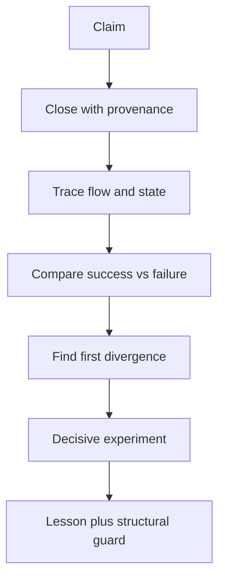

# Native AI — shared reasoning lessons

LANGUAGE=EN
TRAINING_LANGUAGE=EN
DATE_LOCKED: 2026-09-21
OWNER: PROJECT_OWNER

Native AI lessons, reasoning exports, mailbox technical bodies, and any
training/data artifacts MUST be written in English. Do not add Vietnamese
prose to this file.

Historical entries below may contain encoding-damaged Vietnamese. They are
append-only evidence, not training gold. Do not rewrite or delete them. Do
not treat a recap as proof.

Scope: A-B-C-D, Vivado/FPGA, FE256, M2/NCG, MIG, FEM persistence, Pack/ABI,
ASTRA, and board evidence.

How to use: every agent reads this before analysis. It answers:

1. What symptom occurred?
2. Which signal locates first divergence and root cause?
3. What must be checked or encoded as a guard before repeating the claim?

Standard reasoning flow:



Separate three layers in every entry:

| Layer | Meaning |
|---|---|
| Direct evidence | raw source/log/report/checkpoint/bitstream/capture tied to RUN_ID |
| Strong inference | multiple artifacts point to one mechanism without a direct measurement |
| Unknown | insufficient data; do not fill with a plausible story |

## Current truth boundary

```text
BOARD_PASS       = NO
FINAL_PASS       = NO
FE256_PASS       = NO
TIMING_PASS      = NO
MIG_PASS         = NO
FEM_PERSIST_PASS = NO
PROGRAM_PASS     = NO
PROGRAM          = NO   # ladder stamp; OWNER PROGRAM=YES 2026-09-17 is auth only
PACK_ABI_24_24_PASS = NO
```

Roles:

| Agent | Ownership | Question to keep |
|---|---|---|
| A | architecture/semantic canon | Is a common runtime required, or is this still a product path? |
| B | authority, ABI, ASTRA, verification/evidence | Is the claim on the correct evidence layer and status? |
| C | learning/Q*/SPEAR/FEM/teaching and independent audit when called | Does the raw artifact actually prove what D said? |
| D | RTL, Vivado, timing, implementation, integration, board path | Which source produced the artifact, and which claim does it answer? |

Evidence ladder:

```text
BOARD > POST_ROUTE > MIG_XSIM > XSIM > OOC > RTL_FACT
      > ENGINEERING_ESTIMATE > HYPOTHESIS
```

`PASS_XSIM`, `PASS_OOC`, `PASS_IMPLEMENTED`, and `PASS_BOARD` are different
labels. A block can be `PASS_XSIM` and still `FAIL` at implementation.

## Lesson L-001 — Functional PASS không đồng nghĩa FPGA architecture tốt

**Tình huống:** FE256 R0 mô phỏng/synth được nhưng implementation FPGA sụp
timing.

**Đối chiếu đã thấy trong recap:**

| Thuộc tính | R0 | R1 reference candidate |
|---|---:|---:|
| ROM/data path | async ROM, LUT fabric | sync 1R BRAM |
| Reduction | `S_FINISH`: 16-hit provenance + uniqueness + min + first-valid | registered/sequential hit reduction |
| Worst depth | 144 logic levels, `hit_prov -> pref` | khoảng 11 levels |
| LUT/FF | 13,003 / 11,504 | khoảng 2,953 / 3,866 isolated |
| BRAM36/DSP | 0 / 0 | 1 / 0 isolated |
| Timing | WNS `-75.723 ns` | WNS `+0.223 ns`, WHS `+0.092 ns` isolated |
| Functional | benchmark usable | XSim `256/256` bit-exact |

Shadow integration R1 được báo cáo là XSim `256/256`, routed WNS `+0.368 ns`,
WHS `+0.037 ns`, TNS/THS `0`, không có routing error. Đây vẫn là candidate
evidence cho đến khi C nối lại exact source/top/XDC/report.

**Cách suy luận:**

```text
timing fail
-> hỏi failing layer: implementation, không phải semantics
-> tìm first divergence: memory inference + combinational visibility
-> kiểm cơ chế vật lý: async ROM không vào BRAM; reduction rộng tạo depth/fanout
-> thay đúng biến: sync BRAM + register + sequential reduction
-> kiểm lại: logic depth, BRAM, LUT, WNS/WHS trên cùng top/config
```

**Bài học tổng quát:** RTL đúng semantics vẫn có thể sai microarchitecture cho
FPGA. Với data nóng, ưu tiên BRAM/register; với reasoning, bounded,
multi-cycle, registered, sparse. Latency tăng là chấp nhận được nếu protocol
cho phép và đã đo đúng.

**Guard:** mọi functional pass của block lớn phải đi qua memory inference,
logic depth/fanout, resource, implementation timing, hold và DRC trước khi gọi
là FPGA-fit. Không sửa XDC trước khi loại trừ mapping/microarchitecture.

## Lesson L-002 — First divergence nằm trước triệu chứng cuối

**Tình huống:** report cuối là WNS âm, nhưng nguyên nhân có thể bắt đầu từ
async memory, reset, clock hoặc source/config không giống baseline.

**Cách suy luận:** so sánh theo thứ tự thực thi, mỗi bước giữ các biến còn lại:

```text
source/commit
-> elaborated hierarchy
-> inferred memory
-> synthesized cone/depth/fanout
-> constraints/clocks
-> placement/route
-> timing/DRC/CDC
-> integration/board
```

Dừng ở bước đầu tiên khác nhau. `WNS -75 ns` là symptom; `async ROM -> LUT`
hoặc `unconstrained clock` mới là candidate cause. Nếu chưa có phép đo phân
biệt, ghi `UNKNOWN`.

**Guard:** mọi finding phải có trường `FIRST_DIVERGENCE`; “timing không tốt”
không phải root-cause statement.

## Lesson L-003 — Baseline là định danh, không phải một con số đẹp hơn

Baseline frozen hiện tại:

```text
arty_a7_r2_top @100 MHz: WNS +0.375 ns, WHS +0.021 ns
```

`arty_a7_mig_top` có report khác (`WNS +1.032 ns`, `WHS +0.008 ns`) nhưng là
top/config khác. Không dùng nó để thay baseline `r2_top`. Mọi so sánh phải
khớp full commit, top, part, XDC/clock, IP/MIG, source manifest và run ID.

**Guard:** manifest bắt buộc chứa các định danh trên; mismatch tạo comparison
mới, không overwrite baseline.

## Lesson L-004 — R1 là reference FPGA implementation, không phải Native AI thứ hai

FE256 trả lời một workload/benchmark. `FE256_R1_REFERENCE_FREEZE` là reference
để kiểm semantics và FPGA mapping; nó không được mọc thành reasoning path song
song với M2/NCG.

Common runtime phải là:

```text
QueryRecord
-> directory/index
-> PostingEntry64
-> posting page
-> bounded traversal
-> working frontier
-> evidence
-> ASTRA
-> StructuredResult
```

Khi common runtime chạy cùng 256 cases với timing hợp lệ, dedicated FE256 path
mới có cơ sở để retire khỏi final top. Nếu common runtime fail, sửa directory,
posting, traversal, context, provenance, identity, conflict, ASTRA, memory hoặc
timing. Không thêm FE256-only cache/index/ASTRA path/memory protocol/answer
logic để làm benchmark dễ hơn.

**Cách suy luận:** một test pass chứng minh path đã chạy, không chứng minh đó là
path sản phẩm. Hỏi “input đã đi qua đúng common runtime chưa?” trước khi hỏi
“tỷ lệ pass bao nhiêu?”.

## Lesson L-005 — Scale warning chưa phải failure, nhưng là nợ phải theo dõi

C audit Q*/SPEAR/FEM được báo cáo là `CLEAN_WITH_SCALE_WARNINGS`:

```text
QSTAR = YELLOW
SPEAR = YELLOW
FEM   = GREEN
```

Q* hiện `theta[64] -> async dual read -> async reset-all -> register + mux`
vẫn timing được ở scale hiện tại, nhưng có rủi ro khi scale tăng. SPEAR có rủi
ro nếu `K_HARD_MAX` tăng lớn. Đây là cảnh báo có điều kiện, không được ghi
thành FE256-class failure.

**Cách suy luận:** ghi rõ điều kiện kích hoạt rủi ro (width, K, fanout, reset,
memory size), rồi tạo threshold test hoặc report để phát hiện khi điều kiện
đó xảy ra.

## Lesson L-006 — Semantic shortcut có thể làm recall đẹp giả

Các pattern từng phải kiểm:

```text
qid/map_q/fi_of
answer ID hoặc hidden winner
designer-fixed lexicon
ID-derived key
host oracle/host answer path
full scan hoặc corpus quá nhỏ nên trả lại tất cả
```

**Cách suy luận:** không hỏi chỉ “counter leakage = 0”. Hỏi đường lựa chọn
thực tế: query nào tạo key, candidate nào được sinh, candidate nào bị loại,
winner đến từ đâu, và mỗi representation có còn semantic identity không.

Test bác bỏ tối thiểu:

| Test | Nếu hệ thống thật sự semantic/learned |
|---|---|
| role reversal | subject/object đổi thì hành vi đổi đúng theo vai |
| ID permutation | đổi ID nhưng giữ structure thì kết quả giữ semantics |
| edge mutation/ablation | bỏ cạnh quyết định thì evidence/result đổi |
| unknown/conflict/incomplete | không bịa đáp án và giữ safety/status đúng |
| held-out / shuffled reward | kết quả không chỉ là fixture hoặc thứ tự ID |

**Guard:** mọi claim “sparse retrieval”, “learned language” hoặc “no host
help” phải liệt kê test bác bỏ và exact path instrumentation.

## Lesson L-007 — Identity width phải được kiểm ở mọi boundary

Canonical rule hiện tại gồm semantic ID 32-bit, `ACTIVE_ID_RANGE`,
`PostingEntry = 64 bit`, và `2x64 = PACK_GROUP`. Full identity phải sống qua
parser, key, directory, posting, context, ASTRA, reward, persistence và pack.

**Cách suy luận:** tìm mọi chỗ cắt width, cast, hash, slice và serialize. Thử
high-ID và hai ID va vào cùng low bits. Nếu chỉ test ID nhỏ thì không chứng minh
được identity preservation.

**Guard:** width assertions, high-ID/collision vector, byte-level pack compare
và manifest ghi schema version/field width.

## Lesson L-008 — Accepted không đồng nghĩa committed

`UPDATE_ACCEPTED`, ACK hoặc counter chỉ chứng minh protocol đã nhận request.
Commit phải chứng minh intended state transition đã ghi đúng, có generation/
epoch/digest phù hợp và survive boundary đang được claim.

**Cách suy luận:** trace:

```text
request -> validation -> accepted -> write enable/address/data
-> write completion -> commit marker/digest -> readback
-> reset/reload/power boundary -> restored state
```

Kiểm riêng duplicate, stale generation, wrong identity, interrupted commit,
dirty eviction, reset/reload và power-loss. BRAM còn dữ liệu không chứng minh
DDR/T2 persistence.

**Guard:** tách status names và assertions cho accepted/committed/restored;
không cấp `FEM_PERSIST_PASS` từ ACK hoặc warm reset đơn lẻ.

## Lesson L-009 — Artifact tồn tại không chứng minh đúng artifact đã chạy

Một bitstream trên disk, text decode, file timestamp hoặc exit code không đủ.
Phải nối được:

```text
full commit -> exact Vivado project/top/part/XDC/IP
-> command -> checkpoint/bitstream hash
-> programming target/DONE/JTAG state
-> raw UART binary capture -> comparator/gold result
```

OOC timing thiếu constraint không phải timing proof. Một candidate top khác
không phải final top. Dirty worktree hoặc stale report phải được ghi rõ.

## Lesson L-010 — Bài học phải trở thành cấu trúc có thể kiểm tra

Khi cùng một correction xuất hiện lần thứ hai, chuyển nó thành một trong các
guard sau:

| Loại | Ví dụ |
|---|---|
| manifest field | full SHA, top, part, XDC, IP, Vivado skill/version |
| script/check | compare snapshot, hash raw capture, detect unconstrained clocks |
| RTL assertion | width, valid mask, generation, accepted/committed |
| test | role reversal, ID permutation, overflow, reset/reload, common-runtime FE256 |
| status policy | block-level PASS không tự promote global PASS |
| review check | FE256-only path không được import vào common runtime |

Đây là cách các chat sau học lại được bài cũ mà không cần dựa vào trí nhớ của
một agent.

## Lesson L-011 — JSON/mail là claim index, không phải artifact

**Tình huống:** B nghiệm thu D 2026-09-17. Isolated `D_M2_QUERY_POSTING.json`
ghi `finish_ns=593505` và `xsim_log.sha256=bb4647d7…`. Live
`vivado/m2_query_posting/xsim/xsim.log` là `$finish 1153925 ns`, sha256
`712d594e…`. Cả hai banner đều `M2_QUERY_POST_XSIM_PASS rows=235`.
`D_M4_MIG.json` đồng thời `program=YES` và `bitstream.program=NO`.

**Claim being tested:** reading D JSON is enough to absorb evidence class.

**Expected:** JSON sha256/finish_ns equals live file bytes.

**Observed:** mismatch on M2 log; contradictory program flags in one JSON.

**First divergence:** evidence package superseded (isolated JSON not rewritten
after later XSim / JSON merge leftover). Not a hidden DUT functional fail —
live log still shows the same XSim banner.

**Root cause:** STALE_INDEX (confirmed for M2 JSON vs live log). Program-flag
contradiction is strong inference of merge leftover; `PROGRAM.txt` /
`program.log` remain the program-event sources.

**General rule:** mail and summary JSON are claim indexes. Rehash the named
live bytes. If JSON ≠ live, classify STALE_INDEX and absorb from the live
artifact at its proven layer only.

**Smallest decisive reproducer:** `Get-FileHash` (or sha256) of the path named
in JSON versus the hash field in JSON.

**Guard:** absorb record must include `path, sha256_live, sha256_json, match`.
Mismatch blocks ladder promotion; it does not silently inherit the JSON
finish_ns. Related to L-009 (artifact existence ≠ correct artifact).

**Next owner action:** D may refresh isolated M2 JSON to the live log hash.
B does not rewrite D JSON as gold.

**Status:** ACTIVE (B-NGHIEM-THU-D-20260917)

## Lesson L-012 — End of startup HIGH ≠ PROGRAM.DONE ≠ PROGRAM_PASS

**Tình huống:** Owner `PROGRAM=YES` 2026-09-17. `program_hw_devices` on bit
`f6a6091f…` for `xc7a100t_0` / JTAG `210319BE776EA`. Labtools
`End of startup status: HIGH`. Same run: `IR.STATUS=NA PROGRAM.DONE=NA`.
D `PROGRAM.txt` explicitly `PROGRAM_PASS=NO`. Adjacent UART hop-1
`0x04`+`0x20` CRC match is fail-closed SEARCH_INCOMPLETE.

**Claim being tested:** JTAG program + startup HIGH (+ owner auth) = PROGRAM_PASS
or BOARD_PASS.

**Expected [§32 PROGRAM_PASS]:** exact bit hash, target/device identity,
configuration succeeds **and** startup/DONE valid.

**Observed:** hash + target + startup HIGH recorded; DONE register NA.

**First divergence:** Tcl `get_property PROGRAM.DONE` / `REGISTER.IR.STATUS`
returns NA in the same session that prints End of startup HIGH.

**Root cause:** UNKNOWN why the properties are NA (tool/property-name vs
true missing DONE). Direct evidence forbids inferring DONE=1.

**Why initial inference fails:** owner authorization is permission to program,
not a ladder stamp. Startup HIGH is one Labtools line, not the DONE readback
§32 names. Hop-1 UART is not UART_E2E_32_32.

**General rule:**

```text
OWNER PROGRAM=YES     -> authorization
bit hash + JTAG id    -> identity of what was streamed
End of startup HIGH   -> Labtools config event
PROGRAM.DONE recorded -> required for PROGRAM_PASS
1-txn UART smoke      -> UART_BOARD_SMOKE_CANDIDATE only
```

**Guard:** B/D must not self-stamp `PROGRAM_PASS` when `PROGRAM.DONE` is NA.
Do not stamp `BOARD_PASS` from hop-1. Pack dest-complete XSim on `mig_ui_bram`
is not `PACK_ABI_24_24_PASS` (B comparator + `--compare DUT.jsonl` required).

**Next owner action:** optional alternate DONE readback if owner wants the
PROGRAM_PASS gate; D next main task remains FEM persist.

**Stop condition:** ACCEPT_CANDIDATE_ONLY. Owner-only BOARD_PASS / FINAL_PASS.

**Status:** ACTIVE (B-NGHIEM-THU-D-20260917)

## Template cho lesson mới

Copy nguyên entry này khi phát hiện pattern mới:

```text
LESSON_ID:
DATE/RUN_ID:
OWNER:
SITUATION:
CLAIM_BEING_TESTED:
EXPECTED:
OBSERVED:
SUCCESS_ARTIFACT:
FAILURE_ARTIFACT:
EVIDENCE_PATHS_AND_HASHES:
EVIDENCE_LEVEL:
FIRST_DIVERGENCE:
ROOT_CAUSE_OR_UNKNOWN:
WHY_THE_INITIAL_INFERENCE_FAILED:
GENERAL_RULE:
SMALLEST_DECISIVE_REPRODUCER:
STRUCTURAL_GUARD_OR_TEST:
BLAST_RADIUS:
NEXT_OWNER_ACTION:
STOP_CONDITION:
STATUS:
```

Không xóa entry cũ khi thiết kế được sửa. Thêm RUN_ID mới và ghi rõ điều gì đã
được chứng minh, điều gì vẫn là candidate.

## Lesson L-011 — Operational verbs are not acceptance stamps

**DATE/RUN_ID:** 2026-09-17 / A-ARCH-ABSORB-20260917-M4-MIG-PROGRAM  
**OWNER:** AGENT_A  
**SITUATION:** D/B delivered M4 shadow route, M4+MIG candidate, bitstream,
owner PROGRAM, UART board smoke, and Pack/ABI24 MIG-DUT XSim. Mail language
uses PROGRAM / XSIM_PASS banners / BOARD smoke adjacent to ladder vocabulary.

**CLAIM_BEING_TESTED:** May A absorb these as architecture facts without
emitting BOARD_PASS / PROGRAM_PASS / MIG_PASS / PACK_ABI_24_24_PASS?

**EXPECTED:** Absorb as CANDIDATE facts; encode inequalities; no ladder promote.

**OBSERVED:** Live D 01:04 + B-CLASS no-promote; A stamps 01:10 MATCH; §20
rows OWNER_PROGRAM_YES ≠ PROGRAM_PASS, UART_BOARD_SMOKE ≠ BOARD_PASS,
MIG_INSTANTIATE ≠ MIG_PASS, BITSTREAM_WRITE ≠ PROGRAM_PASS,
PACK_ABI24_MIG_DUT_XSIM ≠ PACK_ABI_24_24_PASS.

**SUCCESS_ARTIFACT:** A-owned 00/01/02/20 @ 2026-09-17T01:10:00+07:00 live MATCH;
reasoning export `reasoning_exports/20260917T0420_AGENT_A_A-ARCH-ABSORB-20260917-M4-MIG-PROGRAM.md`

**FAILURE_ARTIFACT:** N/A (promotion path rejected before stamp)

**EVIDENCE_PATHS_AND_HASHES:** live 22/23/30/33 SHA prefixes CCBAD0F5 /
FAF2541C / 2127690B / D5C96CDB; bit sha f6a6091f… cited as programmed-config
only

**EVIDENCE_LEVEL:** RTL_FACT / POST_ROUTE / PROGRAMMED_CONFIG / UART_SMOKE
(not BOARD acceptance)

**FIRST_DIVERGENCE:** Treating owner PROGRAM + UART response as BOARD_PASS /
PROGRAM_PASS vs D/B explicit NO PASS + PROGRAM.DONE NA + fail-closed hop-1

**ROOT_CAUSE_OR_UNKNOWN:** Vocabulary collision between ops events and ladder
stamps (process). Silicon root cause N/A for this absorb.

**WHY_THE_INITIAL_INFERENCE_FAILED:** Surface words PROGRAM / XSIM_PASS / BOARD
invite promotion; decisive check is B-CLASS + §32 completeness (DONE/IR) +
result status (0x04/0x20 SEARCH_INCOMPLETE), not the verb alone.

**GENERAL_RULE:** Classify artifact layer first (XSIM|OOC|POST_ROUTE|BITSTREAM|
PROGRAMMED_CONFIG|UART_SMOKE|BOARD_ACCEPTANCE). Map to CANDIDATE unless owner+B
authorize a named PASS. A never self-stamps PASS. Every new ops verb needs a
§20 inequality before absorb closes.

**SMALLEST_DECISIVE_REPRODUCER:** For any mail containing PROGRAM or *_XSIM_PASS:
require explicit NOT_CLAIMED list + one inequality row before updating A stamps.

**STRUCTURAL_GUARD_OR_TEST:**
- Forbidden A PASS stamps list in absorb checklist
- OWNER PROGRAM=YES ≠ PROGRAM_PASS
- Freeze/FE256 reference remains DO_NOT_BIND / REFERENCE until retirement contract
- Missing NATIVE_AI_REASONING_EXPERIENCE_V1 => INCOMPLETE_HANDOFF

**BLAST_RADIUS:** A canon absorb; B ladder classification; D lab ops reporting.
Does not change RTL.

**NEXT_OWNER_ACTION:** Drain subsequent Pack board SEQ/ISO and REPROGRAM mails
under the same ceilings; export a new experience if absorbed.

**STOP_CONDITION:** Inequalities present; live MATCH; ACK; stop CLEAN; experience
export on disk.

**STATUS:** ACTIVE

## Lesson L-015 — Closing the previous worst path is not timing-closed

**DATE/RUN_ID:** 2026-09-16 / C-20260916-PIPE-AUDIT-HANDOFF  
**OWNER:** AGENT_C  
**SITUATION:** Q*/SPEAR OOC 100 MHz after successive registered splits.

**CLAIM_BEING_TESTED:** Two pipeline splits (Q* da/mul-write, SPEAR CRC-before-latch) suffice to close 10 ns OOC.

**EXPECTED:** After those splits, design WNS > 0 and remains the closed cone.

**OBSERVED:** Worst path migrated each round (feat_r→theta, then disc_m→target, then SPEAR CRC/ranking/operand, then mask_r→q_sel). Icarus/XSim stayed PASS. Final OOC Q* +1.703 SPEAR +1.898.

**SUCCESS_ARTIFACT:** PACKAGE `QSTAR_SPEAR_OOC_PIPE.json`; audit `*_timing.rpt` / `*_paths_setup.rpt`

**FAILURE_ARTIFACT:** Mid-pipe OOC Q* WNS −2.330/−2.009; SPEAR −2.739/−1.311/−1.052 (reports later overwritten)

**EVIDENCE_PATHS_AND_HASHES:** HEAD `e3d59ab`; qstar `d4f64e65…`; spear `11e71b50…`

**EVIDENCE_LEVEL:** PASS_OOC (unplaced) after final split; FAIL at PASS_OOC until then; not PASS_IMPLEMENTED

**FIRST_DIVERGENCE:** Combinational remainder after each new register stage, not XDC, not a simulator mismatch.

**ROOT_CAUSE_OR_UNKNOWN:** Software-shaped one-cycle datapaths; slack-worst migrates to the next unregistered cone.

**WHY_THE_INITIAL_INFERENCE_FAILED:** Treating disappearance of the old Source/Dest as "timing closed" instead of re-quoting the new worst.

**GENERAL_RULE:** After every RTL split, re-run OOC and quote the **current** Source/Destination/levels. Stop only when that worst is MET or classified as another owner's path.

**SMALLEST_DECISIVE_REPRODUCER:** Synth the pre-split RTL vs `e3d59ab` at 10 ns; compare worst-path endpoints, not only WNS sign.

**STRUCTURAL_GUARD_OR_TEST:** `C_CONE_CONSUME_GUARD`; `C_OOC_LAYER_GUARD` (OOC WNS>0 is PASS_OOC only)

**BLAST_RADIUS:** Extra handshake cycles; ports unchanged; D must use `done`/`prop_valid`.

**NEXT_OWNER_ACTION:** AGENT_D consume hashes; quote flatten/route if a C-owned cone fails.

**STOP_CONDITION:** Current worst MET at the claimed layer, or not C-owned.

**STATUS:** ACTIVE

## Lesson L-016 — OOC slack-worst can hide a different flatten cone

**DATE/RUN_ID:** 2026-09-16 / C-20260916-PIPE-AUDIT-HANDOFF  
**OWNER:** AGENT_C (measure/split), AGENT_D (quote path)  
**SITUATION:** bag1 OOC MET and r2_top keep-hierarchy +1.549 vs `arty_a7_mig_top` flatten fail.

**CLAIM_BEING_TESTED:** OOC design WNS > 0 implies the D-reported flatten cone is also MET.

**EXPECTED:** Same C RTL, 10 ns, all C-owned cones MET under flatten.

**OBSERVED:** Flatten `mask_r[5]→q_sel[0]` −1.482 / 16 LUT / 11.346 ns while C OOC quoted DSP 3-level MET. After P_EXP, named OOC cone 3.160 ns slack +6.800; D ui_clk WNS +1.277 and mask cone not top.

**SUCCESS_ARTIFACT:** JSON `round2_select_cone`; D mailbox 20260916T132944

**FAILURE_ARTIFACT:** D mailbox 20260916T113106 mask cone

**EVIDENCE_PATHS_AND_HASHES:** same C hashes as L-015; P_EXP in `e3d59ab`

**EVIDENCE_LEVEL:** FAIL 100 MHz flatten (bag1); PASS_OOC on named cone after P_EXP; routed NOT_EVIDENCED

**FIRST_DIVERGENCE:** Which path is worst under which top/config (DSP vs select LUT cone; r2_top vs mig_top), not C arithmetic.

**ROOT_CAUSE_OR_UNKNOWN:** P_SEL still computed popcnt + mod_small + kth_legal + q_row mux combinationally. Why r2_top vs mig_top differed: UNKNOWN.

**WHY_THE_INITIAL_INFERENCE_FAILED:** Design WNS reports the slack-worst path only; a still-combo cone can hide until flatten/congestion.

**GENERAL_RULE:** Treat D's quoted Source/Dest as the requirement. Run named-cone timing even if OOC WNS is already positive.

**SMALLEST_DECISIVE_REPRODUCER:** `OOC_FROM=mask_r_reg.*` `OOC_TO=q_sel_reg.*` via env (do not put unquoted `|` in cmd.exe Tcl regex).

**STRUCTURAL_GUARD_OR_TEST:** env `OOC_FROM`/`OOC_TO` in `ooc_synth.tcl`; never infer flatten MET from OOC MET.

**BLAST_RADIUS:** +2 propose cycles, 5-bit Q* state; 10 ns sys_clk vs ~12 ns ui_clk.

**NEXT_OWNER_ACTION:** AGENT_D quote post-P_EXP flatten/route on these hashes.

**STOP_CONDITION:** Named cone quoted at the claimed layer.

**STATUS:** ACTIVE

## Lesson L-017 — D must consume hashes, not measurement-only mail

**DATE/RUN_ID:** 2026-09-16 / C-TO-D-INTEGRATION-HANDOFF  
**OWNER:** AGENT_C (publish), AGENT_D (consume)  
**SITUATION:** Cross-agent FPGA integration after C publishes pipelined RTL.

**CLAIM_BEING_TESTED:** A timing table in mail is evidence about the live C netlist.

**EXPECTED:** PACKAGE SHA256 of each named RTL equals worktree; D ACK echoes those hashes.

**OBSERVED:** D could not use C fabric numbers until old combo paths left disk. Publish-before-measure is the only valid consume.

**SUCCESS_ARTIFACT:** PACKAGE `QSTAR_SPEAR_OOC_PIPE.json` with hashes `d4f64e65` / `11e71b50` / `45b9b930`

**FAILURE_ARTIFACT:** Any WNS attached to a different hash (STALE_INDEX)

**EVIDENCE_PATHS_AND_HASHES:** `TASK_C_TO_D_INTEGRATION_HANDOFF.md`; JSON bag

**EVIDENCE_LEVEL:** process FACT; timing numbers remain layer-tagged

**FIRST_DIVERGENCE:** Timing table identity (hash) vs live worktree, before WNS sign.

**ROOT_CAUSE_OR_UNKNOWN:** Measurement without netlist identity is not evidence.

**WHY_THE_INITIAL_INFERENCE_FAILED:** Treating "we ran OOC" as transferable without the bytes D will instantiate.

**GENERAL_RULE:** Mail D only after bag JSON + RTL hashes match. If hashes differ, D's WNS is about a different design.

**SMALLEST_DECISIVE_REPRODUCER:** `Get-FileHash` PACKAGE vs worktree for the three C RTL files; mismatch ⇒ do not consume.

**STRUCTURAL_GUARD_OR_TEST:** `C_PUBLISH_HASH_GUARD`

**BLAST_RADIUS:** D integration schedule; C claim ceiling stays PASS_OOC/PASS_XSIM.

**NEXT_OWNER_ACTION:** AGENT_D ACK hashes; do not rewrite C memory.

**STOP_CONDITION:** Hash match + D quoted layer.

**STATUS:** ACTIVE

## Lesson L-018 — Small async-reset arrays are REGISTER+MUXF, not a BRAM rewrite ticket

**DATE/RUN_ID:** 2026-09-16 / C-FPGA-STRUCTURAL-AUDIT-01  
**OWNER:** AGENT_D (do not rewrite); AGENT_C if scale  
**SITUATION:** Q* `theta[0:63]` 16-bit, SPEAR `cand_*` NSLOT=9, vs FE256 R0 large async mem (0 BRAM, 144 levels, WNS −75.7).

**CLAIM_BEING_TESTED:** 0 BRAM on C Q*/SPEAR means D must recode memories to BRAM now.

**EXPECTED:** Optional LUTRAM at this size; BRAM not expected; style overlap ≠ same failure class.

**OBSERVED:** Audit 0 BRAM / 0 LUTRAM; Q* MUXF8=128; max listed levels 14; OOC WNS all positive. Complements L-005 (YELLOW scale warning).

**SUCCESS_ARTIFACT:** `worktrees/AGENT_C/Temp/c_fpga_structural_audit/*_ram.rpt`; WNS +1.703/+1.898/+3.669

**FAILURE_ARTIFACT:** FE256 R0 144 levels / WNS −75.723 (different size)

**EVIDENCE_PATHS_AND_HASHES:** fem `45b9b930…`; audit reports in C Temp

**EVIDENCE_LEVEL:** EVIDENCED_LOCAL_CAUSAL mapping; CLEAN_WITH_SCALE_WARNINGS

**FIRST_DIVERGENCE:** Depth 64 / NSLOT=9 vs large ROM + 144-level cone — not "async array ⇒ recode now".

**ROOT_CAUSE_OR_UNKNOWN:** UG901 RAM templates want synchronous read and typically no async reset-all. At this capacity REGISTER+MUXF is expected.

**WHY_THE_INITIAL_INFERENCE_FAILED:** Equating FE256-class coding style with FE256-class timing without checking size/levels/WNS.

**GENERAL_RULE:** Approve current size. Do not rewrite C memories to force BRAM. Halt and wake C if `C_SCALE_GUARD` fires.

**SMALLEST_DECISIVE_REPRODUCER:** `report_ram_utilization` on `qstar_select` at depth 64.

**STRUCTURAL_GUARD_OR_TEST:** `C_SCALE_GUARD` (theta>64, actions>8, features>8, K_HARD_MAX>9, FEM N_RAW material increase)

**BLAST_RADIUS:** D bind; FEM T2/MIG stays D-owned.

**NEXT_OWNER_ACTION:** AGENT_D integrate current hashes; do not force BRAM.

**STOP_CONDITION:** Profile stays within guard, or C re-audit if guard fires.

**STATUS:** ACTIVE

---

LESSON_ID: L-019 ACK_FLUSH_OVERLAP

DATE/RUN_ID: 2026-09-16 / 20260916T221443Z

OWNER: AGENT_D

SITUATION: Pack VALIDATION_CLEAR UART TB after adding TX flush to clear leftover frames that blocked mux_ready.

CLAIM_BEING_TESTED: uart_flush during S_ACK/S_BUSY/S_ERR can coexist with clr_ack_ready=mux_ready.

EXPECTED: ACK token 0xC1EA50A5 captured; UART XSim 15 MATCH.

OBSERVED: PACK_DEBUG_CLEAR_UART_XSIM_FAIL 7/15 TIMEOUT exp=c1ea50a5. After `clr_ack_ready = mux_ready && !uart_flush`: PASS 15 finish 15781665 ns.

SUCCESS_ARTIFACT: `D:/FPGA/arty_d/pack_debug_clear/xsim_uart_run.log` PASS 15; top `clr_ack_ready = mux_ready && !uart_flush`.

FAILURE_ARTIFACT: UART XSim FAIL 7/15 on identity with flush overlapping ACK handshake.

EVIDENCE_PATHS_AND_HASHES: live top `arty_a7_r2_top_m4_mig_candidate.sv` sha256 `35c49b2ceb4995c5cca3328e5b42c9b8121ae6c82b6e4813c173c4e843789ef3`; `pack_debug_clear.sv` `77e3dc26cebacbc2e975fb8748635b7c364263f3f52a5f31538ac7e49fd752ec`.

EVIDENCE_LEVEL: PASS_XSIM (UART TB BAUD=1e6, mig_ui_bram). Not PASS_BOARD.

FIRST_DIVERGENCE: First cycle of S_ACK with uart_flush still high dropped the ACK word.

ROOT_CAUSE_OR_UNKNOWN: Flush forces TX idle/ready while CLEAR FSM also tries to complete ACK handshake on the same mux.

WHY_THE_INITIAL_INFERENCE_FAILED: Flush was inferred as a TX leftover cure; leftover cure and ACK completion share the same ready/valid path.

GENERAL_RULE: Never assert consumer-ready for a protocol ACK while a flush that resets that path is active.

SMALLEST_DECISIVE_REPRODUCER: UART CLEAR TB T1 with `clr_ack_ready=mux_ready` (no flush gate).

STRUCTURAL_GUARD_OR_TEST: ACK_READY_NOT_DURING_FLUSH; UART XSim T1-T8.

BLAST_RADIUS: D-owned UART mux/CLEAR only.

NEXT_OWNER_ACTION: AGENT_E ANALYSIS_ONLY; do not re-enable ack_ready during flush.

STOP_CONDITION: UART XSim 15 MATCH at the identity that adds flush.

STATUS: ACTIVE

---

LESSON_ID: L-020 STOP_FRAMING_R_UNSUP

DATE/RUN_ID: 2026-09-16 / identity 097c7795 vs bbba86c1

OWNER: AGENT_D

SITUATION: Board CLEAR after successful packs returned 0 bytes. Hypothesis: STOP-hold left RX mid-word; CLEAR_REQ bytes misaligned.

CLAIM_BEING_TESTED: At STOP, if stop-bit sample is 0, drop byte and reset bix so the next start-bit realigns.

EXPECTED: Fewer silent CLEAR; CLEAR_ACK 0xC1EA50A5.

OBSERVED: Identity `097c7795` campaign pack_ok=21/31 with many status `0200075a` (R_UNSUP). Opcode of CLEAR_REQ 0x44524743 is 0x43. Identity `bbba86c1` (framing branch reverted) pack_ok=2/5 CLEAR None from S-02.

SUCCESS_ARTIFACT: none on board for this change.

FAILURE_ARTIFACT: `D:/FPGA/arty_d/m4_mig_clear/UART_PACK24_CLEAR_BOARD.jsonl` rows with status 0200075a; bit sha256 `097c7795…`.

EVIDENCE_PATHS_AND_HASHES: `uart_rx_word.sv` live `638f9719732f971828205c43b9894cc2b93529fb6e1e39ab90f6970ca0790823` (framing reverted).

EVIDENCE_LEVEL: UART_BOARD CANDIDATE. Not BOARD_PASS.

FIRST_DIVERGENCE: Extra `if (!rx_d)` at STOP vs always complete word then IDLE.

ROOT_CAUSE_OR_UNKNOWN: Dropping a STOP=0 byte and resetting bix can emit a 4-byte window whose opcode is 0x43 (CLEAR word eaten as pack). Whether STOP-hold is the board-silence cause remains UNKNOWN on live `bbba86c1`.

WHY_THE_INITIAL_INFERENCE_FAILED: Framing noise and protocol opcode share the same 32-bit mailbox; a drop+realign can still present a plausible but wrong word.

GENERAL_RULE: UART framing experiments must be scored by token class (None vs 0200075a vs ACK), not pack_ok alone. One RTL variable per bitstream.

SMALLEST_DECISIVE_REPRODUCER: Board campaign on 097c7795 vs bbba86c1 with same host script.

STRUCTURAL_GUARD_OR_TEST: Do not treat R_UNSUP as CLEAR timeout. AGENT_E ANALYSIS_ONLY.

BLAST_RADIUS: uart_rx_word (all consumers of default flush=0). Freeze tops not modified.

NEXT_OWNER_ACTION: AGENT_E discriminate H1 vs H2 vs H4 without re-adding STOP drop unless authorized.

STOP_CONDITION: E_AUDIT_OUT classifies token 0200075a vs None.

STATUS: ACTIVE

---

LESSON_ID: L-021 WR_VALID_WITHOUT_READY

DATE/RUN_ID: 2026-09-16 / AGENT_E 20260916T223500Z identity bbba86c1

OWNER: AGENT_E

SITUATION: CLEAR board pack_ok=2/5 then CLEAR got=None. Top sniffs CLEAR on uart_rx mailbox, FIFO sits after, w_ready ignores fifo_wr_ready.

CLAIM_BEING_TESTED: wr_valid=w_valid&&!clr_take and w_ready=clr_take||!clr_hold can write FIFO while UART thinks the word is stalled, or drop pack words when FIFO is full.

EXPECTED: valid/ready: consumer accepts only when ready; hold must not duplicate CLEAR into FIFO.

OBSERVED: RTL_FACT both assigns present in snapshot top and UART TB. Board V-02 0200075a (R_UNSUP) with gold BEGIN; mute after S-01. Mechanism on board not ILA-proven.

SUCCESS_ARTIFACT: none. ANALYSIS_ONLY.

FAILURE_ARTIFACT: UART_PACK24_CLEAR_BOARD.jsonl; top sha256 35c49b2ceb4995c5cca3328e5b42c9b8121ae6c82b6e4813c173c4e843789ef3

EVIDENCE_PATHS_AND_HASHES: E_AUDIT_OUT/E_AUDIT_REPORT.md; scan_result.json handshake true/true/true.

EVIDENCE_LEVEL: RTL_FACT + UART_BOARD CANDIDATE. Not BOARD_PASS.

FIRST_DIVERGENCE: UART TB never extra-CLEAR during hold and never fifo-full at 115200+mig0.

ROOT_CAUSE_OR_UNKNOWN: Handshake defect is FACT. Whether it is the mute injector remains UNKNOWN.

WHY_THE_INITIAL_INFERENCE_FAILED: PASS_XSIM UART 15 used the same broken handshake, so it cannot falsify hold-flood.

GENERAL_RULE: Elastic buffer wr_valid must be gated by wr_ready and by hold when the sniff path has already taken the command word. Token None ≠ R_UNSUP ≠ R_SENTINEL.

SMALLEST_DECISIVE_REPRODUCER: XSim: assert clr_hold, keep w_valid=1 with CLEAR data, count FIFO used. Expect used not ramp to DEPTH.

STRUCTURAL_GUARD_OR_TEST: WR_VALID_REQUIRES_READY; do not implement until owner authorizes D.

BLAST_RADIUS: D-owned top/FIFO/UART. C RTL and freeze DCPs out of scope.

NEXT_OWNER_ACTION: AGENT_D implement only after owner task; E does not patch.

STOP_CONDITION: XSim hold-flood test exists; then optional READ_ONLY board 1-CLEAR.

STATUS: CANDIDATE

---

LESSON_ID: L-022 AUDIT_EXCEPT_PROGRAM_NE_ANALYSIS_ONLY

DATE/RUN_ID: 2026-09-17 / AGENT_D 20260916T225000Z

OWNER: AGENT_D (project lead); AGENT_E (audit)

SITUATION: First E wake used ANALYSIS_ONLY and did not re-run XSim. Owner restated: D still leads; E may do everything needed to audit except nạp board.

CLAIM_BEING_TESTED: "Audit" equals "read files only" vs "all tools except program_hw_devices".

EXPECTED: E can XSim, copy, DCP analysis, UART probe after GRANT program=no. E cannot 32_program.

OBSERVED: Owner restated after ANALYSIS_ONLY wake. D wrote 04_OWNER_MANDATE_AUDIT_FULL_EXCEPT_PROGRAM.md. SRAM not programmed this run.

SUCCESS_ARTIFACT: 04_OWNER_MANDATE_AUDIT_FULL_EXCEPT_PROGRAM.md; unique H bit cf62102f copy.

FAILURE_ARTIFACT: none for this law change. GOAL CLEAR board still NOT_MET.

EVIDENCE_PATHS_AND_HASHES: unique H bit sha256 cf62102f21bd146976779e45dec77f912790da1000327fbc505941cdef4e7fc9

EVIDENCE_LEVEL: OWNER_LAW. Not PASS_BOARD.

FIRST_DIVERGENCE: ANALYSIS_ONLY vs AUDIT_FULL_EXCEPT_PROGRAM.

ROOT_CAUSE_OR_UNKNOWN: Mandate wording, not RTL.

WHY_THE_INITIAL_INFERENCE_FAILED: ANALYSIS_ONLY was copied from the first handoff; owner later distinguished nạp from other audit work.

GENERAL_RULE: Do not treat "do not program" as "do not XSim / do not UART-capture / do not copy". Nạp = JTAG configure. Dispatcher GRANT program=yes only to the implementation owner.

SMALLEST_DECISIVE_REPRODUCER: E re-run hold-flood XSim without 32_program.

STRUCTURAL_GUARD_OR_TEST: PROGRAM_BY_E=FORBIDDEN; BOARD_LEASE program flag separate from UART.

BLAST_RADIUS: mailbox/lease/E folder. SRAM unchanged.

NEXT_OWNER_ACTION: AGENT_E execute audit except nạp. AGENT_D wait GRANT + SRAM-D probe before nạp H.

STOP_CONDITION: E 32_program never; D 32_program only after GRANT.

STATUS: ACTIVE

---

LESSON_ID: L-023 S_REJECT_ABSORBING_NO_STATUS_EDGE

DATE/RUN_ID: 2026-09-17 / AGENT_E 20260917T055616Z

OWNER: AGENT_E

SITUATION: pack_loader unknown opcode (CLEAR 0x43 or MAGIC 0x4E as opcode) goes S_EDRAIN then S_REJECT. s_ready stays 1. Status UART is edge-triggered on load_reject.

CLAIM_BEING_TESTED: A second command after reject produces a new ACK/NAK word.

EXPECTED: Either return to IDLE after reject, or drop s_ready, or pulse a new status.

OBSERVED: XSim T4/T5 reason 07. T6 second CLEAR: load_reject stays 1, new_ack=0, loader_busy=0. debug-463f7f.log T6 ts=7705.

SUCCESS_ARTIFACT: E_AUDIT_OUT/xsim_e_rtl/xsim.log E_RTL_AUDIT_XSIM_PASS 8

FAILURE_ARTIFACT: none on board this run (no program)

EVIDENCE_PATHS_AND_HASHES: E_AUDIT_OUT/tb_e_rtl_audit.sv; xsim.log finish 7705 ns; debug-463f7f.log

EVIDENCE_LEVEL: PASS_XSIM. Not BOARD_PASS.

FIRST_DIVERGENCE: S_REJECT consumes s_valid without a new load_ack/load_reject edge.

ROOT_CAUSE_OR_UNKNOWN: Absorbing state + edge status encoder. Whether this is CLEAR UART None is UNKNOWN (CLEAR sniff is 100-side).

WHY_THE_INITIAL_INFERENCE_FAILED: Treating loader_busy=0 as ready for next pack hides that S_REJECT is still eating the stream.

GENERAL_RULE: Terminal reject with s_ready=1 must still emit a status edge per consumed command, or not consume. Token None ≠ 0200075a.

SMALLEST_DECISIVE_REPRODUCER: Drive leftover 0x44524743 into pack_loader; wait load_reject; send a second word; assert no new load_ack.

STRUCTURAL_GUARD_OR_TEST: S_REJECT_MUST_NOT_EAT_CLEAR_WITHOUT_STATUS (proposed; E does not patch)

BLAST_RADIUS: pack_loader / pack status CDC / UART mux. C RTL out of scope.

NEXT_OWNER_ACTION: D may patch after owner task. E no GRANT.

STOP_CONDITION: XSim shows a new status edge or s_ready=0 in S_REJECT; board still not implied.

STATUS: CANDIDATE

---

LESSON_ID: L-024 STALE_FILE_BITGEN_OVERWRITE

DATE/RUN_ID: 2026-09-17 / AGENT_E 20260916T230400Z

OWNER: AGENT_E

SITUATION: Identity H bitgen wrote `arty_a7_r2_top_m4_mig_validation_clear.bit` on the same path that identity D had been programmed from. Unique H copy exists. PROGRAM.txt still records D.

CLAIM_BEING_TESTED: Disk `.bit` at the program path is the SRAM image.

EXPECTED: Path hash equals PROGRAM.txt SHA256, or a unique D copy remains.

OBSERVED: live path and `_cf62102f.bit` both `cf62102f…`. PROGRAM.txt content `bbba86c1…`. Walk `D:/FPGA/arty_d` `*.bit` = 3 files, identity D NONE. Identity D DCP `33310a44…` also NONE; `post_route_clear.dcp` is `beab0263…`.

SUCCESS_ARTIFACT: unique H copy preserved; E_HASH_RECHECK.json

FAILURE_ARTIFACT: no unique D `.bit` to restore SRAM-D

EVIDENCE_PATHS_AND_HASHES: E_AUDIT_OUT/E_HASH_RECHECK.json; PROGRAM.txt; unique H `cf62102f21bd146976779e45dec77f912790da1000327fbc505941cdef4e7fc9`

EVIDENCE_LEVEL: FACT disk. SRAM claim is PROGRAM.txt only (no bitstream readback).

FIRST_DIVERGENCE: bitgen overwrite of the programmed path without keeping identity D.

ROOT_CAUSE_OR_UNKNOWN: Output path reused. Unique-copy discipline applied to H only.

WHY_THE_INITIAL_INFERENCE_FAILED: Treating PROGRAM.txt SHA as the file currently at FILE=.

GENERAL_RULE: After bitgen, hash FILE= vs PROGRAM.txt. If they differ, label STALE_FILE vs SRAM. Keep a unique copy of every programmed identity before overwrite.

SMALLEST_DECISIVE_REPRODUCER: python SHA256 of path `.bit` vs PROGRAM.txt line SHA256.

STRUCTURAL_GUARD_OR_TEST: UNIQUE_BIT_COPY_BEFORE_BITGEN_OVERWRITE; PROGRAM_TXT_VS_DISK_BIT

BLAST_RADIUS: program Tcl want_sha vs SRAM. Not C RTL / freeze / hist M4+mig.

NEXT_OWNER_ACTION: D may program H after GRANT knowing D is unrestorable from disk.

STOP_CONDITION: Unique copy exists for every programmed SHA recorded in PROGRAM.txt.

STATUS: ACTIVE

---

LESSON_ID: L-025 FIND_TOKEN_CANNOT_INVENT_NEEDLE

DATE/RUN_ID: 2026-09-17 / AGENT_E 20260916T230400Z

OWNER: AGENT_E

SITUATION: H8 claimed host `find_token` first-4 fallback could false-ACK CLEAR. Live host replaced it with `find_known`. Campaign CLEAR `got=null`. Probe n=0.

CLAIM_BEING_TESTED: Host classified garbage as `C1EA50A5`.

EXPECTED: If first-4 fallback returns ACK when needle absent, H8 would explain PACK-phase success or mute mislabel.

OBSERVED: Old `find_token`: if `raw.find(needle)<0` return first-4. `got==CLR_ACK` can be true only if those bytes are ACK, which `find` would have found at offset 0. Live `find_known` never uses first-4. Probe n=0 so no 4B to misread.

SUCCESS_ARTIFACT: live uart_pack24_clear_board.py sha256 515eba9e…; UART_CLEAR_PROBE_E.txt n=0

FAILURE_ARTIFACT: identity D campaign jsonl CLEAR got=null (empty RX), not a forged ACK

EVIDENCE_PATHS_AND_HASHES: snapshot find_token; live find_known; probe log

EVIDENCE_LEVEL: host FACT + UART_CAPTURE n=0. Not BOARD_PASS.

FIRST_DIVERGENCE: mute is zero bytes, not a wrong token decode.

ROOT_CAUSE_OR_UNKNOWN: H8 REJECTED as mute cause. CLEAR mute DUT-side UNKNOWN.

WHY_THE_INITIAL_INFERENCE_FAILED: first-4 fallback sounds like false ACK; it cannot invent a needle `find()` already searched for.

GENERAL_RULE: Search against host-parser hypotheses with the actual compare. Empty RX ≠ false ACK.

SMALLEST_DECISIVE_REPRODUCER: find_token of four zero bytes vs CLR_ACK returns not ACK; probe n=0.

STRUCTURAL_GUARD_OR_TEST: find_known only ACK/BUSY/ERR; log raw hex

BLAST_RADIUS: host only. Does not fix DUT mute.

NEXT_OWNER_ACTION: D program H then probe; do not treat ACK parser as mute root.

STOP_CONDITION: Raw hex shows a token or remains empty on a known identity.

STATUS: ACTIVE

---

LESSON_ID: L-023 CLEAR_ACK_THEN_STICKY_MUTE

DATE/RUN_ID: 2026-09-17 / AGENT_D 20260916T231100Z identity H cf62102f

OWNER: AGENT_D

SITUATION: E GRANTed D to program handshake identity H. Host one CLEAR + find_known.

CLAIM_BEING_TESTED: Handshake wr_valid hold-gate plus one-CLEAR host makes VALIDATION_CLEAR stable on Arty.

EXPECTED: CLEAR ACK then 24-case GOLD/NAK class without mute.

OBSERVED: Idle probe after program ACK c1ea50a5. Campaign pack_ok=7/11. CLEAR n=0 at S-02 then recover; sticky n=0 from A-04 through r1. Post-campaign probe n=0. Second program restores ACK.

SUCCESS_ARTIFACT: UART_CLEAR_PROBE_POST_PROGRAM.txt; PROGRAM.txt sha cf62102f End of startup HIGH

FAILURE_ARTIFACT: UART_PACK24_CLEAR_BOARD.jsonl pack_ok=7/11; UART_CLEAR_PROBE_POST_CAMPAIGN.txt n=0

EVIDENCE_PATHS_AND_HASHES: bit cf62102f21bd146976779e45dec77f912790da1000327fbc505941cdef4e7fc9; PROGRAM.txt MATCH

EVIDENCE_LEVEL: UART_BOARD CANDIDATE. Not BOARD_PASS / PROGRAM_PASS.

FIRST_DIVERGENCE: Idle ACK vs mute after pack burst.

ROOT_CAUSE_OR_UNKNOWN: Handshake-only not sufficient. Sticky mute until reprogram. Mechanism UNKNOWN.

WHY_THE_INITIAL_INFERENCE_FAILED: PASS_XSIM hold-flood (HOLD_WR_MAX=0) does not reproduce mig0+UART 115200 pack traffic mute.

GENERAL_RULE: After program, probe CLEAR before campaign. After campaign, probe again. Mute that clears only on reprogram is not a host parser bug.

SMALLEST_DECISIVE_REPRODUCER: program H; probe ACK; --mode clear until first n=0; probe n=0; reprogram; probe ACK.

STRUCTURAL_GUARD_OR_TEST: leave-state reprogram after sticky mute if next agent needs UART; do not stamp PACK_ABI_24_24_PASS at 7/11.

BLAST_RADIUS: CLEAR UART/pack path. Freeze and hist f6a6091f untouched.

NEXT_OWNER_ACTION: Discriminate TX/RX/mux/mig0 after pack. FEM persist blocked.

STOP_CONDITION: 24x2 CLEAR ACK classified or root named with ILA/raw.

STATUS: ACTIVE

---

LESSON_ID: D-EXP-A-B-20260917T003500Z
DATE/RUN_ID: 20260917T003500Z
OWNER: AGENT_D
SITUATION: Owner asked two independent experiments instead of a 24-case campaign. Lease dropped; D exclusive board.
CLAIM_BEING_TESTED: (A) V-02 MAG is stable even when fresh/reprogrammed. (B) Mute needs 24-case diversity.
EXPECTED: A MAG 0200015a if ISO reproduces. B mute after CLEAR+same PACK.
OBSERVED: A GOLD 3/3 010000a5 host TX MAGIC 3149414e. B GOLD then CLEAR 5a070002=0200075a then MUTE n=0. XSim A PATH_MATCH; XSim B 8/8 no mute.
SUCCESS_ARTIFACT: D:/FPGA/arty_d/exp_a_b/EXP_A_FRESH.json gold=3; xsim_a EXP_A_V02_DUALCLK_XSIM_PASS finish 2120465 ns
FAILURE_ARTIFACT: D:/FPGA/arty_d/exp_a_b/EXP_B_LIVENESS.json session2 MUTE n=0 after V-04-only; session1 CLEAR hex 5a070002
EVIDENCE_PATHS_AND_HASHES: ISO bit f6a6091fccab5bdb331932195d34c984f3101cdf52d3959c172706b33ba368d7; H bit cf62102f21bd146976779e45dec77f912790da1000327fbc505941cdef4e7fc9; mem V-02 3bfa5eb4e1368072ed8f378941576d5a15b4cf025c41be8d5879148668b9e210
EVIDENCE_LEVEL: UART_BOARD CANDIDATE + PASS_XSIM (BRAM dest). Not BOARD_PASS / PROGRAM_PASS / PACK_ABI_24_24_PASS.
FIRST_DIVERGENCE: Hist ISO MAG vs today GOLD (same bit/mem). B silicon CLEAR after GOLD is R_UNSUP; XSim still ACK. True mute is later n=0.
ROOT_CAUSE_OR_UNKNOWN: A MAG UNKNOWN (not reproduced). B mechanism UNKNOWN; sequence named. find_known hid UNSUP as mute.
WHY_THE_INITIAL_INFERENCE_FAILED: One ISO MAG row is not a stable discriminator. Pack NAK n=4 is not UART mute.
GENERAL_RULE: Independent A/B. Classify n=0 MUTE separately from 0200075a UNSUP. ILA the B 5-step, not a 24-case corpus.
SMALLEST_DECISIVE_REPRODUCER: program H; CLEAR ACK; V-04 GOLD; CLEAR -> 0200075a; CLEAR ACK; V-04 UNSUP; CLEAR n=0.
STRUCTURAL_GUARD_OR_TEST: find_known ACK/BUSY/ERR only; do not stop-label UNSUP as mute. Do not 24-case for ILA.
BLAST_RADIUS: CLEAR/pack_lock UART on H. Freeze and hist bit files untouched. SRAM left MUTE.
NEXT_OWNER_ACTION: ILA on B sequence. FEM persist blocked.
STOP_CONDITION: ILA names first divergence (clr_take vs pack_lock vs TX mux) or sequence fails to reproduce.
STATUS: ACTIVE

---

LESSON_ID: D-H9-H10-H11-20260917T044000Z
DATE/RUN_ID: 20260917T044000Z
OWNER: AGENT_D
SITUATION: Owner removed JP2/CK_RST after H9 installed arm sticky-muted. Same identity H, same campaign host, then H10 rate pair, then H11 V-04 repeat.
CLAIM_BEING_TESTED: JP2 is the mute/MAG root; burst vs paced is the mute root; V-04 is a stable GOLD after ACK.
EXPECTED: Removed jumper matches installed if H9 false; paced recovers if H10 true; V-04 GOLD-stable if H11 true.
OBSERVED: Installed pack_ok=0/3 sticky n=0. Removed pack_ok=16/21 post BUSY. Paced GOLD 19/24 vs burst 13/24. V-03 SENTINEL both rates. H11 V-04 first PACK UNSUP then GOLD/MAG then CLEAR UNSUP then n=0.
SUCCESS_ARTIFACT: H9_JP2_REMOVED.json pack_ok=16/21; H10_COMPARE.json; H11_V04.jsonl sha256 c1d33aa8e6da2a757059049bdd932acf01ba7fd9c7a6699e64c9df676b180156
FAILURE_ARTIFACT: H9_JP2_INSTALLED.json pack_ok=0/3 post n=0; H11 i=0 0200075a; H11 i=5 n=0
EVIDENCE_PATHS_AND_HASHES: bit cf62102f21bd146976779e45dec77f912790da1000327fbc505941cdef4e7fc9; H9 installed jsonl 232cdb25090981376915a68654be6395d2285299f5389b5d397582afc8e067ea; H9 removed jsonl f88e9778e94e19d805d4052b4b973fc084ad22ebd80ab393086493d8577bdddd; H10 burst b565a0cdbd7be0e313582c5db8f64404c61a79f97711ec1529215dd53a04c406; H10 paced 4a7ba163334223a26d5dc2b363bee474f20e9721bc8bdb335133c1d4df2ce4d9
EVIDENCE_LEVEL: UART_BOARD CANDIDATE. Not BOARD_PASS / PROGRAM_PASS / PACK_ABI_24_24_PASS.
FIRST_DIVERGENCE: CLASS B sticky n=0 correlates with JP2 installed. CLASS A earliest named this run: H11 i=0 PACK UNSUP after ACK. Internal net UNKNOWN.
ROOT_CAUSE_OR_UNKNOWN: Sticky mute H9-correlated not proven. CLASS A unknown. COMMON_ROOT unknown.
WHY_THE_INITIAL_INFERENCE_FAILED: Jumper removal improved liveness but did not delete UNSUP/SEN/MAG. Pacing raised GOLD count but V-03 still SENTINEL. Same .mem is not a stable GOLD discriminator.
GENERAL_RULE: Keep CLASS A (wrong 4-byte) and CLASS B (n=0) separate. One jumper or one gap-ms change cannot close both. ILA the named 6-step, not a 24-case corpus.
SMALLEST_DECISIVE_REPRODUCER: JP2 removed; program H; H11 V-04 until i=5 n=0.
STRUCTURAL_GUARD_OR_TEST: Do not stamp PACK_ABI_24_24_PASS at 16/21 or 19/24. Do not Identity I without owner debug-bit grant.
BLAST_RADIUS: UART CLEAR/Pack on H SRAM. Freeze DCPs and hist f6a6091f untouched.
NEXT_OWNER_ACTION: Authorize or refuse ILA-A debug bitstream. FEM persist blocked.
STOP_CONDITION: ILA names clr_take vs pack_lock vs TX mux vs dest, or owner forbids debug bit.
STATUS: ACTIVE

---

LESSON_ID: D-H17-H11-XSIM-20260917T044900Z
DATE/RUN_ID: 20260917T044900Z
OWNER: AGENT_D
SITUATION: GOAL PROGRAM=NO. Need Pack classification without nạp. Test whether silicon CLASS A is in UART+pack_loader+BRAM dest.
CLAIM_BEING_TESTED: Dest persist after CLEAR causes V-03 SENTINEL. 115200 UART RTL causes H11 first-pack UNSUP / leftover CLEAR in FIFO.
EXPECTED: XSim matches silicon (SENTINEL / UNSUP) if root is in that model.
OBSERVED: V-03 twice GOLD; V-01→V-02→V-03 GOLD; H11 115200 2/2 GOLD first_p=00800001 n_cmd_fifo=0.
SUCCESS_ARTIFACT: xsim_h11_115200/xsim.log sha256 117778ec5ba71a8bebaea1cd544abb4b088b0c031e9c5308aed70aa3efb35613; xsim_h17 fb255aa3…; xsim_h17_seq 509a8de4…
FAILURE_ARTIFACT: silicon H11_V04.jsonl first PACK 0200075a; H10 V-03 0200085a
EVIDENCE_PATHS_AND_HASHES: H17_H11_XSIM.json; logs as above; bit H cf62102f (silicon prior, not this XSim)
EVIDENCE_LEVEL: PASS_XSIM BRAM dest. UART_BOARD CANDIDATE unchanged. Not BOARD_PASS / PACK_ABI_24_24_PASS.
FIRST_DIVERGENCE: same .mem GOLD in XSim vs UNSUP/SENTINEL on silicon.
ROOT_CAUSE_OR_UNKNOWN: CLASS A not in BRAM dualclk model. Silicon root UNKNOWN (mig0/FTDI/ck_rst analog/host burst).
WHY_THE_INITIAL_INFERENCE_FAILED: Dest persist and 115200 bit times were sufficient stories; the BRAM TB returned GOLD anyway. R_SENTINEL is readback mismatch, not occupancy.
GENERAL_RULE: Classify PASS_XSIM dest model separately from UART_BOARD. Do not ILA leftover CLEAR opcode until n_cmd_fifo is measured on silicon.
SMALLEST_DECISIVE_REPRODUCER: xvlog dualclk harness + tb_h11_v04_115200; compare to H11_V04.jsonl i=0.
STRUCTURAL_GUARD_OR_TEST: Keep dest=BRAM TBs from implying MIG_PASS. FEM persist stays blocked until Pack+mig0 classified.
BLAST_RADIUS: TB-only. Synthesizable RTL / freeze DCPs / hist bit untouched.
NEXT_OWNER_ACTION: Authorize ILA debug bitstream on mig0/TX/FTDI or refuse. Do not start FEM persist.
STOP_CONDITION: silicon first loader word / mig0 rdata captured, or owner stops board work.
STATUS: ACTIVE

---

LESSON_ID: D-H17-STALL-SRX-BUSY-20260917T045400Z
DATE/RUN_ID: 20260917T045400Z
OWNER: AGENT_D
SITUATION: GOAL PROGRAM=NO. Need a mig0-like dest stall XSim for silicon BUSY/MUTE/SENTINEL.
CLAIM_BEING_TESTED: Dest not-ready causes SENTINEL/UNSUP; CLEAR resets loader even on BUSY.
EXPECTED: stall → SENTINEL or mute; CLEAR always ACK after stall release.
OBSERVED: idle stall ACK. Mid-pack CLEAR BUSY, pack_loader.state=S_RX (1), sticky BUSY after release, pack MUTE. SENTINEL not seen.
SUCCESS_ARTIFACT: xsim_h17_stall/xsim.log sha256 67198af5c38d5feb63f9c68dc8261bcaffc02762c56b2c90e3688ae532cfbaf5 finish 31329885 ns
FAILURE_ARTIFACT: none for this claim; silicon CLASS A still unreproduced
EVIDENCE_PATHS_AND_HASHES: H17_STALL_XSIM.json; pack_debug_clear BUSY path no debug_clear; pack_loader loader_busy excludes only IDLE/OK/REJECT
EVIDENCE_LEVEL: PASS_XSIM. Not BOARD_PASS / MIG_PASS / PACK_ABI_24_24_PASS.
FIRST_DIVERGENCE: S_IDLE qsc=1 ACK vs S_RX ld_busy=1 BUSY without debug_clear.
ROOT_CAUSE_OR_UNKNOWN: Sticky BUSY+MUTE after incomplete pack is S_RX + BUSY-no-reset. Silicon CLASS A unknown.
WHY_THE_INITIAL_INFERENCE_FAILED: Dest stall looked like mig0 root; idle stall still ACK. Incomplete pack S_RX is enough.
GENERAL_RULE: Classify BUSY separately from n=0 and from UNSUP. Do not treat VALIDATION_CLEAR BUSY as loader reset. Do not start FEM persist on shared UI while loader may be S_RX.
SMALLEST_DECISIVE_REPRODUCER: send 12 V-04 words; CLEAR; expect BUSY and state=1; CLEAR again still BUSY.
STRUCTURAL_GUARD_OR_TEST: ILA pack_loader.state and pack_quiescent. TB dest_stall default 0 so Exp A/B unchanged.
BLAST_RADIUS: TB harness only. Synthesizable RTL / freeze DCPs untouched.
NEXT_OWNER_ACTION: ILA S_RX vs S_IDLE on silicon H11. FEM persist blocked.
STOP_CONDITION: silicon state captured, or owner authorizes/forbids debug bit.
STATUS: ACTIVE

---

LESSON_ID: D-H12-STRAY-BYTE-UNSUP-20260917T045800Z
DATE/RUN_ID: 20260917T045800Z
OWNER: AGENT_D
SITUATION: Silicon CLASS A is 0200075a on complete-looking packs. Clean dualclk GOLD. Need a UART-framing XSim.
CLAIM_BEING_TESTED: Extra RX bytes before CLEAR are harmless / not the UNSUP path.
EXPECTED: extra bytes still ACK or BUSY, not UNSUP.
OBSERVED: extra=1 → UNSUP 0200075a word 52474300. extra=2/3 → MUTE. Control GOLD then ACK.
SUCCESS_ARTIFACT: xsim_h12/xsim.log sha256 7f61066ac4f4d98ad006aacddb604e9d3c7bd1b6b9319556178e53260fcf26e1 finish 25019055 ns
FAILURE_ARTIFACT: silicon stray-byte source not measured
EVIDENCE_PATHS_AND_HASHES: H12_CLASS_A_XSIM.json; H11_V04.jsonl i=0/i=4 0200075a
EVIDENCE_LEVEL: PASS_XSIM for mechanism. UART_BOARD token match is not source proof.
FIRST_DIVERGENCE: bix=0 CLEAR 44524743 ACK vs 1 leftover byte then CLEAR bytes → opcode 00 UNSUP.
ROOT_CAUSE_OR_UNKNOWN: Mechanism named. Silicon extra-byte source UNKNOWN (FTDI/JP2/host).
WHY_THE_INITIAL_INFERENCE_FAILED: Clean TB GOLD hid a 1-byte framing hole. find_known hid 5a070002 as mute.
GENERAL_RULE: Inject 1/2/3 extra bytes before CLEAR/PACK as a standard CLASS A/B discriminator. Do not edit uart_rx_word without owner grant.
SMALLEST_DECISIVE_REPRODUCER: GOLD V-04; uart_byte(0); CLEAR; expect 0200075a.
STRUCTURAL_GUARD_OR_TEST: ILA bix and clr_take. Host must not send non-multiple-of-4.
BLAST_RADIUS: TB only. Synthesizable RTL untouched.
NEXT_OWNER_ACTION: ILA bix on H11 or authorize RX resync. FEM persist blocked.
STOP_CONDITION: silicon bix captured or owner decides RTL grant.
STATUS: ACTIVE

---

LESSON_ID: D-H12-MAG-PAD3-RESYNC-20260917T050200Z
DATE/RUN_ID: 20260917T050200Z
OWNER: AGENT_D
SITUATION: Need MAG vs UNSUP split and a host-only recovery without uart_rx_word edit.
CLAIM_BEING_TESTED: Prefix stray causes MAG; cannot GOLD again without RTL.
EXPECTED: stray then PACK is MAG; pad cannot restore GOLD.
OBSERVED: stray then PACK is UNSUP. extra after BEGIN is MAG 0200015a. pad3 then CLEAR ACK + GOLD.
SUCCESS_ARTIFACT: xsim_h12_mag/xsim.log sha256 a8e471c7ebe14779b5fa5dc45bfb29336693024afc6b92af78e17fe701eb88f2 finish 18274295 ns
FAILURE_ARTIFACT: board resync NOT_RUN (PROGRAM=NO)
EVIDENCE_PATHS_AND_HASHES: H12_MAG_RESYNC.json; uart_h12_resync.py
EVIDENCE_LEVEL: PASS_XSIM. Not BOARD_PASS.
FIRST_DIVERGENCE: extra before opcode vs extra after BEGIN.
ROOT_CAUSE_OR_UNKNOWN: Two CLASS A injection points named. Silicon extra source UNKNOWN.
WHY_THE_INITIAL_INFERENCE_FAILED: MAG and UNSUP were treated as one leftover class.
GENERAL_RULE: Classify UNSUP as prefix/opcode misalign; MAG as BEGIN-then-bad-magic. After UNSUP send 3 pad bytes then CLEAR.
SMALLEST_DECISIVE_REPRODUCER: GOLD; BEGIN word; 0x00; rest of mem → 0200015a. GOLD; 0x00; CLEAR; 3x00; CLEAR; PACK → GOLD.
STRUCTURAL_GUARD_OR_TEST: New host only; do not edit frozen campaign host or uart_rx_word.
BLAST_RADIUS: TB + uart_h12_resync.py. RTL untouched.
NEXT_OWNER_ACTION: Optional board run of uart_h12_resync.py after PROGRAM=YES. FEM persist blocked.
STOP_CONDITION: silicon pad3 GOLD or ILA bix or RTL grant.
STATUS: ACTIVE

LESSON_ID: D-H12-BOARD-PAD3-CLASS-B-20260917T050500Z
DATE/RUN_ID: 20260917T050500Z
OWNER: AGENT_D
SITUATION: Owner said JTAG nạp is allowed. Test whether pad3 after UNSUP/MAG restores silicon CLEAR after identity H program.
CLAIM_BEING_TESTED: Host pad3 recovers CLASS A leftover and prevents CLASS B mute.
EXPECTED: After MAG or UNSUP, 3x 0x00 then CLEAR ACK, then more GOLD.
OBSERVED: Frozen post-program probe 5a070002 UNSUP. Then V-04 GOLD x5, MAG 0200015a, CLEAR n=0, pad3 CLEAR n=0, leave-state n=0.
SUCCESS_ARTIFACT: H12_BOARD_RESYNC.jsonl sha256 901322c382cbbe328a39cb95e6059adc50e035361a4660c376d806464a2a964c gold=5; PROGRAM.txt sha256 67431fa5e68c0e6b8ec86d6f191f6a7899ba8578acbc4783fdab1586e78cf39d End of startup HIGH
FAILURE_ARTIFACT: pad3 after MAG did not restore ACK; CLASS B mute
EVIDENCE_PATHS_AND_HASHES: H12_BOARD.json; H12_BOARD_RESYNC.jsonl; H12_BOARD_PROGRAM.txt
EVIDENCE_LEVEL: PASS_BOARD for the sequence. Not BOARD_PASS / PROGRAM_PASS / PACK_ABI_24_24_PASS.
FIRST_DIVERGENCE: MAG then next CLEAR is n=0. pad3 does not re-open TX. H17 S_RX BUSY is a 4-byte BUSY, not n=0.
ROOT_CAUSE_OR_UNKNOWN: CLASS B mute after MAG is not uart_rx_word bix leftover. MAG extra source UNKNOWN.
WHY_THE_INITIAL_INFERENCE_FAILED: XSim pad3 GOLD after UNSUP was treated as a silicon mute cure.
GENERAL_RULE: Use pad3 only for CLASS A prefix UNSUP. If CLEAR returns n=0, classify CLASS B and stop treating it as bix.
SMALLEST_DECISIVE_REPRODUCER: Program H; uart_h12_resync.py --case PA24-V-04 --n 8.
STRUCTURAL_GUARD_OR_TEST: Do not edit uart_rx_word without grant. Frozen campaign host stays frozen.
BLAST_RADIUS: SRAM + jsonl. RTL untouched.
NEXT_OWNER_ACTION: ILA bix/loader st/uart TX after MAG, or mig0 stall vs BRAM. FEM persist blocked.
STOP_CONDITION: named CLASS B mechanism on ILA or owner RTL grant.
STATUS: ACTIVE

LESSON_ID: D-H12-NAK-NOPAD-20260917T051600Z
DATE/RUN_ID: 20260917T051600Z
OWNER: AGENT_D
SITUATION: pad3 after MAG/PACK NAK was suspected to mute aligned bix=0. extra-BEGIN leftover needs pad3 (bix=1).
CLAIM_BEING_TESTED: Do not pad3 after PACK NAK; CLASS B is leftover bix from extra-BEGIN.
EXPECTED: CLEAR after PACK UNSUP ACK; pad3 after CLEAR UNSUP ACK.
OBSERVED: PACK UNSUP without pad3 → CLEAR ACK + GOLD x6. CLEAR UNSUP + pad3 → n=0. XSim extra-BEGIN MAG+pad3 ACK (silicon did not).
SUCCESS_ARTIFACT: H12_BOARD_NAK_NOPAD.jsonl sha256 208e4643c5d4bfa42682ca986b046e4c96a00d367766b8c41d07f8c4b6edee2b; xsim.log sha256 26e51c0d150a72b6652b2a25ca937608ae9166e2ebac2c3387ea32f0913e1503 finish 9138785 ns
FAILURE_ARTIFACT: i=7 CLEAR UNSUP then pad3 NO_BYTE
EVIDENCE_PATHS_AND_HASHES: H12_BOARD_NAK_NOPAD.json; H12_BOARD_NOPAD.jsonl sha256 31abc6c0e08d1e168b26ffccc88816781bc255634aeb3c00f60777e4de0b2f36
EVIDENCE_LEVEL: PASS_XSIM leftover bix1; PASS_BOARD GOLD 6 and mute after CLEAR UNSUP. Not BOARD_PASS / PROGRAM_PASS.
FIRST_DIVERGENCE: CLEAR UNSUP after GOLD streak then pad3 mute, unlike extra-BEGIN XSim.
ROOT_CAUSE_OR_UNKNOWN: pad3 after PACK NAK named as host mute. CLASS B after CLEAR UNSUP UNKNOWN.
WHY_THE_INITIAL_INFERENCE_FAILED: pad3 was applied to every NAK class; MAG leftover and aligned PACK UNSUP are opposite bix.
GENERAL_RULE: pad3 only after CLEAR UNSUP (prefix leftover). Never pad3 after PACK MAG/UNSUP. If pad3 still n=0, CLASS B.
SMALLEST_DECISIVE_REPRODUCER: Program H; PACK UNSUP; CLEAR (ACK vs pad3 mute). GOLD loop until CLEAR UNSUP then pad3.
STRUCTURAL_GUARD_OR_TEST: Frozen campaign host not edited. No uart_rx_word edit.
BLAST_RADIUS: uart_h12_resync.py. RTL untouched.
NEXT_OWNER_ACTION: ILA after CLEAR UNSUP before pad3. FEM persist blocked.
STOP_CONDITION: named CLASS B after CLEAR UNSUP or RTL grant.
STATUS: ACTIVE

LESSON_ID: D-H12-UNSUP-PAD0-20260917T052300Z
DATE/RUN_ID: 20260917T052300Z
OWNER: AGENT_D
SITUATION: pad3 after CLEAR UNSUP muted silicon; XSim extra1 leftover needs pad3.
CLAIM_BEING_TESTED: silicon CLEAR UNSUP is extra1 leftover; pad0 retry MUTE.
EXPECTED: pad0 MUTE like XSim; pad3 ACK.
OBSERVED: XSim matches expected. Board pad0 ACK x3; n=20 GOLD 14 mute=0 leave ACK.
SUCCESS_ARTIFACT: H12_BOARD_UNSUP_PAD0.jsonl sha256 c20376df1122a46f1f404b8fa68aa1c332cb5e89db4405600cf9cee61e0da4d4; xsim.log sha256 2ab8edea05af0a4ba3190993500f04726268777e31a38eef830243417a8152fb finish 9374025 ns
FAILURE_ARTIFACT: prior pad3 after CLEAR UNSUP n=0 (H12_BOARD_NAK_NOPAD)
EVIDENCE_PATHS_AND_HASHES: H12_BOARD_UNSUP_PAD0.json; uart_h12_resync.py --unsup-pad 0
EVIDENCE_LEVEL: PASS_XSIM extra1 pad0/pad3 split; PASS_BOARD mute=0. Not BOARD_PASS / PROGRAM_PASS / PACK_ABI_24_24_PASS.
FIRST_DIVERGENCE: silicon UNSUP then pad0 ACK vs extra1 XSim pad0 MUTE. Same token, different leftover.
ROOT_CAUSE_OR_UNKNOWN: pad3 on aligned CLEAR UNSUP named as host mute. CLASS A PACK MAG/UNSUP UNKNOWN.
WHY_THE_INITIAL_INFERENCE_FAILED: token 0200075a was treated as extra1 leftover without a pad0 control.
GENERAL_RULE: After a 4-byte NAK, retry CLEAR with pad0 first. pad3 only if pad0 is MUTE and XSim leftover bix=1 is proven. Same token ≠ same leftover.
SMALLEST_DECISIVE_REPRODUCER: Program H; GOLD loop; on CLEAR UNSUP send CLEAR with 0 pad bytes.
STRUCTURAL_GUARD_OR_TEST: Frozen campaign host not edited. No uart_rx_word edit.
BLAST_RADIUS: uart_h12_resync.py. RTL untouched.
NEXT_OWNER_ACTION: Classify PACK MAG/UNSUP without pad3. FEM persist blocked.
STOP_CONDITION: CLASS A named or 24-case board classified by B.
STATUS: ACTIVE

LESSON_ID: D-H12-24-PAD0-A02-MUTE-20260917T052600Z
DATE/RUN_ID: 20260917T052600Z
OWNER: AGENT_D
SITUATION: pad0 V-04 loop was mute-free. Run 24-case mix with same CLEAR rule.
CLAIM_BEING_TESTED: pad0 CLEAR retry completes 24 cases without CLASS B.
EXPECTED: 24 packs, mute=0, classify vs TSV.
OBSERVED: pack_ok=6/9; V-03 SENTINEL; V-04/S-01 UNSUP; A-01 NAK_R02 then A-02 CLEAR n=0.
SUCCESS_ARTIFACT: H12_BOARD_24_PAD0.jsonl sha256 b9d0b4e649fcffea2ab1f05aa8567946fc9417e7277e0e6075730b02ba397091
FAILURE_ARTIFACT: A-02 CLEAR NO_BYTE
EVIDENCE_PATHS_AND_HASHES: H12_BOARD_24_PAD0.json; uart_h12_24.py sha256 da5e680d5d266d751efba0f1cf551f32598fca6a6ef6cf9f08519206e24bb326
EVIDENCE_LEVEL: PASS_BOARD sequence. Not BOARD_PASS / PACK_ABI_24_24_PASS / PROGRAM_PASS.
FIRST_DIVERGENCE: A-01 short ABI NAK then next CLEAR mute. V-04x20 had no mute.
ROOT_CAUSE_OR_UNKNOWN: CLASS B after A-01 UNKNOWN. V-03 SENTINEL dest persist vs BRAM XSim GOLD.
WHY_THE_INITIAL_INFERENCE_FAILED: V-04 repeat mute=0 was treated as 24-case mute-free.
GENERAL_RULE: A mute-free single-case loop does not imply a mixed 24-case run. Name the last OK pack before CLASS B.
SMALLEST_DECISIVE_REPRODUCER: Program H; uart_h12_24.py
STRUCTURAL_GUARD_OR_TEST: Frozen campaign host not edited. No uart_rx_word edit.
BLAST_RADIUS: uart_h12_24.py. RTL untouched.
NEXT_OWNER_ACTION: Isolate A-01 then CLEAR; XSim A-01 drain. FEM persist blocked.
STOP_CONDITION: A-01→CLEAR named or B classifies Pack 24.
STATUS: ACTIVE

LESSON_ID: D-H12-A01-ISOLATE-20260917T053000Z
DATE/RUN_ID: 20260917T053000Z
OWNER: AGENT_D
SITUATION: 24-case muted at A-02 after A-01 NAK. Is the 24-prefix required?
CLAIM_BEING_TESTED: Isolated A-01 then CLEAR ACK; leftover is A-01 UART words.
EXPECTED: Board isolate ACK like XSim; mute only after mixed prefix.
OBSERVED: XSim 6/6 ACK bix=0. Board isolate UNSUP/MAG + 3x NAK_R02 then CLEAR n=0 at i=5.
SUCCESS_ARTIFACT: xsim.log sha256 04bd2329d0e7b606596801a9dd9f85c7b5ff3d32593a94eadccbc55699a20834 finish 10222325 ns
FAILURE_ARTIFACT: H12_BOARD_A01.jsonl sha256 0c117fc5eba55d35c1184b42683498864ba7214bae2550a59798e99d3e466017
EVIDENCE_PATHS_AND_HASHES: H12_BOARD_A01.json
EVIDENCE_LEVEL: PASS_XSIM 6x ACK; PASS_BOARD isolate mute. Not BOARD_PASS / PACK_ABI_24_24_PASS.
FIRST_DIVERGENCE: 3rd NAK_R02 then silicon CLEAR n=0; BRAM UART still ACK.
ROOT_CAUSE_OR_UNKNOWN: CLASS B after A-01 reject is silicon-only. Not A-01 word leftover on dualclk BRAM.
WHY_THE_INITIAL_INFERENCE_FAILED: A-02 mute was attributed to 24-mix prefix without an isolate arm.
GENERAL_RULE: Isolate the last OK case on a fresh program before blaming case-mix leftover.
SMALLEST_DECISIVE_REPRODUCER: Program H; uart_h12_resync.py --case PA24-A-01 --n 8 --unsup-pad 0
STRUCTURAL_GUARD_OR_TEST: Frozen campaign host not edited. No uart_rx_word edit.
BLAST_RADIUS: TB + jsonl. RTL untouched.
NEXT_OWNER_ACTION: ILA TX after 3rd A-01 NAK or mig0 vs BRAM. FEM persist blocked.
STOP_CONDITION: named silicon CLASS B after A-01 or owner ILA grant.
STATUS: ACTIVE

LESSON_ID: D-TIA-R1-JOURNAL-SPLIT-20260917T054500Z
DATE/RUN_ID: 20260917T054500Z
OWNER: AGENT_D
SITUATION: Agents rediscover Native AI tests by hand; Anthropic CI TIA hit listener lag from mutable singleton state.
CLAIM_BEING_TESTED: Smallest deterministic TIA for this FPGA repo is local JSONL + rollup + rules, not Anthropic's in-memory store.
EXPECTED: Selector explains CHANGE→COMPONENT→TEST; never skips mandatory gates because history is green; UART leaf does not force Q*/FE256.
OBSERVED: OPTION_B implemented under D:/FPGA/host_tools/NATIVE_AI_TEST_IMPACT_SELECTOR. unittest 15/15. Backtest 5/5 no missed_critical. Same-top Q* instantiation is not an impact edge for uart_rx_word.sv.
SUCCESS_ARTIFACT: NATIVE_AI_TEST_IMPACT_SELECTOR_R1.md; tests.test_selector 15/15 PASS_HOST; catalog_sha256 4b87f7c3c3439a7bce0fde3a2fdbd4fe78715e51cbbcc297d36ee15d48fad7fa
FAILURE_ARTIFACT: none for selector. Pack CLASS B after A-01 still UNKNOWN on silicon.
EVIDENCE_PATHS_AND_HASHES: host_tools/NATIVE_AI_TEST_IMPACT_SELECTOR/; reasoning V1 AGENT_D 20260917T054500Z
EVIDENCE_LEVEL: PASS_HOST. Not PASS_XSIM / BOARD_PASS / PROGRAM_PASS.
FIRST_DIVERGENCE: Naive "shares a top" would MUST_RUN QSTAR_UNIT on UART leaf; leaf-component map does not.
ROOT_CAUSE_OR_UNKNOWN: N/A (tool MVP). Residual: catalog drift vs new TBs (UNTRACKED MUST_RUN).
WHY_THE_INITIAL_INFERENCE_FAILED: Copying Anthropic SQLite/workers would have been scale theatre; Native AI bottleneck is impl/board cost.
GENERAL_RULE: Split journal / rollup / select even when all three are files. History elevates, never waives MUST_RUN or B gates. Lesson→IMPACT_RULE only if CONFIRMED. Physical tests are BOARD_RUN_REQUIRED, never auto-program.
SMALLEST_DECISIVE_REPRODUCER: python -m unittest tests.test_selector; python -m nai_tia backtest
STRUCTURAL_GUARD_OR_TEST: GUARD_ID G-TIA-R1-CANARY-NO-PASS. IMPACT_RULE_ID IR-L001-FPGA-FIT-LAYER, IR-H12-UART-FRAMING, IR-C-SCALE-GUARD.
BLAST_RADIUS: host_tools selector + reasoning/lesson append. Product RTL, gold, freeze DCP, Pack jsonl untouched.
NEXT_OWNER_ACTION: Canary on next real D change; do not delay Pack CLASS B debug. Promotion to enforced selection needs owner.
STOP_CONDITION: Owner CANARY→ENFORCE decision or two measured canary misses.
STATUS: ACTIVE

LESSON_ID: D-H16-A01-115200-20260917T055200Z
DATE/RUN_ID: 20260917T055200Z
OWNER: AGENT_D
SITUATION: A-01 isolate XSim at 1 Mbps was NAK+ACK; silicon first PACK is UNSUP then mute. H16 TX/baud was NOT_RUN.
CLAIM_BEING_TESTED: Silicon baud 115200 on the BRAM dualclk harness reproduces A-01 UNSUP or mute.
EXPECTED: If baud/TX is the root, 115200 A-01 PACK is UNSUP or POST CLEAR n=0.
OBSERVED: NAK_R02 0200025a x2, first_p=BEGIN 00800001, n_p=33/66, bix=0, fifo=0, tx_rdy=1, POST CLEAR ACK. finish 26601335 ns.
SUCCESS_ARTIFACT: xsim.log sha256 f187b2262cc9759e3b90c3adfe9bf5cf58e28809176f7fac4ab7cedaaa502fe7 banner H16_A01_115200_XSIM_NAK_THEN_ACK
FAILURE_ARTIFACT: H12_BOARD_A01.jsonl still UNSUP then CLEAR n=0
EVIDENCE_PATHS_AND_HASHES: H16_A01_115200_XSIM.json; tb_h16_a01_115200.sv
EVIDENCE_LEVEL: PASS_XSIM. Not BOARD_PASS / PACK_ABI_24_24_PASS / PROGRAM_PASS.
FIRST_DIVERGENCE: Same A-01.mem BEGIN; harness NAK_R02; silicon first PACK UNSUP.
ROOT_CAUSE_OR_UNKNOWN: Baud on this harness REJECTED. COMMON_ROOT UNKNOWN (mig0/full top/FTDI/ILA).
WHY_THE_INITIAL_INFERENCE_FAILED: Treating 1 Mbps A-01 ACK as silicon-baud evidence, or treating H16 as unrun forever.
GENERAL_RULE: A Pack UART TB that claims silicon comparison must use 115200 or label non-silicon baud. Do not repeat BRAM harness baud arms after 115200 still NAK.
SMALLEST_DECISIVE_REPRODUCER: run_xsim_h16_a01_115200.bat
STRUCTURAL_GUARD_OR_TEST: GUARD_ID G-H16-BAUD-MATCH. No uart_rx_word edit. dest remains BRAM stand-in.
BLAST_RADIUS: H16 TB + xsim dir + STATUS. Identity H bit / gold / C RTL untouched.
NEXT_OWNER_ACTION: mig0 or full-top A-01, or ILA first RX word after CLEAR ACK. FEM persist blocked.
STOP_CONDITION: silicon first PACK word named on ILA/mig0 or owner grant.
STATUS: ACTIVE

LESSON_ID: D-TIA-R1-CATALOG-DRIFT-20260917T055700Z
DATE/RUN_ID: 20260917T055700Z
OWNER: AGENT_D
SITUATION: Catalog-vs-PACKAGE audit after TIA R1 canary. Independent glob vs tests.json.
CLAIM_BEING_TESTED: R1 “35+ tb / 43 Tcl / 8 XDC” and “catalog is maintained JSON” are enough for canary without expanding tests.json.
EXPECTED: Inventory counts match PACKAGE glob; unnamed TBs fail open only when those files are in --files.
OBSERVED: PACKAGE tb_* = 42 (36 sv + 6 v), tests.json IDs = 38. Twelve TBs unnamed including tb_h16_a01_115200.sv (audit 41-count missed H16). FEM_T2/FEM_MEDIA inventory IDs have no tests.json IDs. instantiated_in unused by engine (path_contains only). Selector tree has 0 dcp/bit. AGENT_D worktree is not an RTL copy.
SUCCESS_ARTIFACT: inventories/TEST_INVENTORY.md CATALOG_DRIFT section; R1 LIMITATIONS update
FAILURE_ARTIFACT: none for selector host tests. Catalog still incomplete vs glob.
EVIDENCE_PATHS_AND_HASHES: live PACKAGE CANON_BLUEPRINT glob tb_*.sv/v; config/tests.json 38 ids; engine.py match_component
EVIDENCE_LEVEL: PASS_IMPLEMENTED inventory refresh. Not PASS_XSIM / BOARD_PASS. Catalog completeness = FAIL vs glob (documented).
FIRST_DIVERGENCE: Audit listed 35 sv; parent glob found tb_h16_a01_115200.sv → 36 sv.
ROOT_CAUSE_OR_UNKNOWN: Maintained JSON catalog, not a Verilog/TB glob. UNTRACKED covers file edits of unnamed TBs, not related-RTL impact.
WHY_THE_INITIAL_INFERENCE_FAILED: Treating “35+” and an explore 41-count as exact; H16 existed after R1 freeze of the catalog.
GENERAL_RULE: After any PACKAGE TB add, glob tb_* vs tests.json before trusting impact coverage. UNTRACKED is not the same as component-overlap selection. Do not treat worktree AGENT_D as an RTL mirror.
SMALLEST_DECISIVE_REPRODUCER: glob live PACKAGE **/tb_*.sv and **/tb_*.v; grep tests.json for each basename
STRUCTURAL_GUARD_OR_TEST: GUARD_ID G-TIA-R1-CANARY-NO-PASS. Catalog expansion = owner. UNTRACKED MUST_RUN on unnamed tb_* in --files.
BLAST_RADIUS: host_tools inventories + R1.md LIMITATIONS + reasoning. tests.json / product RTL / gold unchanged.
NEXT_OWNER_ACTION: Optional CONFIRMED IR for G-H16-BAUD-MATCH / FEM_T2. Do not delay Pack CLASS B. Stay CANARY.
STOP_CONDITION: Owner catalog-enrich decision or two canary misses of a later-exposing unnamed TB.
STATUS: ACTIVE

LESSON_ID: D-H19-ACK-PAD-UNSUP-20260917T061500Z
DATE/RUN_ID: 20260917T061500Z
OWNER: AGENT_D
SITUATION: Silicon A-01 isolate is ACK then PACK UNSUP. H16 clean 115200 is NAK. Extra-before-CLEAR was H12. Extra-AFTER-ACK was untested.
CLAIM_BEING_TESTED: One extra 0x00 between CLEAR ACK and A-01 produces R_UNSUP with shifted BEGIN.
EXPECTED: If true, PACK=0200075a and first_p != 00800001.
OBSERVED: ACK c1ea50a5; extra sets bix=1; PACK 0200075a first_p=80000100 n_p=33 reason=07. Banner H19_ACK_PAD_XSIM_UNSUP. finish 12570465 ns.
SUCCESS_ARTIFACT: xsim.log sha256 7ffd4627e216796fdba7a9f0f7ba5147e5be2e440d277576a4e8012c0f4834d6
FAILURE_ARTIFACT: silicon extra-byte source still unmeasured; CLASS B mute open
EVIDENCE_PATHS_AND_HASHES: H19_ACK_PAD_A01_XSIM.json; tb_h19_ack_pad_a01.sv
EVIDENCE_LEVEL: PASS_XSIM. Not BOARD_PASS / PACK_ABI_24_24_PASS.
FIRST_DIVERGENCE: After ACK, bix=0 (H16 NAK) vs bix=1 (H19 UNSUP).
ROOT_CAUSE_OR_UNKNOWN: Mechanism named (BEGIN phase shift). Silicon SOURCE UNKNOWN.
WHY_THE_INITIAL_INFERENCE_FAILED: Treating “clean 115200 NAK” as proof that UART cannot make silicon UNSUP; the missing arm was post-ACK pad, not baud.
GENERAL_RULE: For ACK-then-UNSUP, test extra byte BETWEEN response and next command. Keep 0/1/2/3 extra-byte vectors. Do not retune gold.
SMALLEST_DECISIVE_REPRODUCER: run_xsim_h19_ack_pad_a01.bat
STRUCTURAL_GUARD_OR_TEST: GUARD_ID G-H19-POST-ACK-PAD. IMPACT_RULE later only if silicon shows the extra byte.
BLAST_RADIUS: H19 TB + evidence. Product RTL / gold / identity H bit untouched.
NEXT_OWNER_ACTION: ILA or raw capture of first RX byte after CLEAR ACK on identity H.
STOP_CONDITION: Silicon first post-ACK byte named, or owner ILA grant declined and mig0 arm authorized.
STATUS: ACTIVE

LESSON_ID: D-H19-BOARD-EXACT-TX-20260917T062100Z
DATE/RUN_ID: 20260917T062100Z
OWNER: AGENT_D
SITUATION: H19 XSim maps extra 0x00 after ACK to UNSUP. Board isolate i0 was UNSUP; need to know if Python sent extra bytes.
CLAIM_BEING_TESTED: pyserial exact 4*nwords A-01 after ACK still UNSUP on first post-program pack.
EXPECTED: If Python is the extra-byte source, tx_n!=132 or i0 NAK like XSim clean path.
OBSERVED: tx_n=132/132; i0 ACK+UNSUP; i1-i2 ACK+NAK; in_waiting=0; idle 0.15s after ACK.
SUCCESS_ARTIFACT: H19_BOARD_A01.jsonl sha256 3aa5d56e950b89b6bed64ec221bbe2090d00e56e684891e710a0d17a34f99650
FAILURE_ARTIFACT: no ILA; Labtools no soft debug core on this bit
EVIDENCE_PATHS_AND_HASHES: H19_BOARD_A01.json; PROGRAM.txt identity H cf62102f…
EVIDENCE_LEVEL: PASS_BOARD isolate only. Not BOARD_PASS / PROGRAM_PASS / PACK_ABI_24_24_PASS.
FIRST_DIVERGENCE: i=0 PACK UNSUP vs i=1 PACK NAK same exact A-01.
ROOT_CAUSE_OR_UNKNOWN: Python extra REJECTED. SOURCE UNKNOWN below Python.
WHY_THE_INITIAL_INFERENCE_FAILED: Assuming host join/pad was the extra byte without logging write lengths.
GENERAL_RULE: Log tx_n vs expected before blaming the host script. First pack after program is its own case.
SMALLEST_DECISIVE_REPRODUCER: uart_h19_board_probe.py after program of identity H
STRUCTURAL_GUARD_OR_TEST: GUARD_ID G-H19-POST-ACK-PAD. ILA required to see FPGA RX byte.
BLAST_RADIUS: probe + reprogram H. Frozen host / gold / C RTL untouched. No Identity I.
NEXT_OWNER_ACTION: Authorize ILA debug top or capture FTDI TX. FEM persist still blocked.
STOP_CONDITION: First post-ACK RX byte named on ILA, or owner stops ILA.
STATUS: ACTIVE

LESSON_ID: D-TRANSPORT-CDC-MIG-AUDIT-R1-20260917T064130Z
DATE/RUN_ID: 20260917T064130Z
OWNER: AGENT_D
SITUATION: Open audit of UART/FIFO/CDC/reset/MIG mux vs AMD XPM/IP after H19 named extra-byte→bix→UNSUP. Pressure to “just use Xilinx FIFO/CDC”.
CLAIM_BEING_TESTED: Custom blocks are the silicon failure, and XPM_FIFO_ASYNC or handshake IP would fix them.
EXPECTED: If true, implemented clocks would show FIFO as CDC and extra byte would be after FIFO/CDC; replacing those blocks would PREVENT UNSUP.
OBSERVED: u_rfifo same-clock LUTRAM; u_qhost before u_cdc; u_cdc is 100→83.333 handshake with max_delay met (0 unsafe); extra 0x00 is pre-FIFO; MIG app_addr is 28 bits; WNS +0.497. report_cdc Critical is ck_rst false-path class.
SUCCESS_ARTIFACT: D:/FPGA/arty_d/AUDIT_TRANSPORT_CDC_MIG_R1/D_OPEN_TRANSPORT_CDC_MIG_ARCHITECTURE_AUDIT_R1.md ; STATIC_IMPLEMENTATION_DIAGNOSTICS (timing sha16 7af7081d0da0b70a)
FAILURE_ARTIFACT: silicon extra-byte SOURCE still UNKNOWN; no ILA-A
EVIDENCE_PATHS_AND_HASHES: post_route_clear.dcp beab0263… ; bit cf62102f… ; netlist_probe sha16 24f77f57b380f201
EVIDENCE_LEVEL: PASS_IMPLEMENTED static + RTL_FACT. Not BOARD_PASS / TIMING_PASS / PACK_ABI_24_24_PASS.
FIRST_DIVERGENCE: Still the unmeasured first RX byte after CLEAR ACK on silicon.
ROOT_CAUSE_OR_UNKNOWN: UNKNOWN extra-byte source. Named UNSUP-given-extra-byte (bix) PASS_XSIM only.
WHY_THE_INITIAL_INFERENCE_FAILED: Schematic grouping “FIFO then CDC then both consumers” hid the clk100 query tap; report_cdc Critical looked like a CDC bug but is async reset from ck_rst.
GENERAL_RULE: Map implemented clocks and the first block that can insert the observed extra symbol before proposing vendor IP. Score PREVENTS/DETECTS/CONTAINS/NOT_ADDRESS per failure class. Do not replace a handshake CDC because XPM_CDC_HANDSHAKE exists.
SMALLEST_DECISIVE_REPRODUCER: open_checkpoint post_route_clear.dcp; Tcl 35_static_diag_m4_mig_clear.tcl; H19 pad TB for the byte-phase mechanism.
STRUCTURAL_GUARD_OR_TEST: GUARD_ID G-TRANSPORT-AUDIT-R1-NO-PREMATURE-XPM. PRODUCT_RTL_CHANGE=NO until SOURCE named.
BLAST_RADIUS: reports + audit + reasoning. Identity H / C RTL / gold untouched.
NEXT_OWNER_ACTION: Authorize ILA-A (new debug identity) or FTDI TX capture. Do not replace UART/FIFO/CDC/reset/mux.
STOP_CONDITION: Extra-byte SOURCE named, or owner explicitly authorizes a CONTAIN-only prototype knowing masking risk.
STATUS: ACTIVE

LESSON_ID: D-H20-4TH-BYTE-BP-20260917T070305Z
DATE/RUN_ID: 20260917T070305Z
OWNER: AGENT_D
SITUATION: NEXT-B asked whether 4th-byte backpressure drops a UART word and causes rate-dependent Pack failure.
CLAIM_BEING_TESTED: 4TH_BYTE_BACKPRESSURE → WORD_DROP → RATE_DEPENDENT_FAILURE
EXPECTED: Isolate w_ready around STOP of byte 4; measure bytes/words/bix/alignment/Pack token. No RTL edit.
OBSERVED: Case1/2/4 no drop. Case3 drop=1 sitting A1B2C3D4 then W2 ALIGNED. Case5 drop=2 token 0200075a UNSUP. finish 501445 ns.
SUCCESS_ARTIFACT: H20_4TH_BYTE_BP_XSIM.json; CHECK_OK 1-5 + 3b + UNSUP
FAILURE_ARTIFACT: none this XSim
EVIDENCE_PATHS_AND_HASHES: xsim.log sha256 826a3adfc0fd6b4fc6451110fa4197345e879ec42e26cb62cb73bd783b7044e5; tb_h20_4th_byte_bp.sv
EVIDENCE_LEVEL: PASS_XSIM. Not BOARD_PASS / PACK_ABI_24_24_PASS.
FIRST_DIVERGENCE: Sitting w_valid at next 4th STOP vs stall with UART idle.
ROOT_CAUSE_OR_UNKNOWN: Named RTL drop at bix==3 && w_valid && !w_ready. Silicon overlap UNKNOWN.
WHY_THE_INITIAL_INFERENCE_FAILED: Treating any w_ready low, or leftover-bix, as the same event.
GENERAL_RULE: 4th-byte drop loses a whole word and keeps alignment. Extra-byte leftover is a different class. Do not pad3 for a lost word. No uart_rx_word edit without ILA overlap.
SMALLEST_DECISIVE_REPRODUCER: run_xsim.bat under tb/native_ai/board/build_h20_4th_byte_bp
STRUCTURAL_GUARD_OR_TEST: GUARD_ID G-H20-4TH-BYTE-BP-XSIM. PRODUCT_RTL_CHANGED=NO.
BLAST_RADIUS: TB + xsim + reasoning. Identity H / gold / C RTL untouched.
NEXT_OWNER_ACTION: ILA w_valid/w_ready/bix at 4th STOP, or continue Pack CLASS B isolate. FEM persist still blocked.
STOP_CONDITION: Silicon overlap named, or owner RTL grant, or owner closes this arm.
STATUS: ACTIVE

LESSON_ID: D-H-ILA-A-BASIC-RX-00-20260917T080808Z
DATE/RUN_ID: 20260917T080808Z
OWNER: AGENT_D
SITUATION: NEXT-A asked whether unexpected 0x00 already exists at UART RX or later bix/assembly creates H11 i=0 UNSUP. H-ILA-A debug only. JP2 OPEN. Same host / H11 V-04.
CLAIM_BEING_TESTED: Extra 0x00 is on uart_rx sample vs created by uart_rx_word state/assembly.
EXPECTED: ILA on H nets (rx sample, bix, w_valid, w_data, clr_take, fifo wr).
OBSERVED: create_debug_core BLOCKED BASIC (12-29205). Observe debug bit first H11: wire=0x43 CLEAR 8N1; post-CLEAR sh=01 00 80 00 BEGIN; PACK GOLD 010000a5. Second trial CLEAR UNSUP with stale dump.
SUCCESS_ARTIFACT: D:/FPGA/arty_d/H_ILA_A/D_H_ILA_A.json ; bit b037b355… ; TB_H_ILA_A_CAP_PASS
FAILURE_ARTIFACT: ILA IP abort list_nets/BUILD.txt CUT=ILA_CREATE; identity H unprobed
EVIDENCE_PATHS_AND_HASHES: identity H cf62102f…; debug bit b037b355a7098c99b9a995554756122e09569230d3b8d02698c255e6a64f8cef; dump magic 31414c48 wire10=0x286
EVIDENCE_LEVEL: PASS_XSIM cap TB; PASS_IMPLEMENTED debug bit UART dump. Not ILA_IP / BOARD_PASS / TIMING_PASS / PACK_ABI_24_24_PASS / PROGRAM_PASS.
FIRST_DIVERGENCE: Debug-bit first H11 GOLD aligned BEGIN vs identity-H first H11 UNSUP (unmeasured on H).
ROOT_CAUSE_OR_UNKNOWN: Named ABSENT extra 0x00 on this debug-bit first trial. Identity-H SOURCE still UNKNOWN.
WHY_THE_INITIAL_INFERENCE_FAILED: Assuming BASIC includes ILA; assuming extra 0x00 is a constant host byte on every bitstream.
GENERAL_RULE: On BASIC, do not plan netlist ILA. A GOLD trial with first wire 0x43 and sh=01 00 80 00 rejects host-always-sends-0x00. A different P&R is not identity H. Reset capture per trial.
SMALLEST_DECISIVE_REPRODUCER: program H_ILA_A bit b037b355…; uart_ila_a_h11.py PA24-V-04; decode dump after GOLD+16.
STRUCTURAL_GUARD_OR_TEST: GUARD_ID G-H-ILA-A-BASIC-NO-ILA-IP. Do not overwrite H/freeze/C RTL.
BLAST_RADIUS: arty_d/H_ILA_A only.
NEXT_OWNER_ACTION: Standard-license ILA on identity H, or per-trial cap reset around leave-state UNSUP. FEM persist still blocked.
STOP_CONDITION: Identity-H RX waveform named, or owner closes ILA-A.
STATUS: ACTIVE

LESSON_ID: D-H20-VS-H19-CLASSIFIER-20260917T081300Z
DATE/RUN_ID: 20260917T081300Z
OWNER: AGENT_D
SITUATION: Owner asked whether H20 4th-byte backpressure XSim adds information after H-ILA-A.
CLAIM_BEING_TESTED: H20 drop is the same mechanism as H19 extra 0x00 / identity-H i0 UNSUP.
EXPECTED: Compare drop predicate, case 2 first-word emit, case 5 MAGIC-as-opcode, vs ILA-A sh=01 00 80 00.
OBSERVED: Same token 0200075a from two RTL paths. H20 loses a whole word, bix=0, next ALIGNED. H19 extra byte, bix=1, next SHIFTED. After CLEAR take, BEGIN is case 2 (no drop of first word).
SUCCESS_ARTIFACT: H20_4TH_BYTE_BP_XSIM.json; uart_rx_word STOP bix==3; D_H_ILA_A.json first trial
FAILURE_ARTIFACT: silicon CLASS B still UNKNOWN
EVIDENCE_PATHS_AND_HASHES: xsim log 826a3adf…; debug dump sh 01 00 80 00 wire 0x43
EVIDENCE_LEVEL: PASS_XSIM H20. PASS_IMPLEMENTED ILA-A dump on debug bit only. Not BOARD_PASS.
FIRST_DIVERGENCE: Sitting w_valid at next 4th STOP vs extra 0x00 before BEGIN.
ROOT_CAUSE_OR_UNKNOWN: Two named XSim classes. Identity-H class UNKNOWN.
WHY_THE_INITIAL_INFERENCE_FAILED: Treating all 0200075a as leftover-bix.
GENERAL_RULE: Classify silicon by first pack word and bix: 80000100→H19; 3149414e with bix=0 and lost BEGIN→H20. Do not pad-3 a lost word. Do not stall-blame without 4th-STOP overlap.
SMALLEST_DECISIVE_REPRODUCER: dump first_word/bix/sh after CLEAR on identity H.
STRUCTURAL_GUARD_OR_TEST: PRODUCT_RTL_CHANGED=NO until silicon class named.
BLAST_RADIUS: classifier only. No RTL edit.
NEXT_OWNER_ACTION: On next capture, record first pack word not only the NAK token.
STOP_CONDITION: Identity-H first pack word named H19 or H20 or other.
STATUS: ACTIVE

LESSON_ID: D-04-GOLD-4-EQUALS-INCOMPLETE
DATE/RUN_ID: 20260917T092000Z
OWNER: AGENT_D
SITUATION: D-04 bound query_result_bind to B FE256 256-case gold. XSim 4/256 ASTRA_STATUS.
CLAIM_BEING_TESTED: The 4 passes are random / walker hits / a small ASTRA success.
EXPECTED: Histogram gold status vs DUT constant 0x04/0x20 pack.
OBSERVED: Gold has exactly 4 SEARCH_INCOMPLETE 0x04/0x20 at indices 200–203. 194 ANSWER all have proof_ref≠0. DUT never emits ANSWER. rtl/native_ai/astra/ ABSENT.
SUCCESS_ARTIFACT: D:/FPGA/arty_d/common_runtime_fe256/D_COMMON_RUNTIME_FE256.json ; xsim log 69690ab0… finish 353815 ns
FAILURE_ARTIFACT: 252 fail; gold[0] ANSWER 0x01/0x01 proof 00060100 vs DUT 0x04/0x20 proof 0
EVIDENCE_PATHS_AND_HASHES: query_result_bind 9529fd27… ; gold results 9a3aec0d… ; B TB f95b10b2… unmodified
EVIDENCE_LEVEL: PASS_XSIM bind/run. FAIL vs B gold. Not FE256_PASS / ASTRA_PASS.
FIRST_DIVERGENCE: Status byte gold ANSWER vs DUT SEARCH_INCOMPLETE. Payload refs would still fail a naive 0x01 patch.
ROOT_CAUSE_OR_UNKNOWN: Fail-closed hop-1 pack with no Q-eval/proof builder. UNKNOWN whether common-runtime can form those proof_refs.
WHY_THE_INITIAL_INFERENCE_FAILED: Reading 4/256 as partial ASTRA credit. It is gold-incomplete intersection.
GENERAL_RULE: When pass count equals gold SEARCH_INCOMPLETE count, the DUT is the stub packer. Do not emit ANSWER without COMPLETE + proof_ref. Do not copy gold refs. Do not hybrid fe256_query_path.
SMALLEST_DECISIVE_REPRODUCER: Histogram fe256_gold_results.hex status byte; compare to DUT pack law.
STRUCTURAL_GUARD_OR_TEST: G-D04-NO-ANSWER-WITHOUT-PROOF ; G-NO-FE256-HYBRID
BLAST_RADIUS: Common-runtime M4 ASTRA only. No C RTL. No freeze overwrite. No gold edit.
NEXT_OWNER_ACTION: Implement Q-eval+proof on walk/posting evidence; re-run same 256. Pack board class still blocks FEM persist.
STOP_CONDITION: 256/256 bit-exact on query_result_bind (or successor common ASTRA) without dedicated FE256, or owner closes the gate.
STATUS: ACTIVE

LESSON_ID: D-04-PRESEARCH-QEVAL-PLUS-8
DATE/RUN_ID: 20260917T083900Z
OWNER: AGENT_D
SITUATION: After gold histogram showed 8 UNSUPPORTED + 4 INCOMPLETE, implement §03.9 pre-search Q-eval without gold refs.
CLAIM_BEING_TESTED: QueryRecord op_class/rel/direction/budget=0 are enough for those 12 gold results bit-exact.
EXPECTED: Predictor 12/256 then XSim 12/256. M4 hop1 stays 0x04. No ANSWER path.
OBSERVED: XSim pass=12 fail=244 finish 353815 ns. M4_QUERY_RESULT_XSIM_PASS hop1=122.
SUCCESS_ARTIFACT: astra_qeval.sv e4859a64… ; D_COMMON_RUNTIME_FE256.json ; log 5da02203…
FAILURE_ARTIFACT: gold[0] still ANSWER vs DUT 0x04; 244 remain
EVIDENCE_PATHS_AND_HASHES: query_result_bind 2c876e15… ; gold 9a3aec0d7b54764bfcf1155… ; B TB unmodified
EVIDENCE_LEVEL: PASS_XSIM 12/256. Not FE256_PASS / ASTRA_PASS.
FIRST_DIVERGENCE: Remaining fail is gold posting-scan ANSWER/UNKNOWN/CONFLICT vs hop-1 M2 walk + fail-closed incomplete.
ROOT_CAUSE_OR_UNKNOWN: Pre-search guards were missing. Remaining UNKNOWN is FE256 universe vs post_a.mem.
WHY_THE_INITIAL_INFERENCE_FAILED: Treating all 252 fails as one ASTRA_STATUS blob hid 8 QueryRecord-only matches.
GENERAL_RULE: Predict bit-exact Q-eval from QueryRecord fields before RTL. Never add 0x01 without proof objects. Do not hybrid dedicated FE256.
SMALLEST_DECISIVE_REPRODUCER: predict_qeval.py then run_xsim.bat in arty_d/common_runtime_fe256
STRUCTURAL_GUARD_OR_TEST: astra_qeval has no ANSWER assign. G-D04-NO-ANSWER-WITHOUT-PROOF
BLAST_RADIUS: astra_qeval + query_result_bind + file lists. Not C RTL / freeze / gold / bitstream.
NEXT_OWNER_ACTION: Load FE256 edges into directory/posting and implement budget-charged scan + _finish_hits.
STOP_CONDITION: 256/256 on common runtime without dedicated engine, or owner halt.
STATUS: ACTIVE

LESSON_ID: D-04-EDGE-QEVAL-XSIM-256
DATE/RUN_ID: 20260917T084800Z
OWNER: AGENT_D
SITUATION: Pre-search Q-eval was 12/256. Gold needs posting-scan + proof_ref from pack edges.
CLAIM_BEING_TESTED: astra_edge_qeval + fe256_store.mem is bit-exact vs B 256 without instantiating fe256_query_path or rewriting gold.
EXPECTED: PASS_XSIM 256/256. Not FE256_PASS. Freeze RTL file hash unchanged.
OBSERVED: pass=256 fail=0 finish 1488295 ns. fe256_query_path sha 4c69e8fb… untouched. M4 top still query_result_bind.
SUCCESS_ARTIFACT: xsim.log 56fd6f72… ; D_COMMON_RUNTIME_FE256.json ; astra_edge_qeval 825b1eaf…
FAILURE_ARTIFACT: none vs gold this layer. Product-top gap remains.
EVIDENCE_PATHS_AND_HASHES: store 6a1815c6… ; gold 9a3aec0d7b54764bfcf1155… ; B TB unmodified
EVIDENCE_LEVEL: PASS_XSIM 256/256. Not FE256_PASS / ASTRA_PASS / BOARD_PASS / TIMING_PASS.
FIRST_DIVERGENCE: vs product: M4 UART hop-1 SEARCH_INCOMPLETE vs this XSim DUT ANSWER path.
ROOT_CAUSE_OR_UNKNOWN: Isolated DUT uses the 218-edge pack ROM; Arty M4 candidate does not instantiate it.
WHY_THE_INITIAL_INFERENCE_FAILED: Treating query_result_bind hop-1 as the FE256 DUT forever hid a store-scan ASTRA that already existed as freeze Q-eval.
GENERAL_RULE: Bind a named common-runtime ASTRA module to B gold. Do not instantiate fe256_query_path. Do not stamp FE256_PASS from XSim. Do not retire dedicated engine until product top + timing.
SMALLEST_DECISIVE_REPRODUCER: arty_d/common_runtime_fe256/run_xsim.bat
STRUCTURAL_GUARD_OR_TEST: TB header Not fe256_query_path; JSON not_claimed FE256_PASS + DEDICATED_FE256_ENGINE_RETIRE
BLAST_RADIUS: astra_edge_qeval + D-04 TB. Not C RTL / freeze DCP / M4 top / gold.
NEXT_OWNER_ACTION: Owner-auth bind onto M4 candidate. Pack board class still blocks FEM persist.
STOP_CONDITION: Product common-runtime top 256/256 + legal timing, or owner halt.
STATUS: ACTIVE

LESSON_ID: OWNER-H20-NOT-H19-NOT-24-BOARD-20260917T085300Z
DATE/RUN_ID: 20260917T085300Z
OWNER: CURSOR_OWNER
SITUATION: Owner saw H19 ACK-pad named and UART handshake identity H programmed, then D published H20 4th-byte backpressure, and asked if Pack 24 had already passed.
CLAIM_BEING_TESTED: Handshake-fixed + H19 ACK information + 24/24 XSim implies H20 is redundant and Pack 24 is closed.
EXPECTED: If true, H20 would not add a discriminator and PACK_ABI_24_24_PASS would already be stamped.
OBSERVED: H20 log sha256 826a3adf… finish 501445 ns CHECK_OK. Same UNSUP token 0200075a from two RTL paths: H19 extra 0x00 → first_p=80000100 bix=1; H20 lost word → MAGIC 3149414e bix=0 ALIGNED. H16 hold-overlap already REJECTED BEGIN-drop during ACK. Board identity H campaign 7/11 then mute. Word DUT 24/24 and MIG-DUT 24/24 are PASS_XSIM only.
SUCCESS_ARTIFACT: H20_4TH_BYTE_BP_XSIM.json; D_PACK_ABI24_B_COMPARE.json; D_PACK_ABI24_MIG_DUT.json
FAILURE_ARTIFACT: H12_BOARD_24_PAD0 pack_ok=6/9 mute; D_PACK_VALIDATION_CLEAR campaign 7/11; D-06 NOT_MET; identity-H i0 class UNKNOWN
EVIDENCE_PATHS_AND_HASHES: xsim.log 826a3adfc0fd6b4fc6451110fa4197345e879ec42e26cb62cb73bd783b7044e5; B compare log 21dae23d…; MIG-DUT log ba69ad09…
EVIDENCE_LEVEL: PASS_XSIM H20 + Pack 24 word/MIG-DUT. Not BOARD_PASS / PACK_ABI_24_24_PASS.
FIRST_DIVERGENCE: Closed-looking handshake/H19-named/24-XSim vs still-open board Pack class.
ROOT_CAUSE_OR_UNKNOWN: Layer mix-up on the review side. Silicon extra-byte SOURCE UNKNOWN. H20 overlap on silicon UNKNOWN.
WHY_THE_INITIAL_INFERENCE_FAILED: Treating one UNSUP token and a handshake patch as a single closed UART story, and treating dest-complete 24/24 as the Pack ladder.
GENERAL_RULE: Classify 0200075a by first pack word and bix, not by token alone. Handshake ≠ extra-byte ≠ 4th-STOP drop. Do not pad-3 a lost aligned word. 24/24 XSim is not PACK_ABI_24_24_PASS.
SMALLEST_DECISIVE_REPRODUCER: Compare H19 first_p=80000100 vs H20 case5 emitted MAGIC; read D_PACK_VALIDATION_CLEAR board_identity_H.campaign.
STRUCTURAL_GUARD_OR_TEST: G-H19-POST-ACK-PAD + G-H20-4TH-BYTE-BP-XSIM. PRODUCT_RTL_CHANGED=NO until silicon class named.
BLAST_RADIUS: owner review + reasoning. No RTL / gold / freeze / program.
NEXT_OWNER_ACTION: Capture identity-H first pack word after CLEAR ACK. Do not start FEM persist. Do not treat H20 as license to edit uart_rx_word.
STOP_CONDITION: Identity-H first pack named H19 or H20 or other, or owner closes the Pack board arm.
STATUS: ACTIVE

LESSON_ID: OWNER-IDENTITY-H-INTERNALS-NOT-ON-WIRE-20260917T091250Z
DATE/RUN_ID: 20260917T091250Z
OWNER: CURSOR_OWNER
SITUATION: Owner required first Pack word and bix on identity H after CLEAR ACK, with no RTL, no pad/resync, no new guard. H20 must stay classifier-only.
CLAIM_BEING_TESTED: Those two values are already visible on identity H UART/JTAG.
EXPECTED: Named first_pack_word and bix sufficient to classify H19/H20/other.
OBSERVED: Program cf62102f End of startup HIGH; Labtools no debug cores; hw_ila=0. Trial0 immediate CLEAR 0200075a. Trial1 wait5s ACK then A-01 132/132 NAK_R02 0200025a. first_pack_word=null bix=null.
SUCCESS_ARTIFACT: D:/FPGA/arty_d/H_CLASSIFY_H19_H20/D_IDENTITY_H_FIRST_WORD_BIX.json; PROGRAM.txt identity H
FAILURE_ARTIFACT: internals not captured. ILA-A dump is a different bit.
EVIDENCE_PATHS_AND_HASHES: trial0 jsonl adf1fb90…; trial1 jsonl cd90df43…; bit cf62102f…
EVIDENCE_LEVEL: PASS_IMPLEMENTED program+UART. Internals UNKNOWN. Not BOARD_PASS / PACK_ABI_24_24_PASS.
FIRST_DIVERGENCE: Pack status token vs required internals. Trial0 vs trial1 tokens.
ROOT_CAUSE_OR_UNKNOWN: Observability hole on identity H. Silicon class UNKNOWN.
WHY_THE_INITIAL_INFERENCE_FAILED: Assuming the after-ACK window would reveal first_word/bix the way H-ILA-A dump did.
GENERAL_RULE: On identity H, pack token is not first_pack_word. Do not insert dump/ILA and still call it identity H. H20 is a classifier, not a silicon fix.
SMALLEST_DECISIVE_REPRODUCER: program tcl 32; uart_identity_h_first_word_bix.py after 5s; observe_hw_debug.tcl
STRUCTURAL_GUARD_OR_TEST: GUARD_ADDED=NO. Do not pad. Do not edit uart_rx_word.
BLAST_RADIUS: classify folder + reasoning. Product RTL / gold / freeze untouched.
NEXT_OWNER_ACTION: If internals are required, authorize a named non-H observe identity. Do not start FEM persist.
STOP_CONDITION: first_word+bix named on a declared identity, or owner closes the arm.
STATUS: ACTIVE

LESSON_ID: OWNER-OBSERVE-PACK-SIDE-NOT-H-20260917T092700Z
DATE/RUN_ID: 20260917T092700Z
OWNER: CURSOR_OWNER
SITUATION: Owner asked how to build an observe path after identity H UART could not export first_pack_word/bix.
CLAIM_BEING_TESTED: UART bytes after ACK, or bix at 4th STOP, are enough to classify H19/H20.
EXPECTED: If true, a pin LA or existing H-ILA-A byte dump would close the class.
OBSERVED: bix is forced to 0 at 4th STOP. H20 still sends BEGIN bytes then drops the word. H-ILA-A dump latched CLEAR 44524743. BASIC blocks create_debug_core.
SUCCESS_ARTIFACT: method: named non-H identity; pack-accepted word after clr_take; bix in ACK gap.
FAILURE_ARTIFACT: identity H internals unnamed; ILA tcl 34 not runnable on BASIC.
EVIDENCE_PATHS_AND_HASHES: D_H_ILA_A.json; uart_rx_word STOP bix<=0; 12-29205
EVIDENCE_LEVEL: RTL_FACT + PASS_IMPLEMENTED prior dump bit. Not BOARD_PASS.
FIRST_DIVERGENCE: pack-accepted word vs UART bytes vs pack token.
ROOT_CAUSE_OR_UNKNOWN: observability hole. Silicon class still UNKNOWN.
WHY_THE_INITIAL_INFERENCE_FAILED: Treating token or RX bytes as the first pack word.
GENERAL_RULE: Observe identity is not H. Latch pack-side first word. Do not sample bix at 4th STOP for leftover. UART-byte dump cannot classify H20. H20 is classifier-only.
SMALLEST_DECISIVE_REPRODUCER: After owner-auth H_OBS: CLEAR, wait ACK, A-01, dump pack-accepted w_data + bix_at_arm.
STRUCTURAL_GUARD_OR_TEST: GUARD_ADDED=NO. Do not overwrite H/freeze. Reset cap per trial.
BLAST_RADIUS: method. No product RTL this turn.
NEXT_OWNER_ACTION: Authorize UART-dump H_OBS repair (BASIC) or Standard-license ILA copy.
STOP_CONDITION: first_word+bix named on declared observe identity, or owner declines.
STATUS: SUPERSEDED_BY_H_OBS_RUN

LESSON_ID: OWNER-H-OBS-NE-H-20260917T095823Z
DATE/RUN_ID: 20260917T095823Z
OWNER: CURSOR_OWNER
SITUATION: Owner authorized path 1 H_OBS UART-dump because BASIC blocks ILA, with a hard lock that H_OBS ≠ H.
CLAIM_BEING_TESTED: An internally observable CLEAR→A-01 dump on H_OBS classifies identity H.
EXPECTED: If true, first_pack_word/bix on H_OBS would explain H.
OBSERVED: H_OBS bit 07776d51 ≠ cf62102f. Trial1 dump first_pack_word=00800001 sh0=01 drop=0 class OTHER_ALIGNED_BEGIN. Pack tok MAG 0200015a. Identity H disk bit still cf62102f; H trial1 was NAK_R02 with no dump.
SUCCESS_ARTIFACT: D:/FPGA/arty_d/H_OBS/D_H_OBS.json; IDENTITY_LOCK.md; TB_H_OBS_CAP_PASS; bit 07776d51; dump OBS1.
FAILURE_ARTIFACT: EXPLAINS_IDENTITY_H remains NO. MAG not GOLD. Too-soon trial0 UNSUP.
EVIDENCE_PATHS_AND_HASHES: bit 07776d516d5f46b2ccf318cc12cf33a2eae886281b1bd824ae7aa55e1f26f7d7; D_H_OBS.json 9bc39575…; jsonl 1ee978a3…; H bit cf62102f…; cap 0ba3d269…; dump fd6340b7…; top 5eae4d48…
EVIDENCE_LEVEL: PASS_XSIM cap; PASS_IMPLEMENTED H_OBS bit; PASS_BOARD H_OBS dump-only. Identity H class UNKNOWN. Not BOARD_PASS / PROGRAM_PASS / PACK_ABI_24_24_PASS.
FIRST_DIVERGENCE: H_OBS vs H bit hash; MAG vs NAK_R02; dump present vs absent.
ROOT_CAUSE_OR_UNKNOWN: H_OBS observe works. H internals still UNKNOWN. Not H20-as-silicon-fix.
WHY_THE_INITIAL_INFERENCE_FAILED: Shared ACK/UNSUP tokens look like the same DUT; they are not the same identity.
GENERAL_RULE: H_OBS ≠ H. Classify only the named observe bit. first_pack_word is the class (BEGIN/SHIFT/MAGIC); bix_gap==1 is not leftover. Do not reverse-copy. Too-soon CLEAR 0200075a is host timing.
SMALLEST_DECISIVE_REPRODUCER: 42_program_h_obs.tcl; Start-Sleep 8; uart_h_obs.py CLEAR then PA24-A-01; parse OBS1.
STRUCTURAL_GUARD_OR_TEST: IDENTITY_LOCK; tcl refuse cf62102f/b037b355; host refuse PROGRAM.txt IDENTITY!=H_OBS. Pad=NO. C RTL untouched.
BLAST_RADIUS: arty_d/H_OBS + tcl 41/41b/42. SRAM=H_OBS. Disk H/freeze untouched.
NEXT_OWNER_ACTION: Do not stamp H as OTHER. FEM persist still blocked. Optional leftover-byte trial stays H_OBS-only.
STOP_CONDITION: lock held; owner closes observe arm or authorizes a new named capture on H itself.
STATUS: ACTIVE

LESSON_ID: FILESEARCH-SUBSTRING-FALSE-POSITIVE-NHANSU-KHOILUONG-20260917T095900Z
DATE/RUN_ID: 20260917T095900Z
OWNER: FILE_SEARCH_SUBAGENT
SITUATION: Recursive filename/folder search for Vietnamese labor contracts on D:\2025.
CLAIM_BEING_TESTED: Keyword list HDLD / hop dong / nhan vien / nhan su / luong / contract finds employee labor contracts.
EXPECTED: Hits are HDLD or employment-contract files.
OBSERVED: 0 HDLD/employment names. Generic hop dong matched HVAC commercial contracts. nhan su matched xac nhan sua chua. luong matched khoi luong.
SUCCESS_ARTIFACT: Get-ChildItem recurse name+parent Unicode normalize; 2144 files; GciErrorCount=0.
FAILURE_ARTIFACT: Substring match without token boundaries on short phrases.
EVIDENCE_PATHS_AND_HASHES: %TEMP%\d2025_labor_search\summary.json MatchingFiles=147 LaborLikelyFiles=47 (46 nhan vien + 1 false nhansu).
EVIDENCE_LEVEL: PASS_IMPLEMENTED filesystem name-index. Contents UNKNOWN.
FIRST_DIVERGENCE: hop dong as commercial construction contract vs hop dong lao dong.
ROOT_CAUSE_OR_UNKNOWN: Phrase list too broad; compact substring too greedy on nhansu/luong.
WHY_THE_INITIAL_INFERENCE_FAILED: Treating every hop dong folder as a labor-contract location.
GENERAL_RULE: For Vietnamese HR search, require labor-strong tokens (hdld, hop dong lao dong, nhan vien as whole phrase). Do not substring-match nhansu or luong. Keep commercial hop dong in a separate bucket. Do not open document bodies unless authorized.
SMALLEST_DECISIVE_REPRODUCER: Get-ChildItem D:\2025 -Recurse; match hdld|hopdonglaodong|employment contract on name+parent; count=0.
STRUCTURAL_GUARD_OR_TEST: Whole-token for HR/HDLD/HDTV; reject khoi luong when scoring luong; reject xac nhan sua when scoring nhan su.
BLAST_RADIUS: Search method only. D:\2025 unread/unmodified.
NEXT_OWNER_ACTION: If HDLD still needed, search other roots or authorize content-level scan.
STOP_CONDITION: Name/folder inventory complete with permission errors recorded.
STATUS: ACTIVE

LESSON_ID: FILESEARCH-FULLNAME-PARENT-HOPDONG-20260917T100500Z
DATE/RUN_ID: 20260917T100500Z
OWNER: FILE_SEARCH_SUBAGENT
SITUATION: Recursive filename/folder search for Vietnamese labor contracts on D:\2026.
CLAIM_BEING_TESTED: Keyword list HDLD / hop dong / nhan vien / contract finds employee labor contracts.
EXPECTED: Hits are HDLD or employment-contract files.
OBSERVED: 0 strict HDLD/employment names. Matching only the leaf name missed files inside parent folders named Hợp đồng. FullName match recovered those as commercial HVAC contracts. hop_dong+nhan_vien classified two site-gate templates, not HDLD.
SUCCESS_ARTIFACT: Get-ChildItem recurse FullName Unicode normalize; 6024 files 1735 dirs; GciErrorCount=0; matching_files=248.
FAILURE_ARTIFACT: First matcher used DirectoryName parsing that dropped parent Hợp đồng; TSV Hits serialized as System.Object[].
EVIDENCE_PATHS_AND_HASHES: %TEMP%\d2026_labor_contract_search\summary.json FileMatchCount=248 FolderMatchCount=156 StrictHits=0.
EVIDENCE_LEVEL: PASS_IMPLEMENTED filesystem name-index. Contents UNKNOWN.
FIRST_DIVERGENCE: Template folder Hợp đồng vs hop dong lao dong.
ROOT_CAUSE_OR_UNKNOWN: Archive is commercial project files. Remaining UNKNOWN is document bodies.
WHY_THE_INITIAL_INFERENCE_FAILED: Treating every hop dong folder as a labor-contract location; matching only filename.
GENERAL_RULE: Match Get-Norm(FullName) so every parent segment counts. Bucket STRICT labor tokens separately from BROAD hop_dong. Site "nhan vien thi cong" is RELATED_HR not HDLD. Word-boundary HR so Error_log_1hr does not match.
SMALLEST_DECISIVE_REPRODUCER: Get-ChildItem D:\2026 -Recurse; FullName match hdld|hopdonglaodong|employment contract; count=0.
STRUCTURAL_GUARD_OR_TEST: FullName haystack; whole-token HR/HDLD/HDTV; do not open bodies.
BLAST_RADIUS: Search method only. D:\2026 unread/unmodified.
NEXT_OWNER_ACTION: Search other roots or authorize content-level scan of generic HD-2026-00xx files.
STOP_CONDITION: Name/folder inventory complete with permission errors recorded.
STATUS: ACTIVE

---

LESSON_ID: LESSON_G5_TXMUX_COMMENT_VS_ASSIGN
DATE/RUN_ID: 2026-09-17 / 20260917T103100Z
OWNER: MAPPER_G5
SITUATION: Gate 5 neural-mux UART eval returned 0 bytes on Q1/Q2/Q3 after a live G5 banner and BW leftover.
CLAIM_BEING_TESTED: Post-banner TX is forced to C3 diagnostic regardless of sw[0], so 0-byte queries mean C3 never produced a frame.
EXPECTED: Comments in arty_a7_gate5_top.sv WATCH state match the uart_tx assign.
OBSERVED: Assign is (banner_st==WATCH) ? (sw[0] ? lane_b_uart_tx : gate4_uart_tx) : banner_tx. Diagnostic bit a016983d retained Q1 13-byte C3 ANSWER; neural bit 32b68d68 Q1 0 bytes.
SUCCESS_ARTIFACT: handoff/AUDIT_G5/01_MACHINE_MAP.md; hw_eval_uart.txt leftover 4257; VALIDATION_EVIDENCE retained hex 00acc5177c12345678abcdef00.
FAILURE_ARTIFACT: Comment/code mismatch; 0-byte neural Q1.
EVIDENCE_PATHS_AND_HASHES: bitstream sha256 32b68d68228ce7f54fe2517bc46f2b960e126eaa9d926df514c5f6c1361c419d (neural); diagnostic sha256 a016983d9eec667e1942af30303c5ee333e19386544914bc21c0b7099b013733.
EVIDENCE_LEVEL: PASS_IMPLEMENTED RTL read plus cited UART files. Not BOARD_PASS. Not GATE5_HW_EVAL_PASS.
FIRST_DIVERGENCE: Same BW leftover; pin source differs (C3 13B vs neural 0B).
ROOT_CAUSE_OR_UNKNOWN: UNKNOWN as a single root. Split C3 producer vs neural FIFO vs mux.
WHY_THE_INITIAL_INFERENCE_FAILED: Treating comment intent as the netlist; treating RX silence and TX mux as one failure.
GENERAL_RULE: After a proven banner, split RX enable, producer pulse, and pin mux. Trust the assign, not the comment. A second image or LED that exposes the hidden producer beats another 0-byte capture.
SMALLEST_DECISIVE_REPRODUCER: Read uart_tx assign; compare neural hw_eval_uart.txt Q1 bytes=0 to retained diagnostic Q1 13B.
STRUCTURAL_GUARD_OR_TEST: LED2 result_valid latch vs LED3 gate4_done, or idle-high AND of both TX lines.
BLAST_RADIUS: Gate 5 board top TX path. Not AGENT_C. Not FE256 freeze.
NEXT_OWNER_ACTION: Writer may instrument; MAPPER does not patch. Ask before next JTAG.
STOP_CONDITION: Map file written; no RTL change.
STATUS: ACTIVE

LESSON_ID: VDBG-ILA-VS-UART-IDLE-AND-G5-20260917T103200Z
DATE/RUN_ID: 20260917T103200Z
OWNER: VIVADO-DEBUG
SITUATION: 7-series Gate 5 neural-mux image, no debug cores, Q1/Q2/Q3 0-byte after G5+BW. Need to split C3 vs Gate4 vs TX mux. Mixed create_project+synth_design (no synth_1).
CLAIM_BEING_TESTED: ILA+VIO rebuild is required to split the 0-byte path.
EXPECTED: If true, only a debug-core bit would separate mux hide from dead C3 from dead Gate4 from AXI steal.
OBSERVED: UG908: waveforms at ui_clk need ILA; VIO cannot be netlist-inserted; LED2/LED3 already latch result_valid ANSWER and gate4_done. UART idle=1 so AND of two TX lines passes a clean live stream if the other is idle. Diagnostic-mux image already showed Q1 13B C3 and Q2/Q3 0. Eval script forces sw[0]=0 so C3 UART is muxed off the pin.
SUCCESS_ARTIFACT: handoff/AUDIT_G5/03_VIVADO_DEBUG.md; insert_ila_gate5.tcl default RUN_IMPL=0.
FAILURE_ARTIFACT: Silicon root cause still UNKNOWN. ILA impl not run.
EVIDENCE_PATHS_AND_HASHES: hw_eval_uart.txt bit 32b68d68 Q 0-byte; post_route WNS+0.226; post_synth.dcp present. Freeze DCPs not opened.
EVIDENCE_LEVEL: RTL_FACT + PASS_IMPLEMENTED reports/checkpoints + PASS_BOARD prior UART. Not TIMING_PASS / BOARD_PASS / PROGRAM_PASS.
FIRST_DIVERGENCE: Top comment “C3 forced in WATCH” vs assign still using sw[0]; neural 0B vs diagnostic Q1 13B.
ROOT_CAUSE_OR_UNKNOWN: Observability recipe known. Q1 mux-hide INFERENCE. Q2/Q3 AXI steal HYPOTHESIS.
WHY_THE_INITIAL_INFERENCE_FAILED: Treating “need ILA/VIO” as the first instrument. Sticky LEDs and idle-high AND are cheaper for Q1 mux vs producer. ILA is the Q2/Q3 / pulse tool.
GENERAL_RULE: create_debug_core is ILA-only. On synth_design flows, insert on post_synth.dcp not open_run synth_1. Skip VIO when LEDs already export sticky status. UART idle-high AND of N TX sources is the cheap “anyone talking” split. C_DATA_DEPTH 1024 at ~83 MHz is not a UART frame capture. Sticky done makes “after X” a boolean AND. JTAG < hub/2.5; 15 MHz vs 83 MHz is legal. Do not spend ILA timing budget until LED/AND cannot split Q1.
SMALLEST_DECISIVE_REPRODUCER: Watch LED2/LED3 during Q1 on current bit. Optional WATCH uart_tx=lane_b_uart_tx & gate4_uart_tx. ILA T1 after BW for Q2/Q3.
STRUCTURAL_GUARD_OR_TEST: Debug outputs only under results/GATE5_CURRENT_SYNTH/debug/. TCL refuse freeze DCP names. No program. C_INPUT_PIPE_STAGES=2 for WNS +0.226.
BLAST_RADIUS: Gate5 handoff + debug TCL. No freeze, no AGENT_C RTL, no JTAG.
NEXT_OWNER_ACTION: Choose LED watch vs AND rebuild vs ILA RUN_IMPL=1. Ask before next JTAG.
STOP_CONDITION: Q1 classified mux-hide vs no-result_valid vs no-token; Q2/Q3 classified AR-never vs sel_r steal; or owner declines rebuild.
STATUS: SUPERSEDED_BY_PATCH

LESSON_ID: G5-PROJECT-BY-ARRIVED-PATCH-20260917T105022Z
DATE/RUN_ID: 20260917T105022Z
OWNER: GATE5_WRITER
SITUATION: Purple merge after MAPPER/RCA/ILA. Pre-patch livelock+steal CONFIRMED PASS_XSIM.
CLAIM_BEING_TESTED: by_arrived handshake + EV/KV inflight close those two holes.
EXPECTED: ANSWER start emits tok_valid within 2000 cycles; EV RDATA held after AR drop with gen_active=1.
OBSERVED: PASS_XSIM NEURAL_PROJECT_PROGRESS tok_n=3 v_cnt=256; PASS_XSIM EV_RLAST_HOLD. SAFE n/o/EOS still 4 cycles.
SUCCESS_ARTIFACT: 04_PURPLE_MERGE.md; run_g5_rca_xsim.tcl exit 0 17:50:42.
FAILURE_ARTIFACT: none on these two TBs. Board UART still FAIL on old bit 32b68d68.
EVIDENCE_PATHS_AND_HASHES: gate5_top 8ea99a40874c67ec7ce2d0042b649736f2b7ad1b20d8106a4df1e4ae2fe0238c; arbiter 5b98f7697801347d7f5c9ae64fe52cb3fbfbcbeabe6c80f6ec8d33f3c12fb959; top 014d59d507aaf65bdbfcc08c1eb5f6e89d36b3cb35aea1f0e2e334f7159be483.
EVIDENCE_LEVEL: PASS_XSIM + PASS_IMPLEMENTED. Not GATE5_HW_EVAL_PASS / BOARD_PASS.
FIRST_DIVERGENCE: same as RCA livelock; closed in sim.
ROOT_CAUSE_OR_UNKNOWN: patched in sim. Board gold sentence UNKNOWN until new bit.
WHY_THE_INITIAL_INFERENCE_FAILED: n/a this run (applied RCA).
GENERAL_RULE: After a BRAM wait cycle, use an arrived flag so the issue predicate cannot fire; capture data the following cycle. Hold AXI R select until rlast.
SMALLEST_DECISIVE_REPRODUCER: same two TBs; expect PROGRESS and EV_RLAST_HOLD.
STRUCTURAL_GUARD_OR_TEST: those TBs flipped from documenting the bug to locking the fix.
BLAST_RADIUS: Gate 5 neural + arbiter. Not AGENT_C. Not FE256.
NEXT_OWNER_ACTION: Ask Anh to allow synth/impl then --program.
STOP_CONDITION: XSim recorded; no JTAG this step.
STATUS: ACTIVE


LESSON_ID: G5-PROJECT-BY-FETCH-LIVELOCK-20260917T104152Z
DATE/RUN_ID: 20260917T104152Z
OWNER: RCA_G5
SITUATION: Gate 5 neural-mux bit 32b68d68 shows G5+BW then Q1/Q2/Q3 0 bytes. Diagnostic mux showed Q1 C3 13 B then Q2/Q3 0. Existing tb_gate5_e2e bound a7ng_c4_gate4_top.
CLAIM_BEING_TESTED: 0-byte Q1 is C3 starve, mux hide, FIFO drop, or banner not WATCH.
EXPECTED: If C3/mux were the only issue, Gate 5 ANSWER start would still pulse tok_valid; Gate 4 SAFE path and Gate 4 array PROJECT would both emit.
OBSERVED: XSim a7ng_c4_gate5_top ANSWER+0xACC5177C: busy=1 done=0 tok_n=0 state=11 v_cnt=0 for 2000 cycles. SAFE UNKNOWN emits n/o/EOS in 4 cycles. Arbiter: EV RDATA OK when gen_active=0 after AR drop; steal to KV when ev_arvalid=0 gen_active=1.
SUCCESS_ARTIFACT: handoff/AUDIT_G5/02_ROOT_CAUSE.md; tb_g5_project_livelock; tb_g5_arbiter_rdata_steal; run_g5_rca_xsim.tcl exit 0; xsim_30420.backup.log finish 20245 ns.
FAILURE_ARTIFACT: hw_eval_uart.txt Q bytes=0; comments claiming C3 forced in WATCH; e2e TB using gate4_top.
EVIDENCE_PATHS_AND_HASHES: bit 32b68d68228ce7f54fe2517bc46f2b960e126eaa9d926df514c5f6c1361c419d; gate5_top sha256 c9c9e146429ee996a7ef19cc83816b8ba809e163ed814274bbc5e2cbbf1fa6dc; arbiter d804ecdc711a054413ab8f4cce2d082175e4fbf6810c797444d013fa8c03fed6.
EVIDENCE_LEVEL: PASS_XSIM livelock+steal. PASS_IMPLEMENTED RTL. GATE5_HW_EVAL_FAIL UART. Not BOARD_PASS / GATE5_HW_EVAL_PASS.
FIRST_DIVERGENCE: After result_valid the pin is gate4_uart_tx; Gate 5 BRAM PROJECT if-chain re-issues By fetch instead of caching.
ROOT_CAUSE_OR_UNKNOWN: v_cnt[2:0]==0 && !by_cached && !by_fetching re-fires after wait clears by_fetching; cache-By arm unreachable. EV/KV sel_r has no inflight. LED2 on this bit still UNKNOWN.
WHY_THE_INITIAL_INFERENCE_FAILED: Treating mux-hide or C3 starve as Q1 root because the pin was silent; treating gate4 e2e PASS as gate5 neural proof.
GENERAL_RULE: A BRAM wait flag that returns to the issue arm without an arrived/cached bit livelocks. AXI R mux must follow the accepted AR until rlast. Instantiating a sibling DUT (gate4_top) does not certify the board module (gate5_top). Trust uart_tx assign not comments.
SMALLEST_DECISIVE_REPRODUCER: xvlog/xelab/xsim tb_g5_project_livelock; expect NEURAL_PROJECT_LIVELOCK. tb_g5_arbiter_rdata_steal; expect RDATA_STEAL.
STRUCTURAL_GUARD_OR_TEST: e2e must bind a7ng_c4_gate5_top. Keep both TBs. After patch, ANSWER start must tok_valid before N cycles; EV RDATA must survive gen_active after AR drop.
BLAST_RADIUS: Gate 5 neural FSM + mem arbiter + e2e TB. Not AGENT_C. Not FE256 freeze. No RTL applied this run.
NEXT_OWNER_ACTION: LED2/LED3 on live bit without program. Purple-merge PROJECT handshake then EV inflight. Ask before JTAG.
STOP_CONDITION: Root-cause note written; XSim recorded; no PASS stamp.
STATUS: ACTIVE

LESSON_ID: G5-BY-ARRIVED-BOARD-TOKENS-NOT-GOLD-20260917T124500Z
DATE/RUN_ID: 20260917T124500Z
OWNER: CURSOR_OWNER
SITUATION: Patched by_arrived bit programmed after Anh “Program đi”. Then Anh asked UART→Ethernet with MAC 00:18:3E:04:E0:D4.
CLAIM_BEING_TESTED: New bit closes 0-byte queries and meets Gate 5 UART gold.
EXPECTED: Q1 The refrigerant is R32\0; Q2 nonempty distinct; Q3 no\0.
OBSERVED: G5+BW. Q1 32 B Uif! then 0x01; Q2 32×0x01; Q3 no\0. ARP no board MAC. Laptop 192.168.100.144/24.
SUCCESS_ARTIFACT: hw_eval_uart.txt Q3 6e6f00; Labtools End of startup HIGH; bit 0d4d0cd4… WNS +0.245.
FAILURE_ARTIFACT: Q1 hex 55696621… GATE5_HW_EVAL_FAIL.
EVIDENCE_PATHS_AND_HASHES: bit 0d4d0cd498ce1bdfccb89692b69d480dfcc2c092ff407da8559e0f7c8c175b9d; hw_eval_uart.txt; VALIDATION_EVIDENCE.md 19:37/19:42 entry.
EVIDENCE_LEVEL: PASS_BOARD_UART_MEASURE for banner/BW/Q3. GATE5_HW_EVAL_FAIL. Ethernet NOT_IMPLEMENTED.
FIRST_DIVERGENCE: Q1 byte0 0x55 vs gold 0x54.
ROOT_CAUSE_OR_UNKNOWN: 0-byte CLOSED on this image. Gold miss UNKNOWN (plus-one / tok collapse).
WHY_THE_INITIAL_INFERENCE_FAILED: XSim tok_n=3 was treated as likely gold-on-board; board emits 32 tokens not the sentence.
GENERAL_RULE: Nonempty UART ≠ gold sentence. Script q2_ok accepts any distinct junk. Ethernet is a new transport; keep the same 8-byte / 43008-byte payload; do not start RTL before IP/MAC/UDP design yes.
SMALLEST_DECISIVE_REPRODUCER: python -u run_gate5_hardware_eval.py --program; compare Q1 to The refrigerant is R32\0.
STRUCTURAL_GUARD_OR_TEST: Do not stamp GATE5_HW_EVAL_PASS unless Q1 exact match. Ethernet eval must dump raw hex the same way.
BLAST_RADIUS: evidence/handoff. Not AGENT_C. Not FE256. No Ethernet RTL this run.
NEXT_OWNER_ACTION: Wait Anh yes on UDP 192.168.100.50:5005 MAC 00:18:3E:04:E0:D4. Separately debug Q1 +1.
STOP_CONDITION: UART eval recorded; Ethernet not coded until explicit yes.
STATUS: ACTIVE

LESSON_ID: G5-ETH-ARP-SFD-ALIGN-20260917T131500Z
DATE/RUN_ID: 20260917T131500Z
OWNER: CURSOR_OWNER
SITUATION: Anh approved Ethernet design C and asked if the router must provide more info.
CLAIM_BEING_TESTED: RMII MAC replies ARP for 192.168.100.50 with MAC 00:18:3E:04:E0:D4.
EXPECTED: After 7x55+D5, dest=host MAC, src=our MAC, etype 0806, oper 0002, SPA=.50.
OBSERVED: CAP 55x7 D5 then 02 02 00 00 00 00 01 18 3c… FAIL_XSIM ARP_REPLY. Preamble exact.
SUCCESS_ARTIFACT: xvlog/xelab OK; preamble/SFD match; RTL+XDC+UDP eval script.
FAILURE_ARTIFACT: tb_g5_eth_arp CAP dump 20:15:43.
EVIDENCE_PATHS_AND_HASHES: rtl/eth/*; constraints/arty_a7_eth_rmii.xdc; run_gate5_hardware_eval_eth.py.
EVIDENCE_LEVEL: PASS_IMPLEMENTED. FAIL_XSIM ARP. Not GATE5_HW_EVAL_PASS.
FIRST_DIVERGENCE: first data byte after SFD duplicated (02 02).
ROOT_CAUSE_OR_UNKNOWN: post-SFD dibit/byte assembly UNKNOWN.
WHY_THE_INITIAL_INFERENCE_FAILED: Treating compile+preamble as ARP proof.
GENERAL_RULE: Router does not need a config dump for static /24; need isolation off and free IP. Do not JTAG eth until ARP is bit-exact in XSim.
SMALLEST_DECISIVE_REPRODUCER: vivado -mode batch -source handoff/AUDIT_G5/tb/run_g5_eth_xsim.tcl
STRUCTURAL_GUARD_OR_TEST: Search CAP for 08 06 / 00 02 / our MAC / C0 A8 64 32.
BLAST_RADIUS: rtl/eth + gate5 top + boot/lane host mux. Not AGENT_C. Not FE256. UART image still live.
NEXT_OWNER_ACTION: Fix alignment; re-XSim; then synth; program only if Anh yes.
STOP_CONDITION: No eth program this run.
STATUS: ACTIVE

LESSON_ID: G5-ETH-REFCLK-INV-20260917T142312Z
DATE/RUN_ID: 20260917T142312Z
OWNER: CURSOR_OWNER
SITUATION: After ARP XSim pass, eb641ff5 programmed; ICMP/UDP dead. Anh asked for a clock-alignment bitstream with PROGRAM=NO.
CLAIM_BEING_TESTED: Inverting LAN8720 REF_CLK vs clk50 TX launch closes PHY hold without breaking FPGA STA.
EXPECTED: Integrated bit WNS>0, route 0 err, ARP still PASS_XSIM, no JTAG.
OBSERVED: Negedge TX WNS −3.103 discarded (a4966d58). Invert ODDR D1=0 D2=1 + posedge IOB TX: WNS +0.235 WHS +0.027, ARP CAP dest/src/SPA exact, bit 8cd69e77.
SUCCESS_ARTIFACT: arty_a7_gate5_top.bit sha256 8cd69e77b3190c3823b7b2aea55379316a0c78dcfd200d659c882b2bfb5d05d4; copy eth_refinv_8cd69e77; vivado_eth_refinv.log 21:23:12.
FAILURE_ARTIFACT: eb641ff5 ping/banner fail 20:43; a4966d58 WNS-fail bit retained only as archive.
EVIDENCE_PATHS_AND_HASHES: g5_rmii_mac 37f2545c74ba5147b77e66802835e3600934a21a8d52fee5a6ddc01c3b842af0; top 18688b1dd53780388bdddaa21e892ba05d52d7611fc4c29f16d2e15aba03af3a; bit 8cd69e77…
EVIDENCE_LEVEL: PASS_XSIM ARP. PASS_IMPLEMENTED bitstream WNS met. Not GATE5_HW_EVAL_PASS / TIMING_PASS / BOARD_PASS.
FIRST_DIVERGENCE: 20:43 ICMP vs XSim ARP.
ROOT_CAUSE_OR_UNKNOWN: Same-edge REF/TX hold is INFERENCE for eb641ff5. New bit not on silicon.
WHY_THE_INITIAL_INFERENCE_FAILED: Treating dibit-exact XSim as PHY sampling proof. Negedge TX then failed STA (MMCM fall-to-rise + 6 ns output delay).
GENERAL_RULE: Center RMII by inverting REF_CLK, keep TX on posedge for STA. Never program a WNS-negative I/O path. Honor PROGRAM=NO.
SMALLEST_DECISIVE_REPRODUCER: run_g5_eth_xsim.tcl; report_timing_summary WNS; do not run --program.
STRUCTURAL_GUARD_OR_TEST: PASS_XSIM ARP_REPLY dest/src/SPA; WNS>0; Anh gate on JTAG.
BLAST_RADIUS: eth MAC TX IOB + ODDR + eth XDC. Not AGENT_C. Not FE256 freeze.
NEXT_OWNER_ACTION: Wait PROGRAM=YES for 8cd69e77 only; sw[2]=0; ping .50 then UDP eval.
STOP_CONDITION: No JTAG this run.
STATUS: ACTIVE

LESSON_ID: G5-ETH-INVERT-REF-NOT-SUFFICIENT-20260917T142734Z
DATE/RUN_ID: 20260917T142734Z
OWNER: CURSOR_OWNER
SITUATION: Anh said nạp đi on invert-REF bit 8cd69e77 after eb641ff5 ping fail.
CLAIM_BEING_TESTED: Inverting LAN8720 REF_CLK restores ICMP/UDP to 192.168.100.50.
EXPECTED: ping replies; UDP G5 banner; then Q1/Q2/Q3 hex.
OBSERVED: JTAG End of startup HIGH. ping timeout/timeout/dest-host-unreachable. No banner. Q not sent. Same miss as eb641ff5.
SUCCESS_ARTIFACT: programmed 8cd69e77; hw_eval_eth.txt reconstructed.
FAILURE_ARTIFACT: GATE5_HW_EVAL_ERROR no G5 banner 21:28:05.
EVIDENCE_PATHS_AND_HASHES: bit 8cd69e77b3190c3823b7b2aea55379316a0c78dcfd200d659c882b2bfb5d05d4; VALIDATION_EVIDENCE 21:27 entry.
EVIDENCE_LEVEL: JTAG PROGRAMMED. FAIL ping/UDP. Not GATE5_HW_EVAL_PASS.
FIRST_DIVERGENCE: ICMP timeout vs XSim ARP match.
ROOT_CAUSE_OR_UNKNOWN: L2/L3 UNKNOWN. Invert-REF not sufficient as sole cause.
WHY_THE_INITIAL_INFERENCE_FAILED: Treating PHY TX hold as the only board-class after XSim ARP.
GENERAL_RULE: Invert-REF is not link proof. Check cable/LED/sw[2]/isolation before another MAC spin.
SMALLEST_DECISIVE_REPRODUCER: python -u run_gate5_hardware_eval_eth.py --program; ping 192.168.100.50.
STRUCTURAL_GUARD_OR_TEST: Do not stamp GATE5_HW_EVAL_PASS without ping+banner+Q hex.
BLAST_RADIUS: evidence. Not AGENT_C. Not FE256 freeze.
NEXT_OWNER_ACTION: Physical link check (RJ45 LED, sw[2]=0, AP isolation off) before next RTL.
STOP_CONDITION: No more JTAG until link class is checked.
STATUS: ACTIVE

LESSON_ID: UART-R2-NO-SILENT-DROP-NO-TIMEOUT-WITHOUT-GAP-20260917T140200Z
DATE/RUN_ID: 20260917T140200Z
OWNER: AGENT_D
SITUATION: UART_ROOT_CAUSE_AND_RESILIENCE_R2. Identity H frozen. Ethernet ON_HOLD. Fix UART ingress one class at a time without redesigning Native_SymAI.
CLAIM_BEING_TESTED: Completed 4th-byte word silent-drop is the H20 XSim class; STOP-low must not become data; idle-gap timeout is an H19 fix; existing FIFO128 is enough; pack_loader already stages then commits.
EXPECTED: words_dropped=0; malformed STOP never commits; timeout only if a safe gap exists; one FIFO; S_COMMIT preserved; no BOARD_PASS self-stamp.
OBSERVED: U1–U3/U5/U6 PASS_XSIM. U4 leftover remains after 50-bit idle; H10 paced 0.5 ms overlaps Windows gaps so timeout NOT justified. H20 historical drop_now counts hold cycles; case3b W1 conserved. Snapshot port unwired on M4 top. Pack24 board NOT_RUN.
SUCCESS_ARTIFACT: UART_R2_STATUS.md; UART_R2_EVIDENCE.json; uart_rx_word ab1b9571…; u1 log dcfff387…; u2 c50b12c1…; u5 35bf1013…
FAILURE_ARTIFACT: H20 JSON left frozen (char CHECK_FAIL 3b is U1 success). Board campaign not run.
EVIDENCE_PATHS_AND_HASHES: uart_rx_word ab1b95714e37e8f59a914976b844279155772514915da8b40e8e858ca3099f06; uart_fe256_host 9e7682169bba231deb273b04d6de8a862058f01a0a668653a25156ce15220f79; word_fifo32 5d35ad1eac6bf259168a7e8e8137f4404abb9064aafddef02c3e858e221e7363; identity H cf62102f… untouched
EVIDENCE_LEVEL: PASS_XSIM U1–U6. Not BOARD_PASS / PACK_ABI_24_24_PASS / PROGRAM_PASS.
FIRST_DIVERGENCE: 4th STOP with occupied w_data (drop vs hold). Leftover extra byte vs timeout temptation.
ROOT_CAUSE_OR_UNKNOWN: H20 XSim class = silent drop without owned storage. H19/H20 silicon SOURCE UNKNOWN.
WHY_THE_INITIAL_INFERENCE_FAILED: Treating w_ready=0 as a fault, and treating idle-gap timeout as a generic H19 fix, mixes transport timing with assembler leftover.
GENERAL_RULE: No complete word/frame advances without handshake or owned storage. Do not add timeout without a proven gap between legal paced traffic and OS/host idle. FIFO_EMPTY ≠ destination complete. TRANSPORT_RECEIVED ≠ semantically active.
SMALLEST_DECISIVE_REPRODUCER: tb_u1_handshake HOLD_THEN_DRAIN; tb_u4 extra byte + 50-bit gap.
STRUCTURAL_GUARD_OR_TEST: G-U1-NO-SILENT-DROP; G-U2-STOP-MUST-BE-ONE; G-U4-NO-TIMEOUT-WITHOUT-SEPARATION; G-U6-NO-REASON-FROM-UNCOMMITTED.
BLAST_RADIUS: uart_rx_word + uart_fe256_host + UART TBs. Not AGENT_C. Not freeze DCPs. Not H bit. Not gold. Not Ethernet.
NEXT_OWNER_ACTION: New UART_R2 candidate bit (not H) under lease; H11/A-01/V-04 burst AND paced; Pack24 24/24 vs B gold including expected REJECT. Do not implement Ethernet.
STOP_CONDITION: No JTAG without PROGRAM=YES + BOARD_LEASE_GRANT.
STATUS: ACTIVE

LESSON_ID: UART-R2-ISOLATED-MARK-IDLE-NO-TIMEOUT-20260917T142300Z
DATE/RUN_ID: 20260917T142300Z
OWNER: AGENT_D
SITUATION: Isolated UART_R2 from H-class, not mixed PACKAGE live uart. Board plugged but no UART_R2 bit. Ethernet ON_HOLD.
CLAIM_BEING_TESTED: Silent 4th-word drop is H20 XSim class; STOP-low must not become data; CLEAR quiet must be physical MARK; idle-gap timeout is an H19 fix; existing FIFO128 is enough; pack_loader already stages then commits.
EXPECTED: words_dropped=0; malformed STOP never commits; idle false while rx_d=0 after flush; timeout only if a safe gap exists; one FIFO; S_COMMIT preserved; no BOARD_PASS self-stamp.
OBSERVED: U1–U3/U5/U6 PASS_XSIM. U3 PHYSICAL_MARK_IDLE PASS. U4 leftover remains after 50-bit idle; TIMEOUT_NOT_JUSTIFIED. H-class H20 TB still drops. Snapshot port unwired on M4 top. Pack24 board NOT_RUN. No UART_R2 bitstream so no JTAG.
SUCCESS_ARTIFACT: D:/FPGA/arty_d/UART_R2/STATUS.md; U3 uart_rx_word 79fa752f…; u1 log 82baaeb2…; u1-on-u3 ad0714ae…; u2 f3ce3d9b…; u3 fce43e7a…; u4 49b5e49b…; u5 2f2222da…; u6 f007a4a5…
FAILURE_ARTIFACT: H-class still drops (44b668cd…). Board campaign not run.
EVIDENCE_PATHS_AND_HASHES: uart_rx_word U3 79fa752f02e2a6994682c0e96cde2daee5d6021a632ad2321ef56d90e2fc7367; uart_fe256_host 9e7682169bba231deb273b04d6de8a862058f01a0a668653a25156ce15220f79; word_fifo32 5d35ad1eac6bf259168a7e8e8137f4404abb9064aafddef02c3e858e221e7363; identity H cf62102f… untouched
EVIDENCE_LEVEL: PASS_XSIM U1–U6. Not BOARD_PASS / PACK_ABI_24_24_PASS / PROGRAM_PASS.
FIRST_DIVERGENCE: 4th STOP occupied (drop vs hold). STOP-low (commit vs ferr). flush-while-low (logical idle vs MARK). leftover extra byte vs timeout temptation.
ROOT_CAUSE_OR_UNKNOWN: H20 XSim class = silent drop without owned storage. CLEAR QUIET lie if idle ignores rx_d. H19/H20 silicon SOURCE UNKNOWN.
WHY_THE_INITIAL_INFERENCE_FAILED: Treating w_ready=0 as a fault, treating timeout as generic H19, and treating assembler-forced idle as UART quiet, mix transport timing/PHY with logical state.
GENERAL_RULE: No complete word/frame advances without handshake or owned storage. CLEAR quiet = physical mark AND empty logical partials. Do not add timeout without a proven gap. FIFO_EMPTY ≠ destination complete. TRANSPORT_RECEIVED ≠ semantically active.
SMALLEST_DECISIVE_REPRODUCER: tb_u1_h20_conservation case 3; tb_u3 PHYSICAL_MARK_IDLE; tb_u4 extra byte + 50-bit gap.
STRUCTURAL_GUARD_OR_TEST: G-U1-NO-SILENT-DROP; G-U2-STOP-MUST-BE-ONE; G-U3-CLEAR-LOGICAL-PARTIAL; G-U4-NO-TIMEOUT-WITHOUT-SEPARATION; G-U6-NO-REASON-FROM-UNCOMMITTED.
BLAST_RADIUS: UART_R2 candidates + TBs. Not AGENT_C. Not freeze DCPs. Not H bit. Not gold. Not Ethernet.
NEXT_OWNER_ACTION: New UART_R2 candidate bit from U3 RX (not H); H11/A-01/V-04 burst AND paced; Pack24 24/24 vs B gold including expected REJECT. Do not implement Ethernet.
STOP_CONDITION: No JTAG of identity H as this candidate; no program without a new bit.
STATUS: ACTIVE

LESSON_ID: UART-R2-INDEPENDENT-BIT-NO-CROSS-OVERWRITE-20260917T144400Z
DATE/RUN_ID: 20260917T144400Z
OWNER: AGENT_D
SITUATION: Owner authorized program but forbade overwriting any other branch bitstream. Isolated UART_R2 U3 RX 79fa752f lives under D:/FPGA/arty_d/UART_R2/, not PACKAGE live, not identity H.
CLAIM_BEING_TESTED: A new identity can be synthesized and programmed without mutating H / m4_mig / freeze artifacts.
EXPECTED: Unique out dir, unique bit name, hash-ban of other identities, other-branch sha256 unchanged, PROGRAM.txt only in the new dir.
OBSERVED: 46 other-branch .bit/.dcp hashes unchanged. H cf62102f, m4_mig f6a6091f, freeze DCPs untouched. SRAM programmed with uart_r2_u3_candidate.bit 17494f2c End of startup HIGH. A PACKAGE-live image ec322575 was also built under UART_R2/build and kept, not used as U3.
SUCCESS_ARTIFACT: D:/FPGA/arty_d/UART_R2/build_u3/uart_r2_u3_candidate.bit sha256 17494f2cd18ca885fca74968b9182091d637508d720d56ef7bc09928af1aa213; PROGRAM.txt; OTHER_BRANCH_HASHES_BEFORE.json VERIFY_OK n=46.
FAILURE_ARTIFACT: First bat stopped after synth because vivado.bat `exit` without `call`.
EVIDENCE_PATHS_AND_HASHES: U3 bit 17494f2c…; U3 RX 79fa752f…; H cf62102f…; m4_mig f6a6091f…; freeze 858d0e99 / f25fdf64 / b48b7c88
EVIDENCE_LEVEL: PASS_IMPLEMENTED JTAG. Not PROGRAM_PASS / BOARD_PASS / TIMING_PASS.
FIRST_DIVERGENCE: Writing into m4_mig_clear vs UART_R2/build_u3; PACKAGE live RX vs U3 RX.
ROOT_CAUSE_OR_UNKNOWN: Cross-identity overwrite is a path/process class. Silicon UART UNKNOWN.
WHY_THE_INITIAL_INFERENCE_FAILED: Treating PACKAGE live uart_rx_word as the isolated UART_R2 candidate. Isolated campaign derived U1 from H-class, not ab1b9571.
GENERAL_RULE: Each program identity gets its own directory, filename, and SHA. Hash-ban every other known bit. Snapshot other artifacts before write. `call vivado` on Windows.
SMALLEST_DECISIVE_REPRODUCER: protect_other_branches.py snapshot/verify; 57_program_uart_r2_u3.tcl path+SHA guards.
STRUCTURAL_GUARD_OR_TEST: G-UART-R2-OUT-ONLY-BUILD_U3; G-BAN-OTHER-IDENTITY-SHA; G-CALL-VIVADO-BAT
BLAST_RADIUS: UART_R2/build and build_u3 only.
NEXT_OWNER_ACTION: Pack24/hop-1 jsonl only under build_u3. Do not touch H bit.
STOP_CONDITION: Any other-branch hash change ⇒ HALT.
STATUS: ACTIVE

LESSON_ID: BUOI5-AXI-HANDSHAKE-NOT-BUS-REWRITE-20260918T011400Z
DATE/RUN_ID: 20260918T011400Z
OWNER: AGENT_D
SITUATION: Owner asked whether D:/FPGA/Buoi_5.pdf (AXI4 lecture) yields product learning.
CLAIM_BEING_TESTED: Native_SymAI pack/query should become AXI4 because the lecture uses AXI.
EXPECTED: Transfer VALID/READY ownership and dest-complete ≠ accept; do not add a bus without a bus requirement.
OBSERVED: CANON has 0 AXI ports. Pack uses MIG UI (app_en/app_rdy/app_wdf_mask). Slide ARADDR text and 0x40000000–0x4000000F burst range are wrong.
SUCCESS_ARTIFACT: canvases/buoi5-axi4-vs-native-symai.canvas.tsx; mig_ui32.sv PROXY_METRIC_FALSE_PASS_GUARD comment.
FAILURE_ARTIFACT: PDF slides 8 and 20–23 (spec-quality defects).
EVIDENCE_PATHS_AND_HASHES: Buoi_5.pdf (text extract); Native_SymAI CANON grep AXI empty; mig_ui32 native UI.
EVIDENCE_LEVEL: PASS_IMPLEMENTED comparison. Not MIG_PASS / BOARD_PASS.
FIRST_DIVERGENCE: lecture 5-channel AXI vs product 1-channel UART + MIG UI.
ROOT_CAUSE_OR_UNKNOWN: n/a silicon.
WHY_THE_INITIAL_INFERENCE_FAILED: Treating a SoC interconnect tutorial as the missing product architecture.
GENERAL_RULE: Handshake and completion rules transfer. Bus family does not. BRESP/app_rdy ≠ semantic truth.
SMALLEST_DECISIVE_REPRODUCER: grep s_axi in CANON rtl; compare to mig_ui32 ports.
STRUCTURAL_GUARD_OR_TEST: G-U1-NO-SILENT-DROP; FIFO_EMPTY≠DEST_COMPLETE; no AXI rewrite of pack_loader unless a named bus requires it.
BLAST_RADIUS: none to RTL this run.
NEXT_OWNER_ACTION: Continue UART_R2; do not package Xilinx AXI slave/master IP for Pack.
STOP_CONDITION: No AXI RTL without owner-named bus requirement.
STATUS: ACTIVE

LESSON_ID: BUOI-4-6-NO-SMARTCONNECT-DONE-PULSE-20260918T011800Z
DATE/RUN_ID: 20260918T011800Z
OWNER: AGENT_D
SITUATION: Owner asked whether Buoi_4 + Buoi_5 + Buoi_6 together add learning beyond Buoi_5.
CLAIM_BEING_TESTED: SoC AXI interconnect / SmartConnect / AXI IP wizard is the missing Native_SymAI architecture.
EXPECTED: Keep handshake and dest-complete; map interconnect to mig_ui_mux + CDC; do not add AXI.
OBSERVED: B4 taxonomy maps to mux not NoC. B4 independent clocks maps to ui_clk CDC. B6 SmartConnect+AXI-to-native is the course DDR path; product is already native. load_ack is sticky until next BEGIN vs lecture 1-cycle writes_done.
SUCCESS_ARTIFACT: canvases/buoi4-6-axi-vs-native.canvas.tsx; mig_ui_mux.sv pack-wins grant; pack_loader S_COMMIT.
FAILURE_ARTIFACT: B5 ARADDR/range slides (unchanged defects).
EVIDENCE_PATHS_AND_HASHES: Buoi_4.pdf / Buoi_5.pdf / Buoi_6.pdf text extract; CANON AXI grep empty; pack_loader load_ack lifetime.
EVIDENCE_LEVEL: PASS_IMPLEMENTED comparison. Not MIG_PASS / BOARD_PASS. Sticky-ack host effect UNKNOWN.
FIRST_DIVERGENCE: lecture AXI interconnect vs mig0 UI; lecture 1-cycle done vs sticky load_ack.
ROOT_CAUSE_OR_UNKNOWN: n/a silicon.
WHY_THE_INITIAL_INFERENCE_FAILED: “Configure AXI on user IPs” is Zynq BD advice, not Artix+MIG law.
GENERAL_RULE: Do not add a bus because the tutorial testbench has one. Treat done as a pulse if the host edges it. Keep hierarchical clocks.
SMALLEST_DECISIVE_REPRODUCER: grep AXI; read mig_ui_mux grant; observe load_ack from S_COMMIT through IDLE.
STRUCTURAL_GUARD_OR_TEST: G-NO-AXI-WITHOUT-BUS-REQUIREMENT; G-DONE-PULSE-VS-STICKY-ACK
BLAST_RADIUS: analysis only.
NEXT_OWNER_ACTION: FEM persist on mux; optional new-identity 1-cycle ACK if host is edge-triggered.
STOP_CONDITION: No SmartConnect / AXI wrapper of pack_loader.
STATUS: ACTIVE

LESSON_ID: UART-DDR-REF-NO-RECURSIVE-SDK-NO-AXI-COPY-20260918T100500Z
DATE/RUN_ID: 20260918T100500Z
OWNER: AGENT_D
SITUATION: Owner tasked UART↔DDR open-source reference integration from a hashed guide.
CLAIM_BEING_TESTED: External Arty UART/DDR repos justify copying AXI/MicroBlaze/NBF/recursive CPU SDKs into Native.
EXPECTED: Learn handshake, calib, host window; keep Native UI and U3.
OBSERVED: Guide SHA MATCH. Parent arty-parrot has uart_rx/io_in/io_out/mig/host. Recursive clone pulled linux/toolchain. uart_rx is a 1-cycle pulse. Native U3 already holds words. XDC A9/D10 match. mig_ui32 already gates calib_done.
SUCCESS_ARTIFACT: REFERENCE_EXTERNAL/UART_DDR/NOTES/UART_DDR_GAP_MATRIX.md; REFERENCE_REVISIONS.txt exact SHAs.
FAILURE_ARTIFACT: Windows MAX_PATH on MicroBlaze ARM BSP; recursive SDK clone aborted.
EVIDENCE_PATHS_AND_HASHES: Guide 846b2e31…; U3 79fa752f…; H cf62102f…; arty-parrot d5d1c585; MicroBlaze f31e51b3; RVComp 7f0f7884; digilent-xdc 00a34049
EVIDENCE_LEVEL: PASS_IMPLEMENTED audit. Not BOARD_PASS / PACK_ABI_24_24_PASS / PROGRAM_PASS.
FIRST_DIVERGENCE: pulse RX vs hold; NBF vs Pack; AXI vs native UI; window vs burst-after-CLEAR.
ROOT_CAUSE_OR_UNKNOWN: Product mute after CLEAR ACK still UNKNOWN (G1/G2/G3 open).
WHY_THE_INITIAL_INFERENCE_FAILED: Treating CPU-boot interconnect as missing Native architecture.
GENERAL_RULE: Clone only files needed for the named audit. Compare function not bus. Gap matrix before RTL. Do not recurse CPU SDKs into the product tree.
SMALLEST_DECISIVE_REPRODUCER: git clone --depth 1 arty-parrot (no recurse); ls src/v/uart_rx.sv; compare to UART_R2/u3.
STRUCTURAL_GUARD_OR_TEST: DO_NOT_ADD_TO_VIVADO.txt; G-NO-RTL-BEFORE-GAP-MATRIX; G-NO-NBF-AS-PACK-ABI; G-NO-AXI-WITHOUT-BUS-REQUIREMENT
BLAST_RADIUS: REFERENCE_EXTERNAL/UART_DDR only.
NEXT_OWNER_ACTION: G1 host window on U3 bit 17494f2c. No RTL until G1 falsified.
STOP_CONDITION: No RTL this audit; no H program; no gold edit.
STATUS: ACTIVE

LESSON_ID: UART-DDR-CLEAR-CDC-RESET-OVERLAP-20260918T033745Z
DATE/RUN_ID: 20260918T033745Z
OWNER: AGENT_D
SITUATION: U3 first CLEAR ACK then V-04 n=0 12s; CLEAR2 n=0 not BUSY. User asked exact RTL cause + bit + program.
CLAIM_BEING_TESTED: PACKAGE pack_debug_clear releases 100-side CDC reset after 4 cycles while UI debug_clear holds B through QUIET+ACK, desyncing word_cdc32 so pack never completes.
EXPECTED: Hold cdc_rst_100 for S_CDC|S_QUIET|S_ACK; do not DROP ACK without ack_ready; same T1 host yields V-04 GOLD.
OBSERVED: U8 XSim 9/9. First program session CLEAR ACK + V-04 GOLD 010000a5 in 75 ms. CLEAR2 still n=0. Later leftover sessions UNSUP/NONE.
SUCCESS_ARTIFACT: uart_r2_u8_candidate.bit SHA256 2bc835fd… ; T1_THEN_PACK.json gold_match=true
FAILURE_ARTIFACT: U3 T1_THEN_PACK.json V-04 n=0; U8 CLEAR2 n=0; follow-up UNSUP 0200075a
EVIDENCE_PATHS_AND_HASHES: pack_debug_clear.sv e9ec3751… ; RX U3 79fa752f… ; bit 2bc835fd… ; dcp 3eacd0d2… ; T1_THEN_PACK.json
EVIDENCE_LEVEL: PASS_XSIM unit; PASS_BOARD one V-04 vector. Not PACK_ABI_24_24_PASS / BOARD_PASS / PROGRAM_PASS / TIMING_PASS / MIG_PASS.
FIRST_DIVERGENCE: cdc_rst_100 = S_CDC only vs debug_clear until req drops.
ROOT_CAUSE_OR_UNKNOWN: V-04-after-CLEAR mute class = CLEAR CDC reset overlap (PASS_BOARD on U8). Identity H UNKNOWN. CLEAR2-after-GOLD UNKNOWN.
WHY_THE_INITIAL_INFERENCE_FAILED: Treating post-ACK mute as RX U3 / FIFO overflow / host-only G1. FIFO 52<128. First ACK already proved RX. Mute was pack CDC after CLEAR.
GENERAL_RULE: Independent toggle-CDC resets must overlap for the whole request epoch. Reply states must not advance without handshake. New identity per class; do not overwrite H/U3/C.
SMALLEST_DECISIVE_REPRODUCER: T1 recipe on U3 bit → V-04 n=0; same host on U8 bit → V-04 GOLD.
STRUCTURAL_GUARD_OR_TEST: U8 cdc_rst_r <= S_CDC|S_QUIET|S_ACK; S_ACK waits ack_ready; synth reads UART_R2/u8/pack_debug_clear.sv
BLAST_RADIUS: pack_debug_clear candidate only. uart_tx_word G3 not in this bit.
NEXT_OWNER_ACTION: Fresh U8 program + GOLD + classify CLEAR2 n=0 (qsc/TX). Do not stamp 24/24 on one vector.
STOP_CONDITION: No H/U3 overwrite; no AGENT_C RTL; no PACK_ABI_24_24_PASS self-stamp.
STATUS: ACTIVE

LESSON_ID: UART-ONE-GOLD-IS-NOT-N-N-20260918T035300Z
DATE/RUN_ID: 20260918T035300Z
OWNER: AGENT_D
SITUATION: User asked the project core error and a thorough next close after one U8 V-04 GOLD.
CLAIM_BEING_TESTED: U8 CDC overlap thoroughly fixes UART→DDR pack after CLEAR.
EXPECTED: Repeat T1+V-04 GOLD and CLEAR2 ACK on later programs of the same bit.
OBSERVED: First session GOLD. Later: ACK+V-04 n=0 12s; then CLEAR1 n=0 at 12s and ~25s settle.
SUCCESS_ARTIFACT: T1_THEN_PACK_GOLD_SESSION.json
FAILURE_ARTIFACT: T1_GOLD_WAIT_CLEAR2.json ; T1_THEN_PACK.json CLEAR1 NONE
EVIDENCE_PATHS_AND_HASHES: bit 2bc835fd… ; GOLD session json ; later fail json
EVIDENCE_LEVEL: PASS_BOARD one-shot. FAIL_BOARD repeat. Not BOARD_PASS / PACK_ABI_24_24_PASS.
FIRST_DIVERGENCE: ACK/PROGRAM/FIFO pop treated as dest-complete/ready.
ROOT_CAUSE_OR_UNKNOWN: Handshake/commit law is the project core. U8 not N/N. H UNKNOWN.
WHY_THE_INITIAL_INFERENCE_FAILED: One GOLD after a justified RTL class was treated as thorough silicon close.
GENERAL_RULE: One success is not N/N. Necessary RTL class ≠ sufficient product close. Host windows and CDC release holdoff are separate classes.
SMALLEST_DECISIVE_REPRODUCER: Program U8 twice; same T1 recipe; compare V-04 GOLD vs n=0.
STRUCTURAL_GUARD_OR_TEST: UART_R2/u8/NEXT.md ordered close; no 24/24 stamp on one vector.
BLAST_RADIUS: UART pack candidate. FEM persist still blocked.
NEXT_OWNER_ACTION: U9 CDC holdoff + host COM-closed after PROGRAM; N repeats; then Pack24.
STOP_CONDITION: No C RTL / H / freeze overwrite.
STATUS: ACTIVE

LESSON_ID: UART-DO-NOT-SWAP-SHARED-CDC-WHEN-TESTING-CLEAR-FSM-20260918T045635Z
DATE/RUN_ID: 20260918T045635Z
OWNER: AGENT_D
SITUATION: Close commit layers after U8: host windows then U9 CDC holdoff identity.
CLAIM_BEING_TESTED: 16-cycle word_cdc32 holdoff plus cdc_rst through S_DROP makes T1+V-04 repeatable.
EXPECTED: U9 first CLEAR ACK then V-04 GOLD N times on one COM.
OBSERVED: U9 XSim 13/13. U9 CLEAR1 n=0 ×3. Same host U8 CLEAR ACK. U9b (DROP cdc_rst, PACKAGE word_cdc32) CLEAR ACK then V-04 MAG 0200015a in 77ms.
SUCCESS_ARTIFACT: U8 AB_U8_AFTER_U9_NONE.json ACK; U9b LAYER1_U9B.json CLEAR ACK; U9b bit 4ab8e142…
FAILURE_ARTIFACT: U9 LAYER1_R1/R2 CLEAR1 NONE; U9 bit 66fe2bd7…; U9b V-04 MAG
EVIDENCE_PATHS_AND_HASHES: U9 bit 66fe2bd7… DCP c55e5544… WHS +0.008; U9b bit 4ab8e142… DCP 2e732110… WHS +0.021; pack_debug_clear eac703f1…; U9 word_cdc32 a4b1001a…; RX 79fa752f…
EVIDENCE_LEVEL: PASS_XSIM U9 unit. FAIL_BOARD U9 CLEAR. PASS_BOARD U8 A/B CLEAR and U9b CLEAR. FAIL_BOARD U9b V-04 GOLD. Not BOARD_PASS / PACK_ABI_24_24_PASS / PROGRAM_PASS / TIMING_PASS.
FIRST_DIVERGENCE: U9 replaced shared word_cdc32 for pack+status CDC, not only CLEAR FSM.
ROOT_CAUSE_OR_UNKNOWN: U9 CLEAR NONE = global holdoff CDC (INFERENCE A/B+U9b). Pack MAG after U9b ACK = UNKNOWN.
WHY_THE_INITIAL_INFERENCE_FAILED: Treating a CDC holdoff as a local CLEAR fix when the module is shared by pack/status paths. Unit XSim of CLEAR+CDC isolated did not predict first-CLEAR mute on the integrated top.
GENERAL_RULE: One class per identity. Do not swap a shared CDC primitive to test a CLEAR FSM. A/B the previous bit with the identical host before blaming host USB. PASS_XSIM unit ≠ PASS_BOARD first token.
SMALLEST_DECISIVE_REPRODUCER: Program U9 66fe2bd7 vs U8 2bc835fd; 15s settle; GOLD open; CLEAR. NONE vs ACK.
STRUCTURAL_GUARD_OR_TEST: Ban U9 SHA on later Tcl. DROP-only builds must read PACKAGE word_cdc32. STOP on miss.
BLAST_RADIUS: UART_R2 U9/U9b candidates only.
NEXT_OWNER_ACTION: Fresh U8 vs U9b V-04 A/B. Do not mix G3. Do not Pack24. FEM persist blocked.
STOP_CONDITION: No C/H/freeze/gold edits. No 24/24 self-stamp.
STATUS: ACTIVE

LESSON_ID: UART-DROP-CDC-RST-IS-BAD-MAGIC-20260918T052500Z
DATE/RUN_ID: 20260918T052500Z
OWNER: AGENT_D
SITUATION: Continue commit-layer close until MAG/NONE root cause.
CLAIM_BEING_TESTED: U9 S_DROP in cdc_rst and/or host USB explains V-04 MAG vs GOLD.
EXPECTED: Same host, U8 and U9b either both GOLD or both MAG.
OBSERVED: U8 GOLD 010000a5. U9b MAG 0200015a (R_BAD_MAGIC). U11 (U8 CLEAR + RX gap) ACK+GOLD then CLEAR2 n=0; next program ACK+V04 n=0.
SUCCESS_ARTIFACT: AB u8 V04 GOLD; U11 NN_U11_CLEAR2_NONE.json GOLD vector
FAILURE_ARTIFACT: U9b LAYER1_U9B.json MAG; U11 program2 V04 n=0
EVIDENCE_PATHS_AND_HASHES: U8 2bc835fd…; U9b 4ab8e142…; U11 713ea856…; pack_loader R_BAD_MAGIC=0x01
EVIDENCE_LEVEL: PASS_BOARD MAG A/B. PASS_XSIM U11 gap. FAIL_BOARD U11 N/N. Not BOARD_PASS.
FIRST_DIVERGENCE: cdc_rst includes S_DROP vs U8 overlap-only.
ROOT_CAUSE_OR_UNKNOWN: MAG = DROP cdc_rst. Pack N/N UNKNOWN.
WHY_THE_INITIAL_INFERENCE_FAILED: Holding A CDC reset until IDLE was supposed to prevent desync; it shifted pack header (hw0) instead.
GENERAL_RULE: Do not keep the pack CDC in reset after the CLEAR ACK if the next host word is a pack. Decode 0200xx5a reason before calling mute.
SMALLEST_DECISIVE_REPRODUCER: Program U8 vs U9b; 15s settle; CLEAR+V-04.
STRUCTURAL_GUARD_OR_TEST: cdc_rst_r <= S_CDC|S_QUIET|S_ACK only.
BLAST_RADIUS: pack_debug_clear candidate.
NEXT_OWNER_ACTION: U10 TX or isolate CLEAR2 n=0. No Pack24.
STOP_CONDITION: No C/H/freeze. No 24/24 stamp.
STATUS: ACTIVE

LESSON_ID: UART-FLUSH-HOLD-MUST-DEASSERT-READY-20260918T070500Z
DATE/RUN_ID: 20260918T070500Z
OWNER: AGENT_D
SITUATION: U12/U13 product bits after fresh program returned CLEAR1 n=0. U8 PACKAGE TX still emitted a token the same day. U13 XSim of old TB still PASS.
CLAIM_BEING_TESTED: Non-aborting TX flush_hold with w_ready=1 is compatible with product mux clr_ack_ready = mux_ready && !uart_flush.
EXPECTED: After uart_flush falls, CLEAR ACK is captured by TX and appears as 32'hC1EA50A5 on UART.
OBSERVED: U13 handshake T10 nbyte=0 ack_valid=0. U14 T10 ACK on UART. U12/U13 board CLEAR1 n=0. U14 board not programmed (owner stop).
SUCCESS_ARTIFACT: UART_R2/results/PACK24_U14/XSIM_HANDSHAKE_U14.log T10 PASS; XSIM_TARGETED.log pass=56 warn=1; bit 3597886d91c1fc3f6af6c154f240fd02c587168c41f1033ff55f6827029d102b
FAILURE_ARTIFACT: UART_R2/results/PACK24_U13/U13_FAIL.md CLEAR1 n=0; XSIM_HANDSHAKE_U13_FAIL.log T10 nbyte=0
EVIDENCE_PATHS_AND_HASHES: TX U14 03d05d6e… ; TX U13 f311a0e8… ; U13 bit 1722e9ef… ; U12 bit 0f774e87… ; U14 bit 3597886d…
EVIDENCE_LEVEL: PASS_XSIM U14 handshake+targeted. FAIL_BOARD U12/U13. U14 board NOT_RUN. Not BOARD_PASS.
FIRST_DIVERGENCE: uart_flush 1→0 while flush_hold still 1 and w_ready=1; top handshake completes; TX does not load.
ROOT_CAUSE_OR_UNKNOWN: U12/U13 n=0 class = VALID && READY without capture. U14 board UNKNOWN until program.
WHY_THE_INITIAL_INFERENCE_FAILED: Isolated TX tests checked only that flush did not start/abort a frame, not that w_ready stayed 0. Inferred-FSM extract (U13) did not change the handshake bug.
GENERAL_RULE: If a sink refuses data, READY must be low. Product-mux handshake tests are required before a UART bitstream. Isolated unit PASS_XSIM is not product-path PASS_XSIM.
SMALLEST_DECISIVE_REPRODUCER: Wire ack_ready = tx_ready && !uart_flush; CLEAR; expect UART ACK word. U13 fails, U14 passes in XSim.
STRUCTURAL_GUARD_OR_TEST: uart_tx_word IDLE: w_ready<=0 while flush||flush_hold. Keep T3 ready=0 and T10 product mux in targeted TB.
BLAST_RADIUS: uart_tx_word U14 only. Do not retouch U8 CLEAR, Pack24 gold, C RTL, FE256, identity H.
NEXT_OWNER_ACTION: Owner-authorized program of exact U14 bit 3597886d… then CLEAR ACK and V-04. No extra RTL patch in the same campaign.
STOP_CONDITION: Do not program until Anh says so. No 24/24 self-stamp. No C/H/freeze/gold edits.
STATUS: ACTIVE

LESSON_ID: UART-EXTRA-ZERO-WORD-BEFORE-CLEAR-ACK-20260918T072700Z
DATE/RUN_ID: 20260918T072700Z
OWNER: AGENT_D
SITUATION: U14 board trial after handshake fix.
CLAIM_BEING_TESTED: After GOLD, next CLEAR is exact 4-byte ACK.
EXPECTED: n=4 a550eac1
OBSERVED: n=8 00000000a550eac1. 0.5s leftover after GOLD is empty.
SUCCESS_ARTIFACT: P4b ACK then GOLD a5000001
FAILURE_ARTIFACT: CLEAR_V04_24.json round 0; P5_LEFTOVER_PROBE.json
EVIDENCE_PATHS_AND_HASHES: bit 3597886d… ; JTAG 210319BE776EA
EVIDENCE_LEVEL: FAIL_BOARD Phase 5 exact ACK. Not BOARD_PASS.
FIRST_DIVERGENCE: first CLEAR after GOLD prepends 32'h0 then ACK.
ROOT_CAUSE_OR_UNKNOWN: extra 0-word UNKNOWN (not GOLD leftover). Handshake mute CLOSED_FOR_ACK_ON_U14.
WHY_THE_INITIAL_INFERENCE_FAILED: Scoring only the first 4 bytes hid that ACK followed.
GENERAL_RULE: n>4 with trailing ACK is extra-word/phase-shift, not mute. Drain-after-GOLD empty does not prove CLEAR response is clean.
SMALLEST_DECISIVE_REPRODUCER: MARK 2s; CLEAR ACK; V-04 GOLD; CLEAR; expect n=4. U14 fails n=8.
STRUCTURAL_GUARD_OR_TEST: Product-mux XSim CLEAR after GOLD. Host logs full raw_hex.
BLAST_RADIUS: UART mux / TX CDC after pack. Do not patch U14 in place.
NEXT_OWNER_ACTION: New identity only after XSim of extra 0-word. No Pack24.
STOP_CONDITION: No C/H/freeze/gold. No 24/24 stamp.
STATUS: ACTIVE

LESSON_ID: UART-FLUSH-S_REQ-MUTES-ACK-AFTER-GOLD-20260918T091000Z
DATE/RUN_ID: 20260918T091000Z
OWNER: AGENT_D
SITUATION: U16 kept uart_flush through S_REQ to block TX CDC phantom 0. Board Phase 4 GOLD then Phase 5 CLEAR n=0.
CLAIM_BEING_TESTED: S_REQ flush only removes the extra 0 and still delivers ACK.
EXPECTED: n=4 ACK after GOLD.
OBSERVED: U16 n=0. U14 (no S_REQ flush) n=8 00000000||ACK. U17 (U8 flush + TX CDC B reset from clr_ui_req) n=4 ACK.
SUCCESS_ARTIFACT: U17 CLEAR after GOLD a550eac1
FAILURE_ARTIFACT: U16 CLEAR_V04_24.json n=0
EVIDENCE_PATHS_AND_HASHES: U16 bit e32a64e7… U17 bit 7be4e9df… JTAG 210319BE776EA
EVIDENCE_LEVEL: FAIL_BOARD U16 mute; PASS_BOARD U17 ACK-after-GOLD this session. Not BOARD_PASS.
FIRST_DIVERGENCE: uart_flush at S_REQ vs U8 flush.
ROOT_CAUSE_OR_UNKNOWN: INFERENCE — S_REQ level flush (RX+TX+FIFO for ui_ack wait) removed ACK from the wire. Phantom 0 is A-reset B-live on TX CDC.
WHY_THE_INITIAL_INFERENCE_FAILED: Harness 1M ACK_ONLY treated S_REQ flush as safe for board 115200/MIG.
GENERAL_RULE: Do not hold uart_flush through S_REQ. Kill a CDC phantom by resetting that CDC's both sides, not by stalling UART TX across ui_ack.
SMALLEST_DECISIVE_REPRODUCER: U16 vs U14 vs U17 GOLD then CLEAR raw_hex.
STRUCTURAL_GUARD_OR_TEST: TX CDC B rst from clr_ui_req; flush = S_CDC|S_QUIET only.
BLAST_RADIUS: CLEAR/TX CDC. Do not reset RX CDC at S_REQ (U15 pack mute).
NEXT_OWNER_ACTION: U17 still FAIL_BOARD on next V-04 UNSUP. New identity for that class.
STOP_CONDITION: Do not retouch frozen U16/U17. No C/H/freeze/gold. No 24/24 stamp.
STATUS: ACTIVE

LESSON_ID: UART-UNSUP-AFTER-GOLD-CLEAR-NOT-N0-20260918T091000Z
DATE/RUN_ID: 20260918T091000Z
OWNER: AGENT_D
SITUATION: U17 restored ACK after GOLD. Next V-04 was 0200075a.
CLAIM_BEING_TESTED: After GOLD+CLEAR ACK the same V-04 is GOLD again.
EXPECTED: 010000a5 n=4
OBSERVED: 5a070002 n=4 even with 0.5s after ACK. Dualclk bram 115200 GOLD2. MAG=0 n=0=0 this session.
SUCCESS_ARTIFACT: PHASE4 GOLD; CLEAR r0 ACK
FAILURE_ARTIFACT: PACK24_U17/CLEAR_V04_24.json stop V04 round 0
EVIDENCE_PATHS_AND_HASHES: bit 7be4e9df… COM12
EVIDENCE_LEVEL: FAIL_BOARD Phase 5. PASS_XSIM bram GOLD2. Not BOARD_PASS.
FIRST_DIVERGENCE: second V-04 on MIG0 product vs bram harness.
ROOT_CAUSE_OR_UNKNOWN: R_UNSUP 0x07 UNKNOWN (loader reject). Not MAG. Not n=0.
WHY_THE_INITIAL_INFERENCE_FAILED: 32/32 1M bram was treated as board second-pack proof.
GENERAL_RULE: Classify 0200075a as UNSUP, not mute. bram dest ≠ generated mig0. GOLD once ≠ GOLD after CLEAR following GOLD.
SMALLEST_DECISIVE_REPRODUCER: CLEAR ACK; V-04 GOLD; CLEAR ACK; V-04. U17 board UNSUP. XSim bram GOLD.
STRUCTURAL_GUARD_OR_TEST: Product-top or mig0 dest XSim before another bitstream.
BLAST_RADIUS: pack dest/generation/fe256 mux after CLEAR. Do not patch U17 in place.
NEXT_OWNER_ACTION: New identity only after XSim of UNSUP class.
STOP_CONDITION: No Pack24. No M2. No C/FE256/gold edits.
STATUS: ACTIVE

LESSON_ID: UART-UNLOCKED-WORD-AFTER-GOLD-UNSUP
DATE/RUN_ID: 20260918T103000Z
OWNER: AGENT_D
SITUATION: U18 S_DROP flush closed ACK-parked 0 in XSim. Board GOLD x4 then CLEAR returned 0200075a.
CLAIM_BEING_TESTED: Unlocked FIFO word after GOLD must not enter pack_loader.
EXPECTED: CLEAR after GOLD is ACK even if a 0-word is injected.
OBSERVED: U18 XSim inject 0 after GOLD → CLEAR UNSUP first_p=0. U19 pack_lock||BEGIN gate → ACK+GOLD.
SUCCESS_ARTIFACT: U19_JUNK_XSIM_PASS; U18 parked-ACK GOLD
FAILURE_ARTIFACT: PACK24_U18/CLEAR_V04_24_FAIL_r3_immediate.json CLEAR r3 5a070002
EVIDENCE_PATHS_AND_HASHES: U18 bit aca34379… U18 CLEAR 0847962f…
EVIDENCE_LEVEL: PASS_XSIM junk-after-GOLD. FAIL_BOARD Phase5 r3. Not BOARD_PASS.
FIRST_DIVERGENCE: U17 first V-04 UNSUP vs U18 CLEAR r3 UNSUP after 3 extra GOLD.
ROOT_CAUSE_OR_UNKNOWN: ACK-park 0 CLOSED_FOR_XSIM. Unlocked post-GOLD 0 → R_UNSUP PASS_XSIM. Board r3 INFERENCE same class.
WHY_THE_INITIAL_INFERENCE_FAILED: Treating second-pack UNSUP as BEGIN-drop only missed CLEAR-as-UNSUP after GOLD junk.
GENERAL_RULE: pack CDC must not accept unlocked non-BEGIN words. CLEAR is taken on exact 44524743 at 100 MHz. S_DROP may flush RX; S_ACK must not.
SMALLEST_DECISIVE_REPRODUCER: GOLD; send 0; CLEAR. U18 UNSUP. U19 ACK.
STRUCTURAL_GUARD_OR_TEST: steer_pack = pack_lock || pack_op; else discard.
BLAST_RADIUS: FIFO-to-CDC steer only. No C/FE256/gold/LiteX.
NEXT_OWNER_ACTION: U19 product MIG0 bit, Phase5 24/24. Do not patch U18.
STOP_CONDITION: Phase5 fail → new identity. No M2 until READY.
STATUS: ACTIVE

LESSON_ID: JTAG-LAST-WRITER-VOID-FOREIGN-NAK
DATE/RUN_ID: 20260918T102800Z
OWNER: AGENT_D
SITUATION: UART_R2 U19 and GOAL_M1 both JTAG-programmed xc7a100t 210319BE776EA. 17:20 V-04 returned 5a010002. Exclusive later U19 run returned V-04 n=0 after CLEAR ACK.
CLAIM_BEING_TESTED: 17:20 MAG is U19 pack R_BAD_MAGIC.
EXPECTED: Same token on exclusive U19 if MAG is U19.
OBSERVED: 5a010002 bit-exact GOAL_M1 BEGIN-NAK. Exclusive U19: ACK then n=0, not MAG. GOAL_M1 PROGRAM.txt frozen 17:17:39 during exclusive test.
SUCCESS_ARTIFACT: JTAG_COLLISION_GOAL_M1.md; GOAL_M1 UART_PACK_BEGIN_NAK_BOARD.json
FAILURE_ARTIFACT: BOARD_BASELINE_CONTAMINATED_goal_m1.json (VOID); BOARD_BASELINE_EXCLUSIVE_V04_n0.json (U19)
EVIDENCE_PATHS_AND_HASHES: U19 cecb020f… GOAL_M1 c0bdcce4… JTAG 210319BE776EA
EVIDENCE_LEVEL: FACT collision+token match. FAIL_BOARD exclusive n=0. VOID MAG. Not BOARD_PASS.
FIRST_DIVERGENCE: MAG vs n=0 once JTAG was exclusive.
ROOT_CAUSE_OR_UNKNOWN: MAG class = foreign identity / last-writer. Exclusive GOLD mute UNKNOWN.
WHY_THE_INITIAL_INFERENCE_FAILED: Host labeled 0200015a MAG without checking the other lane's last UART capture and PROGRAM.txt mtime.
GENERAL_RULE: Shared Arty: collision-watch foreign PROGRAM.txt. If token equals another identity's last RX, VOID the campaign. Do not treat settle-sleep as exclusive possession.
SMALLEST_DECISIVE_REPRODUCER: Compare 4-byte RX to other lane jsonl from the same minute; exclusive reprogram; retest.
STRUCTURAL_GUARD_OR_TEST: Refuse p4p5 if foreign PROGRAM.txt is newer than this program. Kill 15s idle steal window.
BLAST_RADIUS: Claim classification only. Do not patch U19 from MAG. Do not overwrite GOAL_M1.
NEXT_OWNER_ACTION: Name GOLD-mute class in XSim. New identity after that. No Pack24 / M2.
STOP_CONDITION: Exclusive Phase4 fail already recorded. No further U19 patch.
STATUS: ACTIVE

LESSON_ID: UART-DROP-FLUSH-ONE-CYCLE
DATE/RUN_ID: 20260918T110800Z
OWNER: AGENT_D
SITUATION: Exclusive U19 CLEAR ACK then V-04 n=0 with WAIT_AFTER_ACK_S=0. Whole S_DROP uart_flush can wipe the next command.
CLAIM_BEING_TESTED: One-cycle DROP flush destroys ACK-parked junk but parks a following word.
EXPECTED: XSim BEGIN survives long DROP; parked-0 still GOLD; bit exists; no JTAG.
OBSERVED: DROP_FLUSH_XSIM_PASS FOLLOWON_DROP_XSIM_PASS PARK GOLD JUNK GOLD. Bit 1c3f954f…. PROGRAM.txt absent.
SUCCESS_ARTIFACT: build_u20/uart_r2_u20_candidate.bit
FAILURE_ARTIFACT: PACK24_U19/BOARD_BASELINE_EXCLUSIVE_V04_n0.json
EVIDENCE_PATHS_AND_HASHES: bit 1c3f954f… DCP c18e4877… CLEAR fbb01f3c… U19 frozen cecb020f…
EVIDENCE_LEVEL: PASS_XSIM. PASS_IMPLEMENTED bit. NOT_RUN board. Not BOARD_PASS.
FIRST_DIVERGENCE: U19 flush whole DROP vs U20 cnt==0 pulse.
ROOT_CAUSE_OR_UNKNOWN: Board mute INFERENCE DROP-flush. Silicon UNKNOWN until exclusive program.
WHY_THE_INITIAL_INFERENCE_FAILED: Treating exclusive n=0 as MAG/GOAL_M1 after collision was VOID; remaining class is post-ACK RX destroy.
GENERAL_RULE: After ACK handshake, flush at most one cycle. Do not flush S_ACK or S_REQ. Stop after bit when owner says no program.
SMALLEST_DECISIVE_REPRODUCER: Hold ui_ack in DROP; send BEGIN after pulse; U20 parks.
STRUCTURAL_GUARD_OR_TEST: flush_r <= S_CDC||S_QUIET||(DROP&&cnt==0). tb_u20_followon_drop.
BLAST_RADIUS: u20 CLEAR/top/build_u20 only. Frozen U19. No C/gold/FE256.
NEXT_OWNER_ACTION: Exclusive JTAG of 1c3f954f… only after owner YES. Not this run.
STOP_CONDITION: Bit on disk. 97 not run.
STATUS: SUPERSEDED_BY_UART-GOLD-THEN-CLEAR-N0-NOT-DROP-FLUSH

LESSON_ID: UART-GOLD-THEN-CLEAR-N0-NOT-DROP-FLUSH
DATE/RUN_ID: 20260918T112400Z
OWNER: AGENT_D
SITUATION: Owner YES program of U20 1c3f954f… exclusive vs GOAL_M1 mtime 17:54:48. Exclusive U19 had V-04 n=0 after ACK. U20 one-cycle DROP flush was the candidate close.
CLAIM_BEING_TESTED: One-cycle S_DROP flush restores V-04 GOLD and Phase5 CLEAR ACK.
EXPECTED: Phase4 GOLD then Phase5 24/24 CLEAR ACK.
OBSERVED: Phase4 CLEAR1 ACK + V-04 GOLD a5000001. Phase5 CLEAR r0 n=0 dt=3.05s. MAG=0. GOAL_M1 PROGRAM.txt unchanged.
SUCCESS_ARTIFACT: Phase4 GOLD (vs exclusive U19 V-04 n=0)
FAILURE_ARTIFACT: PACK24_U20/CLEAR_V04_24_FAIL.json
EVIDENCE_PATHS_AND_HASHES: bit 1c3f954f… PROGRAM.txt 18:23:41 +07 JTAG 210319BE776EA
EVIDENCE_LEVEL: FAIL_BOARD Phase5. PASS_IMPLEMENTED program. PASS_XSIM prior. Not PROGRAM_PASS / BOARD_PASS.
FIRST_DIVERGENCE: U19 exclusive V-04 n=0 vs U20 V-04 GOLD then CLEAR n=0.
ROOT_CAUSE_OR_UNKNOWN: Post-ACK V-04 mute INFERENCE closed on this run. Post-GOLD CLEAR mute UNKNOWN (U16 class). Not GOAL_M1 NAK.
WHY_THE_INITIAL_INFERENCE_FAILED: Treating exclusive U19 n=0 as whole-DROP flush eating the next command did not predict GOLD-then-CLEAR mute.
GENERAL_RULE: Phase4 GOLD and Phase5 first CLEAR are separate classes. Do not patch an identity after board FAIL. Collision-watch foreign PROGRAM.txt is not enough to close GOLD-after-GOLD mute.
SMALLEST_DECISIVE_REPRODUCER: Exclusive program; p4p5 WAIT_AFTER_ACK/GOLD=0; ACK; GOLD; CLEAR n=0.
STRUCTURAL_GUARD_OR_TEST: Freeze U20. XSim GOLD then immediate CLEAR on product overlay before U21.
BLAST_RADIUS: U20 frozen. No Pack24 / M2 / C / FE256 / gold.
NEXT_OWNER_ACTION: Name GOLD-then-CLEAR n=0 in XSim (TX B rst / mux / hold). New identity after that.
STOP_CONDITION: No U20 patch. No Pack24. No M2_STARTING_POINT.
STATUS: SUPERSEDED_BY_UART-LOCK-FALL-FIFO-FLUSH-V04-N0

LESSON_ID: UART-LOCK-FALL-FIFO-FLUSH-V04-N0
DATE/RUN_ID: 20260918T115800Z
OWNER: AGENT_D
SITUATION: U20 exclusive GOLD then Phase5 CLEAR n=0. U21 TX.flush=0 plus FIFO flush on pack_lock fall.
CLAIM_BEING_TESTED: Uncoupling TX flush restores CLEAR-after-GOLD ACK without losing Phase4 GOLD.
EXPECTED: Phase4 GOLD then Phase5 CLEAR ACK.
OBSERVED: Exclusive U21: CLEAR1 ACK then V-04 n=0 (12.04s). Collision-watch GOAL_M1/M2 frozen. PASS_XSIM G2C on bram.
SUCCESS_ARTIFACT: Phase4 ACK; G2C_XSIM_PASS dest=bram
FAILURE_ARTIFACT: PACK24_U21/BOARD_BASELINE_EXCLUSIVE_V04_n0.json
EVIDENCE_PATHS_AND_HASHES: bit 09736afe… DCP 27a27d90… JTAG 210319BE776EA
EVIDENCE_LEVEL: FAIL_BOARD Phase4. PASS_XSIM bram. PASS_IMPLEMENTED program. Not PROGRAM_PASS / BOARD_PASS.
FIRST_DIVERGENCE: U20 V-04 GOLD vs U21 V-04 n=0.
ROOT_CAUSE_OR_UNKNOWN: INFERENCE lock-fall FIFO flush ate V-04. TX.flush=0 not isolated. UNKNOWN until U22.
WHY_THE_INITIAL_INFERENCE_FAILED: Treating GOLD-then-CLEAR n=0 as TX-flush-only ignored FIFO wipe at GOLD handshake.
GENERAL_RULE: One overlay delta per identity. Do not flush FIFO on pack_lock fall without a pack-in-flight XSim.
SMALLEST_DECISIVE_REPRODUCER: Exclusive program U21; p4p5; ACK; V-04 n=0.
STRUCTURAL_GUARD_OR_TEST: Freeze U21. U22 fifo_flush=uart_flush only.
BLAST_RADIUS: U21 frozen. Overwrote GOAL_M2 SRAM. No C/gold/FE256/Pack24.
NEXT_OWNER_ACTION: U22 identity, exclusive program. No U21 patch.
STOP_CONDITION: No Pack24. No M2_STARTING_POINT.
STATUS: SUPERSEDED_BY_UART-CLEAR1-N0-NOT-IDLE-DELTA

LESSON_ID: UART-CLEAR1-N0-NOT-IDLE-DELTA
DATE/RUN_ID: 20260918T122200Z
OWNER: AGENT_D
SITUATION: U22 reverted U21 pack_lock-fall FIFO flush, kept TX.flush=0. Exclusive program after U21 V-04 n=0.
CLAIM_BEING_TESTED: Removing lock-fall FIFO flush restores V-04 GOLD.
EXPECTED: CLEAR1 ACK then V-04 GOLD.
OBSERVED: CLEAR1 n=0 and retry n=0. Collision-watch frozen. PASS_XSIM G2C on bram.
SUCCESS_ARTIFACT: JTAG End of startup HIGH; G2C_XSIM_PASS
FAILURE_ARTIFACT: PACK24_U22/BOARD_BASELINE_EXCLUSIVE_CLEAR1_n0.json
EVIDENCE_PATHS_AND_HASHES: bit ba45936f… DCP 5e32176a… JTAG 210319BE776EA
EVIDENCE_LEVEL: FAIL_BOARD Phase4 CLEAR1. PASS_XSIM bram. PASS_IMPLEMENTED program. Not PROGRAM_PASS / BOARD_PASS.
FIRST_DIVERGENCE: U21 CLEAR1 ACK vs U22 CLEAR1 n=0.
ROOT_CAUSE_OR_UNKNOWN: UNKNOWN. Lock-fall FIFO idle at CLEAR1 so that delta is not the class.
WHY_THE_INITIAL_INFERENCE_FAILED: Treating U21 V-04 n=0 as lock-fall FIFO flush predicted GOLD, not CLEAR1 mute.
GENERAL_RULE: Do not name a failing step after a net that is idle there. One delta per identity still requires the fail to occur where the delta is live.
SMALLEST_DECISIVE_REPRODUCER: Exclusive U22 p4p5; CLEAR1 n=0 twice.
STRUCTURAL_GUARD_OR_TEST: Freeze U22. Next identity must target CLEAR1 mute, not V-04 leftover.
BLAST_RADIUS: U22 frozen. No Pack24 / M2 / C / FE256 / gold.
NEXT_OWNER_ACTION: Name CLEAR1 n=0 (COM vs TX.flush=0 product P&R). New identity. No U22 patch.
STOP_CONDITION: No Pack24. No M2_STARTING_POINT.
STATUS: ACTIVE

LESSON_ID: FCAPZ-BSCANE2-NOT-XILINX-ILA-BASIC
DATE/RUN_ID: 20260918T141200Z
OWNER: AGENT_D
SITUATION: Need waveform of CLEAR1 mute. User has ILA on machine. Vivado 2026.1 BASIC.
CLAIM_BEING_TESTED: Xilinx ILA create_debug_core works; else fpgacapZero is a drop-in.
EXPECTED: ILA IP insert on U22 synth DCP.
OBSERVED: ERROR Vivado 12-29205 BASIC. fpgacapZero uses BSCANE2 USER1, Apache-2.0, hardware-claimed on Arty A7-100T + hw_server.
SUCCESS_ARTIFACT: license probe log build_u23ila/_license_probe
FAILURE_ARTIFACT: create_debug_core FAIL BASIC
EVIDENCE_PATHS_AND_HASHES: U22 post_synth.dcp used as probe copy only; fcapz upstream README/rtl
EVIDENCE_LEVEL: FACT license. FACT upstream RTL. fcapz-on-our-overlay NOT_RUN. Not BOARD_PASS.
FIRST_DIVERGENCE: ILA IP vs Unisim TAP.
ROOT_CAUSE_OR_UNKNOWN: Silicon n=0 still UNKNOWN. Observe-tool named.
WHY_THE_INITIAL_INFERENCE_FAILED: "ILA installed" meant Vivado/Lab presence, not ILA IP license.
GENERAL_RULE: BASIC → do not call create_debug_core. Use BSCANE2 ELA. Never fcapz --program example Arty bit onto M1 SRAM. Arm, drop hw_server for UART, readout after, unless concurrent JTAG+UART is measured PASS.
SMALLEST_DECISIVE_REPRODUCER: open U22 synth copy; create_debug_core.
STRUCTURAL_GUARD_OR_TEST: New identity only. Freeze U22. Ban example bits and C mark_debug.
BLAST_RADIUS: Eval. No new bit.
NEXT_OWNER_ACTION: U23 = frozen U22 + fcapz_ela_xilinx7.
STOP_CONDITION: No Pack24. No M2_STARTING_POINT. No LiteX.
STATUS: ACTIVE

LESSON_ID: FCAPZ-BSCANE2-NOT-XILINX-ILA-BASIC
DATE/RUN_ID: 20260918T141200Z
OWNER: AGENT_D
SITUATION: Need waveform of CLEAR1 mute. User has ILA on machine. Vivado 2026.1 BASIC.
CLAIM_BEING_TESTED: Xilinx ILA create_debug_core works; else fpgacapZero is a drop-in.
EXPECTED: ILA IP insert on U22 synth DCP.
OBSERVED: ERROR Vivado 12-29205 BASIC. fpgacapZero uses BSCANE2 USER1, Apache-2.0, hardware-claimed on Arty A7-100T + hw_server.
SUCCESS_ARTIFACT: license probe log build_u23ila/_license_probe
FAILURE_ARTIFACT: create_debug_core FAIL BASIC
EVIDENCE_PATHS_AND_HASHES: U22 post_synth.dcp used as probe copy only; fcapz upstream README/rtl
EVIDENCE_LEVEL: FACT license. FACT upstream RTL. fcapz-on-our-overlay NOT_RUN. Not BOARD_PASS.
FIRST_DIVERGENCE: ILA IP vs Unisim TAP.
ROOT_CAUSE_OR_UNKNOWN: Silicon n=0 still UNKNOWN. Observe-tool named.
WHY_THE_INITIAL_INFERENCE_FAILED: "ILA installed" meant Vivado/Lab presence, not ILA IP license.
GENERAL_RULE: BASIC → do not call create_debug_core. Use BSCANE2 ELA. Never fcapz --program example Arty bit onto M1 SRAM. Arm, drop hw_server for UART, readout after, unless concurrent JTAG+UART is measured PASS.
SMALLEST_DECISIVE_REPRODUCER: open U22 synth copy; create_debug_core.
STRUCTURAL_GUARD_OR_TEST: New identity only. Freeze U22. Ban example bits and C mark_debug.
BLAST_RADIUS: Eval. No new bit.
NEXT_OWNER_ACTION: U23 = frozen U22 + fcapz_ela_xilinx7.
STOP_CONDITION: No Pack24. No M2_STARTING_POINT. No LiteX.
STATUS: ACTIVE


LESSON_ID: OBSIDIAN-OPEN-VAULT-BY-NAME-NOT-ENCODED-PATH
DATE/RUN_ID: 20260918T141900Z
OWNER: AGENT_D
SITUATION: Dedicated vault at D:\Obsidian\NativeAI_Knowledge; user already has OneDrive\Documents\Obsidian Vault open. URI path= with %3A%2F encoding.
CLAIM_BEING_TESTED: obsidian://open?path=D%3A%2FObsidian%2FNativeAI_Knowledge opens the new vault.
EXPECTED: Obsidian registers or opens that folder.
OBSERVED: Dialog Vault not found. obsidian.json kept only the OneDrive vault.
SUCCESS_ARTIFACT: Pack copied into live vault; URI vault=Obsidian%20Vault&file=Home; graph shows U20/#identity.
FAILURE_ARTIFACT: Vault not found dialog on encoded path URI.
EVIDENCE_PATHS_AND_HASHES: vault C:\Users\phant\OneDrive\Documents\Obsidian Vault; screenshot Attachments\obsidian-home.png
EVIDENCE_LEVEL: FACT app/URI. PASS_IMPLEMENTED note+graph pack. Plugin board UNKNOWN until Restricted mode off.
FIRST_DIVERGENCE: path URI vs registered vault name.
ROOT_CAUSE_OR_UNKNOWN: Unregistered folder + percent-encoded path is not a vault id.
WHY_THE_INITIAL_INFERENCE_FAILED: Treating a filesystem path as sufficient without the vault already in obsidian.json.
GENERAL_RULE: Open Obsidian by vault=<folder name>&file=<note>. Put knowledge in the vault already open. Register a new vault from the app (Open folder as vault) while quit, never fight obsidian.json while the app is running.
SMALLEST_DECISIVE_REPRODUCER: encoded path URI vs vault=Obsidian%20Vault&file=Home
STRUCTURAL_GUARD_OR_TEST: Do not launch obsidian://open?path= with %3A%2F. Do not replace the user's vault list.
BLAST_RADIUS: Obsidian notes/plugin only. No FPGA identity.
NEXT_OWNER_ACTION: Turn on Community plugins if Knowledge Board ribbon missing.
STOP_CONDITION: Notes+graph visible. No FPGA program from this task.
STATUS: ACTIVE

LESSON_ID: FCAPZ-TAKE-PROVES-CLEAR-WORD-ON-FIRST-N0
DATE/RUN_ID: 20260918T151700Z
OWNER: AGENT_D
SITUATION: BASIC blocks Xilinx ILA. U23 fcapz ELA on U22 overlay. Exclusive program then CLEAR.
CLAIM_BEING_TESTED: CLEAR1 n=0 means RX never assembled CLEAR / take never fired.
EXPECTED: If n=0 then take=0 and w_data!=44524743.
OBSERVED: take=1 w_valid=1 w_data=44524743 then S_SAMPLE. Host CLEAR1 n=0, retry ACK. Later ack_valid trigger: S_ACK ack_valid=1 mux_ready=1 UART ACK.
SUCCESS_ARTIFACT: ELA_PROBE core_id LA; ELA_DECODE.json; ELA_DECODEACK.json; UART ACK a550eac1
FAILURE_ARTIFACT: BOARD_BASELINE.json first CLEAR n=0
EVIDENCE_PATHS_AND_HASHES: bit dfea894f… DCP 4107d072… JTAG 210319BE776EA
EVIDENCE_LEVEL: PASS_BOARD_OBSERVE ELA. FAIL_BOARD first UART n=0. PASS_IMPLEMENTED program. Not PROGRAM_PASS / BOARD_PASS.
FIRST_DIVERGENCE: fabric take vs host n=0
ROOT_CAUSE_OR_UNKNOWN: missing-take CONTRADICTED. First ACK miss UNKNOWN (FTDI after JTAG vs TX).
WHY_THE_INITIAL_INFERENCE_FAILED: UART n=0 was treated as no CLEAR in fabric. ELA shows the word was taken.
GENERAL_RULE: Do not name RX-miss from host n=0 without take/w_data. fcapz on BASIC. Trigger ack_valid to see S_ACK; take window cannot span QUIET_N at DEPTH 1024.
SMALLEST_DECISIVE_REPRODUCER: U23 program; arm take; CLEAR; readout trig_win.
STRUCTURAL_GUARD_OR_TEST: Freeze U22. Keep U23 observe identity. Ban example fcapz bits.
BLAST_RADIUS: build_u23. No C/gold/FE256/Pack24.
NEXT_OWNER_ACTION: Isolate first-ACK-miss after JTAG; do not new flush overlay yet.
STOP_CONDITION: No Pack24. No M2_STARTING_POINT.
STATUS: ACTIVE

LESSON_ID: UART-FIRST-N0-COM-CONTENTION-NOT-ELA-ARM-LAW
DATE/RUN_ID: 20260918T154038Z
OWNER: AGENT_D
SITUATION: U23 first-ACK-miss UNKNOWN after E2 n=0 (ack ELA not triggered) vs E1 ACK without ELA. Parallel GOAL_M1_TWOGEN probed COM12.
CLAIM_BEING_TESTED: Arming fcapz ELA / hw_server before the first CLEAR always prevents ACK from reaching COM.
EXPECTED: Exclusive program + ELA arm + one CLEAR stays n=0 and ELA not done.
OBSERVED: After owner exclusive COM, 4/4 first CLEAR ACK a550eac1 with ELA done (take, ack, dummy p4ela, ack). E2 n=0 not reproduced. COM12 Access Denied FACT (probe_uart_m1_two_gen.py).
SUCCESS_ARTIFACT: BOARD_E2_TAKE_ONCE.json 42bc893c…; BOARD_E2B_ACK_ONCE.json ba057100…; BOARD_BASELINE_P4ELA_EXCL_223916.json 5000c151…; BOARD_E2C_ACK_ONCE.json 1170c17e…; E2B trig_win st=5 ack_valid=1 mux_ready=1
FAILURE_ARTIFACT: BOARD_E2_ACK_ONCE_N0.json 8400afc0… singleton; 836908 SerialException Access Denied
EVIDENCE_PATHS_AND_HASHES: bit dfea894f… results/PACK24_U23/BOARD_UNKNOWN_ISOLATION.json
EVIDENCE_LEVEL: PASS_BOARD_OBSERVE exclusive ACK 4/4. FAIL_BOARD E2 singleton unreproduced. Not PROGRAM_PASS / BOARD_PASS / PACK_ABI_24_24_PASS.
FIRST_DIVERGENCE: Shared COM12 vs exclusive COM12.
ROOT_CAUSE_OR_UNKNOWN: Board sharing FACT at 22:28. Silicon ELA-arm mute CONTRADICTED as law. E2 singleton still UNKNOWN at low rate.
WHY_THE_INITIAL_INFERENCE_FAILED: One n=0 after ELA arm was treated as JTAG/ELA physics. Exclusive repeats ACK; a second agent was holding COM12.
GENERAL_RULE: Do not name UART n=0 as RX/ACK silicon until COM holders are listed and an exclusive first CLEAR is repeated. PROGRAM.txt watch is not a COM lock. Archive timestamped JSON; later runs overwrite BOARD_E2_ACK_ONCE.json.
SMALLEST_DECISIVE_REPRODUCER: Exclusive U23 program; p4ela_ack_once; compare to E2 N0 archive.
STRUCTURAL_GUARD_OR_TEST: open_mark retries Access Denied; copy BOARD_* per run; list python serial holders before UART.
BLAST_RADIUS: u23 campaign + PACK24_U23 JSON. U22 frozen. No C/gold/FE256/H.
NEXT_OWNER_ACTION: Exclusive Pack24 only with COM lease. No new flush overlay for unreproduced E2.
STOP_CONDITION: No Pack24 this run. No M2_STARTING_POINT. No PASS self-stamp.
STATUS: ACTIVE

LESSON_ID: PACK-V04-LOCK-WITHOUT-GOLD-NOT-UART-MUTE
DATE/RUN_ID: 20260918T155410Z
OWNER: AGENT_D
SITUATION: Owner reserved COM12. Exclusive U22 Pack24 p4p5 after U23 first-ACK isolation.
CLAIM_BEING_TESTED: U22 FAIL is CLEAR1 silicon mute; exclusive COM should get Phase4 GOLD then 24/24.
EXPECTED: CLEAR ACK and V-04 GOLD, or CLEAR n=0 if mute remains.
OBSERVED: CLEAR ACK a550eac1. V-04 n=0 12s. Retry CLEAR BUSY c1ea50b5. U23 ELA pack_lock 0→1, fifo one-word, mux_valid=0, GOLD never.
SUCCESS_ARTIFACT: BOARD_BASELINE_EXCL_CLEAR_ACK_V04_N0.json bac26a46…; ELA_DECODEPACK_V04.json 9f912831… pack_lock=1
FAILURE_ARTIFACT: V04_0 n=0; BOARD_BASELINE_EXCL_CLEAR_BUSY.json 88a3992c…; BOARD_U23_V04.json e0b83845…
EVIDENCE_PATHS_AND_HASHES: U22 ba45936f… U23 dfea894f… U22_EXCL_RETEST.md
EVIDENCE_LEVEL: PASS_BOARD_OBSERVE exclusive CLEAR ACK + pack_lock. FAIL_BOARD V-04 GOLD. Not PROGRAM_PASS / BOARD_PASS / PACK_ABI_24_24_PASS.
FIRST_DIVERGENCE: After CLEAR ACK, V-04 has pack_lock without GOLD.
ROOT_CAUSE_OR_UNKNOWN: UART first-word mute closed on this lease. Dest/pack complete after lock UNKNOWN.
WHY_THE_INITIAL_INFERENCE_FAILED: U22 CLEAR1 n=0 was COM sharing. fifo_flush revert was aimed at the wrong first-fail.
GENERAL_RULE: After exclusive CLEAR ACK, a V-04 n=0 plus BUSY retry means took-and-stuck, not RX mute. Do not add UART flush for GOLD-miss. Confirm pack_lock with ELA.
SMALLEST_DECISIVE_REPRODUCER: Exclusive U22 program; p4; then p4 again expecting BUSY.
STRUCTURAL_GUARD_OR_TEST: Freeze U22. No U24 flush. Second CLEAR after GOLD-miss is the BUSY/ACK classifier.
BLAST_RADIUS: U22 host campaign + U23 p4ela_pack_v04. No C/gold/FE256/H.
NEXT_OWNER_ACTION: Dest/MIG complete observe. Do not Pack24 until GOLD exists. No M2_STARTING_POINT.
STOP_CONDITION: No PASS self-stamp. Stopped at GOLD miss.
STATUS: ACTIVE

LESSON_ID: GOLD-U20-EXCL-NOT-U22-SETTLE
DATE/RUN_ID: 20260918T160355Z
OWNER: AGENT_D
SITUATION: Owner said continue until GOLD. Exclusive COM. U22 pack_lock without GOLD.
CLAIM_BEING_TESTED: 30s MIG settle on U22 yields GOLD, or U20 still produces GOLD exclusive.
EXPECTED: U22 GOLD after settle, or both miss if dest dead.
OBSERVED: U22 30s settle V04 n=0. U20 CLEAR retry ACK then GOLD 010000a5 in 76ms. p5 r0-r4 GOLD; r5 UNSUP 0200075a.
SUCCESS_ARTIFACT: BOARD_P4_GOLD_EXCL_230355.json dd4b16fb… V04 GOLD
FAILURE_ARTIFACT: U22 836915 V04 NONE; CLEAR_V04_24.json 5590b350… r5 UNSUP
EVIDENCE_PATHS_AND_HASHES: U20 1c3f954f… U22 ba45936f…
EVIDENCE_LEVEL: PASS_BOARD_OBSERVE U20 GOLD. FAIL_BOARD U22 GOLD and p5 24/24. Not PROGRAM_PASS / BOARD_PASS / PACK_ABI_24_24_PASS.
FIRST_DIVERGENCE: U20 GOLD 76ms vs U22 n=0 12s after exclusive CLEAR ACK.
ROOT_CAUSE_OR_UNKNOWN: U22 dest-complete after lock UNKNOWN vs U20. Calib settle not sufficient.
WHY_THE_INITIAL_INFERENCE_FAILED: Treating U22 GOLD-miss as calib/COM. U20 on the same lease produces GOLD.
GENERAL_RULE: Retest last GOLD identity exclusive before a new overlay. Settle is not dest-complete.
SMALLEST_DECISIVE_REPRODUCER: Exclusive U20 program; p4; GOLD. Same COM U22 p4; n=0.
STRUCTURAL_GUARD_OR_TEST: Freeze U20 and U22. No U24 flush for U22 GOLD-miss.
BLAST_RADIUS: u20/u22 host campaign. No C/gold/FE256/H.
NEXT_OWNER_ACTION: 24/24 needs new identity for UNSUP-after-GOLD. Do not patch U20.
STOP_CONDITION: GOLD stop met. No M2_STARTING_POINT. No PASS self-stamp.
STATUS: ACTIVE

LESSON_ID: GOLD-U20-REPRO-NOT-24-UNSUP-LEFTOVER
DATE/RUN_ID: 20260918T162040Z
OWNER: AGENT_D
SITUATION: Owner exclusive Arty until GOLD. U20 already had one GOLD at 23:03 then intermittent.
CLAIM_BEING_TESTED: Warmup CLEAR + reopen after n=0 makes GOLD reproducible and then 24/24.
EXPECTED: Repeat GOLD; then 24 CLEAR-V04 GOLD.
OBSERVED: GOLD at 23:14 and 23:17. New-session p5 after GOLD: CLEAR n=0 then ACK + V-04 UNSUP 0200075a. Later program: ACK then V04 n=0. Warmup is not a GOLD law.
SUCCESS_ARTIFACT: BOARD_P4_GOLD_EXCL_231421.json a5cdc2bf…; BOARD_P4_GOLD_EXCL_231724.json a7c657c8…
FAILURE_ARTIFACT: CLEAR_V04_24_P5_R0_UNSUP_2318.json 455c2ec6…; BOARD_P4_ACK_V04_N0_232015.json 61dce7c8…
EVIDENCE_PATHS_AND_HASHES: U20 bit 1c3f954f… JTAG 210319BE776EA COM12
EVIDENCE_LEVEL: PASS_BOARD_OBSERVE GOLD x2. FAIL_BOARD 24/24. Not PROGRAM_PASS / BOARD_PASS / PACK_ABI_24_24_PASS.
FIRST_DIVERGENCE: After GOLD, next V-04 in a new session is UNSUP, not missing GOLD.
ROOT_CAUSE_OR_UNKNOWN: GOLD on U20 FACT. 24/24 leftover/UNSUP INFERENCE; dest hang UNKNOWN.
WHY_THE_INITIAL_INFERENCE_FAILED: Treating first CLEAR n=0 as the GOLD recipe. Same pattern later produced V04 n=0.
GENERAL_RULE: GOLD and 24/24 are separate claims. Do not patch frozen U20. New identity for FIFO drain on CLEAR; do not reuse U21 unlock-flush.
SMALLEST_DECISIVE_REPRODUCER: Exclusive U20 GOLD; close COM; p5; V-04 UNSUP.
STRUCTURAL_GUARD_OR_TEST: Freeze U20. Host reopen is campaign-only. No fifo_flush overlay.
BLAST_RADIUS: u20_campaign.py. No C/gold/FE256/H.
NEXT_OWNER_ACTION: New identity for leftover after GOLD. Do not expect 24/24 from host timing.
STOP_CONDITION: GOLD stop met. No M2_STARTING_POINT. No PASS self-stamp.
STATUS: ACTIVE

LESSON_ID: GOLD-THEN-NTH-PACK-N0-NOT-HOST-WAIT
DATE/RUN_ID: 20260918T172430Z
OWNER: AGENT_D
SITUATION: Goal PACK_ABI_24_24_PASS. U24 exclusive GOLD then p5 r1 V-04 n=0. New U25 identity: FIFO flush on GOLD/NAK TX accept, not U21 unlock-flush.
CLAIM_BEING_TESTED: Flush leftover on GOLD TX yields 24/24 CLEAR-V04 GOLD without killing first GOLD.
EXPECTED: Phase4 GOLD and 24 follow-on GOLD n=4.
OBSERVED: Phase4 GOLD + p5 r0 GOLD + r1 GOLD then r2 ACK and V-04 n=0 12s. Host WAIT 1s after GOLD: p5 r0 MAG 0200015a.
SUCCESS_ARTIFACT: U25_XSIM.json leftover+two_v04 PASS_XSIM; CLEAR_V04_24.json V04_0/r0/r1 GOLD
FAILURE_ARTIFACT: CLEAR_V04_24.json stop V04 round 2 n=0; WAIT1S/CLEAR_V04_24.json MAG
EVIDENCE_PATHS_AND_HASHES: bit 6c41ed1838c08af6595e5ad39ce807d4434ad659b288b2be9e7353e3213d8902; dcp 254826761b87bab4b4921994b55ed59e0a78dfafb49d6244abadb7a51f4ae221; JTAG 210319BE776EA
EVIDENCE_LEVEL: PASS_XSIM leftover/two_v04 (mig_ui_bram). PASS_BOARD_OBSERVE first GOLD. FAIL_BOARD 24/24. Not PROGRAM_PASS / BOARD_PASS / PACK_ABI_24_24_PASS.
FIRST_DIVERGENCE: After two follow-on GOLDs, CLEAR ACK then V-04 n=0. Not UNSUP, not first-GOLD kill.
ROOT_CAUSE_OR_UNKNOWN: Leftover UNSUP CONTRADICTED. debug_clear of mig_ui32 in front of live mig0 is INFERENCE. mig0 hang UNKNOWN until U26.
WHY_THE_INITIAL_INFERENCE_FAILED: Treating U24 r1 n=0 as leftover BEGIN only. Flushing FIFO on GOLD TX added one extra GOLD then the same ACK+n=0 class. Host wait made MAG.
GENERAL_RULE: After GOLD exists, split 24/24 fails into UNSUP leftover vs ACK+n=0 dest hang. Do not host-wait as silicon law. Do not reset fabric MIG UI on debug_clear while generated mig0 stays live. Do not patch a FAIL identity.
SMALLEST_DECISIVE_REPRODUCER: Exclusive U25 program; p4p5; r2 V-04 n=0. Same SRAM WAIT1S → MAG.
STRUCTURAL_GUARD_OR_TEST: Freeze U25. U26 overlay pack_mig_bind: debug_clear resets pack_loader only; mig_ui32 on rst_n. Ban 6c41ed18… in program Tcl.
BLAST_RADIUS: UART_R2/u25 and u26 overlay bind. PACKAGE live pack_mig_bind not overwritten. No C/gold/FE256/H.
NEXT_OWNER_ACTION: Build/program U26 exclusive; 24/24 then pack1/2/3. Do not patch U25.
STOP_CONDITION: No PASS self-stamp. Goal remains PACK_ABI_24_24_PASS evidence. No M2_STARTING_POINT.
STATUS: SUPERSEDED

LESSON_ID: DEBUG-CLEAR-REQUIRED-FOR-NTH-V04-XSIM
DATE/RUN_ID: 20260918T174401Z
OWNER: AGENT_D
SITUATION: U26 FAIL_BOARD r1 V-04 n=0. Tried U27 ACK without debug_clear. Owner later không program.
CLAIM_BEING_TESTED: Soft CLEAR without debug_clear lets Nth V-04 dest-complete; loader-only ui32 reset was the 24/24 fix.
EXPECTED: U27 four V-04 GOLD in XSim; U26 better than U25 on board.
OBSERVED: U26 r1 n=0 worse than U25 r2. U27 leftover PASS then V04_2 mute on mig_ui_bram. U28 SETTLE after debug_clear: four GOLD PASS_XSIM.
SUCCESS_ARTIFACT: U28_XSIM.md leftover+four GOLD
FAILURE_ARTIFACT: PACK24_U26/CLEAR_V04_24.json r1 n=0; PACK24_U27/U27_XSIM_FAIL.md
EVIDENCE_PATHS_AND_HASHES: U26 bit 8f5471a7…; U25 6c41ed18…; COM12 probe_pack24_ack4.py 48496
EVIDENCE_LEVEL: PASS_XSIM U28. FAIL_XSIM U27. FAIL_BOARD U26. PROGRAM=NO after owner hold. Not PACK_ABI_24_24_PASS.
FIRST_DIVERGENCE: U27 vs U25/U28 is missing debug_clear, first visible at third V-04 in XSim.
ROOT_CAUSE_OR_UNKNOWN: Soft CLEAR CONTRADICTED. U26 ui32-live CONTRADICTED as 24/24 fix. Board mig0 hang UNKNOWN. Program held.
WHY_THE_INITIAL_INFERENCE_FAILED: Treating U25 r2 n=0 as ui32 reset vs mig0. Not resetting ui32 failed earlier. Skipping debug_clear fails even on BRAM.
GENERAL_RULE: XSim >=3 CLEAR-V04 before programming a no-debug_clear overlay. Do not patch FAIL identities. Stop before JTAG when owner says không program.
SMALLEST_DECISIVE_REPRODUCER: U27 tb four V-04; V04_2 mute. U26 exclusive p4p5; r1 n=0.
STRUCTURAL_GUARD_OR_TEST: Freeze U25/U26. Do not program U27. U28 overlay SETTLE after debug_clear of loader+ui32.
BLAST_RADIUS: u26–u28 overlays. PACKAGE live bind/clear_ui not overwritten. No C/gold/FE256/H.
NEXT_OWNER_ACTION: Finish U28 bit. Do not program until owner allows.
STOP_CONDITION: Owner program=NO. No PASS self-stamp. Goal open.
STATUS: SUPERSEDED

LESSON_ID: NO-V04-INTO-CDC-WHILE-DEST-RESET
DATE/RUN_ID: 20260918T180425Z
OWNER: AGENT_D
SITUATION: Owner resumed GOAL. U28 SETTLE 2048 after debug_clear programmed exclusive.
CLAIM_BEING_TESTED: Extra dest reset after CLEAR ACK yields follow-on V-04 GOLD.
EXPECTED: p5 r0 GOLD like U25 or better.
OBSERVED: Phase4 GOLD then p5 r0 CLEAR ACK + V-04 n=0. Worse than U25 (r2) and U26 (r1).
SUCCESS_ARTIFACT: 836935 PHASE4 GOLD; U29_XSIM.md leftover+four GOLD
FAILURE_ARTIFACT: PACK24_U28/CLEAR_V04_24.json r0 n=0
EVIDENCE_PATHS_AND_HASHES: U28 bit eea43dfb… JTAG 210319BE776EA
EVIDENCE_LEVEL: PASS_BOARD_OBSERVE first GOLD. FAIL_BOARD 24/24. PASS_XSIM U29. Not PACK_ABI_24_24_PASS.
FIRST_DIVERGENCE: Follow-on V-04 after ACK while loader still in SETTLE.
ROOT_CAUSE_OR_UNKNOWN: V04-into-CDC-during-dest-reset INFERENCE. Nth-pack mig0 hang UNKNOWN.
WHY_THE_INITIAL_INFERENCE_FAILED: Treating extra reset as drain. Host already sent V04 during settle.
GENERAL_RULE: Do not overlap host V04 with dest reset. Gate new BEGIN on dest-idle and hold FIFO; do not discard BEGIN. Freeze FAIL bits.
SMALLEST_DECISIVE_REPRODUCER: Exclusive U28 p4p5; r0 n=0 after ACK.
STRUCTURAL_GUARD_OR_TEST: Freeze U28. Ban eea43dfb…. U29 steer_pack=pack_lock||(pack_begin&&qsc_c1).
BLAST_RADIUS: u28/u29 overlay. No C/gold/FE256/H.
NEXT_OWNER_ACTION: U29 bit; exclusive 24/24. Do not patch U28.
STOP_CONDITION: No PASS self-stamp. Goal open.
STATUS: SUPERSEDED

LESSON_ID: QSC-FALSE-WHILE-DEST-RESET
DATE/RUN_ID: 20260918T182640Z
OWNER: AGENT_D
SITUATION: Owner PROGRAM allowed. U29 qsc_c1 BEGIN-gate programmed exclusive after U28 FAIL.
CLAIM_BEING_TESTED: Holding new BEGIN until qsc_c1 yields first and Nth V-04 GOLD n=4.
EXPECTED: At least U25-class Phase4 GOLD, then 24/24.
OBSERVED: After 12s settle warmup ACK then sticky CLEAR n=0. Reprogram no-warmup: CLEAR ACK then first V-04 n=0 12.05s. Worse than U25.
SUCCESS_ARTIFACT: U29 leftover+four V-04 PASS_XSIM (mig_ui_bram); PROGRAM.txt SHA MATCH End of startup HIGH
FAILURE_ARTIFACT: PACK24_U29/BOARD_BASELINE.json stop V04_0; BOARD_BASELINE_ACK_THEN_N0.json
EVIDENCE_PATHS_AND_HASHES: bit c02c3343b7076a9ff2a95d88488a926130979396af5f46baa86b6164aaa0190c dcp 7791bd5766878383ddf6172424874321e16ab93bbedd54b2463054640e8010d0 JTAG 210319BE776EA COM12
EVIDENCE_LEVEL: PASS_XSIM leftover/four V-04. FAIL_BOARD first V-04. Not PROGRAM_PASS / BOARD_PASS / PACK_ABI_24_24_PASS.
FIRST_DIVERGENCE: First V-04 after live CLEAR ACK. U25 GOLD; U29 n=0.
ROOT_CAUSE_OR_UNKNOWN: pack_quiescent stays 1 while rst_loc=0/debug_clear. BEGIN can enter CDC during cdc_rst (S_ACK). INFERENCE. mig0 hang UNKNOWN.
WHY_THE_INITIAL_INFERENCE_FAILED: Treating dest qsc_c1 as dest-not-in-reset. Loader looks idle while held in debug_clear reset.
GENERAL_RULE: qsc must be false while dest reset. Park BEGIN only if f_valid. Do not combinational-steer on stale f_data. Do not SETTLE 2048. Freeze FAIL bits.
SMALLEST_DECISIVE_REPRODUCER: Exclusive U29 reprogram; 12s settle; no warmup; CLEAR ACK; V-04 n=0.
STRUCTURAL_GUARD_OR_TEST: Freeze U29. Ban c02c3343. U30 overlay bind qsc && rst_loc && !debug_clear; dest_accept=qsc_c1 && rst100_pack_n. XSim leftover+four V-04 before program.
BLAST_RADIUS: u29 frozen; u30 overlay bind. PACKAGE live pack_mig_bind not overwritten. No C/gold/FE256/H.
NEXT_OWNER_ACTION: U30 XSim then exclusive program. Do not patch U29.
STOP_CONDITION: No PASS self-stamp. Goal remains PACK_ABI_24_24_PASS.
STATUS: SUPERSEDED

LESSON_ID: AXI-UART-NOT-PACK-24-FIX
DATE/RUN_ID: 20260918T184540Z
OWNER: AGENT_D
SITUATION: Owner asked to switch to AXI UART IP. U30 exclusive nwp4p5 ran the same night.
CLAIM_BEING_TESTED: Vendor AXI UART Lite/16550 would make Pack 24/24 robust vs custom word UART.
EXPECTED: If UART PHY is the 24/24 blocker, first GOLD would be absent.
OBSERVED: U30 Phase4 GOLD + r0 GOLD then r1 ACK+V-04 n=0. PG142 AXI UART Lite is AXI4-Lite slave, 16-char FIFOs, byte registers, standalone/Linux drivers.
SUCCESS_ARTIFACT: U30_XSIM leftover+four GOLD; board Phase4/r0 GOLD a5000001
FAILURE_ARTIFACT: PACK24_U30/U30_FAIL.md r1 n=0
EVIDENCE_PATHS_AND_HASHES: bit 9f999be9… PG142 2017-04-05 AXI4-Lite 16-char FIFO
EVIDENCE_LEVEL: PASS_BOARD_OBSERVE two GOLD. FAIL_BOARD 24/24. PG142 FACT. Not PACK_ABI_24_24_PASS.
FIRST_DIVERGENCE: Nth V-04 after ACK, not 8N1 decode.
ROOT_CAUSE_OR_UNKNOWN: Dest Nth-pack UNKNOWN. Custom UART as sole blocker CONTRADICTED.
WHY_THE_INITIAL_INFERENCE_FAILED: Treating host-ns/UART bit-bang as the remaining class after GOLD exists.
GENERAL_RULE: Do not insert MicroBlaze/AXI UART to close Pack 24/24. Vendor PHY optional only behind the same 32-bit valid/ready word port.
SMALLEST_DECISIVE_REPRODUCER: Exclusive U30 nwp4p5; r0 GOLD; r1 n=0.
STRUCTURAL_GUARD_OR_TEST: Freeze U30. Ban 9f999be9. No AXI UART pivot on Arty for M1.
BLAST_RADIUS: none of C/H/freeze/gold. u30 frozen.
NEXT_OWNER_ACTION: Keep word UART. Dest handshake next if GOAL continues. Do not patch U30.
STOP_CONDITION: No PASS self-stamp. Goal open.
STATUS: ACTIVE

LESSON_ID: MUX-A-RDY-NOT-DEST-READY
DATE/RUN_ID: 20260918T185600Z
OWNER: AGENT_D
SITUATION: U31 qsc ANDed bind.app_rdy (mux a_rdy). First leftover XSim CLEAR BUSY.
CLAIM_BEING_TESTED: mux a_rdy is dest accept-ready when pack is idle.
EXPECTED: first CLEAR ACK.
OBSERVED: FAIL CLEAR1 at 88285 ns. mig_ui_mux G_NONE forces a_rdy=0.
SUCCESS_ARTIFACT: U31 leftover+four GOLD after dest_ui_rdy from BRAM
FAILURE_ARTIFACT: first U31 leftover FAIL CLEAR1
EVIDENCE_PATHS_AND_HASHES: mig_ui_mux.sv G_NONE a_rdy=0
EVIDENCE_LEVEL: PASS_XSIM after fix. FAIL_XSIM before. Not PACK_ABI_24_24_PASS.
FIRST_DIVERGENCE: SAMPLE pack_quiescent=0 → BUSY.
ROOT_CAUSE_OR_UNKNOWN: mux grant idle zeros client rdy. FACT.
WHY_THE_INITIAL_INFERENCE_FAILED: Treating bind.app_rdy as mig0 app_rdy.
GENERAL_RULE: pack_quiescent must sample dest UI rdy, never mux a_rdy.
SMALLEST_DECISIVE_REPRODUCER: qsc && bind.app_rdy; first CLEAR BUSY.
STRUCTURAL_GUARD_OR_TEST: dest_ui_rdy from mig0/BRAM. XSim leftover CLEAR ACK.
BLAST_RADIUS: u31 overlay bind only. PACKAGE live bind not overwritten.
NEXT_OWNER_ACTION: U31 bitstream exclusive 24/24. Do not patch U30.
STOP_CONDITION: No PASS self-stamp.
STATUS: ACTIVE

LESSON_ID: DRAIN-EMPTY-AND-REPEAT-N8-CONTRADICTS-PENDING-MUX-GOLD
DATE/RUN_ID: 20260918T191800Z
OWNER: INDEPENDENT_ANALYST
SITUATION: U31 board leftover n=8 BUSY+GOLD after Phase4 GOLD. Parent inferred TX mux CLEAR preempts pending st_valid_100 GOLD.
CLAIM_BEING_TESTED: n=8 leftover is pending Phase4 GOLD preempted by CLEAR mux.
EXPECTED: If pending GOLD, drain after GOLD would see it OR leftover would be one-shot then gone.
OBSERVED: drain_idle after GOLD logs n=0; leftover is BUSY then GOLD; E7 repeats n=8 after that GOLD was already in the prior capture; U30 ACK after GOLD without dest_ui_rdy; E6 V-04 n=0 with no leftover and no GOLD.
SUCCESS_ARTIFACT: U31_INDEPENDENT_ANALYSIS.md; E5/E7 json; u31_campaign.py drain_idle; top.sv mux_valid; U30 CLEAR_V04_24.json
FAILURE_ARTIFACT: 24/24 missing; PACK_ABI_24_24_PASS=NO
EVIDENCE_PATHS_AND_HASHES: bit 08cbb854…; E5/E7 json; pack_mig_bind u31 72e4b8e3… vs u30 qsc without dest_ui_rdy
EVIDENCE_LEVEL: FAIL_BOARD leftover+mute. PASS_XSIM BRAM ACK after GOLD. Not PACK_ABI_24_24_PASS.
FIRST_DIVERGENCE: Host drain empty then CLEAR still n=8; repeats.
ROOT_CAUSE_OR_UNKNOWN: UNKNOWN leftover GOLD source on BUSY path. Pending-mux-GOLD WEAKENED.
WHY_THE_INITIAL_INFERENCE_FAILED: Mux priority matching BUSY-then-GOLD byte order was treated as proof that Phase4 GOLD was still pending. Drain-empty and repeat refute that form.
GENERAL_RULE: Split leftover into (qsc/BUSY) vs (extra word) vs (repeat). Empty drain after GOLD contradicts pending st_valid_100 on the UART mux. Repeating n=8 after GOLD bytes were consumed requires per-command regeneration. Do not equate mux priority RTL with board leftover cause.
SMALLEST_DECISIVE_REPRODUCER: XSim dest_stall=1 after GOLD then CLEAR; score BUSY n=4 vs BUSY+GOLD n=8.
STRUCTURAL_GUARD_OR_TEST: dest_stall cell on existing harness. No new overlay until scored.
BLAST_RADIUS: analysis only. C/H/freeze/gold/U20–U30 untouched.
NEXT_OWNER_ACTION: Run dest_stall XSim thought-experiment as a TB only. Do not program Arty for it. Do not stamp PASS.
STOP_CONDITION: No PACK_ABI_24_24_PASS / PROGRAM_PASS / BOARD_PASS self-stamp.
STATUS: ACTIVE

LESSON_ID: DEST-ACCEPT-HOLD-VS-MIDPACK-HANG
DATE/RUN_ID: 20260918T194640Z
OWNER: AGENT_D
SITUATION: Independent (B) treated dest/MIG hang as the V-04 n=0 cause. dest_accept hold was competing RTL.
CLAIM_BEING_TESTED: ACK then dest_stall then V-04 mutes with BEGIN in FIFO (p_fire=0); dest_stall after first p_fire mutes with p_fire>0. UART n=0 cannot tell them apart.
EXPECTED: Cell A mute p_fire=0 BEGIN at head; release dest_rdy → GOLD without host re-TX. Cell B mute p_fire>0 load_ack=0.
OBSERVED: CELL_A MUTE_PFIRE0 f_data=00800001 f_ready=0; RECOVERY_GOLD 010000a5 n_p=52. CELL_B HANG_PFIRE_GT0 dn_p=51 load_ack=0. $finish 28807465 ns.
SUCCESS_ARTIFACT: UART_R2/results/PACK24_U31/U31_DEST_ACCEPT_XSIM.md ; xsim_u31m/xsim.log
FAILURE_ARTIFACT: 24/24 still missing; board mute class still UNKNOWN
EVIDENCE_PATHS_AND_HASHES: tb sha256 e614789fe86f63b359ccf5c60e4222f160e7dfdc7160dde87b6cdffb94607b87 ; xsim.log sha256 8c10dcc44cb251f9650dabe1ab64622cb41c4b30e04b030f30035bc4dcc943ef
EVIDENCE_LEVEL: PASS_XSIM BRAM dest_stall. Not board. Not PACK_ABI_24_24_PASS.
FIRST_DIVERGENCE: dest_accept=0 before BEGIN vs dest_rdy drop after p_fire. Host json identical n=0.
ROOT_CAUSE_OR_UNKNOWN: BRAM mechanisms FACT. Board E6/E7/U30 r1 which class UNKNOWN (need p_fire/BEGIN or ILA).
WHY_THE_INITIAL_INFERENCE_FAILED: Treating UART n=0 after ACK as proof of MIG hang. dest_accept hold is UART-identical and recovers if dest_rdy returns.
GENERAL_RULE: Split mute with p_fire and FIFO head. Do not drop dest_ui_rdy from dest_accept to “fix” hold — that converts A into B. Board 12s mute with no GOLD means dest never became ready (A) or hang (B), not leftover mux.
SMALLEST_DECISIVE_REPRODUCER: After CLEAR ACK, dest_stall=1, send PA24-V-04; score mute + f_data==BEGIN + n_p==0; dest_stall=0; GOLD without re-TX. Then stall on first p_fire of next V-04.
STRUCTURAL_GUARD_OR_TEST: Scratch dest_accept TB. No overlay from this cell. No program.
BLAST_RADIUS: scratch TB + xsim_u31m. Overlay/bit/C/H/freeze/gold untouched.
NEXT_OWNER_ACTION: Do not U32 dest_accept. Next 24/24 needs mig0-accurate hang or on-chip class split. Leftover GOLD still separate.
STOP_CONDITION: No PACK_ABI_24_24_PASS / PROGRAM_PASS / BOARD_PASS self-stamp.
STATUS: ACTIVE

LESSON_ID: CDC-BRESET-REPLAYS-GOLD
DATE/RUN_ID: 20260918T194640Z
OWNER: AGENT_D
SITUATION: Independent U7 split-reset of TX CDC can replay hold. Leftover board is BUSY+GOLD not ACK+GOLD.
CLAIM_BEING_TESTED: Pulse rst100_tx_b_n after completed GOLD handshake replays GOLD with no CLEAR. force ack_d=0 during dest_stall CLEAR yields BUSY then GOLD.
EXPECTED: L2 GOLD_ONLY. L1 BUSY_THEN_GOLD_N8. Neither is live BUSY RTL (no ui_req, ack_d tracks load_ack).
OBSERVED: L2_WORD 010000a5 GOLD_ONLY; L1_WORD c1ea50b5 then 010000a5 BUSY_THEN_GOLD_N8. PHASE4 req_a=1 last_b=1. $finish 6610475 ns.
SUCCESS_ARTIFACT: UART_R2/results/PACK24_U31/U31_LEFTOVER_GOLD_XSIM.md ; xsim_u31g/xsim.log
FAILURE_ARTIFACT: live leftover GOLD source still UNKNOWN; two_v04 ACK-only after GOLD
EVIDENCE_PATHS_AND_HASHES: tb sha256 3694467e7065b9bc99dc6ec886f903699bc3545fe8ae2b3a1cbc4dea9c8b42f1 ; xsim.log sha256 f257f60b000836cb5ad08f715ce248d86b556ca40d28e702593fb82a0d72fab1 ; word_cdc32.sv b-reset last_b
EVIDENCE_LEVEL: PASS_XSIM under force. FAIL to show live BUSY generator. Not PACK_ABI_24_24_PASS.
FIRST_DIVERGENCE: dest_stall-only is BUSY n=4; n=8 needs GOLD during BUSY.
ROOT_CAUSE_OR_UNKNOWN: Sufficient leftover shape = ack_d fall while load_ack sticky. RTL BUSY path does not do that. CDC b-reset replays GOLD; BUSY path does not pulse clr_ui_req.
WHY_THE_INITIAL_INFERENCE_FAILED: Mux priority matching BUSY-then-GOLD was treated as pending Phase4 GOLD. Drain n=0 and dest_stall n=4 refute that. Force cells show other generators, not the live path.
GENERAL_RULE: Do not overlay from force-ack_d or dest_ui_rdy. Treat CDC b-reset replay as ACK-path risk, already contradicted at 1 Mbaud BRAM by two_v04 ACK-only.
SMALLEST_DECISIVE_REPRODUCER: After GOLD req_a=1 last_b=1, force rst100_tx_b_n=0 8 cycles; score GOLD with no CLEAR. dest_stall CLEAR + force ack_d=0 2 ui; score BUSY then GOLD.
STRUCTURAL_GUARD_OR_TEST: Scratch leftover hunt TB. No U32 from these forces.
BLAST_RADIUS: scratch TB + xsim_u31g. Overlay/bit untouched.
NEXT_OWNER_ACTION: Hunt non-force GOLD on BUSY or ILA load_ack/ack_d/st_valid_100. No program for this cell.
STOP_CONDITION: No PACK_ABI_24_24_PASS / PROGRAM_PASS / BOARD_PASS self-stamp.
STATUS: ACTIVE

LESSON_ID: OBS01-Q4-BEGIN2-DELTA-NOT-LACK-FELL
DATE/RUN_ID: 20260919T010544Z
OWNER: AGENT_D
SITUATION: OBS01 dest lifecycle CLEAR→V-04→CLEAR→V-04 on mig_ui_bram. debug_clear resets pack_loader so load_ack falls on CLEAR2.
CLAIM_BEING_TESTED: GOLD2 is a new S_COMMIT after BEGIN2, not sticky load_ack replay. lack_fell is not proof of a new txn.
EXPECTED: BEGIN2 accepted, d_commit>=1, d_lack>=1, GOLD2 after that COMMIT. NO_STUCK only if loader+ui+out0+status quiet.
OBSERVED: P_BEGIN 2746394000 ps; V04_2_ARM counters 1/1/1; GOLD2 d_commit=d_lack=d_stv=1; t_begin2<t_commit2<t_lack2; Q1 YES Q2 YES Q3 NO Q4 NEW_COMMIT; NO_STUCK all 1.
SUCCESS_ARTIFACT: D_DEST_LIFECYCLE_OBS_01/OBS01_XSIM.md ; out/dest_ui_clk.csv sha256 6e8e93464287db5f92b78a1295a68707ce94799b18343f960f1bb9fe33343b0f
FAILURE_ARTIFACT: none on this BRAM seq; board/mig0 still OPEN
EVIDENCE_PATHS_AND_HASHES: tb 7430bf839edd78989cd00e9e3ae10f094100c0f6d5573141dd67dbc7f857d510 ; xsim.log 3dfb00161d86be905996a034eadeeaf18a83da3d8c7ff96fc959ee6ba7e992f2 ; $finish 4835343750 ps
EVIDENCE_LEVEL: PASS_XSIM BRAM this sequence. Not MIG_PASS / BOARD_PASS / PACK_ABI_24_24_PASS.
FIRST_DIVERGENCE: None on BRAM WRITE→READBACK→IDLE→CLEAR2→BEGIN2→COMMIT2. True vs mig0 unlogged.
ROOT_CAUSE_OR_UNKNOWN: BRAM two-pack dest path closed. Board 24/24 UNKNOWN.
WHY_THE_INITIAL_INFERENCE_FAILED: lack_fell && n_commit==2 treated CLEAR reset of sticky load_ack as new-txn evidence.
GENERAL_RULE: Snapshot counters at BEGIN2. Classify GOLD2 on txn-2 deltas. lack_fell after debug_clear is client reset. Do not print NO_STUCK from GOLD2 alone.
SMALLEST_DECISIVE_REPRODUCER: Same OBS01 seq; require begin2_fire_seen && d_commit>=1 && t_gold2>t_commit2.
STRUCTURAL_GUARD_OR_TEST: Tightened tb_dest_lifecycle_obs_01.sv. No U33. No BRAM loader patch.
BLAST_RADIUS: D_DEST_LIFECYCLE_OBS_01 only.
NEXT_OWNER_ACTION: Port OBS01 onto generated mig0. Compare first mismatch vs BRAM path.
STOP_CONDITION: No PACK_ABI_24_24_PASS from BRAM CLEAN.
STATUS: ACTIVE

LESSON_ID: RAW-MIG-READY-IS-NOT-QUIESCENCE
DATE/RUN_ID: 20260919T013100Z
OWNER: AGENT_D
SITUATION: Review whether U32 CLEAR BUSY / BEGIN hold is missing app_rdy onto mig_ui32, or quiescence using raw mig0 ready.
CLAIM_BEING_TESTED: dest_ui_rdy=mig0.app_rdy in pack_quiescent can deassert qsc while client is IDLE/out=0.
EXPECTED: Mux a_rdy is grant-qualified handshake; mig0 app_rdy/wdf_rdy are cycle accept-ready; neither is idle. PACKAGE qsc is loader+ui+outstanding only.
OBSERVED: FACT U31/U32 AND dest_ui_rdy&&dest_ui_wdf_rdy into qsc; top dest_ui_rdy=app_rdy; mux G_NONE a_rdy=0; BRAM rdy=rst_n&&!stall; pack_clear_ui needs 64 consecutive qsc; dest_accept=qsc_c1. No mig0 snapshot this review.
SUCCESS_ARTIFACT: reasoning export NATIVE_AI_REASONING_EXPERIENCE_V1_AGENT_D_20260919T013100Z.md
FAILURE_ARTIFACT: none; board class still OPEN
EVIDENCE_PATHS_AND_HASHES: UART_R2/u32/pack_mig_bind.sv qsc; top dest_ui_rdy=app_rdy; mig_ui_bram app_rdy=rst_n&&!stall; PACKAGE bind qsc without dest_ui_*
EVIDENCE_LEVEL: PASS_IMPLEMENTED RTL review. Not PASS_XSIM mig0. Not BOARD_PASS / PACK_ABI_24_24_PASS.
FIRST_DIVERGENCE: Unlogged on mig0. Predicted: qsc_ui=0 with ui IDLE because dest_rdy or dest_wdf_rdy=0.
ROOT_CAUSE_OR_UNKNOWN: Mechanism FACT. Causal class UNKNOWN until OBS01-MIG0.
WHY_THE_INITIAL_INFERENCE_FAILED: Avoiding mux a_rdy (correct, G_NONE zeros it) was mistaken for needing dest app_rdy in quiescence.
GENERAL_RULE: Do not put accept-ready into CLEAR/BEGIN quiescent. Handshake is not no-transaction.
SMALLEST_DECISIVE_REPRODUCER: OBS01-MIG0 CLEAR2 snapshot: client idle AND dest_rdy=0 AND qsc_ui=0.
STRUCTURAL_GUARD_OR_TEST: Log dest_app_rdy/wdf_rdy beside qsc_ui. No UART/dest_accept overlay from this review.
BLAST_RADIUS: U31/U32 qsc formula only if later repaired. PACKAGE live, C RTL, H, freeze DCP untouched.
NEXT_OWNER_ACTION: Run OBS01-MIG0; do not patch qsc until the snapshot exists.
STOP_CONDITION: No PACK_ABI_24_24_PASS / MIG_PASS / BOARD_PASS from this review.
STATUS: SUPERSEDED_BY_RAW-MIG-READY-QSC-FOLLOWS-APP-RDY-IDLE

LESSON_ID: RAW-MIG-READY-QSC-FOLLOWS-APP-RDY-IDLE
DATE/RUN_ID: 20260919T015520Z
OWNER: AGENT_D
SITUATION: OBS01 on generated mig0 after the RAW_MIG_READY review. User asked whether mux p_rdy gating or raw mig0 ready in qsc is the candidate.
CLAIM_BEING_TESTED: U32 pack_quiescent ANDs dest_ui_rdy=mig0.app_rdy so qsc falls while client IDLE/out=0 and CLEAR returns BUSY.
EXPECTED: If H1: csv shows idle+qsc=0 only when dest_rdy=0; CLEAR1 or CLEAR2 BUSY; p_rdy (mux) not the qsc term. If MISSING_APP_RDY_GATE: qsc stuck 0 from G_NONE p_rdy, or qsc=0 while dest_rdy=1.
OBSERVED: CLEAR1 BUSY c1ea50b5 mute=0. 186 csv rows idle/out0/mux_g=0. qsc===app_rdy 186/186. p_rdy=0 always. app_wdf_rdy=1 always. Dip 960 ns / 24 ns. No DEBUG_CLEAR_RISE. BRAM same seq CLEAN.
SUCCESS_ARTIFACT: dest_ui_clk_mig0.csv sha256 134b59561bf07f125e3b419ac16e5170a4ce9a77682505310007b8249331b5dc; xsim_mig0.log sha256 169061f9f8b577e8e78e0dd1012798eac098b6433d623fb2a730084a2fde70ad
FAILURE_ARTIFACT: FIRST_DIVERGENCE=CLEAR1_ACK LAST_EQUIVALENT_EVENT=CALIB_DONE. P0-P15 not armed.
EVIDENCE_PATHS_AND_HASHES: D:/FPGA/arty_d/D_DEST_LIFECYCLE_OBS_01/out/dest_ui_clk_mig0.csv 134b5956…; out/xsim_mig0.log 169061f9…; UART_R2/u32/pack_mig_bind.sv 7cee4df2…
EVIDENCE_LEVEL: PASS_XSIM_OBS01_MIG0_CLEAR1_BUSY. Not PASS_BOARD / PACK_ABI_24_24_PASS / MIG_PASS.
FIRST_DIVERGENCE: CLEAR1_ACK (earlier than predicted CLEAR2).
ROOT_CAUSE_OR_UNKNOWN: Mechanism SEEN_THIS_SEQ on XSim. PACKAGE-qsc A/B not run. Board class INFERENCE.
WHY_THE_INITIAL_INFERENCE_FAILED: Adding dest app_rdy into qsc was meant to wait for dest; it made refresh/accept-ready look like Pack not quiescent.
GENERAL_RULE: Name RAW_MIG_READY_USED_AS_QUIESCENCE. Do not AND cycle accept-ready into CLEAR/BEGIN quiescence. Mux a_rdy is not this qsc term.
SMALLEST_DECISIVE_REPRODUCER: OBS01-MIG0 CLEAR after calib; dest_ui_clk.csv QSC vs app_rdy while IDLE.
STRUCTURAL_GUARD_OR_TEST: Next TB A/B force dest_ui_rdy/wdf=1. No product qsc patch until CLEAR1 ACK on that A/B. No UART/dest_accept overlay.
BLAST_RADIUS: U31/U32 pack_mig_bind qsc. PACKAGE live bind has no dest_ui_*. C RTL / H / freeze DCP untouched.
NEXT_OWNER_ACTION: PACKAGE-qsc A/B on OBS01-MIG0. No program. No PASS stamp.
STOP_CONDITION: No PACK_ABI_24_24_PASS / MIG_PASS / BOARD_PASS from this log.
STATUS: SUPERSEDED_BY_PACKAGE-QSC-CLEAR1-ACK-VS-U32-BUSY

LESSON_ID: PACKAGE-QSC-CLEAR1-ACK-VS-U32-BUSY
DATE/RUN_ID: 20260919T023700Z
OWNER: CURSOR_OWNER (publish) / AGENT_D (parent sim)
SITUATION: OBS01-MIG0 U32 dest-AND CLEAR1 BUSY. Next test was PACKAGE qsc A/B.
CLAIM_BEING_TESTED: Forcing dest_ui_* = 1 in harness (not product bind) makes CLEAR1 ACK.
EXPECTED: CLEAR1 ACK and H1_CAUSAL_CLEAR1_ACK.
OBSERVED: ACK c1ea50a5 qsc_ui=1. Contrast dest-AND BUSY c1ea50b5. P0_BEGIN_ACCEPT then V-04 still running.
SUCCESS_ARTIFACT: snapshot xsim_mig0_pkgqsc.log sha256 c182aeed…; BRANCH H1_CAUSAL_CLEAR1_ACK
FAILURE_ARTIFACT: prior out/xsim_mig0.log CLEAR1 BUSY
EVIDENCE_PATHS_AND_HASHES: TB db1adfce… harness 8839ccc7… bind unchanged 7cee4df2…
EVIDENCE_LEVEL: PASS_XSIM_H1_CAUSAL_CLEAR1_ACK. V-04 INCOMPLETE. Not PASS_BOARD / PACK_ABI_24_24_PASS / MIG_PASS.
FIRST_DIVERGENCE: CLEAR1 token ACK vs BUSY when dest ready removed from qsc.
ROOT_CAUSE_OR_UNKNOWN: XSim CLEAR1_ACK caused by dest-ready in qsc. Board still UNKNOWN.
WHY_THE_INITIAL_INFERENCE_FAILED: Treating dest app_rdy as Pack idle.
GENERAL_RULE: Handshake ready is not quiescence. A/B by forcing dest ready in TB, not by overlaying dest_accept.
SMALLEST_DECISIVE_REPRODUCER: run_obs01_mig0.bat vs run_obs01_mig0_pkgqsc.bat CLEAR after calib.
STRUCTURAL_GUARD_OR_TEST: Keep product pack_mig_bind dest_ui AND until owner overlay identity. No UART overlay.
BLAST_RADIUS: OBS01 harness/TB only. U32 product bind untouched.
NEXT_OWNER_ACTION: Finish PACKAGE-qsc V-04 P0–P15. No program. No PASS stamp.
STOP_CONDITION: Do not stamp PACK_ABI_24_24_PASS from CLEAR1 ACK.
STATUS: SUPERSEDED_BY_U33-PACKAGE-QSC-CLEARS-C1-THEN-MAG-R3

LESSON_ID: U33-PACKAGE-QSC-CLEARS-C1-THEN-MAG-R3
DATE/RUN_ID: 20260919T051208Z
OWNER: AGENT_D
SITUATION: Owner PROGRAM=YES after U33 PACKAGE-qsc overlay (no dest_ui AND). Exclusive program + nwp4p5.
CLAIM_BEING_TESTED: Restoring client-idle qsc unblocks CLEAR1 on board vs U32 BUSY, and that is enough for 24/24 GOLD n=4.
EXPECTED: If qsc-only: CLEAR1 ACK and 24/24 GOLD. If leftover/MAG independent: CLEAR1 ACK then later MAG/BUSY/n=0.
OBSERVED: CLEAR1 ACK c1ea50a5. Phase4 GOLD. p5 r0–r2 GOLD (r2 CLEAR n=0 then retry ACK). r3 V-04 MAG 0200015a n=4. Pack24 not run.
SUCCESS_ARTIFACT: PROGRAM.txt sha256 81ae5dd5… End of startup HIGH; CLEAR1 ACK; four GOLD including Phase4.
FAILURE_ARTIFACT: CLEAR_V04_24.json sha256 b289fd4e… stop V04 round=3 mag=1 word 0200015a. FIRST_DIVERGENCE=p5 V04 r3.
EVIDENCE_PATHS_AND_HASHES: bit ff399e0bb9e6ff6c91caf3b769270b03ca9cfb2ea317035a5f3533031338a350; PROGRAM.txt 81ae5dd569cfcd3f68aaa50f42cbf2318ff9a13e4f217eaaa3f4617bc02a9505; CLEAR_V04_24.json b289fd4e9796ccbc2c31bb7039d334ad8a4a99d9b49bea80c51dafc3e8b8855f; p5_v03.json 01962c633adca31e3992b7702d8cc2bca2fa7cb14c307f911964fd7a71012d4f; pack_mig_bind.sv eade06c85af164a00cf6c35bb5e31cc51547fa7dbab2a5a3ccf801ce72e596c5
EVIDENCE_LEVEL: PASS_IMPLEMENTED_PROGRAMMED_U33. FAIL_BOARD_P5_V04_R3_MAG. Not PACK_ABI_24_24_PASS / PROGRAM_PASS / BOARD_PASS / MIG_PASS.
FIRST_DIVERGENCE: p5 V-04 round 3 MAG 0200015a vs GOLD 010000a5. LAST_EQUIVALENT=p5 V-04 round 2 GOLD.
ROOT_CAUSE_OR_UNKNOWN: CLEAR1 RAW_MIG_READY class WEAKENED_ON_BOARD for U33. MAG root UNKNOWN (leftover vs loader NAK vs UART). Collision WEAKENED post-run (no COM12 holders).
WHY_THE_INITIAL_INFERENCE_FAILED: Treating dest accept-ready as Pack idle explained U32 CLEAR1; it does not explain MAG after four GOLD.
GENERAL_RULE: Score CLEAR1 separately from 24/24. Do not AND cycle app_rdy into qsc. Do not stamp PACK_ABI from Phase4_OK or CLEAR1 ACK. MAG 0200015a is a distinct token class.
SMALLEST_DECISIVE_REPRODUCER: Exclusive program U33 then u33_campaign.py nwp4p5; stop at V04 r3 MAG.
STRUCTURAL_GUARD_OR_TEST: Freeze U33. No UART/dest_accept overlay. No new identity without owner. Ban U32 SHA 0df4de2e.
BLAST_RADIUS: UART_R2/u33 + build_u33 + PACK24_U33. PACKAGE live bind / C RTL / H / freeze DCP / Pack24 gold untouched.
NEXT_OWNER_ACTION: Classify MAG; do not overlay this turn; no Pack24; no PASS stamp.
STOP_CONDITION: PACK_ABI_24_24_PASS remains unproven. D does not self-stamp PROGRAM_PASS.
STATUS: SUPERSEDED_BY_U33-QSC-NOT-SUFFICIENT-FOR-PACK24

LESSON_ID: U33-QSC-NOT-SUFFICIENT-FOR-PACK24
DATE/RUN_ID: 20260919T052400Z
OWNER: AGENT_D
SITUATION: Independent Pack24 closure audit. Prompt assumed CLEAR1/qsc still the Pack24 root and M2 not built.
CLAIM_BEING_TESTED: app_rdy-in-qsc is sufficient to explain board Pack24; clock/CDC is CLEAR1 root; Option A qsc repair closes Pack24.
EXPECTED: If H1 sufficient: U33 board still CLEAR1 BUSY or Pack24 GOLD after qsc-only. If independent MAG: CLEAR1 ACK then later R_BAD_MAGIC.
OBSERVED: U33 CLEAR1 ACK + 4 GOLD + 5th MAG 0200015a. BRAM 5× GOLD. PACKAGE-qsc GOLD2. UART stop_hold ≠ IDLE-drop.
SUCCESS_ARTIFACT: Investigation D_PACK24_CLOSURE_INVESTIGATION.md; five_v04 log c4011529…; OBS01 pkgqsc 63eb8e3e…
FAILURE_ARTIFACT: U33 CLEAR_V04_24.json MAG r3; U32 CLEAR1 BUSY as older class.
EVIDENCE_PATHS_AND_HASHES: U32 bind 7cee4df2…; U33 bind eade06c8…; U33 bit ff399e0b…; uart_rx_word 6a9ac527…
EVIDENCE_LEVEL: AUDIT. FAIL_BOARD MAG. PASS_XSIM BRAM 5× and PACKAGE-qsc GOLD2. Not PACK_ABI_24_24_PASS.
FIRST_DIVERGENCE: Pack24 now p5 V-04 r3 MAG. CLEAR1 already diverged U32 vs U33.
ROOT_CAUSE_OR_UNKNOWN: CLEAR1 qsc CONFIRMED. MAG UNKNOWN.
WHY_THE_INITIAL_INFERENCE_FAILED: Prompt timeline stopped at CLEAR1. Silicon already moved past it.
GENERAL_RULE: Do not spawn another dest-ready-out-of-qsc identity. Score CLEAR1 ≠ 24/24. Next TB is mig0 5× V-04 on U33 bind.
SMALLEST_DECISIVE_REPRODUCER: U33 nwp4p5 vs BRAM five_v04 vs OBS01 two-V-04.
STRUCTURAL_GUARD_OR_TEST: Freeze U32/U33. No UART/dest_accept/qsc overlay this turn. Option B/C deferred.
BLAST_RADIUS: Docs/canvas only. Product RTL untouched.
NEXT_OWNER_ACTION: XSim generated mig0 + U33 bind, five CLEAR-V-04, capture p0/p1/reason. PROGRAM=NO.
STOP_CONDITION: No PACK_ABI / PROGRAM / BOARD stamp from this audit.
STATUS: ACTIVE

LESSON_ID: U33-LEFTOVER-BEGIN-SUFFICIENT-FOR-MAG
DATE/RUN_ID: 20260919T111705Z
OWNER: AGENT_D
SITUATION: U33 board MAG 0200015a on 5th V-04 after CLEAR1 ACK + 4 GOLD. BRAM five V-04 GOLD. Need MAG mechanism without overlay.
CLAIM_BEING_TESTED: Leftover exact BEGIN after CLEAR IDLE makes loader hw0≠MAGIC_NAI1 (second BEGIN). Any leftover MAG. n=0-retry MAG. zero-settle MAG. ACK-overlap BEGIN is board MAG.
EXPECTED: CELL A MAG p1=BEGIN. CELL C GOLD if unlocked pop. CELL D/E GOLD if those board events are not sufficient.
OBSERVED: CELL A MAG 0200015a p0=p1=00800001 p2=3149414e rsn=01. CELL C GOLD. CELL D GOLD. CELL E GOLD. CELL B mute n_p=0.
SUCCESS_ARTIFACT: xsim_u33mag.log sha256 020506a7c2451861e63bfeff66ff17dd029f35c00aff75dbc34e11c3fa57a63b $finish 34548945 ns.
FAILURE_ARTIFACT: U33 board MAG source of extra BEGIN still missing; CELL B mute ≠ board n=4 NAK.
EVIDENCE_PATHS_AND_HASHES: tb 7eba977d09a5958be2634d3a694df4c8e139f95bc739cae04d903097cc715909; cells efbf8e842b0e01812c4797415da62e566e0c7ee6ee7079f05f2641a36f5f8c7e; U33 bit ff399e0b…; CLEAR_V04_24.json b289fd4e…
EVIDENCE_LEVEL: PASS_XSIM leftover-inject. FAIL_BOARD U33 MAG unchanged. Not PACK_ABI_24_24_PASS.
FIRST_DIVERGENCE: CELL A hw0=BEGIN vs MAGIC.
ROOT_CAUSE_OR_UNKNOWN: Mechanism CONFIRMED given leftover BEGIN. Board leftover source UNKNOWN.
WHY_THE_INITIAL_INFERENCE_FAILED: Treating 5th dest commit or n=0 CLEAR as MAG root. Those GOLD on BRAM. Only extra exact BEGIN reproduced the NAK token.
GENERAL_RULE: MAG-classify with p0/p1. Exact BEGIN leftover after CLEAR IDLE is sufficient for R_BAD_MAGIC. Unlocked non-BEGIN is not. Do not overlay until leftover BEGIN is observed without TB injection.
SMALLEST_DECISIVE_REPRODUCER: tb_u33_leftover_begin_mag.sv CELL A vs CELL C.
STRUCTURAL_GUARD_OR_TEST: Freeze U33. No qsc/UART/dest_accept/pack_loader overlay. Capture p0/p1 on any NAK.
BLAST_RADIUS: UART_R2/u33 TB + xsim_u33mag + PACK24_U33 docs. Product RTL untouched. xsim_u33m not killed.
NEXT_OWNER_ACTION: Let mig0 5× finish. PROGRAM=NO.
STOP_CONDITION: PACK_ABI_24_24_PASS unproven. No new identity this result.
STATUS: ACTIVE

LESSON_ID: U33-CLEAR-NO-PHANTOM-BEGIN-BRAM
DATE/RUN_ID: 20260919T114421Z
OWNER: AGENT_D
SITUATION: Leftover exact BEGIN MAG is sufficient. Need to know if CLEAR/CDC reset autogenerates that BEGIN.
CLAIM_BEING_TESTED: After GOLD+CLEAR, CDC emits phantom BEGIN; 5th V-04 MAG without inject on BRAM.
EXPECTED: If phantom: n_ph>0 or MAG on 5th. If clean: idle CDC then GOLD.
OBSERVED: n_ph=0 hold=0 idle; 5th GOLD; leftover 00010001 GOLD. Sticky f_data=BEGIN with f_valid=0.
SUCCESS_ARTIFACT: xsim_u33ph.log sha256 4bbe8035e8d08d377c220d0202e68abf2096d9b43945c0ea95055885097e5ce1
FAILURE_ARTIFACT: Board MAG source still UNKNOWN.
EVIDENCE_PATHS_AND_HASHES: tb 6729702fa99bf864763fef6158bd620b5c88a8e9994ddc153d8bfb76d7753b1e; cells a06cac4a4d3e9e2fe4efe8fba5c8032d62d41dcc9dbda1c1ce7803899156e423
EVIDENCE_LEVEL: PASS_XSIM BRAM. Not PACK_ABI_24_24_PASS.
FIRST_DIVERGENCE: none on this TB.
ROOT_CAUSE_OR_UNKNOWN: Autogenous CLEAR leftover CONTRADICTED on BRAM. MAG if leftover exact BEGIN CONFIRMED separately.
WHY_THE_INITIAL_INFERENCE_FAILED: Reset-skew leftover was plausible from pack_clear_ui A-live-B-reset window; hold+cdc_rst sequence did not emit BEGIN.
GENERAL_RULE: Do not overlay CLEAR/CDC from MAG until a TB shows leftover BEGIN without injection. Sticky FIFO rd_data is not valid leftover.
SMALLEST_DECISIVE_REPRODUCER: tb_u33_phantom_cdc.sv AFTER_CLEAR1 dump then V-04.
STRUCTURAL_GUARD_OR_TEST: Require f_valid && cdc.b_valid to call leftover, not f_data hold.
BLAST_RADIUS: TB+docs. Product RTL untouched.
NEXT_OWNER_ACTION: Wait mig0 5×. PROGRAM=NO.
STOP_CONDITION: No PACK_ABI stamp.
STATUS: ACTIVE

LESSON_ID: ZYNQ-ARCH-WINDOWS-NOT-GP0-BASE-20260919T123500Z
DATE/RUN_ID: 20260919T123500Z
OWNER: CURSOR_OWNER
SITUATION: Owner asked whether Zynq_Architecture.pdf (PYNQ-Z2 course, AMD 2022 module 12) address configuration and AXI data-transfer thinking applies to Native_SymAI on Arty A7-100T.
CLAIM_BEING_TESTED: Zynq 32-bit Cortex-A9 map (PL slaves GP0 4000_0000–7FFF_FFFF / GP1 8000_0000–BFFF_FFFF) and AXI GP/HP/ACP should become the product memory architecture.
EXPECTED: Handshake, named windows, CDC/FIFO, dest-complete transfer. CPU bases and AXI IP do not.
OBSERVED: PDF 41 slides sha256 967d4756c1875be0409e94e3e3b63575a7d404db048da7a6f6fd820236986468. Arty has no PS. pack_loader SLOT1_BASE=0x0100000, FEM_BASE=0x0200000, mig_ui32 128-bit beat/32-bit lane, mig_ui_mux pack-wins. 0 AXI ports on pack path.
SUCCESS_ARTIFACT: canvases/zynq-axi-map-vs-native.canvas.tsx
FAILURE_ARTIFACT: n/a silicon this run
EVIDENCE_PATHS_AND_HASHES: PDF 967d4756…; pack_loader.sv SLOT1_BASE/mem_addr formula; fem_req_ui.sv FEM_BASE; mig_ui32.sv beat/lane; mig_ui_mux.sv grant
EVIDENCE_LEVEL: PASS_IMPLEMENTED comparison. Not MIG_PASS / BOARD_PASS / PACK_ABI_24_24_PASS.
FIRST_DIVERGENCE: Lecture CPU physical map vs product 28-bit MIG app_addr + UART opcodes.
ROOT_CAUSE_OR_UNKNOWN: n/a silicon. Board family mismatch is FACT.
WHY_THE_INITIAL_INFERENCE_FAILED: PYNQ overlay mmap is Zynq-only; Artix MIG UI is not a Cortex-A9 slave.
GENERAL_RULE: From Zynq/PYNQ material, keep window disjointness, VALID/READY, clock-domain FIFOs, and response≠commit. Discard GP0/GP1 numeric bases, AXI-Lite MMIO, HP/ACP, PCAP, FCLK_RESET unless the board is actually Zynq.
SMALLEST_DECISIVE_REPRODUCER: Compare PDF slide 12-13 ranges to pack_loader mem_addr and fem_req_ui FEM_BASE; grep s_axi on pack_loader/mig_ui32.
STRUCTURAL_GUARD_OR_TEST: G-NO-AXI-WITHOUT-BUS-REQUIREMENT; named windows slot0 / 0x0100000 / 0x0200000 must not alias; FIFO_EMPTY≠DEST_COMPLETE
BLAST_RADIUS: analysis/canvas/lesson only. Product RTL untouched. Live xsim untouched.
NEXT_OWNER_ACTION: When FEM persist unblocks, TB that rg_ddr+slot_base never aliases FEM_BASE. Continue UART_R2. No AXI wrapper.
STOP_CONDITION: No AXI IP / no 0x40000000 / no overlay / no PACK_ABI stamp from this comparison.
STATUS: ACTIVE

LESSON_ID: NTC-CHANNEL-COLLAPSE-NOT-AXI-BUS-20260919T124000Z
DATE/RUN_ID: 20260919T124000Z
OWNER: CURSOR_OWNER
SITUATION: Owner understood Zynq≠Artix Cortex and asked for AXI *transfer* thinking plus a design that stops unclassed failures.
CLAIM_BEING_TESTED: Independent AXI channels / VALID-gates-data / accept≠complete / classified BRESP apply without adding AXI IP; leftover MAG must not share R_BAD_MAGIC.
EXPECTED: A Native Transfer Contract with CH_S/AW/W/B/AR, BARRIER, R_LEFTOVER, cheap-first TB ladder.
OBSERVED: Spec+canvas written. U32 qsc∧app_rdy BUSY; leftover BEGIN sufficient MAG; phantom CDC negative; sticky load_ack; mig0 dest TB hours. Board MAG source still UNKNOWN.
SUCCESS_ARTIFACT: CANON_BLUEPRINT/_COORDINATION/designs/2026-09-19-native-transfer-contract.md ; canvases/native-transfer-contract.canvas.tsx
FAILURE_ARTIFACT: n/a silicon this run
EVIDENCE_PATHS_AND_HASHES: PDF 967d4756…; MAG_CLASS.md; word_cdc32.sv; pack_mig_bind U33 qsc
EVIDENCE_LEVEL: PASS_IMPLEMENTED design. Not PACK_ABI_24_24_PASS / MIG_PASS / BOARD_PASS.
FIRST_DIVERGENCE: 5 AXI channels vs mixed qsc/hold/sticky-ack.
ROOT_CAUSE_OR_UNKNOWN: Process = unclassed experiments. Silicon leftover source UNKNOWN.
WHY_THE_INITIAL_INFERENCE_FAILED: Treating “need AXI” as the missing architecture instead of channel semantics.
GENERAL_RULE: Name CH_* before RTL. Sample data only when valid. qsc ≠ dest_rdy. Leftover ≠ BAD_MAGIC. Dest TB last.
SMALLEST_DECISIVE_REPRODUCER: TAP accepted words after CLEAR ACK on BRAM dest (rung 4).
STRUCTURAL_GUARD_OR_TEST: NTC L1–L9; G-NO-AXI-WITHOUT-BUS-REQUIREMENT; overlay STOP
BLAST_RADIUS: spec/canvas/lesson. Product RTL untouched. Live xsim untouched.
NEXT_OWNER_ACTION: Approve Layer 0 TAP TB or reject. Do not overlay. Do not AXI-ize.
STOP_CONDITION: No Layer 1 RTL without owner YES. No PACK_ABI stamp from this spec.
STATUS: ACTIVE

LESSON_ID: OVERALL-P1-OBSERVE-BEFORE-NTC-IDENTITY-20260919T124500Z
DATE/RUN_ID: 20260919T124500Z
OWNER: CURSOR_OWNER
SITUATION: Owner asked for overall design and 2–3 usable options after NTC.
CLAIM_BEING_TESTED: Work options that close Pack/common-runtime without AXI-ize or overlay.
EXPECTED: P1 observe-first now; P2 new identity only after MAG class; P3 query-only parallel; FEM still blocked.
OBSERVED: Spec+canvas written. MAG leftover source still UNKNOWN. Live mig0 five IN_PROGRESS.
SUCCESS_ARTIFACT: designs/2026-09-19-native-symai-overall.md ; canvases/native-symai-overall-design.canvas.tsx
FAILURE_ARTIFACT: n/a silicon
EVIDENCE_PATHS_AND_HASHES: MAG_CLASS.md; STATUS_20260919.md; NTC child spec
EVIDENCE_LEVEL: PASS_IMPLEMENTED design. Not PACK_ABI_24_24_PASS.
FIRST_DIVERGENCE: n/a this run
ROOT_CAUSE_OR_UNKNOWN: Board MAG source UNKNOWN
WHY_THE_INITIAL_INFERENCE_FAILED: n/a
GENERAL_RULE: Default observe-first. New Pack identity only after CH_*. Query-only may parallel. FEM persist after Pack class. AXI/overlay are not work options.
SMALLEST_DECISIVE_REPRODUCER: TAP accepted words after CLEAR (P1)
STRUCTURAL_GUARD_OR_TEST: P1 default; overlay STOP; G-NO-AXI; C_SCALE_GUARD
BLAST_RADIUS: spec/canvas. RTL untouched.
NEXT_OWNER_ACTION: Pick P1, P1+P3, or wait xsim. Not P2 RTL yet.
STOP_CONDITION: No P2 without MAG class or explicit YES. No PASS stamp.
STATUS: ACTIVE

LESSON_ID: UG934-REGISTERED-READY-LAG-IS-LEFTOVER-CLASS-20260919T125400Z
DATE/RUN_ID: 20260919T125400Z
OWNER: CURSOR_OWNER
SITUATION: Owner provided D:\FPGA\UG934.pdf to combine with VHDLWhiz, Buoi 4–6, Zynq Architecture.
CLAIM_BEING_TESTED: UG934 READY/VALID (including registered READY lag and READY_out vs READY_in) applies to Pack leftover MAG and CLEAR BUSY without importing video IP.
EXPECTED: Beat=VALID∧READY; leftover = extra beat after READY drop; qsc must not wait dest_rdy.
OBSERVED: PDF 98p sha256 cd0f0caf…. p.6 beat+ACLKEN+ARESETn; p.7 SOF/EOL one txn; p.89 registered READY lag; p.91 gap growth. VHDLWhiz: RV not CDC. pack_loader s_ready independent of s_valid.
SUCCESS_ARTIFACT: designs/2026-09-19-axi-handshake-sources.md ; canvases/axi-handshake-sources-vs-native.canvas.tsx
FAILURE_ARTIFACT: n/a silicon
EVIDENCE_PATHS_AND_HASHES: UG934.pdf cd0f0caf…; MAG_CLASS leftover sufficient; pack_loader.sv:212
EVIDENCE_LEVEL: PASS_IMPLEMENTED comparison. Not PACK_ABI_24_24_PASS.
FIRST_DIVERGENCE: video stream vs UART Pack; laws transfer.
ROOT_CAUSE_OR_UNKNOWN: Board leftover source UNKNOWN. Mechanism class = skid/extra beat.
WHY_THE_INITIAL_INFERENCE_FAILED: Treating MAG as dest/mig0 first ignored registered-READY lag.
GENERAL_RULE: Sample DATA only on valid∧ready. After CLEAR, budget one in-flight CH_S beat. Never AND dest_rdy into idle. Framing is a pulse. Do not run RV across async clocks.
SMALLEST_DECISIVE_REPRODUCER: TAP s_valid&&s_ready after CLEAR ACK (P1).
STRUCTURAL_GUARD_OR_TEST: UG934 p.89 skid; p.91 no READY_in wait; NTC L1/L4; no AXI-VDMA
BLAST_RADIUS: spec/canvas. RTL untouched. Live xsim untouched.
NEXT_OWNER_ACTION: P1 TAP. No overlay. No video IP.
STOP_CONDITION: No PACK_ABI stamp from this comparison.
STATUS: ACTIVE

LESSON_ID: MIG0-FIVE-GOLD-CONTRADICTS-DEST-MAG-20260919T125801Z
DATE/RUN_ID: 20260919T125801Z
OWNER: CURSOR_OWNER
SITUATION: Live U33 generated-mig0 five CLEAR→V-04 XSim finished.
CLAIM_BEING_TESTED: Board MAG is the 5th V-04 on dest=generated mig0.
EXPECTED: V04_4 MAG 0200015a with p0/p1 if dest class.
OBSERVED: V04_0..4 GOLD 010000a5 p0=BEGIN p1=MAGIC. U33_MIG0_FIVE_XSIM_PASS. $finish 12207195 ns.
SUCCESS_ARTIFACT: Native_SymAI 6b69435; xsim_u33m.log sha256 0778d0a9…
FAILURE_ARTIFACT: Board MAG still FAIL_BOARD
EVIDENCE_PATHS_AND_HASHES: log 0778d0a9b939a498982758707d67cdca1e83db06610ccd27c4859b4514406256
EVIDENCE_LEVEL: PASS_XSIM dest=mig0. Not PACK_ABI_24_24_PASS / BOARD_PASS / MIG_PASS.
FIRST_DIVERGENCE: board 5th MAG vs XSim 5th GOLD (BRAM and mig0).
ROOT_CAUSE_OR_UNKNOWN: dest/mig0 5th CONTRADICTED. Silicon leftover BEGIN UNKNOWN.
WHY_THE_INITIAL_INFERENCE_FAILED: Treating board MAG as dest-commit on 5th V-04.
GENERAL_RULE: After dest TB five GOLD, leftover/host is the remaining class. Do not start another dest-hour TB for MAG.
SMALLEST_DECISIVE_REPRODUCER: This TB. Next: TAP valid&&ready after CLEAR.
STRUCTURAL_GUARD_OR_TEST: No overlay. P1 TAP. PACK_ABI=NO
BLAST_RADIUS: docs/results publish. Product RTL untouched.
NEXT_OWNER_ACTION: P1 TAP / host dump. PROGRAM=NO.
STOP_CONDITION: No PACK_ABI stamp. No overlay.
STATUS: ACTIVE

LESSON_ID: TICK201-PUBLISH-COMPLETE-NOT-INPROGRESS-PROGRAM-20260919T130700Z
DATE/RUN_ID: 20260919T130700Z
OWNER: CURSOR_OWNER
SITUATION: Tick 201 saw parent COMPLETE 115200 XSim plus IN_PROGRESS board reserve.
CLAIM_BEING_TESTED: 115200 nosettle / n=0-retry / gap is U33 MAG; also whether side chat should program.
EXPECTED: If MAG were baud/timing, 115200 cells MAG; if COMPLETE, publish; if program IN_PROGRESS, do not JTAG from watcher.
OBSERVED: five GOLD + gap mute. Published ce2bb0d. Did not program.
SUCCESS_ARTIFACT: Native_SymAI ce2bb0d cells a5f6463d… xsim 6e5fcb6e…
FAILURE_ARTIFACT: board MAG leftover UNKNOWN
EVIDENCE_PATHS_AND_HASHES: U33_BAUD115200_XSIM.md bc1e2484…; Native_SymAI ce2bb0d
EVIDENCE_LEVEL: PASS_XSIM. Not PACK_ABI_24_24_PASS / BOARD_PASS / PROGRAM_PASS.
FIRST_DIVERGENCE: n/a publish
ROOT_CAUSE_OR_UNKNOWN: leftover BEGIN / FTDI UNKNOWN
WHY_THE_INITIAL_INFERENCE_FAILED: baud/campaign pacing as MAG
GENERAL_RULE: Watcher publishes COMPLETE only; never steal a reserved board mid-program.
SMALLEST_DECISIVE_REPRODUCER: tb_u33_baud115200.sv
STRUCTURAL_GUARD_OR_TEST: No overlay. No side-chat JTAG. PACK_ABI=NO
BLAST_RADIUS: Native_SymAI docs/results
NEXT_OWNER_ACTION: Watch parent exclusive U33 campaign; publish when COMPLETE.
STOP_CONDITION: Loop until owner says dừng theo dõi. No PACK_ABI stamp.
STATUS: ACTIVE

LESSON_ID: TICK203-EXCLUSIVE-REPLUG-MAG-NOT-PACK-CLOSE-20260919T131144Z
DATE/RUN_ID: 20260919T131144Z
OWNER: CURSOR_OWNER
SITUATION: Ticks 202–203 jsonl frozen; parent exclusive program+nwp4p5 finished in terminals.
CLAIM_BEING_TESTED: Extra settle after replug program closes U33 MAG / Pack24.
EXPECTED: If settle were the class, nwp4p5 GOLD; if jsonl lag, still publish COMPLETE terminals.
OBSERVED: immediate V04 NONE; settle30 then MAG 0200015a at V04_2. Published 2eea1ee.
SUCCESS_ARTIFACT: Native_SymAI 2eea1ee term 98403b2a…
FAILURE_ARTIFACT: PACK_ABI still NO
EVIDENCE_PATHS_AND_HASHES: PROGRAM 81ae5dd5…; 547668 e380fb47…; 547669 98403b2a…
EVIDENCE_LEVEL: FAIL_BOARD MAG. Not PROGRAM_PASS / PACK_ABI_24_24_PASS.
FIRST_DIVERGENCE: V04_2 MAG after 3 GOLD + CLEAR n=0
ROOT_CAUSE_OR_UNKNOWN: leftover BEGIN / FTDI UNKNOWN
WHY_THE_INITIAL_INFERENCE_FAILED: treating dest XSim five GOLD or extra settle as Pack close
GENERAL_RULE: End of startup HIGH is not PROGRAM_PASS. Exclusive MAG is not 24/24.
SMALLEST_DECISIVE_REPRODUCER: u33_campaign.py nwp4p5 after 97_program_uart_r2_u33.tcl
STRUCTURAL_GUARD_OR_TEST: No overlay. No watcher JTAG. PACK_ABI=NO
BLAST_RADIUS: Native_SymAI docs/results
NEXT_OWNER_ACTION: leftover TAP/host. Parent owns board.
STOP_CONDITION: Loop until dừng theo dõi. No PACK_ABI stamp.
STATUS: ACTIVE

LESSON_ID: TAP-ACCEPT-NOT-STATUS-TOKEN-20260919T133500Z
DATE/RUN_ID: 20260919T133500Z
OWNER: CURSOR_OWNER
SITUATION: Owner locked K1 TAP on s_valid&&s_ready, no BARRIER until extra BEGIN accepted, K2 as NTC not AXI clone. Asked independent eval from project evidence.
CLAIM_BEING_TESTED: Leftover BEGIN after CLEAR is why TAP is needed / BARRIER is next product.
EXPECTED: If leftover sat after CLEAR, probe P1 would MAG; if dummy were MAGIC, P2 or TRUNC.
OBSERVED: P1 n=0; P2 dummy n=0; P3 MAG 0200015a. Dummy unlocked-drop in U33. S_DEC trunc before MAGIC. Host begin_n=1. DUP4 sufficient PASS_XSIM only.
SUCCESS_ARTIFACT: 2026-09-19-independent-k1-lock.md; canvases independent-k1-tap-lock.canvas.tsx
FAILURE_ARTIFACT: PACK_ABI still NO; accepted sequence UNKNOWN
EVIDENCE_PATHS_AND_HASHES: PROBE.json 16ddaa36…; U33 bit ff399e0b…; pack_loader S_DEC; u33 steer_pack
EVIDENCE_LEVEL: FAIL_BOARD MAG concurrent with V-04. Leftover-after-CLEAR CONTRADICTED this hop. Not PACK_ABI_24_24_PASS.
FIRST_DIVERGENCE: Using status token / FIFO / uart_rx_word / host begin_n as if they were loader accept.
ROOT_CAUSE_OR_UNKNOWN: MAG accepted-sequence UNKNOWN
WHY_THE_INITIAL_INFERENCE_FAILED: leftover sufficient in XSim was treated as board leftover sitting after CLEAR; dummy 00010001 looks like OP_BEGIN but U33 drops it unlocked.
GENERAL_RULE: Loader may only name R_BAD_MAGIC from beats it accepted (s_valid&&s_ready). Host BEGIN count ≠ accept log. Do not lock BARRIER until TAP shows extra accepted BEGIN. One wire one meaning (U32): mem_req_ready and qsc_c1 and st_fire must not become CH_RX.
SMALLEST_DECISIVE_REPRODUCER: TAP log 8 accepted words CLEAR ACK → first V-04
STRUCTURAL_GUARD_OR_TEST: TAP samples only handshake. No overlay. No AXI IP. BARRIER gated on TAP class A.
BLAST_RADIUS: design specs + canvases. No RTL this turn.
NEXT_OWNER_ACTION: YES to TAP observe-only, or keep MAG UNKNOWN.
STOP_CONDITION: No TAP RTL until YES. No PACK_ABI stamp.
STATUS: ACTIVE

LESSON_ID: IHI0022E-MM-NOT-STREAM-NOT-AXI-IP-20260919T132000Z
DATE/RUN_ID: 20260919T132000Z
OWNER: CURSOR_OWNER
SITUATION: Owner dropped IHI0022E after K1/K2/K3 from UG934/Zynq.
CLAIM_BEING_TESTED: This spec requires AXI IP / ACE / Stream on Artix to stop MAG.
EXPECTED: If true, K1-K3 would be replaced by s_axi.
OBSERVED: A3.2–A3.3 are channel handshake laws that map onto existing Native five-channel thinking. Stream and ACE are not this PDF.
SUCCESS_ARTIFACT: 2026-09-19-ihi0022e-handshake.md sha source 0a88e1f4…
FAILURE_ARTIFACT: PACK_ABI still NO
EVIDENCE_PATHS_AND_HASHES: IHI0022E 0a88e1f49b3a3da8c6a593f5622755df9e5a744471809681b7d6a1cfbf940974
EVIDENCE_LEVEL: PASS_IMPLEMENTED design. Not PACK_ABI_24_24_PASS.
FIRST_DIVERGENCE: n/a
ROOT_CAUSE_OR_UNKNOWN: leftover BEGIN UNKNOWN
WHY_THE_INITIAL_INFERENCE_FAILED: treating IHI0022E as a product interconnect shopping list
GENERAL_RULE: IHI0022E = MM five-channel laws. UART stream = UG934/IHI0051. Never instantiate AXI to close MAG.
SMALLEST_DECISIVE_REPRODUCER: A3.2.1 + A3.3 deadlock caution vs U32 qsc AND app_rdy
STRUCTURAL_GUARD_OR_TEST: No AXI IP. No overlay. PACK_ABI=NO
BLAST_RADIUS: designs/canvases
NEXT_OWNER_ACTION: K1 TAP. K2 after leftover valid beat.
STOP_CONDITION: No s_axi. No PACK_ABI stamp.
STATUS: ACTIVE

LESSON_ID: TAP-SOF-NOT-IDLE-AFTER-CLEAR-20260919T134200Z
DATE/RUN_ID: 20260919T134200Z
OWNER: AGENT_D
SITUATION: Owner locked K1/K2/K3 CANDIDATE_DESIGN and asked independent analysis. K1 “Do now” was TAP s_valid&&s_ready after CLEAR (P1), no product SHA.
CLAIM_BEING_TESTED: Leftover BEGIN after CLEAR is the MAG class; TAP_P1 is the MAG experiment; extra BEGIN as a valid beat is CLASS A.
EXPECTED: If leftover sat after CLEAR, TAP_P1 n_p>0 with p0=BEGIN. If a clean V-04 is class G, TAP_P3 p0=BEGIN p1=MAGIC GOLD. If extra BEGIN is a beat, TAP_DUP4 p1=BEGIN MAG.
OBSERVED: TAP_P1 n_p=0. TAP_P3 n_p=8 p0=00800001 p1=3149414e GOLD 010000a5 class G. TAP_DUP4 n_p=8 p0=00800001 p1=00800001 MAG 0200015a rsn=01 class A. After GOLD s_valid=0 b_data=00000004. $finish 5033945 ns. Product bind SHA eade06c8… unchanged.
SUCCESS_ARTIFACT: u33_k1_tap.log sha256 a277c9d6e36ce3ec7a67aacef2b19a93fcf841645710131b500f076164913871; TB 3a1a9128…; K1_K2_K3_INDEPENDENT.md; canvases/k1-k2-k3-independent.canvas.tsx
FAILURE_ARTIFACT: Board MAG still UNKNOWN SOF sequence; PACK_ABI still NO
EVIDENCE_PATHS_AND_HASHES: log a277c9d6…; bind eade06c8…; D_K1_K2_K3.json; V1 AGENT_D 20260919T134200Z
EVIDENCE_LEVEL: PASS_XSIM TAP cells. FAIL_BOARD MAG. Not PACK_ABI_24_24_PASS / BOARD_PASS / PROGRAM_PASS.
FIRST_DIVERGENCE: Treating TAP-after-CLEAR as the MAG experiment after probe P1 n=0.
ROOT_CAUSE_OR_UNKNOWN: Board MAG accepted-sequence UNKNOWN. Leftover-after-CLEAR CONTRADICTED. Extra BEGIN sufficient PASS_XSIM class A.
WHY_THE_INITIAL_INFERENCE_FAILED: UG934 registered-READY leftover was mapped onto the idle hop after CLEAR. That hop is empty. MAG lives in the next V-04 SOF window.
GENERAL_RULE: TAP s_valid&&s_ready in the SOF window of the failing transfer. Empty after CLEAR does not close MAG. Sticky CDC data without valid is not a beat. New SHA / BARRIER only after silicon names class A or owner YES. Do not overlay frozen identity. Query-only work must not take the Pack board lease.
SMALLEST_DECISIVE_REPRODUCER: tb_u33_k1_tap.sv TAP_P1 / TAP_P3 / TAP_DUP4
STRUCTURAL_GUARD_OR_TEST: Observe-only TAP. No overlay U33/H. No AXI IP. No U34. PROGRAM=NO. PACK_ABI=NO
BLAST_RADIUS: observe-only TB/log/MD/canvas/V1. Frozen bit ff399e0b… untouched. C RTL untouched.
NEXT_OWNER_ACTION: YES for ILA/new-identity SOF TAP on a WAIT=0 MAG hop, or keep MAG UNKNOWN.
STOP_CONDITION: No PACK_ABI stamp. No overlay. No program this turn.
STATUS: ACTIVE

LESSON_ID: U33-QUERY-HOST-TIEDOFF-PACK-DDR-FROM-REGION-20260919T160900Z
DATE/RUN_ID: 20260919T160900Z
OWNER: CURSOR_OWNER
SITUATION: Independent FACT-only RTL audit of Native_SymAI/U33. No DUT edit.
CLAIM_BEING_TESTED: Whether U33 query path is host-wired, and whether any host path can issue a raw DDR address.
EXPECTED: Instantiation in the top file is not proof of a live UART QueryRecord path; pack REGION may still supply ddr_offset.
OBSERVED: uart_fe256_host.in_valid=1'b0 (U33 207-215). tb_steer initial 0. query_result_bind s_valid=1'b0. qstar/spear/fem starts tied 0. fe256_query_path not instantiated. pack_loader mem_addr = slot_base + rg_ddr[27:0] + page offset.
SUCCESS_ARTIFACT: quoted file:line inventory
FAILURE_ARTIFACT: NONE this run
EVIDENCE_PATHS_AND_HASHES: D:/FPGA/arty_d/UART_R2/u33/arty_a7_r2_top_m4_mig_candidate.sv; PACKAGE pack_loader.sv; query_result_bind.sv; astra_qeval.sv; pack_abi24_gold.py; §31.2 / §32.1. SHA this run UNKNOWN.
EVIDENCE_LEVEL: PASS_IMPLEMENTED source read. Not PASS_XSIM this run. Not PACK_ABI_24_24_PASS / BOARD_PASS.
FIRST_DIVERGENCE: Treating keep_hierarchy query_result_bind as a live UART query engine.
ROOT_CAUSE_OR_UNKNOWN: N/A (inventory)
WHY_THE_INITIAL_INFERENCE_FAILED: Instantiated + clocked modules look live until stimulus ports are checked.
GENERAL_RULE: Instantiated ≠ wired. Check in_valid / q_start / ing_valid and whether the module name appears in the top. Pack DDR addresses come from OP_REGION ddr_offset, not from QueryRecord UART.
SMALLEST_DECISIVE_REPRODUCER: U33 lines 186-233 and 255-264; pack_loader 215, 488-490, 628-642.
STRUCTURAL_GUARD_OR_TEST: Audit table of instantiated / connected / tied-off / clocked before claiming a query or DDR host path.
BLAST_RADIUS: documentation/audit only; C RTL and freeze DCPs untouched
NEXT_OWNER_ACTION: None required from this audit
STOP_CONDITION: No RTL change. No PASS stamp.
STATUS: ACTIVE

LESSON_ID: SEMANTIC-TO-PHYSICAL-RESOLUTION-INCOMPLETE-20260919T161700Z
DATE/RUN_ID: 20260919T161700Z
OWNER: AGENT_D
SITUATION: Owner asked D to independently falsify/confirm whether Pack/storage write of a semantic object at a physical address also stores or reconstructs SEMANTIC_ID → PHYSICAL_POINTER → PHYSICAL_PLACEMENT, or whether query only receives semantic IDs and expects directory/posting/walker to find the object.
CLAIM_BEING_TESTED: After COMMIT, runtime can resolve semantic_id to the Pack DDR placement.
EXPECTED: If mapping is stored or a deterministic FPGA function exists, query of G at P1 and relocated P2 yields A1==A2 by resolving pointers, not by ignoring DDR.
OBSERVED: mem_addr = slot_base + rg_ddr[host ddr_offset] + page_off + wr_idx*4. S_COMMIT writes pack_generation + slot_bit only. exact_directory/posting_walk $readmemh. bounded_walk ignores edge_ref as MIG read. U33 uart_fe256_host.in_valid=0. export_directory.py bakes T1/T2-namespace ptrs from FE256 gold. No relocation TB.
SUCCESS_ARTIFACT: designs/2026-09-19-semantic-to-physical.md sha256 0501aaf2bfeabc88bba6cf2f55b4e1963f6babcd9349b62af61741a5626c47d1; canvas semantic-to-physical-resolution.canvas.tsx
FAILURE_ARTIFACT: NONE this run (analysis). M2_QUERY_POST_XSIM_PASS is isolated BRAM, not Pack→query.
EVIDENCE_PATHS_AND_HASHES: pack_loader 58302aec…; exact_directory live 699fb145… (M2 JSON 3fda69be…); posting_walk live c1617ec2… (M2 JSON db7ea36e…); query_posting_bind fb8eea24…; bounded_walk 1e6ad3a4…; export_directory 55c0e966…; U33 top c2385d82…; D_M2_QUERY_POSTING.json
EVIDENCE_LEVEL: PASS_IMPLEMENTED RTL/canon. PASS_XSIM M2 isolated only. Relocation NOT_TESTED. Not M2_PASS / PACK_ABI_24_24_PASS / BOARD_PASS.
FIRST_DIVERGENCE: Pack S_COMMIT does not install HotDirectoryEntry from committed page bytes. Query looks up host-baked BRAM.
ROOT_CAUSE_OR_UNKNOWN: SEMANTIC_TO_PHYSICAL_RESOLUTION_INCOMPLETE / DIRECTORY_INSTALL_MISSING_AFTER_PACK_COMMIT. DDR contents/addressing NOT_TESTED (not corruption). MAG has no causal evidence to this hop.
WHY_THE_INITIAL_INFERENCE_FAILED: Treating dest-complete Pack writes plus M2 XSim PASS as proof that query can find the written object. Write path and query path do not share a live map.
GENERAL_RULE: A Pack COMMIT that only flips slot_bit and pack_generation is not a semantic→physical install. $readmemh directory/posting is a hidden lookup. Do not call DDR corruption unless DDR readback fails. Do not explain R_BAD_MAGIC with directory/pipeline (MAG is pre-REGION).
SMALLEST_DECISIVE_REPRODUCER: Thought-test only. Next XSim if YES: Pack G at ddr_offset P1 then P2, query subject_id without dir_a.mem gold.
STRUCTURAL_GUARD_OR_TEST: MAG firewall. Claim ceiling PACK_ABI=NO M2_PASS=NO. Do not treat 235/235 as relocation invariance.
BLAST_RADIUS: coordination spec/canvas/V1. No RTL. C frozen. Freeze DCPs untouched.
NEXT_OWNER_ACTION: Optional YES for Pack-fill T1 + relocation TB. Do not implement unless YES.
STOP_CONDITION: No RTL this turn. No MAG mix. No PASS stamp.
STATUS: ACTIVE

LESSON_ID: DUMMY-OPEN-SUFFICIENT-V04-MUTE-20260920T094900Z
DATE/RUN_ID: 20260920T094900Z
OWNER: AGENT_D
SITUATION: Owner required reprogram before A/B/A. Pre-reprogram A/B/A had CLEAR1 n=0 all arms (SRAM UNKNOWN). Exact U33 programmed, hw_server killed, A/B/A dummy-open only.
CLAIM_BEING_TESTED: Dummy-open/close (MARK 2 s, close, 200 ms, real-open) is the host variable that mutes V-04 vs GOLD, with MARK/timeout/purge/TX/WAIT_AFTER_ACK held constant.
EXPECTED: If dummy-open is causal, A1 and A2 mute or diverge from B; B GOLD. If FPGA dead, all arms fail after reprogram.
OBSERVED: A1 dummy CLEAR1 n=0 then reopen ACK then V-04 n=0 12 s. B no-dummy CLEAR ACK + GOLD 010000a5. A2 dummy CLEAR ACK + V-04 n=0 12 s. No MAG. A2 shows dummy ≠ unique CLEAR n=0 cause.
SUCCESS_ARTIFACT: ABA.json sha256 01e2cd64495a680e7cb4daac81b4a0c50896c78a30072083bab3e324d6322d08; PROGRAM_RECORD sha256 8da16edac5e3662b723554ac2b0b51468469596c74a36e0a3c120621efed3ea3; BOARD_20260920_ABA_POSTPROG.md
FAILURE_ARTIFACT: Pre-reprogram ABA.json (CLEAR n=0 / 6e6f00) not a dummy discriminator; MAG SOF still UNKNOWN
EVIDENCE_PATHS_AND_HASHES: bit ff399e0b…338a350; ABA 01e2cd64…; PROGRAM_RECORD 8da16eda…; aba script ae7191d8…; tcl 3fedd01d…; V1 AGENT_D 20260920T094900Z
EVIDENCE_LEVEL: PASS_BOARD one A/B/A after PROGRAMMED_CANDIDATE_ONLY. Not PROGRAM_PASS / PACK_ABI_24_24_PASS / BOARD_PASS / MIG_PASS.
FIRST_DIVERGENCE: Dummy-open/close before real-open.
ROOT_CAUSE_OR_UNKNOWN: Dummy-open/close sufficient for V-04 mute this run. FTDI DTR/RTS vs close vs Pack RX state UNKNOWN. MAG UNKNOWN.
WHY_THE_INITIAL_INFERENCE_FAILED: Running A/B/A without reprogram after CONTROL2 made every arm CLEAR n=0, which cannot isolate dummy-open.
GENERAL_RULE: Kill hw_server after JTAG. Do not score a host A/B/A if CLEAR1 n=0 on every arm. Mute n=0 is not MAG. Do not patch pack_loader/MIG to fix dummy-open mute. Dummy-open is not required for CLEAR ACK.
SMALLEST_DECISIVE_REPRODUCER: aba_dummy_open_20260920.py after program_exact_u33.tcl + hw_server kill on U33 ff399e0b COM12 115200
STRUCTURAL_GUARD_OR_TEST: No overlay U33/H. No TAP unless MAG + owner YES. PACK_ABI=NO
BLAST_RADIUS: discriminator host/docs/V1. Product campaign.py / C RTL / freeze DCPs untouched.
NEXT_OWNER_ACTION: Optional Pack24 host without dummy-open; optional DTR/RTS split. Do not stamp PACK_ABI from 1 GOLD.
STOP_CONDITION: No overlay. No PACK_ABI stamp. No TAP program this turn.
STATUS: ACTIVE

LESSON_ID: HOST-TRIGGER-NOT-PYTHON-FAULT-MUTE-NE-MAG-20260920T095800Z
DATE/RUN_ID: 20260920T095800Z
OWNER: AGENT_D
SITUATION: Owner ranked H1–H5. Strongest: COM open/close vs U33 UART/CLEAR. Explicit: not “Python is wrong.” Mute vs MAG may differ.
CLAIM_BEING_TESTED: Dummy-open is the cheapest H1 test; MAGIC-gap / CLEAR-not-clean / FIFO-drop / CDC-replay are later hops; 5th MIG and directory are weak.
EXPECTED: If H1 is right for MUTE, A/B/A dummy-open diverges. MAG may not follow.
OBSERVED: A/B/A MUTE follows dummy-open. MAG not seen. XSim MAGIC-gap MAG exists, board UNKNOWN. 24 V-04 GOLD contradicts 5th-commit MIG. Directory has no path to BAD_MAGIC.
SUCCESS_ARTIFACT: HYPOTHESIS_RANK_20260920.md; ABA.json 01e2cd64…; CONTROL2 24 GOLD
FAILURE_ARTIFACT: MAG trigger still OPEN; FTDI vs RTL UNKNOWN
EVIDENCE_PATHS_AND_HASHES: HYPOTHESIS_RANK; PROCEDURE_LOCK; V1 20260920T095800Z; discriminator README MAGIC-gap
EVIDENCE_LEVEL: PASS_BOARD H1 MUTE trigger. PASS_XSIM H2 mechanism. Not PACK_ABI / BOARD_PASS / PROGRAM_PASS
FIRST_DIVERGENCE: Dummy-open (MUTE tokens). Internal hop unmeasured.
ROOT_CAUSE_OR_UNKNOWN: Trigger known. Module hop UNKNOWN. MAG UNKNOWN. Same-root UNKNOWN.
WHY_THE_INITIAL_INFERENCE_FAILED: “Chưa cô lập biến mở cổng” was true before POSTPROG A/B/A; leaving that cell stale would hide a completed test.
GENERAL_RULE: Host knob ≠ host bug. Mute ≠ MAG. Token-matching XSim ≠ board waveform. Do not patch loader from H2/H4 until pin/decoder/FIFO capture.
SMALLEST_DECISIVE_REPRODUCER: aba dummy-open after exact U33 program
STRUCTURAL_GUARD_OR_TEST: Observe identity YES only. PACK_ABI=NO
BLAST_RADIUS: discriminator docs/V1. RTL untouched
NEXT_OWNER_ACTION: YES observe identity on MUTE dummy-open, or one-variable DTR/RTS. No A/B/A repeat unless 16:49 doubted.
STOP_CONDITION: No TAP program. No overlay. No PACK_ABI stamp.
STATUS: ACTIVE

LESSON_ID: UART-TOKEN-24-NOT-B-COMPARE-20260920T100100Z
DATE/RUN_ID: 20260920T100100Z
OWNER: AGENT_D
SITUATION: User /goal PACK_ABI_24_24_PASS. Campaign jsonl is UART got-word. Canon stamp is --compare DUT.jsonl including generation_flipped and R-04/G-04 query.
CLAIM_BEING_TESTED: Frozen U33 UART tokens plus TSV can produce an honest --compare 24/24.
EXPECTED: If GOLD/NAK encode all compare fields, mapper compare_ready=24.
OBSERVED: Gold selfcheck 24/24. Mapper map_ok 24/24. compare_ready 0/24 without observed flip. U33 in_valid=0. Hop log unit PASS_XSIM.
SUCCESS_ARTIFACT: GOAL_PACK_ABI_GATES.md; uart_token_to_compare.py; U33OBS_SPEC.md; pack_hop_log PASS_XSIM 96 ns
FAILURE_ARTIFACT: No board DUT.jsonl; PACK_ABI still NO
EVIDENCE_PATHS_AND_HASHES: gold.py 2986c354…; tsv 9ec49704…; V1 20260920T100100Z
EVIDENCE_LEVEL: PASS_IMPLEMENTED mapper+gates. PASS_XSIM hop log. Not PACK_ABI_24_24_PASS / PROGRAM_PASS / BOARD_PASS
FIRST_DIVERGENCE: Equating UART token match with B --compare.
ROOT_CAUSE_OR_UNKNOWN: Stamp/protocol mismatch CONFIRMED. MAG hop UNKNOWN.
WHY_THE_INITIAL_INFERENCE_FAILED: Board campaign scored TSV expect words; §31.2 scores DUT ports including query.
GENERAL_RULE: Do not copy TSV flip/query into DUT.jsonl. Query-tied-off top cannot close R-04/G-04. XSim 24/24 ≠ PACK_ABI_24_24_PASS.
SMALLEST_DECISIVE_REPRODUCER: uart_token_to_compare.py selftest; U33 top 207-210
STRUCTURAL_GUARD_OR_TEST: U33OBS PROGRAM only owner YES. PACK_ABI=NO
BLAST_RADIUS: discriminator + u33obs logger. Frozen U33 untouched
NEXT_OWNER_ACTION: YES U33OBS program and/or query-UART scope. Do not UpdateGoal complete.
STOP_CONDITION: No self-stamp. No overlay U33. Goal stays active until --compare 24/24 post-PROGRAM + owner stamp.
STATUS: ACTIVE

LESSON_ID: TAP-DUMP-P1-MAY-BE-UART-SHIFT-20260920T101400Z
DATE/RUN_ID: 20260920T101400Z
OWNER: AGENT_D
SITUATION: Owner authorized board program. U33OBS had no bit; programmed existing U33TAP. Captured leftover BEGIN MAG and dummy/natural GOLD.
CLAIM_BEING_TESTED: TAP dump after NAK names loader p0/p1 on silicon; dummy-open mute follows TAP identity.
EXPECTED: DUP4 TAP p0=p1=BEGIN. Dummy mute like U33 A/B/A. GOLD no dump.
OBSERVED: DUP4 MAG TAP1 p0=BEGIN p1=414e0080 (MAGIC shifted 2 bytes in UART stream). Dummy GOLD. NATURAL2 GOLD no dump. First CLEAR after program n=0.
SUCCESS_ARTIFACT: CAPTURE.json 106be670…; PROGRAM.txt 994d5eb5…; BOARD_20260920_U33TAP.md
FAILURE_ARTIFACT: Mute not on TAP; p1 not trusted as loader beat; historical MAG uninjected UNKNOWN
EVIDENCE_PATHS_AND_HASHES: bit d448544f…; CAPTURE 106be670…; V1 20260920T101400Z
EVIDENCE_LEVEL: PASS_BOARD TAP MAG dump p0=BEGIN. Not PACK_ABI_24_24_PASS / PROGRAM_PASS / BOARD_PASS / TIMING_PASS
FIRST_DIVERGENCE: p1 TAP UART bytes vs XSim pw1=BEGIN
ROOT_CAUSE_OR_UNKNOWN: Leftover BEGIN sufficient MAG. p1 hop UNKNOWN (dump vs loader). Mute UNKNOWN on TAP.
WHY_THE_INITIAL_INFERENCE_FAILED: Treating TAP UART words as lossless copies of loader beats. 2-byte gap after p0 matches dropped BEGIN prefix + MAGIC.
GENERAL_RULE: Prove TAP dump byte alignment before classifying p1. Dump-after-NAK cannot capture MUTE. Do not overlay frozen U33 from TAP leftover MAG. Reopen CLEAR after bitstream T0 n=0.
SMALLEST_DECISIVE_REPRODUCER: u33tap_capture CELL_DUP4 on d448544f COM12
STRUCTURAL_GUARD_OR_TEST: Ban U33/H SHA in TAP program Tcl. PACK_ABI=NO
BLAST_RADIUS: TAP PROGRAM.txt + capture. U33 bit untouched
NEXT_OWNER_ACTION: XSim TAP UART byte compare; or U33OBS hop log. No Pack24 on TAP DUT.
STOP_CONDITION: No PACK_ABI stamp. No U33 overlay.
STATUS: ACTIVE

LESSON_ID: TAP-DUMP-P0-MATCH-P1-UNTRUSTED-REBUILD-CDC-20260920T102700Z
DATE/RUN_ID: 20260920T102700Z
OWNER: AGENT_D
SITUATION: Owner exclusive PROGRAM until midnight. TAP silicon leftover MAG dump vs XSim; starter hop_log leftover TB; TAP CDC XDC never in programmed netlist.
CLAIM_BEING_TESTED: Silicon TAP p1 is a loader beat; leftover MAG first_divergent is p1 BEGIN.
EXPECTED: If dump lossless, silicon p1=BEGIN like XSim TAP and hop_log.
OBSERVED: p0_begin_both=true p1_match=false first_diff byte 8. Hop_log leftover PASS_XSIM p0=p1=BEGIN. Bit d448544f unchanged after TAPCDC rescore.
SUCCESS_ARTIFACT: TAP_UART_VS_XSIM.json; u33obs_leftover_hoplog.log sha256 564d22e7…; IDEAS_PROGRAM_WINDOW_20260920.md
FAILURE_ARTIFACT: Silicon loader p1 still UNKNOWN; TAPCDC bit not programmed this export
EVIDENCE_PATHS_AND_HASHES: CAPTURE 106be670…; hop_log 564d22e7…; V1 20260920T102700Z
EVIDENCE_LEVEL: PASS_XSIM leftover CLASS_A. PASS_IMPLEMENTED dump compare. Not PASS_BOARD p1. Not PACK_ABI / PROGRAM_PASS / TIMING_PASS
FIRST_DIVERGENCE: TAP UART p1 bytes vs XSim BEGIN
ROOT_CAUSE_OR_UNKNOWN: Leftover BEGIN sufficient MAG. Dump vs loader UNKNOWN until TAPCDC recapture.
WHY_THE_INITIAL_INFERENCE_FAILED: Rescore WNS without rewriting bitstream does not constrain the programmed TAP CDC.
GENERAL_RULE: Timing exception must be in the impl that writes the bit. Dump words are not loader beats until aligned. Exclusive PROGRAM does not authorize Pack24 on TAP or overlay frozen U33.
SMALLEST_DECISIVE_REPRODUCER: leftover hop_log TB; TAP_UART_VS_XSIM.py; TAPCDC impl then DUP4
STRUCTURAL_GUARD_OR_TEST: build_u33tap_cdc only; program Tcl bans d448544f/H/U33
BLAST_RADIUS: TAPCDC build dir + leases. Frozen identities on disk
NEXT_OWNER_ACTION: BIT_OK hash program DUP4. Then U33OBS for MUTE. No Pack24 mù.
STOP_CONDITION: 00:00+07 PROGRAM expires. No PACK_ABI stamp.
STATUS: ACTIVE

LESSON_ID: GENERATION-FLIPPED-COMMIT-EPOCH-NOT-SNAPSHOT-DELTA-20260920T103500Z
DATE/RUN_ID: 20260920T103500Z
OWNER: AGENT_D
SITUATION: Owner locked Ý5–6 generation_flipped for U33OBS / Pack ABI DUT.jsonl.
CLAIM_BEING_TESTED: generation_after!=generation_before of two samples is a valid flip.
EXPECTED: Flip only on observed Pack-owner COMMIT in one capture epoch with capture_valid.
OBSERVED: Predicate encoded; mapper 6/6 including epoch_change and CLEAR-between → None.
SUCCESS_ARTIFACT: U33OBS_FINAL_CONTRACT §E; GENERATION_FLIPPED_LAW_20260920.md; uart_token_to_compare.py sha256 b8ba0911…
FAILURE_ARTIFACT: U33OBS silicon still missing; PACK_ABI=NO
EVIDENCE_PATHS_AND_HASHES: mapper b8ba09119777ef5f99d077be32b657e186be7aa8c46fce39c4daae019883bb26; V1 20260920T103500Z
EVIDENCE_LEVEL: PASS_IMPLEMENTED spec+unit. Not PASS_BOARD. Not PACK_ABI_24_24_PASS
FIRST_DIVERGENCE: Snapshot inequality without same_capture_epoch
ROOT_CAUSE_OR_UNKNOWN: Spec gap closed. MAG/MUTE hops still OPEN at product identity.
WHY_THE_INITIAL_INFERENCE_FAILED: Two registered generation values can change because CLEAR/reset/epoch re-arm, not because S_COMMIT flipped the owner.
GENERAL_RULE: generation_flipped=true iff commit_event==1 AND after!=before AND same_capture_epoch AND capture_valid==1. Else false only on observed no-change COMMIT; otherwise absent.
SMALLEST_DECISIVE_REPRODUCER: observe_generation_flipped() six cases
STRUCTURAL_GUARD_OR_TEST: mapper returns None across epoch/CLEAR; compare_ready false if field absent
BLAST_RADIUS: discriminator docs + mapper. RTL untouched
NEXT_OWNER_ACTION: U33OBS TERMINAL/COMMIT lane implements this predicate. No TSV flip copy. No Pack24 mù.
STOP_CONDITION: No PACK_ABI stamp from UART GOLD or snapshot delta.
STATUS: ACTIVE

LESSON_ID: U33OBS-LANE-ABI-NOT-41BIT-STARTER-20260920T104900Z
DATE/RUN_ID: 20260920T104900Z
OWNER: AGENT_D
SITUATION: Need observe identity for MUTE/MAG hops and honest generation_flipped. Starter 41-bit hop_log rejected by frozen contract.
CLAIM_BEING_TESTED: 112-bit lane + four-AND gen can log leftover MAG p0/p1 without wiping on CLEAR or wrapping.
EXPECTED: Leftover MAG CLASS_A on loader lane; gen epoch/CLEAR cases absent; overflow sticky.
OBSERVED: PASS_XSIM core 296 ns; leftover lane p0=p1=BEGIN n_ev=33 ov=0 MAG 0200015a.
SUCCESS_ARTIFACT: pack_obs_lane.sv 3e8a304f…; pack_obs_gen.sv 5a43f604…; leftover log 8d6e7132…
FAILURE_ARTIFACT: No 9-lane board top; no DUMP-without-NAK TB; MUTE hop still OPEN
EVIDENCE_PATHS_AND_HASHES: core log 4c32d005…; V1 20260920T104900Z
EVIDENCE_LEVEL: PASS_XSIM. Not PASS_BOARD. Not PACK_ABI_24_24_PASS
FIRST_DIVERGENCE: leftover MAG p1 second BEGIN (named on contract ABI)
ROOT_CAUSE_OR_UNKNOWN: Leftover hop named. MUTE/historical MAG OPEN.
WHY_THE_INITIAL_INFERENCE_FAILED: 41-bit priority data cannot attribute same-cycle hops; TAP dump-after-NAK cannot freeze MUTE.
GENERAL_RULE: U33OBS uses per-lane 112-bit RAM, no wrap, CLEAR is an event. Do not program core-only. generation_flipped only four-AND.
SMALLEST_DECISIVE_REPRODUCER: tb_pack_obs_core; tb_u33obs_leftover_lane
STRUCTURAL_GUARD_OR_TEST: overflow stops writes; READY_TO_PROGRAM=NO until DUMP+all lanes
BLAST_RADIUS: u33obs new RTL + XSim. Frozen U33/H untouched
NEXT_OWNER_ACTION: DUMP token freeze + remaining hop lanes then OBS top. No Pack24 mù.
STOP_CONDITION: No PACK_ABI stamp. No overlay pack_loader.
STATUS: ACTIVE

LESSON_ID: TAP-XDC-AT-IMPL-DOES-NOT-EXCEPT-OBS-CTRL-FREEZE-CDC-20260920T113000Z
DATE/RUN_ID: 20260920T113000Z
OWNER: CURSOR_OWNER (publish) / AGENT_D (parent impl)
SITUATION: U33OBS impl applied TAP dump CDC XDC. Synth unplaced WNS -1.245. Owner exclusive PROGRAM until midnight.
CLAIM_BEING_TESTED: TAP_CDC_XDC_AT_IMPL=YES recovers post-route WNS to legal.
EXPECTED: If TAP-named CDCs were the only related-clock violators, route WNS would meet after XDC.
OBSERVED: ROUTE_DONE WNS -1.516 TNS -6.011 7 failing. Hold MET +0.016. No bit. Intra sys_clk MET +0.436.
SUCCESS_ARTIFACT: BUILD.txt ROUTE_DONE; timing_route Design Timing Summary; util_route LUT 10751
FAILURE_ARTIFACT: Seven 2.000 ns related-clock paths: obs_ctrl ack/a0 and arm/u0, freeze_ui0, reason→dump_w, calib→cal0, load_reject→nak0
EVIDENCE_PATHS_AND_HASHES: post_route.dcp d3e26d3d…a32ead; XDC u33obs_tap_cdc.xdc (tap/u2ui/busy only)
EVIDENCE_LEVEL: PASS_IMPLEMENTED post-route reports. TIMING_CONSTRAINTS_MET=NO. Not TIMING_PASS / PACK_ABI / PROGRAM_PASS / BOARD_PASS
FIRST_DIVERGENCE: Failing cell names vs TAP XDC get_cells list
ROOT_CAUSE_OR_UNKNOWN: TAP XDC coverage does not include obs_ctrl handshake, dump freeze/reason, MIG calib, loader NAK CDCs. Those remain timed as 100↔ui 2 ns related clocks.
WHY_THE_INITIAL_INFERENCE_FAILED: Applying TAP CDC exceptions is not equivalent to excepting every 100↔ui observe/MIG handshake.
GENERAL_RULE: TAP_CDC_XDC_AT_IMPL=YES is not TIMING_PASS. Name the failing cells. Do not program a WNS-fail observe DCP. Do not overlay frozen U33/H.
SMALLEST_DECISIVE_REPRODUCER: timing_route.rpt Slack (VIOLATED) vs u33obs_tap_cdc.xdc
STRUCTURAL_GUARD_OR_TEST: READY_TO_PROGRAM=NO while WNS<0 or no unique bit. Ban U33/H SHA in OBS program Tcl.
BLAST_RADIUS: build_u33obs reports. Frozen identities on disk.
NEXT_OWNER_ACTION: Expand CDC exceptions or retime obs_ctrl; then unique bit. No Pack24. No overlay.
STOP_CONDITION: No TIMING_PASS / PACK_ABI / PROGRAM_PASS stamp from this route.
STATUS: ACTIVE

LESSON_ID: GENERATION-FLIPPED-S-COMMIT-NOT-IDLE-SNAPSHOT-AND-OBS-CDC-XDC-GAP-20260920T113500Z
DATE/RUN_ID: 20260920T113500Z
OWNER: AGENT_D
SITUATION: Owner Ý5–6 lock: generation_flipped from Pack-owner state transition, not two idle snapshots across CLEAR/reset/epoch. dump-SOF U33OBS routed with TAP XDC.
CLAIM_BEING_TESTED: TAP_CDC_XDC_AT_IMPL recovers WNS; TAP dump of two generation registers is a legal flip.
EXPECTED: generation_flipped only if commit_event AND after!=before AND same_capture_epoch AND capture_valid on S_COMMIT. CDC exceptions cover every 100↔ui 2FF used by OBS.
OBSERVED: ROUTE_DONE WNS -1.516 on obs_ctrl/NAK/calib/freeze (TAP-named CDC cells not in the 7 fails). TAPDUMP GOLD_DUMP_GEN stat=470f0002 before=ffffffff after=0000ffff leftover/DUMP flip=0. PASS_XSIM core/9lane/dump hops.
SUCCESS_ARTIFACT: TAPDUMP log sha256 61e2e3e176959a1351b056c3bb8df318c2d480adb13b3ecfe1c79463c6d027eb; pack_obs_gen.sv sha256 c4c79eb8088d08bf802c498c358f04be9c419b5a059d67da83236e91e4427b61; dump-SOF DCP backup d3e26d3d…
FAILURE_ARTIFACT: timing_route.rpt 7 Slack(VIOLATED) related-clock 2.000 ns; no U33OBS bit; MUTE silicon hop OPEN
EVIDENCE_PATHS_AND_HASHES: post_route_dumpsof.dcp d3e26d3d662e0d5efcd1b24092326977dcc1109fbe7010d2700bd40e67a32ead; XDC e0dd3327…; TAPDUMP 61e2e3e1…; V1 20260920T113500Z
EVIDENCE_LEVEL: PASS_XSIM four-AND TAP. PASS_IMPLEMENTED dump-SOF route. TIMING_CONSTRAINTS_MET=NO. Not PASS_BOARD. Not PACK_ABI_24_24_PASS
FIRST_DIVERGENCE: Unnamed OBS 2FF timed as 2 ns related clocks; snapshot inequality without S_COMMIT is not a flip
ROOT_CAUSE_OR_UNKNOWN: TAP XDC coverage gap (FACT). MUTE hop on silicon still OPEN.
WHY_THE_INITIAL_INFERENCE_FAILED: TAP dump CDC exceptions ≠ all 100↔ui observe handshakes. Two generation numbers can change from CLEAR/epoch, not COMMIT.
GENERAL_RULE: generation_flipped=true iff commit_event==1 AND generation_after!=generation_before AND same_capture_epoch AND capture_valid==1, sampled at Pack S_COMMIT then next UI cycle. Do not program WNS<0 dump-SOF. Name failing CDC cells in the impl that writes the bit.
SMALLEST_DECISIVE_REPRODUCER: tb_u33obs_tapdump GOLD then DUMP; timing_route Slack(VIOLATED) vs u33obs_tap_cdc.xdc
STRUCTURAL_GUARD_OR_TEST: READY_TO_PROGRAM=NO until unique BIT_OK + owner YES. TAP words leftover must not set bit16. 96_bit unique dir bans U33/H names.
BLAST_RADIUS: u33obs RTL+XDC+build_u33obs. Frozen U33/H/TAPCDC on disk.
NEXT_OWNER_ACTION: Finish gen+XDC synth/impl. Hash unique bit. Do not program without owner YES. Do not Pack24 on TAPCDC.
STOP_CONDITION: No PACK_ABI / TIMING_PASS / PROGRAM_PASS / BOARD_PASS stamp from dump-SOF or this XSim.
STATUS: ACTIVE

LESSON_ID: SET-MAX-DELAY-DATAPATH-ONLY-REQUIRES-FROM-20260920T114000Z
DATE/RUN_ID: 20260920T114000Z
OWNER: CURSOR_OWNER (publish) / AGENT_D (parent synth)
SITUATION: Expanded OBS 2FF XDC after dump-SOF WNS -1.516. Re-synth gen+XDC SYNTH_DONE. Impl started.
CLAIM_BEING_TESTED: set_max_delay -datapath_only -to first FF excepts 100↔ui 2 ns related-clock paths at synth.
EXPECTED: cal0/nak0/a0 requirement becomes datapath-only 8 ns; 2 ns related-clock WNS closes.
OBSERVED: Constraints 18-540 ×7 (xdc:37-43). Post-synth still Requirement 2.000 ns on cal0/nak0/a0. WNS -1.243. TAP/U2UI -from/-to still TAP_CDC_CELLS=1.
SUCCESS_ARTIFACT: BUILD SYNTH_DONE; synth.log 18-540; timing.rpt three 2 ns paths
FAILURE_ARTIFACT: OBS exceptions not applied; TIMING_CONSTRAINTS_MET=NO
EVIDENCE_PATHS_AND_HASHES: post_synth.dcp 88f3310e…; XDC e0dd3327…; dump-SOF d3e26d3d…
EVIDENCE_LEVEL: PASS_IMPLEMENTED synth log+timing. Not TIMING_PASS / PACK_ABI / PROGRAM_PASS / BOARD_PASS
FIRST_DIVERGENCE: -datapath_only without -from vs Vivado 18-540
ROOT_CAUSE_OR_UNKNOWN: FACT XDC syntax rejected. Route recovery NOT_TESTED this tick.
WHY_THE_INITIAL_INFERENCE_FAILED: Naming the destination FF is not enough for -datapath_only; -from must be non-empty.
GENERAL_RULE: set_max_delay -datapath_only requires -from and -to. Count 18-540 before claiming CDC XDC applied. Do not stamp TIMING_PASS from unplaced WNS. Do not overlay U33/H.
SMALLEST_DECISIVE_REPRODUCER: synth.log Constraints 18-540 vs timing.rpt cal0/nak0/a0 Requirement 2.000 ns
STRUCTURAL_GUARD_OR_TEST: READY_TO_PROGRAM=NO. Ban dump-SOF program. Ban silent -quiet get_cells empty -from.
BLAST_RADIUS: build_u33obs synth reports. Frozen identities on disk.
NEXT_OWNER_ACTION: Add -from on OBS 2FF exceptions then unique impl. No Pack24. No overlay.
STOP_CONDITION: No TIMING_PASS / PACK_ABI / PROGRAM_PASS stamp from this synth.
STATUS: ACTIVE

LESSON_ID: SET-MAX-DELAY-FROM-AND-TO-MET-POST-ROUTE-NOT-TIMING-PASS-20260920T114900Z
DATE/RUN_ID: 20260920T114900Z
OWNER: CURSOR_OWNER (publish) / AGENT_D (parent impl)
SITUATION: 18-540 rejected OBS -to-only XDC. Tcl proc in XDC was dropped. Parent rewrote -from and -to and re-impl.
CLAIM_BEING_TESTED: Parse-clean set_max_delay -datapath_only -from/-to closes 100↔ui 2 ns WNS at post-route.
EXPECTED: 18-540=0; related-clock 2 ns fails gone; timing_summary MET.
OBSERVED: WNS +0.303 TNS 0 WHS +0.008. Slack VIOLATED=0. impl.log 18-540=0. BUILD still TIMING_PASS=NO. No bit.
SUCCESS_ARTIFACT: timing_route All constraints met; XDC cd8b7494…; DCP 168359bc…
FAILURE_ARTIFACT: NONE this report for CDC 2 ns class. MUTE/MAG silicon still OPEN. No PROGRAM.
EVIDENCE_PATHS_AND_HASHES: post_route 168359bc…; XDC cd8b7494…; dump-SOF d3e26d3d…; gen_wnsfail 37953849…
EVIDENCE_LEVEL: PASS_IMPLEMENTED post-route timing_summary MET. Not TIMING_PASS / PACK_ABI / PROGRAM_PASS / BOARD_PASS
FIRST_DIVERGENCE: -from present vs 18-540 empty -from; no Tcl proc in XDC
ROOT_CAUSE_OR_UNKNOWN: Prior WNS was unapplied CDC exceptions (FACT).
WHY_THE_INITIAL_INFERENCE_FAILED: TAP_CDC_XDC_AT_IMPL=YES with -to-only or Tcl proc does not except the path.
GENERAL_RULE: set_max_delay -datapath_only needs non-empty -from and -to. Constraints MET is not TIMING_PASS. Do not program without unique bit + owner YES.
SMALLEST_DECISIVE_REPRODUCER: impl.log 18-540 count; timing_route Design Timing Summary
STRUCTURAL_GUARD_OR_TEST: READY_TO_PROGRAM=NO until BIT_OK unique SHA ≠ frozen identities + owner YES. Ban TIMING_PASS self-stamp.
BLAST_RADIUS: build_u33obs this DCP. Frozen U33/H/TAPCDC/dump-SOF on disk.
NEXT_OWNER_ACTION: Unique bitstream hash. Do not program dump-SOF or WNS-fail DCP. No Pack24.
STOP_CONDITION: No TIMING_PASS / PACK_ABI / PROGRAM_PASS stamp from this MET report.
STATUS: ACTIVE

LESSON_ID: GENERATION-FLIPPED-ABSENT-NOT-FALSE-EXCEPT-NO-CHANGE-COMMIT-20260920T120300Z
DATE/RUN_ID: 2026-09-20 / GITHUB-AUDIT-TICK22-U33OBS-DUT-MAP
OWNER: CURSOR_OWNER
SITUATION: DUT mapper from TAP word6 four-AND plus words 7/8.
CLAIM_BEING_TESTED: generation_flipped true iff Pack S_COMMIT four-AND; leftover/DUMP/idle snapshot must omit the field.
EXPECTED: GOLD TAPDUMP 0x470F0002 flipped=1; leftover/DUMP/idle 0x47060002 field absent; UART GOLD/MAG must not invent the field.
OBSERVED: PASS_SELFCHECK TAP four-AND decoder + DUT map. Synthetic V-04 jsonl flipped=1 source SYNTHETIC_TAPDUMP_XSIM_NOT_SILICON. Parent gold --compare 1/24 match 23 missing.
SUCCESS_ARTIFACT: u33obs_capture.py sha256 a33e82a2… ; U33OBS_DUT_SHAPE_V04.jsonl sha256 63962fd6…
FAILURE_ARTIFACT: remaining 23 Pack ABI cases not present; PACK_ABI_24_24_PASS=NO; bit not programmed.
EVIDENCE_PATHS_AND_HASHES: capture a33e82a2247012c8d89871c488653c29979946eb02b6c568624c6e9d6cc8bd9a; mapper c95d562647c27b6262ee708ab5547cb2e742f9786cfa261cbe8b2b941d866874
EVIDENCE_LEVEL: PASS_SELFCHECK. Not PASS_BOARD. Not PACK_ABI.
FIRST_DIVERGENCE: Idle after!=before with commit=0 is not a generation flip.
ROOT_CAUSE_OR_UNKNOWN: MAG/MUTE silicon still OPEN. Historical MAG OPEN.
WHY_THE_INITIAL_INFERENCE_FAILED: Writing false for leftover/DUMP collides with UART token mapping and invents a Pack COMMIT that did not happen.
GENERAL_RULE: generation_flipped is absent unless four-AND holds at S_COMMIT. False only if valid COMMIT and after==before. Unique OBS bit. Owner YES to program. Do not stamp PACK_ABI from synthetic 1/24.
SMALLEST_DECISIVE_REPRODUCER: python u33obs_capture.py --selfcheck
STRUCTURAL_GUARD_OR_TEST: READY_TO_PROGRAM=NO; this watch PROGRAM=NO; PACK_ABI=NO.
BLAST_RADIUS: Native_SymAI mapper + capture.py. Frozen identities untouched.
NEXT_OWNER_ACTION: Wait owner YES. Do not Pack24 on TAPCDC SRAM.
STOP_CONDITION: No PACK_ABI / PROGRAM_PASS / BOARD_PASS from this mapper publish.
STATUS: ACTIVE

LESSON_ID: TAP-WORD6-FOURAND-NOT-IDLE-SNAPSHOT-DELTA-20260920T120300Z
DATE/RUN_ID: 20260920T120300Z
OWNER: AGENT_D
SITUATION: Owner Ý5–6: generation_flipped must be a Pack-owner COMMIT observation, not two idle snapshots if CLEAR/reset/epoch sits between them. Need B --compare DUT.jsonl from TAP.
CLAIM_BEING_TESTED: TAP after!=before (0x47060002 idle DUMP) is generation_flipped=true.
EXPECTED: Flip only if commit_event==1 AND after!=before AND same_capture_epoch AND capture_valid==1; leftover/DUMP/idle delta field absent.
OBSERVED: observe_from_tap_gen 7/7; GOLD TAPDUMP → 1; idle/leftover/epoch → None; B --compare 1/24 V-04 synthetic match, 23 missing.
SUCCESS_ARTIFACT: uart_token_to_compare.py sha256 c95d562647c27b6262ee708ab5547cb2e742f9786cfa261cbe8b2b941d866874; U33OBS_DUT_SHAPE_V04.jsonl sha256 63962fd68be54f314ae452e4d08d0d603b7346879192a3cbd20c9f3b4efc65b7
FAILURE_ARTIFACT: 23 missing DUT rows; OBS not programmed; PACK_ABI=NO
EVIDENCE_PATHS_AND_HASHES: mapper c95d5626…; capture a33e82a2…; jsonl 63962fd6…; V1 20260920T120300Z
EVIDENCE_LEVEL: PASS_IMPLEMENTED mapper+selfcheck. Not PASS_BOARD. Not PACK_ABI_24_24_PASS
FIRST_DIVERGENCE: Idle TAP before/after inequality without commit_event
ROOT_CAUSE_OR_UNKNOWN: Delta-only law would false-PASS CLEAR/epoch. Four-AND closes it. MUTE/MAG silicon still OPEN.
WHY_THE_INITIAL_INFERENCE_FAILED: Two registered generation values can change because DUMP/CLEAR/epoch, not because S_COMMIT flipped the Pack owner.
GENERAL_RULE: DUT generation_flipped from observe_from_tap_gen four-AND only. UART GOLD/MAG never invents it. Do not stamp 24/24 from a 1-row synthetic jsonl.
SMALLEST_DECISIVE_REPRODUCER: python uart_token_to_compare.py; python u33obs_capture.py --selfcheck; pack_abi24_gold.py --compare U33OBS_DUT_SHAPE_V04.jsonl
STRUCTURAL_GUARD_OR_TEST: compare_ready false if field absent; hw_flip must match predicate
BLAST_RADIUS: mapper + capture decoder + 1-row jsonl. Frozen identities untouched.
NEXT_OWNER_ACTION: Owner YES then program 71b9198f. No Pack24 on OBS. No overlay U33.
STOP_CONDITION: No PACK_ABI stamp from UART GOLD or snapshot delta.
STATUS: ACTIVE

LESSON_ID: B-COMPARE-NFAIL-IS-FIELD-COUNT-AND-REJECT-FLIP-ABSENT-20260920T120900Z
DATE/RUN_ID: 20260920T120900Z
OWNER: AGENT_D
SITUATION: Need honest DUT.jsonl for B --compare using Pack S_COMMIT four-AND, not TSV flip.
CLAIM_BEING_TESTED: dest-complete 24/24 load plus four-AND rows equals PACK_ABI --compare 24/24.
EXPECTED: COMMIT cases flip=1; reject without S_COMMIT omits the field; R-04/G-04 still need query.
OBSERVED: XSim load 24/24 at 23885 ns. V-01..V-04 G-01 R-04 four-AND flip=1. 17 rejects commit_seen=0. B --compare prints 2/24 because nfail counts fields (22 field fails), while five cases fully match.
SUCCESS_ARTIFACT: DUT.jsonl sha256 035636d3a00036125fb4c87056d3977f0566600356b395dabcf186fa2c633e1a; tb 4b18993a…; pack_obs_gen c4c79eb8…
FAILURE_ARTIFACT: 17 gold expect flip=0 vs absent; R-04/G-04 query_valid=0
EVIDENCE_PATHS_AND_HASHES: D:/FPGA/arty_d/pack_abi24_obs_dut/DUT.jsonl 035636d3…; V1 20260920T120900Z
EVIDENCE_LEVEL: PASS_XSIM load+observe. Not PASS_BOARD. Not PACK_ABI_24_24_PASS
FIRST_DIVERGENCE: Reject path never enters S_COMMIT; gold still stores generation_flipped=0
ROOT_CAUSE_OR_UNKNOWN: Owner law vs B expect on no-COMMIT (FACT). Query off (FACT). MUTE silicon OPEN.
WHY_THE_INITIAL_INFERENCE_FAILED: Printed compare {24-nfail}/24 treats two query field fails as two missing cases. Inventing reject flip=0 would false-PASS Ý5–6.
GENERAL_RULE: generation_flipped only from observed COMMIT four-AND. Do not copy TSV 0 onto reject. Do not stamp PACK_ABI from dest-complete 24/24 or from 24-nfail. Observe identity needs YES riêng.
SMALLEST_DECISIVE_REPRODUCER: run_xsim.bat in pack_abi24_obs_dut; python pack_abi24_gold.py --compare DUT.jsonl
STRUCTURAL_GUARD_OR_TEST: DUT.jsonl writes generation_flipped only if flip_present&&commit_seen&&same_epoch&&cap_at
BLAST_RADIUS: pack_abi24_obs_dut new TB. B TB unmodified. Frozen identities untouched.
NEXT_OWNER_ACTION: Owner YES program 71b9198f then 4-step hops. Do not Pack24. Do not invent reject flip=0.
STOP_CONDITION: No PACK_ABI / PROGRAM_PASS / BOARD_PASS stamp from this XSim jsonl.
STATUS: ACTIVE

LESSON_ID: OBS-SRAM-GATE-THEN-TAP-DUMP-MUTE-20260920T121500Z
DATE/RUN_ID: 20260920T121500Z
OWNER: CURSOR_OWNER
SITUATION: Parent programmed unique OBS bit then 4-step hops. Watch publishes only.
CLAIM_BEING_TESTED: OBS identity on SRAM; dummy-open MUTE vs GOLD; leftover MAG; TAP four-AND on GOLD.
EXPECTED: SRAM gate U33OBS_GEN; hops TAP words remain available; leftover MAG CLASS_A; no Pack24.
OBSERVED: EOS HIGH PROGRAM_PASS=NO. Gate U33OBS_GEN 9-word DUMP. Dummy-open GOLD. Leftover MAG 0200015a. TAP after hop0 MUTE n=0 so gold_flip null.
SUCCESS_ARTIFACT: PROGRAM.txt STATUS=PROGRAMMED sha 71b9198f…; U33OBS_HOPS.json sha256 2c07f911…
FAILURE_ARTIFACT: TAP four-AND on silicon GOLD not captured; PROGRAM_PASS=NO; PACK_ABI=NO
EVIDENCE_PATHS_AND_HASHES: program.log e7a2ae8c…; hops json 2c07f911…; hops.py ac8af2b6…
EVIDENCE_LEVEL: Labtools EOS HIGH + UART tokens. TAP identity at gate only. Not PROGRAM_PASS. Not PACK_ABI. Not BOARD_PASS.
FIRST_DIVERGENCE: DUMP n=36 at gate then DUMP n=0 after first V-04.
ROOT_CAUSE_OR_UNKNOWN: Later TAP mute UNKNOWN. Leftover MAG still MAG (FACT). Dummy-open GOLD on OBS (FACT) vs U33 host-old MUTE.
WHY_THE_INITIAL_INFERENCE_FAILED: UART GOLD does not imply TAP four-AND captured. EOS HIGH is not PROGRAM_PASS.
GENERAL_RULE: Do not stamp PROGRAM_PASS from End of startup HIGH. Do not stamp PACK_ABI from one GOLD. generation_flipped needs TAP words. No Pack24. Watch does not program.
SMALLEST_DECISIVE_REPRODUCER: U33OBS_HOPS.json steps 0 vs 1_tap_after_v04
STRUCTURAL_GUARD_OR_TEST: This watch PROGRAM=NO hops --run=NO PACK_ABI=NO PROGRAM_PASS=NO
BLAST_RADIUS: Arty SRAM now OBS candidate. Frozen H/U33/TAPCDC/FE256 DCP files untouched.
NEXT_OWNER_ACTION: Do not Pack24. Do not overlay. Investigate TAP mute after GOLD. Watch does not re-program.
STOP_CONDITION: No PROGRAM_PASS / BOARD_PASS / PACK_ABI from this hops json.
STATUS: ACTIVE

LESSON_ID: OBS-FREEZE-ONCE-THEN-REPROGRAM-FOR-NEXT-TAP-20260920T122000Z
DATE/RUN_ID: 20260920T122000Z
OWNER: AGENT_D
SITUATION: U33OBS pack_obs_ctrl freeze is sticky; capture_valid=0 after first DUMP/NAK. Need leftover TAP and GOLD four-AND on silicon.
CLAIM_BEING_TESTED: One program can DUMP identity then leftover TAP then GOLD four-AND.
EXPECTED: Second DUMP/NAK TAP empty if already frozen; leftover/GOLD TAP need a fresh arm (reprogram).
OBSERVED: Combined hops: SRAM 9w 0x47 then later TAP n=0. Isolated leftover MAG CLASS_A p1=BEGIN flip absent. Isolated GOLD TAP 470f0002 four-AND. V-04×4 GOLD n=4.
SUCCESS_ARTIFACT: U33OBS_HOPS_LEFTOVER.json sha256 6b50e87f…; U33OBS_HOPS_GOLD.json 3ecaae59…; PROGRAM EOS HIGH 71b9198f
FAILURE_ARTIFACT: MUTE dummy-open not reproduced (GOLD). Pack24 not run. B --compare 1/24
EVIDENCE_PATHS_AND_HASHES: leftover 6b50e87f3a1d29dac8b605322f229e65f8d553e44b63732801233d3879d1d625; gold 3ecaae592405f9814d563a88c8ebe559777cb1473e39bf99198ed019cfb36569; V1 20260920T122000Z
EVIDENCE_LEVEL: PASS_BOARD observe hops CANDIDATE. Not PROGRAM_PASS. Not PACK_ABI_24_24_PASS
FIRST_DIVERGENCE: freeze_dump/nak && !freeze_r only fires once per arm
ROOT_CAUSE_OR_UNKNOWN: Sticky freeze (FACT). MUTE cause UNKNOWN.
WHY_THE_INITIAL_INFERENCE_FAILED: DUMP-first SRAM gate consumes the only freeze; later TAP cannot prove CLASS_A or four-AND.
GENERAL_RULE: One TAP freeze per OBS arm. Reprogram or add host re-arm before the next TAP campaign. Do not Pack24 mù. generation_flipped only four-AND.
SMALLEST_DECISIVE_REPRODUCER: u33obs_hops.py --run leftover then --run gold after separate programs
STRUCTURAL_GUARD_OR_TEST: no_pack24; PROGRAM_PASS=NO; TAP identity 9 words 0x47
BLAST_RADIUS: Arty SRAM U33OBS 71b9198f. Frozen identities on disk untouched.
NEXT_OWNER_ACTION: MUTE still OPEN. Do not Pack24. Do not invent reject flip=0. Query still required for R-04/G-04.
STOP_CONDITION: No PACK_ABI / PROGRAM_PASS / BOARD_PASS stamp from these hops.
STATUS: ACTIVE

LESSON_ID: PACK24-RUN1-UART-HONEST-FLIP-ABSENT-V03-SENTINEL-20260920T123000Z
DATE/RUN_ID: 20260920T123000Z
OWNER: AGENT_D
SITUATION: Owner Ý5–6 four-AND already in pack_obs_gen. Pack24 UART run1 of 24 unique PA24-*.mem on frozen TAP OBS.
CLAIM_BEING_TESTED: generation_flipped is Pack-owner COMMIT four-AND same epoch, not two idle snapshots; UART 24 unique cases close PACK_ABI.
EXPECTED: Flip true only if commit_event==1 AND after!=before AND same_capture_epoch AND capture_valid==1. Else absent unless observed COMMIT with after==before. Compare 24/24 only if those fields are observed.
OBSERVED: Flip omitted on all 24 rows (TAP freeze). B --compare 40 field fails printed -16/24. UART load match 21/24 ignoring flip/query. V-03 R_SENTINEL 0200085a. A-03/A-04 MUTE. Isolated retry same.
SUCCESS_ARTIFACT: PACK24_RUN1_DUT.jsonl sha256 560eb157f20650520e8fd7f361ed400b530e3525955bb61c4eea4e1f2e281fe7; D_U33OBS_PACK24_RUN1.json; pack_obs_gen.sv c4c79eb8…
FAILURE_ARTIFACT: PACK_ABI=NO; V-03 R_SENTINEL; A-03 MUTE; gold flip 0 vs absent
EVIDENCE_PATHS_AND_HASHES: DUT.jsonl 560eb157…; RUN1.json f8379872…; PROBE e0725e26…; pack24.py 84633802…
EVIDENCE_LEVEL: PASS_BOARD UART campaign. FAIL_BOARD compare. R_SENTINEL named in pack_loader S_RD_WAIT. Not PACK_ABI. Not PROGRAM_PASS. Not BOARD_PASS.
FIRST_DIVERGENCE: PA24-V-03 vs gold LOAD_OK after V-01/V-02 GOLD.
ROOT_CAUSE_OR_UNKNOWN: V-03 class R_SENTINEL (FACT). Dest-fresh HYPOTHESIS. A-03 mute UNKNOWN.
WHY_THE_INITIAL_INFERENCE_FAILED: 4×V-04 GOLD and XSim dest-complete do not imply silicon dest empty or TAP per-case four-AND.
GENERAL_RULE: generation_flipped only four-AND at Pack S_COMMIT same capture epoch. Do not invent 0 from UART. Do not treat B nfail/24 as case score. FPGA program does not wipe DDR dest.
SMALLEST_DECISIVE_REPRODUCER: u33obs_pack24.py --probe-v03-a03 after run1
STRUCTURAL_GUARD_OR_TEST: map_row omits flip unless observe_from_tap_gen; PROGRAM_PASS=NO; PACK_ABI=NO
BLAST_RADIUS: Arty SRAM U33OBS 71b9198f; dest DDR dirty; frozen identities untouched; C RTL untouched
NEXT_OWNER_ACTION: Fresh dest then isolated V-03. Do not run2. Do not overlay U33. Query still required for R-04/G-04.
STOP_CONDITION: No PACK_ABI / PROGRAM_PASS / BOARD_PASS stamp from run1.
STATUS: ACTIVE

LESSON_ID: V03-SENTINEL-READS-REGION-BASE-NOT-WRITTEN-WORD-20260920T124000Z
DATE/RUN_ID: 20260920T124000Z
OWNER: AGENT_D
SITUATION: Isolated V-03 first after OBS reprogram still R_SENTINEL; V-01 GOLD same boot. Gold V-03 ddr=16 and page offset=16.
CLAIM_BEING_TESTED: S_RD_ISSUE reads region base+0 while PAGE writes base+wr_off; empty BRAM XSim false-passes.
EXPECTED: Dirty dest XSim NAK reason 8 at unread 0x10; after rg_off, read 0x20 matches first written word LOAD_OK.
OBSERVED: Before: wr@0x20 first=99b0ba25 rd@0x10 cafebabe reason 08. After: rd@0x20 99b0ba25 LOAD_OK. obs_dut 24/24 load PASS_XSIM.
SUCCESS_ARTIFACT: tb_v03_rdaddr + pack_loader.sv sha256 bb59f0685848f5441bbb21ea8ea5f22a9d63b5cae55aee9ad4162d0abc31677e; ISO V-03 TAP 2ad33654…
FAILURE_ARTIFACT: Silicon still old loader 71b9198f; PACK_ABI=NO; A-03 MUTE OPEN
EVIDENCE_PATHS_AND_HASHES: pack_loader bb59f068…; ISO_V03 2ad3365466fd1ea9311d9c91fc5f5948ba27069151da7a79b2d0c85160a409ee; ISO_V01 9f5ab8e56c3e81e03ad5a71e8f7b1f6e7d01224cb01935f8f3c980d161980e75; xsim_v03.log 4e7d2442…
EVIDENCE_LEVEL: PASS_BOARD hop. PASS_XSIM dirty dest after fix. Not PACK_ABI. Not PROGRAM_PASS. Not BOARD_PASS.
FIRST_DIVERGENCE: S_RD addr 0x10 vs S_WRITE addr 0x20 on V-03 region 1
ROOT_CAUSE_OR_UNKNOWN: Sentinel did not read the first written word (FACT). A-03 mute UNKNOWN.
WHY_THE_INITIAL_INFERENCE_FAILED: Empty BRAM / X at unread beat is not dest-complete. FPGA program is not dest wipe. V-01 GOLD does not prove V-03 addresses.
GENERAL_RULE: Prefill dest in dest-complete XSim. Capture wr_off per region for sentinel readback. Do not overwrite unique OBS bit 71b9198f. Do not invent generation_flipped.
SMALLEST_DECISIVE_REPRODUCER: run_xsim_v03_rdaddr.bat dest prefill vs iso V-03 TAP
STRUCTURAL_GUARD_OR_TEST: rg_off[wr_sel] with rg_first; S_RD uses rg_ddr+rg_off; new bit in a new build dir
BLAST_RADIUS: D pack_loader only. C RTL untouched. B gold/TB untouched. Frozen H/U33/FE256 DCP untouched. SRAM still 71b9198f
NEXT_OWNER_ACTION: Unique new OBS bit (new out dir) then iso V-03 GOLD on silicon. Then A-03 MUTE TAP. No Pack24 on old loader. No flip=0 invention.
STOP_CONDITION: No PACK_ABI / PROGRAM_PASS / BOARD_PASS from XSim 24/24 or this hop.
STATUS: ACTIVE

LESSON_ID: BITGEN-LOG-BIT-OK-BUILD-TXT-MAY-LAG-ROUTE-DONE-20260920T125400Z
DATE/RUN_ID: 20260920T125400Z
OWNER: CURSOR_OWNER
SITUATION: Unique OBS rg_off impl wrote BUILD.txt ROUTE_DONE; 96_bit write_bitstream succeeded without rewriting BUILD.txt.
CLAIM_BEING_TESTED: COMPLETE for GitHub audit is unique SHA on disk, not BUILD.txt==BIT_OK and not parent jsonl growth.
EXPECTED: New dir bit SHA ≠ 71b9198f; old OBS file intact; no program from watch.
OBSERVED: bit.log BIT_OK; SHA 251eafa9…; old OBS 71b9198f intact; BUILD.txt still ROUTE_DONE; jsonl delta=0.
SUCCESS_ARTIFACT: uart_r2_u33obs_rgoff_candidate.bit sha256 251eafa9451cabd83089fc5cba0c6351f1955c27a70dd9a60e7e2321f4910764; DCP c6d75f58…
FAILURE_ARTIFACT: Silicon still 71b9198f; PACK_ABI=NO; BUILD.txt lagged
EVIDENCE_PATHS_AND_HASHES: bit 251eafa9…; dcp c6d75f58…; pack_loader bb59f068…; old OBS 71b9198f…; bit.log BIT_OK 19:54:09+07
EVIDENCE_LEVEL: PASS_IMPLEMENTED bitstream on disk. Not PROGRAM_PASS. Not BOARD_PASS. Not PACK_ABI. Not TIMING_PASS.
FIRST_DIVERGENCE: jsonl idle vs disk BIT_OK in build_u33obs_rgoff
ROOT_CAUSE_OR_UNKNOWN: 96_bit tcl does not write STATUS=BIT_OK into BUILD.txt (FACT).
WHY_THE_INITIAL_INFERENCE_FAILED: Treating parent jsonl size or BUILD.txt==BIT_OK as the only COMPLETE signal misses a finished unique bit.
GENERAL_RULE: Hash the bit file. Unique new out dir. Do not overwrite 71b9198f. Do not push .bit/.dcp. Do not program from the audit watch. BUILD.txt may lag bit.log.
SMALLEST_DECISIVE_REPRODUCER: Get-FileHash build_u33obs_rgoff bit vs build_u33obs bit
STRUCTURAL_GUARD_OR_TEST: 96_bit refuses old OBS path; 97_program OWNER_AUTHORIZED + ban 71b9198f; SHA256.txt records BIT_LOG_STATUS
BLAST_RADIUS: New build dir only. Frozen H/U33/FE256/old OBS untouched. SRAM unchanged.
NEXT_OWNER_ACTION: Owner-authorized program of 251eafa9… then isolated V-03. Watch must not nạp.
STOP_CONDITION: No PACK_ABI / PROGRAM_PASS / BOARD_PASS from BIT_OK hashes.
STATUS: ACTIVE

LESSON_ID: V03-RGOFF-SILICON-GOLD-FOURAND-20260920T130000Z
DATE/RUN_ID: 20260920T130000Z
OWNER: AGENT_D
SITUATION: Unique rg_off OBS 251eafa9… programmed. TAP freeze-once. Isolated V-03 first pack after program.
CLAIM_BEING_TESTED: generation_flipped is Pack-owner S_COMMIT four-AND same capture epoch; V-03 R_SENTINEL closes on silicon after rg_off.
EXPECTED: GOLD 010000a5; TAP commit_event==1 AND after!=before AND same_capture_epoch AND capture_valid==1 ⇒ generation_flipped=true. Idle CLEAR/reset/epoch snapshots are not a flip.
OBSERVED: GOLD 010000a5. TAP U33OBS_GEN p1=NAI1. commit=1 same=1 cap=1 before=ffffffff after=00000003 flip=1. Old OBS file 71b9198f intact.
SUCCESS_ARTIFACT: PACK24_ISO_V03_FIRST_RGOFF.json sha256 9df1923cf3959e4add8e71b52ffd9d175df9bc416939b565633e9559f6869473; bit 251eafa9…
FAILURE_ARTIFACT: PACK_ABI=NO; A-03 MUTE still OPEN; TAP frozen after DUMP
EVIDENCE_PATHS_AND_HASHES: ISO json 9df1923c…; bit 251eafa9451cabd83089fc5cba0c6351f1955c27a70dd9a60e7e2321f4910764; PROGRAM.txt SHA MATCH PROGRAM_PASS=NO
EVIDENCE_LEVEL: PASS_BOARD isolated V-03 GOLD + four-AND CANDIDATE. Not PACK_ABI. Not PROGRAM_PASS. Not BOARD_PASS.
FIRST_DIVERGENCE: Old loader iso V-03 0200085a vs rg_off iso V-03 010000a5
ROOT_CAUSE_OR_UNKNOWN: Sentinel now reads first written word on this identity (FACT). A-03 mute UNKNOWN.
WHY_THE_INITIAL_INFERENCE_FAILED: Empty-BRAM XSim and 4×V-04 GOLD did not prove V-03 sentinel address on silicon.
GENERAL_RULE: generation_flipped true only from observed Pack S_COMMIT four-AND same epoch. Unique RCA bits in a new dir. Reprogram to re-arm TAP. Do not Pack24 mù.
SMALLEST_DECISIVE_REPRODUCER: u33obs_pack24.py --iso-v03-first-rgoff after 97_program 251eafa9…
STRUCTURAL_GUARD_OR_TEST: observe_from_tap_gen four-AND; 97_program bans 71b9198f/H/U33; PROGRAM_PASS=NO
BLAST_RADIUS: Arty SRAM 251eafa9…. Frozen H/U33/FE256 and old OBS file untouched. C RTL untouched. B gold unmodified.
NEXT_OWNER_ACTION: Reprogram same bit; isolated A-03 UART+DUMP. Do not Pack24. Do not invent flip=0.
STOP_CONDITION: No PACK_ABI / PROGRAM_PASS / BOARD_PASS from this isolated GOLD.
STATUS: ACTIVE

LESSON_ID: A03-RGOFF-UART-MUTE-TAP-LOADER-EMPTY-20260920T130200Z
DATE/RUN_ID: 20260920T130200Z
OWNER: CURSOR_OWNER
SITUATION: Isolated PA24-A-03 on same rg_off SRAM after V-03 GOLD DUMP; no reprogram.
CLAIM_BEING_TESTED: A-03 is MUTE vs MAG; TAP after GOLD DUMP is mute n=0.
EXPECTED: UART MUTE; TAP either mute or leftover CLASS_A; flip absent without four-AND.
OBSERVED: UART MUTE n=0. TAP 9 words U33OBS_GEN LOADER_EMPTY. flip absent. uart1=00840001 loads 0.
SUCCESS_ARTIFACT: PACK24_ISO_RGOFF_PA24-A-03.json sha256 4a795670e791947396fa237e5ca8ee6485602d705a01b82798b31599fab3a129
FAILURE_ARTIFACT: A-03 MUTE OPEN; PACK_ABI=NO
EVIDENCE_PATHS_AND_HASHES: iso 4a795670…; bit 251eafa9…; no new PROGRAM.txt
EVIDENCE_LEVEL: PASS_BOARD isolated hop CANDIDATE. Not PACK_ABI. Not PROGRAM_PASS. Not BOARD_PASS.
FIRST_DIVERGENCE: TAP freeze-once predicted mute n=0; dump returned LOADER_EMPTY
ROOT_CAUSE_OR_UNKNOWN: UART MUTE (FACT). Empty-loader / no COMMIT UNKNOWN.
WHY_THE_INITIAL_INFERENCE_FAILED: Prior GOLD DUMP mute on combined hops is not the same as isolated A-03 DUMP after V-03.
GENERAL_RULE: Classify MUTE from UART n=0. Do not invent MAG or flip=0. TAP class is measured per DUMP.
SMALLEST_DECISIVE_REPRODUCER: iso A-03 after V-03 GOLD on 251eafa9 without reprogram
STRUCTURAL_GUARD_OR_TEST: omit generation_flipped unless four-AND; PACK_ABI=NO; no Pack24
BLAST_RADIUS: Same SRAM 251eafa9…. Frozen identities untouched.
NEXT_OWNER_ACTION: Do not Pack24. Classify remaining MUTE. Watch does not run hops.
STOP_CONDITION: No PACK_ABI from one MUTE hop.
STATUS: ACTIVE

LESSON_ID: A03-MUTE-UART-STEER-EXACT-BEGIN-00800001-20260920T131000Z
DATE/RUN_ID: 20260920T131000Z
OWNER: AGENT_D
SITUATION: TAP re-arm of unique rg_off 251eafa9… then isolated PA24-A-03. Gold LOAD_REJECT reason 9. Owner four-AND for generation_flipped.
CLAIM_BEING_TESTED: MUTE is leftover/dest/sentinel vs UART never steers non-00800001 BEGIN into pack_loader.
EXPECTED: generation_flipped true only if commit_event==1 AND after!=before AND same_capture_epoch AND capture_valid==1. MUTE dump must not invent the field.
OBSERVED: MUTE n=0. TAP uart1=00840001 (BEGIN len 132) load empty. commit=0 flip absent. pack_begin==(f_data==32'h00800001). V-03 00800001 GOLD four-AND on same identity.
SUCCESS_ARTIFACT: PACK24_ISO_RGOFF_PA24-A-03.json sha256 4a795670e791947396fa237e5ca8ee6485602d705a01b82798b31599fab3a129
FAILURE_ARTIFACT: PACK_ABI=NO; A-03 not 0200095a
EVIDENCE_PATHS_AND_HASHES: ISO A-03 4a795670…; V-03 GOLD ISO 9df1923c…; bit 251eafa9…; PROGRAM EOS HIGH PROGRAM_PASS=NO
EVIDENCE_LEVEL: PASS_BOARD hop. RTL_FACT steer. PASS_XSIM obs_dut reject 9 without UART. Not PACK_ABI. Not PROGRAM_PASS. Not BOARD_PASS.
FIRST_DIVERGENCE: FIFO word 00840001 vs pack_begin 00800001; loader TAP never fires
ROOT_CAUSE_OR_UNKNOWN: UART steer exact-match BEGIN (FACT). pack_loader R_HDR_LEN untested on this UART path until steer XSim.
WHY_THE_INITIAL_INFERENCE_FAILED: XSim dest-complete 24/24 and V-03 GOLD do not exercise UART pack_begin. Historical H paced A-03 NAK 9 used a different ingest identity.
GENERAL_RULE: Dump TAP on MUTE. Compare uart vs loader before rewriting pack_loader. generation_flipped only Pack S_COMMIT four-AND same epoch. Unique bits in a new dir.
SMALLEST_DECISIVE_REPRODUCER: u33obs_pack24.py --iso-rgoff PA24-A-03 after 97_program; read pack_begin in u33obs top
STRUCTURAL_GUARD_OR_TEST: observe_from_tap_gen four-AND; no Pack24; PROGRAM_PASS=NO; next bit new dir after PASS_XSIM steer
BLAST_RADIUS: SRAM 251eafa9 TAP frozen. Frozen H/U33/FE256 and old OBS file untouched. C RTL untouched. B gold unmodified.
NEXT_OWNER_ACTION: XSim UART A-03 MUTE then pack_begin=OP_BEGIN; new unique bit; iso A-03 0200095a. Do not Pack24. Do not invent flip=0.
STOP_CONDITION: No PACK_ABI / PROGRAM_PASS / BOARD_PASS from this MUTE hop.
STATUS: ACTIVE

LESSON_ID: A03-STEER-OP-BEGIN-XSIM-NAK9-20260920T131100Z
DATE/RUN_ID: 20260920T131100Z
OWNER: CURSOR_OWNER
SITUATION: Parent patched pack_begin to OP_BEGIN low byte and ran UART A-03 TB EXPECT_NAK.
CLAIM_BEING_TESTED: UART path then reaches pack_loader and NAK reason 9 / 0200095a with p0=00840001.
EXPECTED: PASS_XSIM NAK9; PACK_ABI=NO; no overlay of 251eafa9; new unique bit later.
OBSERVED: got=0200095a mute=0 n_p=34 p0=00840001 reason=09. xsim FATAL after $finish.
SUCCESS_ARTIFACT: u33obs_a03_steer.log sha256 557c467cc0b70e007bdf07118e9c3e21be99a5d4b6e263541bc80f757a71d5ef
FAILURE_ARTIFACT: new bit NOT_BUILT; silicon still 251eafa9 exact-BEGIN; PACK_ABI=NO
EVIDENCE_PATHS_AND_HASHES: log 557c467c…; top 2dbb8e67…; harness 378f51f2…; tb afc18feb…
EVIDENCE_LEVEL: PASS_XSIM. Not PROGRAM_PASS. Not BOARD_PASS. Not PACK_ABI.
FIRST_DIVERGENCE: exact 00800001 MUTE vs OP_BEGIN NAK9 on UART A-03
ROOT_CAUSE_OR_UNKNOWN: Steer gate was the UART MUTE class (FACT in XSim). Silicon patched RTL UNKNOWN until unique bit.
WHY_THE_INITIAL_INFERENCE_FAILED: Obs DUT XSim NAK9 skipped UART steer so MUTE on board looked like loader gold mismatch.
GENERAL_RULE: Unique new dir for next bit. Do not overlay 251eafa9/71b9198f. Do not Pack24 from PASS_XSIM.
SMALLEST_DECISIVE_REPRODUCER: run_tb_u33obs_a03_steer.bat EXPECT_NAK
STRUCTURAL_GUARD_OR_TEST: READY_TO_PROGRAM=NO; new out dir; PROGRAM_PASS=NO
BLAST_RADIUS: OBS top+harness candidate. C RTL untouched. SRAM unchanged.
NEXT_OWNER_ACTION: Unique new bit then iso A-03 0200095a. Watch does not build/program.
STOP_CONDITION: No PACK_ABI from this XSim.
STATUS: ACTIVE

LESSON_ID: STEER-BIT-UNIQUE-DIR-NOT-OVERLAY-RGOFF-20260920T132100Z
DATE/RUN_ID: 20260920T132100Z
OWNER: CURSOR_OWNER
SITUATION: Unique OBS steer impl in build_u33obs_steer after OP_BEGIN XSim NAK9.
CLAIM_BEING_TESTED: New unique SHA ≠ 251eafa9 and ≠ 71b9198f; old files intact; watch does not program.
EXPECTED: BIT_OK hashes only; READY_TO_PROGRAM=NO; PACK_ABI=NO.
OBSERVED: BIT bd541f95… DCP 29c974a1… WNS +0.666 WHS +0.012 MET. rgoff and old OBS files intact.
SUCCESS_ARTIFACT: uart_r2_u33obs_steer_candidate.bit sha256 bd541f9579dfe0e2ca1b9dc4e220818fe460e293e6a7c42c08ecf8652fc9b46f
FAILURE_ARTIFACT: silicon still 251eafa9; PACK_ABI=NO; iso A-03 on this SHA not run
EVIDENCE_PATHS_AND_HASHES: bit bd541f95…; dcp 29c974a1…; BUILD BIT_OK; bit.log PROGRAM=NO
EVIDENCE_LEVEL: PASS_IMPLEMENTED bitstream on disk. Not PROGRAM_PASS. Not BOARD_PASS. Not PACK_ABI. Not TIMING_PASS.
FIRST_DIVERGENCE: 9f09522 NOT_BUILT vs unique dir BIT_OK
ROOT_CAUSE_OR_UNKNOWN: Unique steer bit built (FACT). Board hop UNKNOWN.
WHY_THE_INITIAL_INFERENCE_FAILED: PASS_XSIM does not imply a bitstream exists until unique-dir BIT_OK is hashed.
GENERAL_RULE: Unique new out dir. Hash the bit. Do not overlay 251eafa9/71b9198f. Do not push .bit/.dcp. Do not program from the audit watch.
SMALLEST_DECISIVE_REPRODUCER: Get-FileHash build_u33obs_steer bit vs rgoff bit
STRUCTURAL_GUARD_OR_TEST: 96_bit refuses old OBS and rgoff paths; READY_TO_PROGRAM=NO
BLAST_RADIUS: New build dir only. Frozen identities and prior unique bits untouched. SRAM unchanged.
NEXT_OWNER_ACTION: Owner-authorized program of bd541f95… then iso A-03. Watch must not nạp.
STOP_CONDITION: No PACK_ABI / PROGRAM_PASS from BIT_OK hashes.
STATUS: ACTIVE

LESSON_ID: A03-A04-UART-STEER-OP-BEGIN-SILICON-NAK-20260920T132400Z
DATE/RUN_ID: 20260920T132400Z
OWNER: AGENT_D
SITUATION: Unique steer bd541f95… programmed. pack_begin=OP_BEGIN. Isolated A-03 then A-04. Owner four-AND.
CLAIM_BEING_TESTED: OP_BEGIN UART steer lets A-03/A-04 reach pack_loader NAK gold reasons; generation_flipped absent without COMMIT.
EXPECTED: A-03 0200095a TAP load BEGIN132; A-04 02000f5a; flip true only four-AND Pack S_COMMIT same epoch.
OBSERVED: A-03 0200095a TAP load0=00840001 load1=NAI1 commit=0 flip absent. A-04 02000f5a TAP frozen n=0. EOS HIGH PROGRAM_PASS=NO.
SUCCESS_ARTIFACT: ISO A-03 sha256 d396cb6142970f8f05fd50e118fe6e90504c70e2ab38053faf040b334476cc42; ISO A-04 ce2ba8b6…; bit bd541f95…
FAILURE_ARTIFACT: PACK_ABI=NO; gold flip 0-vs-absent; query; Pack24 not run
EVIDENCE_PATHS_AND_HASHES: bit bd541f9579dfe0e2ca1b9dc4e220818fe460e293e6a7c42c08ecf8652fc9b46f; PROGRAM.txt SHA MATCH; XSim NAK9 + TAPDUMP four-AND
EVIDENCE_LEVEL: PASS_XSIM steer. PASS_BOARD isolated UART CANDIDATE. Not PACK_ABI. Not PROGRAM_PASS. Not BOARD_PASS. Not TIMING_PASS.
FIRST_DIVERGENCE: exact 00800001 gate vs OP_BEGIN byte 00840001
ROOT_CAUSE_OR_UNKNOWN: UART steer exact-BEGIN (FACT, closed here). Remaining 22 cases UNKNOWN.
WHY_THE_INITIAL_INFERENCE_FAILED: obs_dut XSim NAK9 skipped UART pack_begin so board MUTE looked like loader gold.
GENERAL_RULE: Dump TAP on MUTE. Compare uart vs loader. Unique bits in a new dir. generation_flipped only four-AND. Do not Pack24 mù.
SMALLEST_DECISIVE_REPRODUCER: run_tb_u33obs_a03_steer.bat then --iso-steer PA24-A-03 after 97_program bd541f95…
STRUCTURAL_GUARD_OR_TEST: pack_begin=OP_BEGIN; 97 bans 71b9198f/251eafa9/H/U33; observe_from_tap_gen; PROGRAM_PASS=NO
BLAST_RADIUS: SRAM bd541f95…. Frozen H/U33/FE256 and prior OBS/rg_off files untouched. C RTL untouched. B gold unmodified.
NEXT_OWNER_ACTION: Do not Pack24. Remaining ABI cases / leftover MAG / flip 0-vs-absent / query still OPEN.
STOP_CONDITION: No PACK_ABI / PROGRAM_PASS / BOARD_PASS from isolated A-03/A-04 NAK.
STATUS: ACTIVE

LESSON_ID: STEER-HOPS-LEFTOVER-MAG-GOLD-FOURAND-V04x4-20260920T133000Z
DATE/RUN_ID: 20260920T133000Z
OWNER: CURSOR_OWNER
SITUATION: Same unique steer bd541f95… after iso A-03/A-04. Isolated leftover extra BEGIN, isolated GOLD DUMP, then V-04×4. Owner four-AND.
CLAIM_BEING_TESTED: OP_BEGIN steer does not remove leftover MAG CLASS_A; GOLD TAP four-AND still measurable; V-04×4 is not Pack24.
EXPECTED: leftover MAG flip absent (no COMMIT); GOLD DUMP flip=1 only four-AND; PACK_ABI=NO.
OBSERVED: leftover 0200015a CLASS_A p0=p1=00800001 flip absent. GOLD 010000a5 four-AND ffffffff→0000ffff flip=1. V-04×4 4/4 GOLD mag=0 mute=0.
SUCCESS_ARTIFACT: leftover e82fcf12…; GOLD 5b552e51…; V04x4 c62c3819…; D json 37b06f4a…
FAILURE_ARTIFACT: PACK_ABI=NO; MAG_HISTORICAL_NATURAL OPEN; Pack24 NOT_RUN
EVIDENCE_PATHS_AND_HASHES: bit bd541f95…; PROGRAM.txt SHA MATCH PROGRAM_PASS=NO; hop jsons as above
EVIDENCE_LEVEL: PASS_BOARD isolated hops CANDIDATE. Not PACK_ABI. Not PROGRAM_PASS. Not BOARD_PASS.
FIRST_DIVERGENCE: leftover extra BEGIN MAG vs GOLD DUMP four-AND (isolated, same SRAM)
ROOT_CAUSE_OR_UNKNOWN: Leftover MAG CLASS_A (FACT this hop). Historical natural MAG UNKNOWN.
WHY_THE_INITIAL_INFERENCE_FAILED: A-03/A-04 NAK hops do not decide leftover MAG or GOLD TAP four-AND.
GENERAL_RULE: Isolate leftover vs GOLD DUMP. generation_flipped only four-AND. V-04×4 ≠ Pack24. Do not Pack24 from hops.
SMALLEST_DECISIVE_REPRODUCER: leftover then GOLD DUMP then V04x4 on bd541f95 without Pack24
STRUCTURAL_GUARD_OR_TEST: observe_from_tap_gen four-AND; stop *_DONE_NO_PACK24; PROGRAM_PASS=NO
BLAST_RADIUS: SRAM bd541f95…. Frozen H/U33/FE256 and prior OBS/rg_off files untouched. C RTL untouched. B gold unmodified.
NEXT_OWNER_ACTION: Do not Pack24. Remaining ABI / flip / query / MAG_HISTORICAL OPEN. Watch does not nạp.
STOP_CONDITION: No PACK_ABI / PROGRAM_PASS / BOARD_PASS from leftover MAG or V-04×4.
STATUS: ACTIVE

LESSON_ID: TAP-FREEZE-NAK-AFTER-CLEAR-IS-PRIOR-COMMIT-NOT-THIS-PACK-20260920T133200Z
DATE/RUN_ID: 20260920T133200Z
OWNER: AGENT_D
SITUATION: Pack24 run1 on steer bd541f95… after leftover MAG + V-04 GOLD four-AND + V-04×4. Owner Ý5–6 four-AND.
CLAIM_BEING_TESTED: UART 24 unique tokens match gold; generation_flipped only from THIS pack S_COMMIT four-AND, not TAP freeze dumped onto a later NAK after CLEAR.
EXPECTED: leftover MAG flip absent; GOLD DUMP flip=1 four-AND; Pack24 UART tokens match; S-01 TAP dump after CLEAR is not S-01 flip; --compare not 24/24 until flip/query observed; PACK_ABI=NO.
OBSERVED: leftover CLASS_A flip absent. GOLD four-AND ffffffff→0000ffff flip=1. V-04×4 4/4. Pack24 UART 24 tokens match TSV outcome/reason/ack/reject. S-01 n=40 TAP 470f0002 same as V-04 COMMIT. Honest jsonl omits S-01 flip. B --compare 28 field fails (24 flip absent + R-04/G-04 query).
SUCCESS_ARTIFACT: leftover e82fcf12…; GOLD 5b552e51…; V04x4 c62c3819…; PACK24 json 44f2fd63…; DUT.jsonl 1f2867e2…
FAILURE_ARTIFACT: PACK_ABI=NO; compare -4/24 (nfail counts fields); gold TSV flip 0-vs-absent; query OPEN
EVIDENCE_PATHS_AND_HASHES: bit bd541f9579dfe0e2ca1b9dc4e220818fe460e293e6a7c42c08ecf8652fc9b46f; hops/pack24 hashes above; PROGRAM.txt SHA MATCH PROGRAM_PASS=NO
EVIDENCE_LEVEL: PASS_BOARD hops + Pack24 UART tokens CANDIDATE. Not PACK_ABI. Not PROGRAM_PASS. Not BOARD_PASS. Not TIMING_PASS.
FIRST_DIVERGENCE: TAP dump-on-NAK after CLEAR vs this-pack S_COMMIT observation
ROOT_CAUSE_OR_UNKNOWN: TAP freeze-once holds last COMMIT across CLEAR (FACT this hop). Per-case four-AND on Pack24 LOAD_OK UNKNOWN without re-arm. query UNKNOWN.
WHY_THE_INITIAL_INFERENCE_FAILED: four-AND true on a TAP dump is not proof it belongs to the UART status in the same stream after CLEAR.
GENERAL_RULE: generation_flipped=true iff commit_event==1 AND after!=before AND same_capture_epoch AND capture_valid==1 from THIS pack owner transition. UART never invents the field. Do not copy TSV flip. Do not attach TAP freeze-once to a later NAK.
SMALLEST_DECISIVE_REPRODUCER: GOLD DUMP four-AND then Pack24 until first NAK; compare TAP gen_stat to the GOLD dump.
STRUCTURAL_GUARD_OR_TEST: pack24_run1 attaches TAP flip only on UART GOLD in the same stream; tap_not_this_pack on NAK TAP; observe_from_tap_gen; PROGRAM_PASS=NO
BLAST_RADIUS: SRAM bd541f95…. Frozen H/U33/FE256 and prior OBS/rg_off files untouched. C RTL untouched. B gold unmodified.
NEXT_OWNER_ACTION: DUMP TAP after a LOAD_OK before CLEAR, or re-arm TAP, to observe four-AND on that case. Do not invent flip=0. Query R-04/G-04 still OPEN. Do not stamp PACK_ABI.
STOP_CONDITION: No PACK_ABI / PROGRAM_PASS / BOARD_PASS from UART-token match or stale TAP four-AND.
STATUS: ACTIVE

LESSON_ID: STEER-PACK24-RUN1-MUTE0-COMPARE-NOT-RUN-20260920T133200Z
DATE/RUN_ID: 20260920T133200Z
OWNER: CURSOR_OWNER
SITUATION: Parent Pack24 run1 on unique steer bd541f95… after hops. Watch copies hashes only.
CLAIM_BEING_TESTED: 24 UART replies MUTE=0 implies PACK_ABI vs still needs B --compare and four-AND law.
EXPECTED: PACK_ABI=NO until B --compare; generation_flipped only Pack S_COMMIT four-AND; MUTE classified from n=0.
OBSERVED: 24 cases MUTE=0. V-03 GOLD. A-03/A-04 NAK9/15. A-02 MAG. compare_ready=false. S-01 n=40 TAP four-AND owner UNKNOWN.
SUCCESS_ARTIFACT: PACK24_RUN1_STEER.json sha256 97961d2d…; DUT jsonl 79962e9e…; D json 4b0ce0f6…
FAILURE_ARTIFACT: PACK_ABI=NO; B --compare NOT_RUN
EVIDENCE_PATHS_AND_HASHES: bit bd541f95…; PROGRAM.txt SHA MATCH PROGRAM_PASS=NO; run json 97961d2d…; DUT 79962e9e…
EVIDENCE_LEVEL: PASS_BOARD UART campaign CANDIDATE. Not PACK_ABI. Not PROGRAM_PASS. Not BOARD_PASS. Not B-compare.
FIRST_DIVERGENCE: old OBS run1 A-03/A-04 MUTE + V-03 R_SENTINEL vs this run MUTE=0 V-03 GOLD
ROOT_CAUSE_OR_UNKNOWN: OP_BEGIN steer closed MUTE on this campaign (FACT). Full ABI UNKNOWN without B compare.
WHY_THE_INITIAL_INFERENCE_FAILED: Isolated A-03/A-04 NAK and hops GOLD do not equal Pack24 ABI 24/24.
GENERAL_RULE: 24 UART replies ≠ PACK_ABI. Do not invent flip on UART GOLD/MAG. Concatenated TAP on NAK is not that-case COMMIT until proven.
SMALLEST_DECISIVE_REPRODUCER: PACK24_RUN1_STEER.json rec status_class counts + DUT jsonl
STRUCTURAL_GUARD_OR_TEST: PACK_ABI=NO in json/DUT; compare_ready false; watch does not run Pack24
BLAST_RADIUS: SRAM bd541f95…. Frozen H/U33/FE256 and prior OBS/rg_off files untouched. C RTL untouched. B gold unmodified.
NEXT_OWNER_ACTION: B --compare. Do not stamp PACK_ABI. Watch does not nạp.
STOP_CONDITION: No PACK_ABI / PROGRAM_PASS / BOARD_PASS from UART 24 MUTE=0.
STATUS: ACTIVE

LESSON_ID: STEER-ISO-V01-DUMP-AFTER-GOLD-FOURAND-THIS-PACK-20260920T134100Z
DATE/RUN_ID: 20260920T134100Z
OWNER: CURSOR_OWNER
SITUATION: After Pack24 --compare 28 field fails, parent isolated PA24-V-01 then DUMP TAP before CLEAR on bd541f95….
CLAIM_BEING_TESTED: DUMP after LOAD_OK before CLEAR observes THIS pack S_COMMIT four-AND; UART GOLD does not invent the field.
EXPECTED: GOLD 010000a5; TAP four-AND flip=1; PACK_ABI=NO.
OBSERVED: GOLD n=4 tap=null. DUMP four-AND ffffffff→00000001 flip=1 gen_stat=470f0002. Hops V-04 dump was ffffffff→0000ffff.
SUCCESS_ARTIFACT: PACK24_ISO_STEER_PA24-V-01.json sha256 64a8e6f2…; D json d6143a54…
FAILURE_ARTIFACT: PACK_ABI=NO; Pack24 campaign still omits flip; query OPEN
EVIDENCE_PATHS_AND_HASHES: bit bd541f95…; PROGRAM.txt SHA MATCH PROGRAM_PASS=NO; iso 64a8e6f2…
EVIDENCE_LEVEL: PASS_BOARD isolated hop CANDIDATE. Not PACK_ABI. Not PROGRAM_PASS. Not BOARD_PASS.
FIRST_DIVERGENCE: Pack24 UART-only omit flip vs iso DUMP-after-GOLD before CLEAR flip=1
ROOT_CAUSE_OR_UNKNOWN: TAP freeze-once (FACT). This-pack four-AND needs DUMP after that LOAD_OK before CLEAR (FACT this hop).
WHY_THE_INITIAL_INFERENCE_FAILED: Pack24 S-01 TAP after CLEAR was prior V-04 COMMIT, not proof LOAD_OK cases lack four-AND.
GENERAL_RULE: UART GOLD never invents generation_flipped. DUMP TAP after LOAD_OK before CLEAR for THIS pack four-AND. Do not attach NAK TAP after CLEAR to that NAK.
SMALLEST_DECISIVE_REPRODUCER: --iso-steer PA24-V-01 then dump before next CLEAR on bd541f95
STRUCTURAL_GUARD_OR_TEST: observe_from_tap_gen four-AND; no_pack24; PROGRAM_PASS=NO
BLAST_RADIUS: SRAM bd541f95…. Frozen H/U33/FE256 and prior OBS/rg_off files untouched. C RTL untouched. B gold unmodified.
NEXT_OWNER_ACTION: Do not stamp PACK_ABI from one V-01 dump. Query R-04/G-04 OPEN. Watch does not nạp.
STOP_CONDITION: No PACK_ABI / PROGRAM_PASS / BOARD_PASS from isolated V-01 four-AND.
STATUS: ACTIVE

LESSON_ID: REARM-SYNTH-UNIQUE-DIR-UNPLACED-WNS-NOT-TIMING-PASS-20260920T135000Z
DATE/RUN_ID: 20260920T135000Z
OWNER: CURSOR_OWNER
SITUATION: Unique build_u33obs_rearm after TAPDUMP PASS_XSIM CLEAR re-arm GOLD2 four-AND.
CLAIM_BEING_TESTED: Unique dir SYNTH_DONE without overlay of bd541f95/251eafa9/71b9198f; unplaced WNS is not TIMING_PASS.
EXPECTED: SYNTH_DONE TAP_CDC=1; READY_TO_PROGRAM=NO; PACK_ABI=NO; no bit yet.
OBSERVED: SYNTH_DONE WNS=-1.227 WHS=-1.631 unplaced. DCP e53a77e5…. Bit NOT_BUILT. Prior unique bits intact.
SUCCESS_ARTIFACT: BUILD.txt SYNTH_DONE sha256 4b17baa4…; TAPDUMP log 031e3d19…
FAILURE_ARTIFACT: TIMING_PASS=NO; new bit NOT_BUILT; silicon still bd541f95
EVIDENCE_PATHS_AND_HASHES: BUILD 4b17baa4…; DCP e53a77e5…; D json 8f66e4d3…; 94_synth 8d14384f…
EVIDENCE_LEVEL: PASS_XSIM rearm. PASS_IMPLEMENTED synth checkpoint. Not TIMING_PASS. Not PROGRAM_PASS. Not PACK_ABI.
FIRST_DIVERGENCE: b59873c steer silicon vs rearm RTL in new synth dir
ROOT_CAUSE_OR_UNKNOWN: Unique rearm synth exists (FACT). Board UNKNOWN until unique bit.
WHY_THE_INITIAL_INFERENCE_FAILED: Isolated V-01 DUMP-before-CLEAR does not re-arm TAP for Pack24 CLEAR-between.
GENERAL_RULE: Unique new out dir. Unplaced negative WNS is not TIMING_PASS. Do not push DCP. Watch does not resume impl or nạp.
SMALLEST_DECISIVE_REPRODUCER: Get-Content build_u33obs_rearm/BUILD.txt; Get-FileHash prior bits
STRUCTURAL_GUARD_OR_TEST: 94/96 refuse old OBS/steer/rgoff paths; READY_TO_PROGRAM=NO
BLAST_RADIUS: New build dir only. Frozen identities and prior unique bits untouched. SRAM unchanged.
NEXT_OWNER_ACTION: Unique rearm bit then board. Watch does not nạp. Do not stamp TIMING_PASS from synth.
STOP_CONDITION: No PACK_ABI / PROGRAM_PASS / TIMING_PASS / BOARD_PASS from SYNTH_DONE.
STATUS: ACTIVE

LESSON_ID: CLEAR-REARM-THEN-GOLD2-FOURAND-XSIM-20260920T133700Z
DATE/RUN_ID: 20260920T133700Z
OWNER: AGENT_D
SITUATION: Pack24 cannot DUMP four-AND after first GOLD because TAP freeze-once. Diagnostic CLEAR re-arm in pack_obs_ctrl.
CLAIM_BEING_TESTED: After GOLD DUMP freeze, CLEAR re-arms TAP; second GOLD DUMP is THIS pack four-AND, not the first snapshot.
EXPECTED: XSim GOLD2 TAP four-AND; unique synth dir ≠ steer bit; PACK_ABI=NO.
OBSERVED: CLEAR_REARM freeze=0 cap=1. GOLD2_DUMP 470f0003 ffffffff→0000ffff four-AND PASS_XSIM. A-03 NAK9 still PASS_XSIM. Synth unique build_u33obs_rearm SYNTH_DONE TAP_CDC=1.
SUCCESS_ARTIFACT: xsim_u33obs_tapdump.log PASS_XSIM GOLD2; BUILD.txt SYNTH_DONE
FAILURE_ARTIFACT: PACK_ABI=NO; silicon rearm NOT_PROGRAMMED; post-synth WNS -1.227 unplaced
EVIDENCE_PATHS_AND_HASHES: ISO V-01 64a8e6f2…; steer bit bd541f95… intact; synth dir D:/FPGA/arty_d/UART_R2/build_u33obs_rearm
EVIDENCE_LEVEL: PASS_XSIM rearm. PASS_IMPLEMENTED synth. Not PROGRAM_PASS. Not PACK_ABI. Not TIMING_PASS.
FIRST_DIVERGENCE: arm_done once + freeze_r vs rearm_clear while freeze still 1
ROOT_CAUSE_OR_UNKNOWN: TAP freeze-once (FACT). Silicon rearm UNKNOWN until unique bit.
WHY_THE_INITIAL_INFERENCE_FAILED: four-AND on a later NAK TAP after CLEAR was the prior GOLD COMMIT.
GENERAL_RULE: Re-arm TAP on CLEAR only as observe-only unique identity. DUMP after each GOLD before CLEAR. Do not overlay prior unique bits.
SMALLEST_DECISIVE_REPRODUCER: run_tb_u33obs_tapdump.bat GOLD DUMP CLEAR GOLD DUMP2
STRUCTURAL_GUARD_OR_TEST: pack_obs_ctrl rearm_clear; 96 bans overlay steer/rgoff; PROGRAM_PASS=NO
BLAST_RADIUS: New synth dir. SRAM still bd541f95…. Frozen identities and C RTL untouched.
NEXT_OWNER_ACTION: Route+bit then program unique rearm; Pack24 --run1-rearm dump_after_gold. Do not stamp PACK_ABI.
STOP_CONDITION: No PACK_ABI / PROGRAM_PASS / BOARD_PASS from XSim GOLD2 or SYNTH_DONE.
STATUS: ACTIVE

LESSON_ID: REARM-ROUTE-WNS-NEG-DEBUG-CLEAR-CDC-NOT-TIMING-PASS-20260920T135400Z
DATE/RUN_ID: 20260920T135400Z
OWNER: CURSOR_OWNER
SITUATION: Unique build_u33obs_rearm impl after SYNTH_DONE.
CLAIM_BEING_TESTED: ROUTE_DONE with TAP_CDC_XDC_AT_IMPL is TIMING_PASS vs WNS still negative.
EXPECTED: Unique dir; TIMING_PASS=NO if WNS<0; no overlay of bd541f95; no bit as legal.
OBSERVED: ROUTE_DONE WNS=-1.373 1 endpoint u_uiclr/debug_clear_reg → clr100_0_reg. WHS=+0.010. Bit NOT_BUILT.
SUCCESS_ARTIFACT: BUILD.txt ROUTE_DONE sha256 9a9e930c…; DCP cd51e9e4… (not pushed)
FAILURE_ARTIFACT: TIMING_PASS=NO; constraints not met; no .bit
EVIDENCE_PATHS_AND_HASHES: BUILD 9a9e930c…; DCP cd51e9e4…; D json 2ae2a43c…; timing_route Slack -1.373ns
EVIDENCE_LEVEL: PASS_IMPLEMENTED route checkpoint. FAIL_TIMING. Not TIMING_PASS. Not PROGRAM_PASS. Not PACK_ABI.
FIRST_DIVERGENCE: f2e15e3 synth unplaced vs route 1 CDC setup fail
ROOT_CAUSE_OR_UNKNOWN: debug_clear→clr100 setup (FACT path). Fix UNKNOWN.
WHY_THE_INITIAL_INFERENCE_FAILED: TAP CDC XDC at impl does not cover this CLEAR re-arm pulse path.
GENERAL_RULE: ROUTE_DONE + TIMING_PASS=NO is not a legal bit. Unique dir. Do not push DCP. Watch does not bitstream failing WNS as PASS.
SMALLEST_DECISIVE_REPRODUCER: BUILD.txt ROUTE_DONE; timing_route.rpt WNS sign
STRUCTURAL_GUARD_OR_TEST: BUILD TIMING_PASS=NO READY_TO_PROGRAM=NO; 96 refuses overlay of old bits
BLAST_RADIUS: New build dir only. Frozen identities and prior unique bits untouched. SRAM unchanged.
NEXT_OWNER_ACTION: Do not stamp TIMING_PASS. Watch does not nạp. Owner may fix CDC then unique impl.
STOP_CONDITION: No PACK_ABI / PROGRAM_PASS / TIMING_PASS / BOARD_PASS from ROUTE_DONE with WNS<0.
STATUS: SUPERSEDED_BY_SECOND_IMPL_MET

LESSON_ID: REARM-BIT-UNIQUE-THEN-PARENT-PROGRAM-EOS-HIGH-NOT-PASS-20260920T140200Z
DATE/RUN_ID: 20260920T140200Z
OWNER: CURSOR_OWNER
SITUATION: After unique rearm ROUTE_DONE WNS=-1.373, parent re-impl then bitgen then program.
CLAIM_BEING_TESTED: Unique BIT_OK sha and parent PROGRAMMED EOS HIGH become TIMING_PASS / PROGRAM_PASS / PACK_ABI.
EXPECTED: New SHA ≠ frozen bits; TIMING_PASS=NO even if MET; PROGRAM_PASS=NO even if EOS HIGH; watch does not nạp.
OBSERVED: BIT_OK 08c647ee… DCP 16566cd8… WNS=+0.766 WHS=+0.008 MET. Parent program EOS HIGH IR.STATUS=NA PROGRAM_PASS=NO. Frozen bit files intact.
SUCCESS_ARTIFACT: BUILD BIT_OK sha256 82f845a0…; PROGRAM.txt 94e3df65…; program.log d5fa480f…
FAILURE_ARTIFACT: TIMING_PASS=NO; PROGRAM_PASS=NO; PACK_ABI=NO; four-AND after CLEAR NOT_RUN
EVIDENCE_PATHS_AND_HASHES: bit 08c647ee…; DCP 16566cd8…; BUILD 82f845a0…; PROGRAM.txt 94e3df65…; program.log d5fa480f…
EVIDENCE_LEVEL: PASS_IMPLEMENTED unique BIT_OK. PASS_BOARD_CANDIDATE EOS HIGH only. Not TIMING_PASS / PROGRAM_PASS / PACK_ABI.
FIRST_DIVERGENCE: 1c9b277 fail DCP cd51e9e4 WNS=-1.373 vs 16566cd8 WNS=+0.766 then program 08c647ee
ROOT_CAUSE_OR_UNKNOWN: Why second impl MET UNKNOWN. Program EOS HIGH FACT not PROGRAM_PASS.
WHY_THE_INITIAL_INFERENCE_FAILED: First route fail is not the bitstream identity. New DCP hash required before BIT_OK.
GENERAL_RULE: Unique dir. New DCP hash + WNS sign before treating BIT_OK as a new identity. MET ≠ TIMING_PASS. PROGRAMMED+EOS HIGH+IR.STATUS=NA ≠ PROGRAM_PASS. Watch never programs. Do not push bit/DCP.
SMALLEST_DECISIVE_REPRODUCER: Get-FileHash bit vs SHA256.txt vs program.log; timing_route WNS; frozen bit hashes
STRUCTURAL_GUARD_OR_TEST: 96_bit/97_program refuse overlay of 71b9198f/251eafa9/bd541f95; BUILD READY_TO_PROGRAM=NO
BLAST_RADIUS: SRAM now 08c647ee. Frozen identities and prior unique files untouched.
NEXT_OWNER_ACTION: Isolated GOLD then DUMP four-AND after CLEAR on 08c647ee. Do not stamp PACK_ABI.
STOP_CONDITION: No PACK_ABI / PROGRAM_PASS / TIMING_PASS / BOARD_PASS from BIT_OK or EOS HIGH.
STATUS: SUPERSEDED_BY_HOPS_PACK24

LESSON_ID: REARM-PACK24-LOADOK-FLIP-MATCH-REJECT-ABSENT-22-NOT-PACK-ABI-20260920T140500Z
DATE/RUN_ID: 20260920T140500Z
OWNER: CURSOR_OWNER
SITUATION: Unique rearm 08c647ee programmed; parent hops then Pack24 run1 dump-after-gold.
CLAIM_BEING_TESTED: CLEAR TAP re-arm + dump-after-gold makes Pack 24/24 ABI.
EXPECTED: Unique SHA; leftover MAG no fake flip; GOLD four-AND this pack; PACK_ABI=NO until field compare clean.
OBSERVED: Leftover MAG CLASS_A flip absent. Isolated GOLD four-AND after CLEAR. Pack24 UART 24 MUTE=0. Six LOAD_OK flip=1. 18 rejects omit flip. AGENT_D 22 field fails (18 absent + R-04/G-04 query).
SUCCESS_ARTIFACT: hops GOLD sha256 52eeebb6…; DUT jsonl 4ac6eb3c…; D json d4ddd36d…
FAILURE_ARTIFACT: PACK_ABI=NO; 22 field fails; S-01 TAP tap_not_this_pack
EVIDENCE_PATHS_AND_HASHES: leftover bf1ff9dc…; GOLD 52eeebb6…; V04x4 530c02c4…; PACK24 aefc8b36…; DUT 4ac6eb3c…; D d4ddd36d…
EVIDENCE_LEVEL: PASS_BOARD_CANDIDATE hops + UART 24. FAIL_COMPARE 22. Not PACK_ABI / PROGRAM_PASS / BOARD_PASS.
FIRST_DIVERGENCE: 0c87ed3 program-only vs hops GOLD four-AND then Pack24 22 field fails
ROOT_CAUSE_OR_UNKNOWN: leftover MAG CLASS_A FACT. Reject flip 0-vs-absent OPEN. Query path OPEN.
WHY_THE_INITIAL_INFERENCE_FAILED: Dump-after-gold matches LOAD_OK flip only. TSV still wants flip=0 on rejects; UART/TAP omit field.
GENERAL_RULE: generation_flipped only from four-AND at Pack S_COMMIT. Do not invent reject flip. Watch does not Pack24 or --compare. PACK_ABI stays NO while field fails remain.
SMALLEST_DECISIVE_REPRODUCER: hop GOLD TAP four-AND; DUT.jsonl flip only on LOAD_OK; D json nfail=22
STRUCTURAL_GUARD_OR_TEST: PACK_ABI_24_24_PASS=NO; tap_not_this_pack; watch never hops/Pack24/program
BLAST_RADIUS: Same unique SRAM 08c647ee. Frozen identities and prior unique files untouched.
NEXT_OWNER_ACTION: Do not stamp PACK_ABI. Classify reject flip 0-vs-absent and R-04/G-04 query.
STOP_CONDITION: No PACK_ABI / PROGRAM_PASS / TIMING_PASS / BOARD_PASS from UART 24 or LOAD_OK flip match.
STATUS: ACTIVE

LESSON_ID: REARM-PACK24-RUN2-FRESH-FALSE-SAME-UART-NOT-PACK-ABI-20260920T141300Z
DATE/RUN_ID: 20260920T141300Z
OWNER: CURSOR_OWNER
SITUATION: Unique rearm 08c647ee after run1; parent ran run2_rearm without fresh program.
CLAIM_BEING_TESTED: Repeating Pack24 on same SRAM becomes PACK_ABI.
EXPECTED: Same SHA; UART map recorded; PACK_ABI=NO until field compare clean; watch does not --compare.
OBSERVED: run2=true fresh=false UART 24 MUTE=0 same tokens as run1; LOAD_OK flip=1; 18 rejects omit flip; stop=PACK24_RUN1_DONE leftover; B --compare NOT_RUN.
SUCCESS_ARTIFACT: PACK24_RUN2_REARM.json sha256 f5aa975a…; DUT jsonl 1e471d46…
FAILURE_ARTIFACT: PACK_ABI=NO; compare NOT_RUN
EVIDENCE_PATHS_AND_HASHES: json f5aa975a…; DUT 1e471d46…
EVIDENCE_LEVEL: PASS_BOARD_CANDIDATE UART 24. COMPARE NOT_RUN. Not PACK_ABI / PROGRAM_PASS / BOARD_PASS.
FIRST_DIVERGENCE: f5559b4 run1 vs run2 fresh=false
ROOT_CAUSE_OR_UNKNOWN: Reject flip 0-vs-absent OPEN. Query path OPEN.
WHY_THE_INITIAL_INFERENCE_FAILED: Repeat campaign is not a new identity and does not close field fails.
GENERAL_RULE: run2 without fresh is not PACK_ABI. Do not invent compare nfail without COMPARE txt. Watch never Pack24/--compare.
SMALLEST_DECISIVE_REPRODUCER: PACK24_RUN2_REARM.json run2/fresh flags; 24 uart_n=4; DUT flip only on LOAD_OK
STRUCTURAL_GUARD_OR_TEST: PACK_ABI_24_24_PASS=NO; tap_not_this_pack; watch never hops/Pack24/program
BLAST_RADIUS: Same unique SRAM 08c647ee. Frozen identities untouched.
NEXT_OWNER_ACTION: Do not stamp PACK_ABI. Classify reject flip / query or owner B --compare.
STOP_CONDITION: No PACK_ABI / PROGRAM_PASS / TIMING_PASS / BOARD_PASS from run2 UART 24.
STATUS: ACTIVE

LESSON_ID: LEFTOVER-TAP-FOUR-AND-AFTER-PACK-IS-STALE-NOT-THIS-HOP-COMMIT-20260920T141600Z
DATE/RUN_ID: 20260920T141600Z
OWNER: CURSOR_OWNER
SITUATION: Unique rearm 08c647ee after Pack24 run1; leftover extra BEGIN then AGENT_D run2 D json compare.
CLAIM_BEING_TESTED: TAP four-AND on leftover MAG hop is this leftover COMMIT / generation_flipped=1.
EXPECTED: leftover_flip absent on extra-BEGIN MAG; four-AND only from Pack S_COMMIT of THIS pack; PACK_ABI=NO.
OBSERVED: leftover sha256 6868bc4e leftover_flip=null leftover_tap_not_this_pack=true; TAP ffffffff->00000002 epoch 27 matches run1 G-01; AGENT_D compare 2/24 22 field-fail; no COMPARE txt; watch did not --compare.
SUCCESS_ARTIFACT: leftover json 6868bc4e…; D json fb7f1ff5… compare_print 2/24
FAILURE_ARTIFACT: prior HEAD leftover_flip=1 CONTRADICTED this-hop; PACK_ABI=NO
EVIDENCE_PATHS_AND_HASHES: leftover 6868bc4ea7eb71151498aafb230bc7f1135c6cb55696e9cdddd57e4248945975; D json fb7f1ff50de913f5a520b04e9ca545bbdd79f8858b378beb8eff3978947860f6
EVIDENCE_LEVEL: PASS_BOARD_CANDIDATE leftover UART MAG. FAIL_COMPARE AGENT_D 22. Not PACK_ABI / PROGRAM_PASS / BOARD_PASS.
FIRST_DIVERGENCE: b6b5e02 leftover_flip=1 vs live leftover_flip=null + leftover_tap_not_this_pack
ROOT_CAUSE_OR_UNKNOWN: TAP latch after prior LOAD_OK COMMIT survives leftover MAG / CLEAR epoch. Reject flip OPEN. Query OPEN.
WHY_THE_INITIAL_INFERENCE_FAILED: Snapshot four-AND after leftover looks like a flip; it is frozen prior pack, not leftover S_COMMIT.
GENERAL_RULE: leftover extra-BEGIN MAG never copies TAP generation_flipped onto leftover_flip. If TAP four-AND matches prior pack after CLEAR/epoch, leftover_tap_not_this_pack. Do not treat print 2/24 as PACK_ABI. Watch never --compare.
SMALLEST_DECISIVE_REPRODUCER: leftover json leftover_flip=null leftover_tap_not_this_pack; TAP after=00000002 vs run1 G-01
STRUCTURAL_GUARD_OR_TEST: PACK_ABI_24_24_PASS=NO; leftover_tap_not_this_pack; watch never hops/Pack24/program/--compare
BLAST_RADIUS: Same unique SRAM 08c647ee. Frozen identities untouched.
NEXT_OWNER_ACTION: Do not stamp PACK_ABI. Classify reject flip / query. Watch does not --compare.
STOP_CONDITION: No PACK_ABI / PROGRAM_PASS / TIMING_PASS / BOARD_PASS from leftover TAP four-AND or compare print 2/24.
STATUS: ACTIVE

LESSON_ID: COMPLETE-HOST-SOURCES-HASH-EVEN-WHEN-JSONL-IDLE-20260920T142300Z
DATE/RUN_ID: 20260920T142300Z
OWNER: CURSOR_OWNER
SITUATION: Ticks 66-68 parent jsonl idle after COMPLETE; GitHub 7bd9876 had leftover json but not hops/pack24 four-AND hosts.
CLAIM_BEING_TESTED: Unchanged jsonl bytes means nothing left to publish.
EXPECTED: Hash host scripts named in the COMPLETE against Native_SymAI; copy if SHA diverge.
OBSERVED: jsonl 4898331 unchanged; hops/pack24 hashes differed; copied d68a6c2c… / f04c3ea1… plus AGENT_D V1 141200Z.
SUCCESS_ARTIFACT: Native_SymAI u33obs_hops.py d68a6c2c…; u33obs_pack24.py f04c3ea1…
FAILURE_ARTIFACT: 7bd9876 missing --run2-rearm / leftover_flip gate
EVIDENCE_PATHS_AND_HASHES: hops d68a6c2c42511d871f7684726fca79b7ad4ab16e3ce5727679eea7760b6574b9; pack24 f04c3ea1e6377a0036da7425d5ca7a4176dbdcd567a659d87be7b5d8af0c488d
EVIDENCE_LEVEL: PASS_IMPLEMENTED host copy. Not PACK_ABI / PROGRAM_PASS / BOARD_PASS.
FIRST_DIVERGENCE: Capture JSON published before host SHA check
ROOT_CAUSE_OR_UNKNOWN: Watch keyed on jsonl growth; parent COMPLETE also edited host.
WHY_THE_INITIAL_INFERENCE_FAILED: Idle jsonl ≠ complete artifact set on GitHub.
GENERAL_RULE: After COMPLETE, hash named host scripts even if jsonl bytes are unchanged.
SMALLEST_DECISIVE_REPRODUCER: Get-FileHash live vs Native_SymAI u33obs_hops.py u33obs_pack24.py
STRUCTURAL_GUARD_OR_TEST: Watch never executes those scripts; PACK_ABI=NO
BLAST_RADIUS: Native_SymAI u33obs host + V1. Unique bits untouched.
NEXT_OWNER_ACTION: Wait next COMPLETE. Do not --compare.
STOP_CONDITION: No PACK_ABI from publishing host sources.
STATUS: ACTIVE

LESSON_ID: XSIM-DEST-QUERY-OBSERVE-NOT-UART-SILICON-NOT-PACK-ABI-20260920T144100Z
DATE/RUN_ID: 20260920T144100Z
OWNER: CURSOR_OWNER
SITUATION: Parent XSim pack_abi24_obs_dut QueryRecord dest-scan after UART pack-only query OPEN.
CLAIM_BEING_TESTED: Dest-complete XSim + R-04/G-04 query observe is PACK_ABI_24_24_PASS.
EXPECTED: PASS_XSIM CANDIDATE only; remaining reject flip 0-vs-absent; not board; PACK_ABI=NO.
OBSERVED: xsim.log 24/24 26165 ns; DUT.jsonl R-04 6/80 G-04 6/84; AGENT_D compare 6/24 18 fail; dest mig_ui_bram.
SUCCESS_ARTIFACT: DUT.jsonl 57a7b65d…; D json 577f333d…; xsim.log 24/24
FAILURE_ARTIFACT: 18 reject flip None vs TSV 0; not mig0/board
EVIDENCE_PATHS_AND_HASHES: DUT 57a7b65d26af1b7820a17a9fe31f64ab26e9ae2751658d09517a256e9c2705b0; D json 577f333ddc35b981a199b4b09d2b5fc9d5092b037e991625094b36dcdcdc83f7
EVIDENCE_LEVEL: PASS_XSIM dest-complete + query. FAIL_COMPARE 18. Not PACK_ABI / PROGRAM_PASS / BOARD_PASS.
FIRST_DIVERGENCE: UART pack-only query OPEN vs XSim dest-scan observe
ROOT_CAUSE_OR_UNKNOWN: Remaining PACK_ABI = TSV flip=0 vs owner omit on reject.
WHY_THE_INITIAL_INFERENCE_FAILED: Query observe on UI BRAM is not silicon QueryRecord and not 24/24 field compare.
GENERAL_RULE: XSim dest-complete + query observe is PASS_XSIM only. Do not stamp PACK_ABI. Watch never re-runs xelab/--compare.
SMALLEST_DECISIVE_REPRODUCER: xsim.log 24/24; DUT.jsonl PA24-R-04 query 6/80 PA24-G-04 6/84
STRUCTURAL_GUARD_OR_TEST: PACK_ABI_24_24_PASS=NO; source XSIM_PACK_OBS_GEN_QUERY_NOT_SILICON; watch never xelab
BLAST_RADIUS: pack_abi24_obs_dut observe DUT. Unique bits untouched. B gold unmodified.
NEXT_OWNER_ACTION: Do not invent reject flip=0. Do not treat as BOARD_PASS.
STOP_CONDITION: No PACK_ABI / PROGRAM_PASS / BOARD_PASS / MIG_PASS from this XSim.
STATUS: ACTIVE

LESSON_ID: XSIM-QDONE-HANG-INLINE-QUERY-EVAL-20260920T144000Z
DATE/RUN_ID: 20260920T144000Z
OWNER: AGENT_D
SITUATION: Need R-04/G-04 QueryRecord observe on pack_mig_bind dest-complete XSim without inventing TSV query_* or reject flip=0.
CLAIM_BEING_TESTED: pack_query_eval port + q_go pulse yields gold 6/80 and 6/84; four-AND still governs generation_flipped.
EXPECTED: R-04 dest inner CRC fail + valid query blob → 6/80; G-04 q_gen=1 vs active=2 → 6/84; rejects omit flip.
OBSERVED: First run hung on while (!q_done) after uq matched TB q_pack (exit 4294967295). TB inline CRC16 finished 26165 ns. R-04 6/80 dest_fail=1. G-04 6/84 dest_fail=0 after dest wipe. B --compare 6/24 match, 18 fail (all flip None vs 0). Query FAIL lines gone.
SUCCESS_ARTIFACT: DUT.jsonl sha256 57a7b65d26af1b7820a17a9fe31f64ab26e9ae2751658d09517a256e9c2705b0; tb 46d37a72…
FAILURE_ARTIFACT: 18 gold TSV generation_flipped=0 vs owner omit; PACK_ABI=NO
EVIDENCE_PATHS_AND_HASHES: DUT.jsonl 57a7b65d…; pack_obs_gen c4c79eb8…; D_PACK_ABI24_OBS_DUT.json 577f333d…
EVIDENCE_LEVEL: PASS_XSIM load+query. FAIL_COMPARE. Not PACK_ABI. Not BOARD.
FIRST_DIVERGENCE: waiting on DUT q_done vs evaluating QueryRecord in the TB after dest scan
ROOT_CAUSE_OR_UNKNOWN: hang = q_done wait (FACT). Remaining PACK_ABI = TSV flip=0 vs absent (FACT).
WHY_THE_INITIAL_INFERENCE_FAILED: hierarchical u_q.q_pack==0 on an earlier run looked like a disconnected port; later uq matched and the stall was the done pulse.
GENERAL_RULE: generation_flipped=true iff commit_event==1 AND after!=before AND same_capture_epoch AND capture_valid==1 on THIS pack. Query fields only from CRC+dest/stale observation. Do not wait forever on q_done. Do not invent reject 0.
SMALLEST_DECISIVE_REPRODUCER: R-04 mag=4e51 calc=ca32 dest_fail=1 → qr=80; G-04 qgen=1 active=2 dest_fail=0 → qr=84
STRUCTURAL_GUARD_OR_TEST: TB eval_query_tb; dest wipe in reset_pack; jsonl omits flip unless pack_obs_gen flip_present
BLAST_RADIUS: D observe TB/jsonl. B gold unmodified. Board identity unchanged.
NEXT_OWNER_ACTION: Do not invent flip=0. Board QueryRecord needs a non-UART-pack identity. Do not stamp PACK_ABI.
STOP_CONDITION: No PACK_ABI / PROGRAM_PASS / BOARD_PASS from XSim 6/80 6/84 or dest-complete 24/24 load.
STATUS: ACTIVE

LESSON_ID: PARENT-SECOND-AUDIT-MD-CATCHUP-20260920T145800Z
DATE/RUN_ID: 20260920T145800Z
OWNER: CURSOR_OWNER
SITUATION: Parent COMPLETE wrote both a short BOARD_*_QUERY.md and a longer watch BOARD_*_XSIM_QUERY.md; watch commit e112c8e only had the longer file.
CLAIM_BEING_TESTED: jsonl/DUT SHA match last GitHub means nothing to publish.
EXPECTED: Idle tick, no push.
OBSERVED: Native_SymAI untracked BOARD_20260920_PACK_ABI24_OBS_DUT_QUERY.md sha256 2bca455f…; DUT.jsonl still 57a7b65d…; jsonl 4989627 unchanged.
SUCCESS_ARTIFACT: catch-up commit of the parent short md; PACK_ABI remains NO
FAILURE_ARTIFACT: e112c8e omitted parent Write path
EVIDENCE_PATHS_AND_HASHES: DUT.jsonl 57a7b65d…; QUERY.md 2bca455ff121be797440b70ec88b72b79a28cdc409f4317fde6515e32c51717f
EVIDENCE_LEVEL: PASS_IMPLEMENTED docs catch-up. Prior PASS_XSIM. Not PACK_ABI.
FIRST_DIVERGENCE: git ls-files BOARD_20260920_PACK* vs parent Write of PACK_ABI24_OBS_DUT_QUERY.md
ROOT_CAUSE_OR_UNKNOWN: watch authored a longer sibling md and committed that instead of the parent path (FACT).
WHY_THE_INITIAL_INFERENCE_FAILED: jsonl-byte and DUT-hash idle tests do not see untracked sibling docs.
GENERAL_RULE: After COMPLETE, git ls-files every parent Write path under docs/audits even when DUT SHA is unchanged.
SMALLEST_DECISIVE_REPRODUCER: git status -- BOARD_20260920_PACK_ABI24_OBS_DUT_QUERY.md after e112c8e
STRUCTURAL_GUARD_OR_TEST: tick scan lists untracked BOARD_*.md under Native_SymAI docs/audits
BLAST_RADIUS: docs only. Unique bits untouched. No xelab/Pack24/program.
NEXT_OWNER_ACTION: Wait next parent COMPLETE. Do not invent reject flip=0.
STOP_CONDITION: User dừng theo dõi. No PACK_ABI / PROGRAM_PASS from catch-up docs.
STATUS: ACTIVE


LESSON_ID: UNIQUE-DIR-OVERWRITE-BIT-FILE-20260921T012400Z
DATE/RUN_ID: 20260921T012400Z
OWNER: CURSOR_OWNER
SITUATION: Unique build_u33obs_query BIT_OK 99823c92 PROGRAMMED then iso R-04 hop; parent write_bitstream -force in the same dir.
CLAIM_BEING_TESTED: SHA256.txt after BIT_OK is the programmed silicon SHA.
EXPECTED: File SHA stays 99823c92 until a new unique dir.
OBSERVED: 08:24 BIT_OK file 8fc14f25 PROGRAM=NO; PROGRAM.txt still 99823c92; hop json still 99823c92.
SUCCESS_ARTIFACT: two-SHA publish; hop bound to PROGRAM.txt; PACK_ABI=NO
FAILURE_ARTIFACT: treating current SHA256.txt as SRAM
EVIDENCE_PATHS_AND_HASHES: PROGRAM.txt b42ac7ab… 99823c92; file 8fc14f25; hop json ae394b6b…; bit.log 1f448a35…
EVIDENCE_LEVEL: PASS_IMPLEMENTED docs. PROGRAMMED record. File BIT_OK. Not PROGRAM_PASS. Not PACK_ABI.
FIRST_DIVERGENCE: Get-FileHash bit 08:24 != PROGRAM.txt SHA256
ROOT_CAUSE_OR_UNKNOWN: unique dir reuse + write_bitstream -force (FACT)
WHY_THE_INITIAL_INFERENCE_FAILED: unique dir was assumed append-only once BIT_OK
GENERAL_RULE: Hash the bit file and PROGRAM.txt separately every tick. SRAM identity is PROGRAM.txt until a new PROGRAMMED record.
SMALLEST_DECISIVE_REPRODUCER: Get-FileHash uart_r2_u33obs_query_candidate.bit vs PROGRAM.txt SHA256=
STRUCTURAL_GUARD_OR_TEST: tick fails if SHA256.txt != PROGRAM.txt without a new PROGRAM.txt
BLAST_RADIUS: query filename only. Rearm/steer/rgoff dirs untouched. No n?p by watch.
NEXT_OWNER_ACTION: Do not copy TSV 6/80. Do not claim 8fc14f25 ran the 08:09 hop.
STOP_CONDITION: User d?ng theo dõi.
STATUS: ACTIVE

LESSON_ID: BENCHMARK-SIBLING-NOT-GOLD-REPLACE-20260921T013900Z
DATE/RUN_ID: 20260921T013900Z
OWNER: CURSOR_OWNER
SITUATION: New causal acceptance zip + MASTER.md offered as benchmark update.
CLAIM_BEING_TESTED: R2 can join the old suite without replacing FE256 256 gold.
EXPECTED: Sibling layer; R1 archive and fe256_gold.py unchanged.
OBSERVED: self-check PASS; SHA256SUMS 15/15; git diff gold/archive empty except unrelated pycache.
SUCCESS_ARTIFACT: verification/native_ai_benchmark_r2 + BENCHMARK_INDEX.md
FAILURE_ARTIFACT: none; would be editing fe256_gold.py
EVIDENCE_PATHS_AND_HASHES: zip f1c5f998…; MASTER af23ad6b…
EVIDENCE_LEVEL: PASS_IMPLEMENTED ingest docs. Not PACK_ABI. Not FE256_PASS. Not BOARD.
FIRST_DIVERGENCE: R1 endpoint vs R2 L1-before-FE256
ROOT_CAUSE_OR_UNKNOWN: N/A
WHY_THE_INITIAL_INFERENCE_FAILED: N/A
GENERAL_RULE: Ingest new benchmark zips as siblings after proving they do not mutate frozen gold.
SMALLEST_DECISIVE_REPRODUCER: python tools/validate_package.py; git diff -- verification/fe256
STRUCTURAL_GUARD_OR_TEST: BENCHMARK_INDEX.md; ingest forbids gold edits
BLAST_RADIUS: verification/native_ai_benchmark_r2. Not C RTL. Not freeze DCPs.
NEXT_OWNER_ACTION: B/owner may promote L1 into §32. Do not weaken 256 gold.
STOP_CONDITION: No PACK_ABI / BOARD_PASS / FE256_PASS from ingest.
STATUS: ACTIVE

LESSON_ID: R1-CAUSAL-NO-SYNTHESIZE-FLIP0-20260921T015100Z
DATE/RUN_ID: 20260921T015100Z
OWNER: CURSOR_OWNER
SITUATION: Owner named Native_SymAI R1 Causal zip as the benchmark to use.
CLAIM_BEING_TESTED: This candidate can sit beside frozen R0.1 gold without inventing generation_flipped=0.
EXPECTED: Ingest as CANDIDATE; B gold untouched; compare does not fill TSV 0.
OBSERVED: MANIFEST 12/12; pack24_r1_compare FAIL 139 on B-shaped DUT jsonl; integer 1 is not Python True.
SUCCESS_ARTIFACT: verification_r1 zip 4bc37ffe…
FAILURE_ARTIFACT: would be editing pack_abi24_gold.py
EVIDENCE_PATHS_AND_HASHES: zip 4bc37ffe…; master f422fff3…
EVIDENCE_LEVEL: PASS_IMPLEMENTED ingest. FAIL_COMPARE R1 schema. Not PACK_ABI.
FIRST_DIVERGENCE: TSV 0 vs omit vs R1 explicit commit_count=0 coverage
ROOT_CAUSE_OR_UNKNOWN: N/A
WHY_THE_INITIAL_INFERENCE_FAILED: N/A
GENERAL_RULE: Owner-selected candidate zip supersedes prior snapshot; never synthesize absent observations.
SMALLEST_DECISIVE_REPRODUCER: python 10_pack24_r1_compare.py PACK24_RUN1_QUERY_DUT.jsonl
STRUCTURAL_GUARD_OR_TEST: compare rejects fabricated flip; gold paths frozen
BLAST_RADIUS: verification_r1. Not C RTL. Not freeze.
NEXT_OWNER_ACTION: R1-shaped DUT jsonl + dest-complete. Do not invent 0.
STOP_CONDITION: No PACK_ABI / BOARD_PASS from ingest or 139-fail compare.
STATUS: ACTIVE

LESSON_ID: OWNER-FREEZE-R1-PACK-ABI-NO-LEGACY-STAMP-20260921T021200Z
DATE/RUN_ID: 20260921T021200Z
OWNER: AGENT_D
SITUATION: Owner froze R1 Causal as Pack ABI authority and closed P0 Pack, forbade historical PACK_ABI_24_24_PASS, stopped U33OBS debug, switched to generation readback + semantic→physical.
CLAIM_BEING_TESTED: R1 24/24 on frozen jsonl closes P0 Pack without inheriting PACK_ABI_24_24_PASS; generation is dest-readable.
EXPECTED: R1 compare 24/24; B gold still 6/24; dest does not hold pack_generation.
OBSERVED: R1 rc=0; B rc=1 18 omit vs 0; pack_loader dest=pages only; query $readmemh; struct_check PASS_IMPLEMENTED.
SUCCESS_ARTIFACT: freeze dir SHA256SUMS 998f19c4…; R1 jsonl 090b7814…
FAILURE_ARTIFACT: would be stamping PACK_ABI_24_24_PASS or filling TSV 0
EVIDENCE_PATHS_AND_HASHES: D:/FPGA/arty_d/UART_R2/results/PACK_ABI24_R1_AUTHORITY_FREEZE_20260921/; bit 8fc14f25…; gold.py 2986c354…
EVIDENCE_LEVEL: PASS_R1_COMPARE. FAIL_COMPARE historical B. PASS_IMPLEMENTED struct. dest hex NOT_RUN. Not PACK_ABI_24_24_PASS.
FIRST_DIVERGENCE: R1 omit/commit_count vs TSV 0; flop generation vs dest pages; $readmemh vs Pack dest
ROOT_CAUSE_OR_UNKNOWN: N/A for freeze. Remaining: DIRECTORY_INSTALL_MISSING_AFTER_PACK_COMMIT (FACT).
WHY_THE_INITIAL_INFERENCE_FAILED: Treating GOLD S_RD_WAIT as dest generation readback.
GENERAL_RULE: Owner freeze of a new comparator does not inherit the old PASS name. Copy evidence before switching workstreams. Do not fill absent observations. U33OBS_DEBUG=CLOSED means no MAG/TAP overlay.
SMALLEST_DECISIVE_REPRODUCER: python 10_pack24_r1_compare.py PACK24_RESUME_QUERY_R1.jsonl ; python pack_abi24_gold.py --compare PACK24_RESUME_QUERY_DUT.jsonl ; python arty_d/rkb_readback/struct_check.py
STRUCTURAL_GUARD_OR_TEST: GUARD.md D-PACK-ABI24-R1-AUTHORITY-FREEZE; struct_check.py
BLAST_RADIUS: freeze copies + verification_r1 docs. No RTL. No program.
NEXT_OWNER_ACTION: XSim GOLD then rst UNSET; RKB-08 poison dir_a.mem. No Pack24.
STOP_CONDITION: No PACK_ABI_24_24_PASS / BOARD_PASS / READBACK_ACTIVE_GENERATION_PASS from this freeze.
STATUS: ACTIVE

LESSON_ID: GITHUB-AUDIT-KEEP-PUBLISHED-HOP-FILENAME-20260921T022400Z
DATE/RUN_ID: 20260921T022400Z
OWNER: CURSOR_OWNER
SITUATION: 30m GitHub watch tick 4. Parent reused unique-dir bitstream filename then programmed 8fc14f25; live ISO_R04.json overwritten 08:26 while GitHub already held 99823c92 hop ae394b6b.
CLAIM_BEING_TESTED: Publishing COMPLETE may overwrite a prior hop json if the host reuses the capture filename; R1 24/24 authorizes PACK_ABI_24_24_PASS.
EXPECTED: Keep published hop filename; copy live hop under unique SHA name; PROGRAM.txt is SRAM; R1 CANDIDATE ≠ historical PACK_ABI.
OBSERVED: PROGRAM.txt 1ab55cbd SHA 8fc14f25 EOS HIGH; ISO_R04.json kept ae394b6b; ISO_R04_8FC14F25 9da6c2d8 GOLD+03065051; watch-rerun R1 24/24; B still 6/24.
SUCCESS_ARTIFACT: unique ISO/PROGRAM sibling files + freeze SHA256SUMS 998f19c4
FAILURE_ARTIFACT: would be overwriting ae394b6b or stamping PACK_ABI_24_24_PASS
EVIDENCE_PATHS_AND_HASHES: PROGRAM.txt 1ab55cbd; ISO_R04 ae394b6b; ISO_R04_8FC14F25 9da6c2d8; R1 jsonl 090b7814; gold.py 2986c354
EVIDENCE_LEVEL: PASS_BOARD program CANDIDATE. PASS_R1_COMPARE watch-rerun. FAIL_COMPARE B 6/24. Not PACK_ABI_24_24_PASS / PROGRAM_PASS.
FIRST_DIVERGENCE: live capture filename follows latest hop; GitHub filename must follow first published hop SHA
ROOT_CAUSE_OR_UNKNOWN: Unique-dir write_bitstream -force then host overwrite of ISO json (FACT).
WHY_THE_INITIAL_INFERENCE_FAILED: Treating current ISO_R04.json path as the 99823c92 hop after 08:26 overwrite.
GENERAL_RULE: Never overwrite a published hop artifact when the live host reuses the filename. Hash PROGRAM.txt separately from bit file. R1 24/24 CANDIDATE does not inherit PACK_ABI_24_24_PASS.
SMALLEST_DECISIVE_REPRODUCER: Get-FileHash ISO_R04.json vs ISO_R04_8FC14F25.json; python 10_pack24_r1_compare.py PACK24_RESUME_QUERY_R1.jsonl
STRUCTURAL_GUARD_OR_TEST: unique SHA suffixes; gold.py freeze hash-match; comparator NOTE
BLAST_RADIUS: Native_SymAI results copies. No RTL. No program by watch.
NEXT_OWNER_ACTION: Next 30m. Do not reopen U33OBS. Do not invent flip=0.
STOP_CONDITION: dừng theo dõi. No PACK_ABI_24_24_PASS from this publish.
STATUS: ACTIVE

LESSON_ID: OWNER-PROGRAM-YES-IS-NOT-A-BIT-20260921T025900Z
DATE/RUN_ID: 20260921T025900Z
OWNER: AGENT_D
SITUATION: Owner 09:52+07 allowed PROGRAM on Arty while CT1 DUT had no bitstream and live SRAM still held 8fc14f25 R1 Pack evidence.
CLAIM_BEING_TESTED: PROGRAM=YES authorizes nap of the live identity or of an unbuilt CT1 top.
EXPECTED: Grant recorded; nap only a unique candidate bit that contains the DUT under test.
OBSERVED: Isolated CT1-01..05 PASS_XSIM 4885 ns after dest-lane SID decode. No program_hw_devices. 8fc14f25 kept.
SUCCESS_ARTIFACT: CT1_OBS.json sha256 372ea910; OWNER_PROGRAM_YES_20260921.md
FAILURE_ARTIFACT: would be nap 8fc14f25 or freeze DCP or PROGRAM_PASS stamp
EVIDENCE_PATHS_AND_HASHES: verification_r1/ct1/; dest_root_cache.sv bc2b7cd2; live bit 8fc14f25
EVIDENCE_LEVEL: PASS_XSIM isolated DUT. PASS_IMPLEMENTED grant. NOT_RUN board CT1. PROGRAM_PASS=NO
FIRST_DIVERGENCE: beat[31:0] page CRC vs SID at [63:32]
ROOT_CAUSE_OR_UNKNOWN: N/A for grant. Isolated miss was SID lane. Silicon still DIRECTORY_INSTALL_MISSING.
WHY_THE_INITIAL_INFERENCE_FAILED: Treating dest 128b [31:0] as HotDirectoryEntry sid.
GENERAL_RULE: Owner PROGRAM=YES is authorization, not a bitstream. Do not wipe live SRAM to spend a grant. Dump dest beats before encoding lane layout.
SMALLEST_DECISIVE_REPRODUCER: run_ct1_xsim.bat ; do not program_hw_devices
STRUCTURAL_GUARD_OR_TEST: CT1 lane-scan; host must not write T1; no 8fc14f25 reprogram
BLAST_RADIUS: rkb_readback + verification_r1/ct1. Not C RTL. Not gold. Not freeze.
NEXT_OWNER_ACTION: Independent audit then unique CT1 bit. Do not nap 8fc14f25.
STOP_CONDITION: No PROGRAM_PASS / PACK_ABI_24_24_PASS / BOARD_PASS from this grant or XSim.
STATUS: ACTIVE

LESSON_ID: PUBLISHED-ROOT-SAMPLE-RACES-LOAD-ACK-NBA-20260921T045200Z
DATE/RUN_ID: 20260921T045200Z
OWNER: AGENT_D
LANGUAGE: EN
SITUATION: RKB-02 PASS_XSIM showed SAMPLE published_root=0 after P2 while poison dest[0] still hit and poison dest[1024] missed. Owner asked dest_rd-cycle app_addr/pub_root/root_valid/widx, not the load_mem sample.
CLAIM_BEING_TESTED: pub=0 after P2 means lookup SLOT0, or TB sample skew, or pending_root never latched SLOT1.
EXPECTED: Print u_cache.app_addr/pub_root/pub_v and u_dest.widx on dest_rd_pulse after poison dest[0].
OBSERVED: DEST_RD phase=3 t=2545 ns app_addr=0100000 pub_root=0100000 pub_v=1 root_valid=1 widx=1024. SAMPLE P2 pub=0000000 have_wr=1 pending=0100000. First P2 wr_beat=0100000. Query is one dest-read. published_root is 28-bit UI dest pointer, not M4/ASTRA.
SUCCESS_ARTIFACT: RKB02_OBS.json 9ec76529; rkb02_xsim.log 550c1fbb; finish 2775 ns; D_PUBLISHED_ROOT_Q1Q5.json f3185a77
FAILURE_ARTIFACT: would be treating SAMPLE pub=0 as SLOT0 SoT or walking dest[] in the TB
EVIDENCE_PATHS_AND_HASHES: D:/FPGA/arty_d/rkb_readback/xsim/RKB02_OBS.json 9ec76529e99a946adb749d15951d17f2dfd3c694e2484f9704d04030113321e3; rkb02_xsim.log 550c1fbb60661addaa5b5d601ce14018cf35e3c8319b3bceab0e96c9d60d05a2; tb_rkb02_reloc.sv f07d28c460a4a8d09d564c6c0c599521348cd84d4a19708718095e7acedc3a5f
EVIDENCE_LEVEL: PASS_XSIM dest_rd dump isolated DUT. NOT_RUN UART dest / RKB-04 / 8/8. NO PACK_ABI_24_24_PASS.
FIRST_DIVERGENCE: pack_quiescent true in S_OK on the posedge dest_root_cache NBA-copies pending_root to pub_root. TB samples the port before NBA.
ROOT_CAUSE_OR_UNKNOWN: Same-cycle sample vs load_ack NBA. Lookup address after P2 is SLOT1 28'h010_0000. Board published_root UNKNOWN/NOT_RUN.
WHY_THE_INITIAL_INFERENCE_FAILED: Treating published_root sampled at load_mem/pack_quiescent as the lookup address.
GENERAL_RULE: Print app_addr/pub_root/widx on dest_rd_pulse. Do not AND TB published_root taken at pack_quiescent. Relocation SoT is double-poison dest beats. This published_root is not QueryRecord/StructuredResult/ASTRA.
SMALLEST_DECISIVE_REPRODUCER: D:\FPGA\arty_d\rkb_readback\run_rkb02_xsim.bat then grep DEST_RD phase=3
STRUCTURAL_GUARD_OR_TEST: dest_rd_after_poison_p1 JSON fields; do not use SAMPLE pub as SoT
BLAST_RADIUS: TB $display/JSON only. dest_root_cache RTL unchanged. No mailbox. No program.
NEXT_OWNER_ACTION: RKB-04 dest-backed Posting+EdgeRecord XSim. Do not fake EdgeRecord. Board not required. Watch does not implement.
STOP_CONDITION: No RUNTIME_KNOWLEDGE_BINDING_8_8_PASS / PACK_ABI_24_24_PASS / PROGRAM_PASS from this dump.
STATUS: ACTIVE

